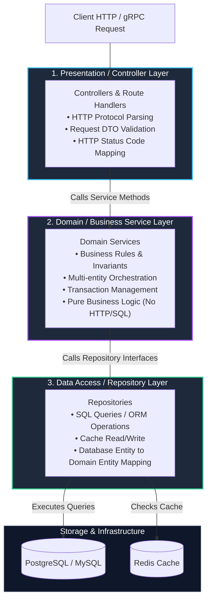
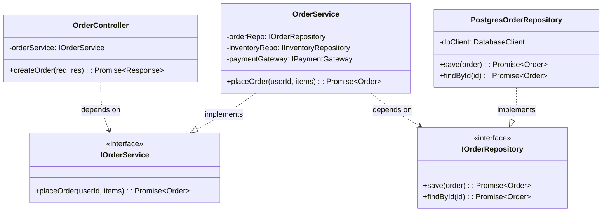
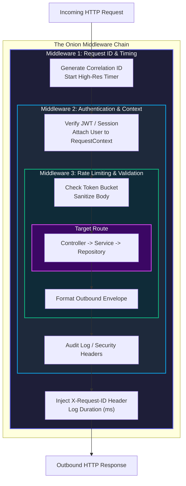
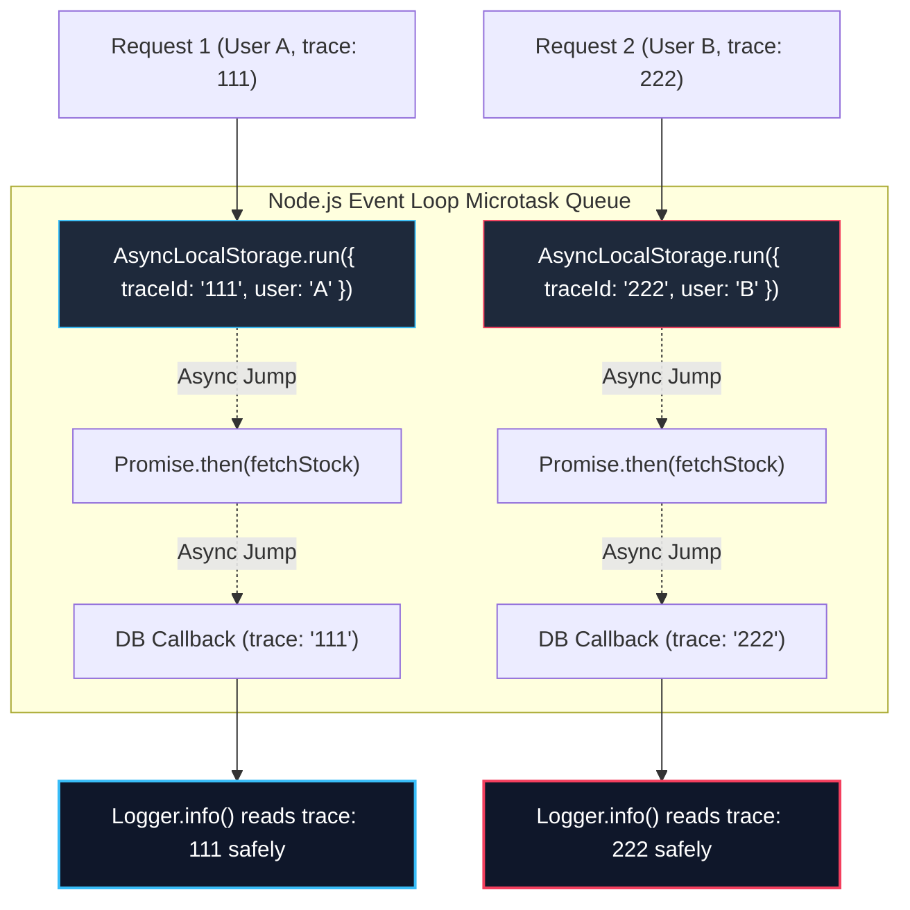

import { Callout } from 'fumadocs-ui/components/callout';
import { Tabs, Tab } from 'fumadocs-ui/components/tabs';
import { Steps, Step } from 'fumadocs-ui/components/steps';

When building hobby projects, mixing routing, business calculations, SQL queries, and error responses inside a single file feels fast and convenient. But as an engineering organization scales to tens of developers, hundreds of thousands of lines of code, and millions of daily requests, that flat structure—often known as the **"Smart Controller"** or **"Spaghetti Architecture"**—becomes an unmaintainable nightmare.

To build resilient, testable, and maintainable systems, backend engineers separate systems into distinct conceptual strata. This lesson explores the industry-standard **3-Tier Layered Architecture**, the mechanics of **Middleware Onion Pipelines**, and how modern runtimes propagate request-scoped metadata across asynchronous boundaries using **Request Context**.

---

## The Chaos of the Monolithic Route Handler

Consider a naive route handler written during an early hackathon:

```typescript
// ❌ ANTI-PATTERN: The "Fat Controller / Kitchen Sink Handler"
app.post("/api/orders", async (req, res) => {
  // 1. Transport & Auth
  const authHeader = req.headers.authorization;
  if (!authHeader) return res.status(401).json({ error: "Unauthorized" });
  const token = authHeader.split(" ")[1];
  const user = jwt.verify(token, process.env.SECRET!);

  // 2. Input Validation
  const { items, promoCode } = req.body;
  if (!items || !Array.isArray(items)) return res.status(400).json({ error: "Invalid items" });

  // 3. Database Access (Direct SQL)
  const productIds = items.map((i) => i.productId);
  const products = await db.query("SELECT * FROM products WHERE id = ANY($1)", [productIds]);

  // 4. Core Business Logic (Pricing, stock verification)
  let total = 0;
  for (const item of items) {
    const product = products.rows.find((p) => p.id === item.productId);
    if (!product || product.stock < item.quantity) {
      return res.status(400).json({ error: `Out of stock: ${item.productId}` });
    }
    total += product.price * item.quantity;
  }

  // 5. External Third-Party Integration
  const payment = await stripe.charges.create({ amount: total, currency: "usd" });

  // 6. Database Mutation
  const order = await db.query(
    "INSERT INTO orders (user_id, total, status, stripe_id) VALUES ($1, $2, $3, $4) RETURNING *",
    [user.id, total, "PAID", payment.id]
  );

  // 7. Side Effects
  await sendGrid.sendEmail({ to: user.email, subject: "Order Confirmation" });

  return res.status(201).json(order.rows[0]);
});
```

### Why Does This Collapse in Production?

1. **Zero Testability**: Testing the order calculation or inventory validation requires a running database, an actual Stripe API connection, and a live SendGrid mailer. Unit tests are impossible; only brittle end-to-end tests can run.
2. **Duplicated Business Logic**: If an admin cron job or a background worker needs to calculate order totals or re-order stock, it cannot reuse this logic—it must copy-paste it.
3. **Transport Lock-In**: If the team decides to expose the same functionality over gRPC or a CLI tool, the entire controller must be rewritten because business rules are intertwined with Express's `req` and `res`.
4. **Leaky Database Details**: If PostgreSQL is replaced with DynamoDB or schema columns are renamed, every route handler in the system breaks.

---

## The 3-Tier Layered Architecture

To isolate change and enforce single responsibility, we slice the backend horizontally into three distinct tiers:



### Layer Responsibilities & Contracts

| Layer | Primary Responsibility | Knows About | Must NEVER Know About |
| :--- | :--- | :--- | :--- |
| **Controller** | Parse HTTP headers/body, invoke Service, serialize responses, return HTTP status codes. | HTTP concepts (`req`, `res`, status codes), Service interface. | SQL statements, database transactions, table schemas, raw ORM entities. |
| **Service** | Execute core business rules, validate domain logic, orchestrate transactions, handle pricing/billing. | Domain models, Repository interfaces, external service interfaces. | `req`, `res`, HTTP status codes, headers, cookies, query strings. |
| **Repository** | Abstract data storage, execute SQL queries, handle database connections, manage caches. | Database client (`pg`, Prisma, Drizzle, GORM), SQL, table schemas. | HTTP requests, business orchestration, email templates, payment gateways. |

<Callout type="info" title="The Golden Rule of Layer Isolation">
**Information flows down, data flows back up.** The Controller calls the Service; the Service calls the Repository. A lower layer must **never** import or call a higher layer. Furthermore, the Service layer must remain 100% agnostic to the transport layer: you should be able to call `OrderService.createOrder()` from an HTTP handler, a CLI script, a gRPC server, or a Kafka queue worker without changing a single line of service code.
</Callout>

### Enforcing Inversion of Control with Dependency Inversion

In robust systems, the Service does not instantiate its Repository directly. Instead, it relies on an interface:



---

## The Middleware Pipeline: The Onion Model

Before a request hits a controller, and after the controller produces a response, the execution flow passes through a chain of composable functions called **Middleware**.

Middleware frameworks (Express, Koa, Fastify, NestJS, Gin, Axum) implement the **Onion Model**:



### Visualizing the Onion Execution Order

Notice how execution dives inwards, reaches the core handler, and bounces back outwards:

```text
Request Arrives
│
├──> [Inward] Middleware 1 (Timer starts, X-Request-Id generated)
│    ├──> [Inward] Middleware 2 (Auth token decoded, User verified)
│    │    ├──> [Inward] Middleware 3 (Rate limiter tokens decremented)
│    │    │    │
│    │    │    └───★ CONTROLLER EXECUTION (Service & DB) ★
│    │    │    │
│    │    └──< [Outward] Middleware 3 (Add RateLimit headers)
│    └──< [Outward] Middleware 2 (Audit log written)
└──< [Outward] Middleware 1 (Response duration logged: "POST /orders 201 Created - 42ms")
│
Response Leaves Server
```

---

## Request Context & Scoped State Propagation

In real-world backend applications, every request carries contextual metadata:
- **`correlationId` / `requestId`**: Trace ID for distributed logging across microservices.
- **`userId` & `organizationId`**: Multi-tenant identifier for data isolation.
- **`locale` & `timezone`**: Formatting and currency rules.
- **`cancellationToken`**: Propagation of client connection drops.

### The "Prop-Drilling" Anti-Pattern in Backends

Without a dedicated context mechanism, engineers are forced to pass `requestId` and `currentUser` through every single function call:

```typescript
// ❌ ANTI-PATTERN: Backend Parameter Drilling
async function placeOrder(ctx: RequestContext, items: Item[]) {
  await validateStock(ctx, items);
  const order = await orderRepo.create(ctx, items);
  await auditLog(ctx, "ORDER_CREATED", order.id);
  await notificationService.notifyUser(ctx, order);
}
```

Every utility function, helper, and database query signature gets polluted with `ctx`. If a deeply nested logging helper needs the `requestId`, every function in the call chain must be modified to accept and pass it.

### The Modern Solution: Async Context Storage

Modern runtimes provide asynchronous thread-local equivalents:
- **Node.js**: [`AsyncLocalStorage`](https://nodejs.org/api/async_context.html#class-asynclocalstorage) (part of `node:async_hooks`).
- **Go**: `context.Context` (passed explicitly by idiomatic convention).
- **Java**: `ThreadLocal` or Project Loom's `ScopedValue`.
- **Python**: `contextvars.ContextVar`.

#### How Node.js `AsyncLocalStorage` Works Under the Hood

Node.js manages asynchronous I/O via the `libuv` event loop. When a callback or promise continuation is scheduled, `AsyncLocalStorage` preserves a pointer to the current store throughout microtask queues and asynchronous jumps:



<Callout type="warn" title="AsyncLocalStorage Gotcha: Breaking Context Propagation">
`AsyncLocalStorage` binds across standard Promises, `async/await`, and standard Node timers (`setTimeout`). However, if your code interfaces with legacy callback-based libraries that invoke callbacks outside the active execution context without tracking (or un-promisified event emitters), the store reference can be lost (`undefined`). Always wrap legacy APIs using `util.promisify`.
</Callout>

---

## Interactive Simulation: The Request Journey

Follow a `POST /api/v1/orders` request as it travels through the entire architecture.

<Tabs items={['Phase 1: Ingestion & Middleware', 'Phase 2: Controller & DTO Parsing', 'Phase 3: Service Domain Logic', 'Phase 4: Repository & DB Transaction', 'Phase 5: Outbound Pipeline Return']}>
  <Tab value="Phase 1: Ingestion & Middleware">
    ### 1. Ingestion & Middleware Pipeline
    The TCP packet arrives at the HTTP server. The raw socket delivers the HTTP payload.

    ```text
    RAW TCP STREAM ──────> HTTP SERVER (Port 3000)
    POST /api/v1/orders HTTP/1.1
    Host: api.store.com
    Authorization: Bearer eyJhbGciOi...
    Content-Type: application/json
    {"items":[{"id":"sku_99","qty":2}],"coupon":"AUTUMN26"}
    ```

    **Action Executed:**
    1. **Correlation Middleware:** Generates UUID `req_c3a9f182` and sets timestamp `t_0 = 0.00ms`.
    2. **Context Middleware:** Calls `AsyncLocalStorage.run({ reqId: "req_c3a9f182" })`.
    3. **Auth Middleware:** Verifies JWT token, decodes claims (`userId = "usr_8821"`), and attaches `user` to the context.
    4. **Rate Limiting:** Checks Redis token bucket for `usr_8821`. Token count is valid; decrements 1 token.
  </Tab>

  <Tab value="Phase 2: Controller & DTO Parsing">
    ### 2. Controller & DTO Validation
    Execution enters `OrderController.createOrder()`.

    ```mermaid
    sequenceDiagram
        autonumber
        participant M as Middleware Onion
        participant C as OrderController
        participant V as Zod Validator
        participant S as OrderService

        M->>C: invoke(req, res)
        C->>V: parse(req.body)
        V-->>C: validatedDTO: CreateOrderDTO
        C->>S: placeOrder(userId, validatedDTO)
    ```

    **Action Executed:**
    1. Extracts `body` from `req`.
    2. Runs schema validation (e.g., Zod or class-validator). Fails fast if schema validation fails (`400 Bad Request`).
    3. Transforms raw string primitives into strongly typed Value Objects / DTOs (`CreateOrderDTO`).
    4. Calls `OrderService.placeOrder(userId, dto)`. Notice: **Zero SQL queries and zero HTTP response formatting happen here.**
  </Tab>

  <Tab value="Phase 3: Service Domain Logic">
    ### 3. Domain Service & Business Rules
    Execution enters `OrderService.placeOrder()`. This is the brain of the backend.

    ```text
    ┌─────────────────────────────────────────────────────────────┐
    │ ORDER SERVICE: DOMAIN INVARIANT VERIFICATION                │
    ├─────────────────────────────────────────────────────────────┤
    │ 1. Fetch user account status -> Verified (Active)           │
    │ 2. Check item inventory -> SKU "sku_99" stock = 14 (Pass)   │
    │ 3. Apply promotional code "AUTUMN26" -> 15% discount applied│
    │ 4. Calculate Taxes & Shipping -> Base: $40.00, Tax: $3.20   │
    │ 5. Authorize Stripe Hold -> AuthToken: ch_live_73891 (Pass) │
    └─────────────────────────────────────────────────────────────┘
    ```

    **Action Executed:**
    1. Service queries `InventoryRepository` to lock inventory.
    2. Evaluates pricing algorithms and discount constraints.
    3. Coordinates with `PaymentService` to verify fund availability.
    4. Encapsulates order creation within a transactional boundary.
  </Tab>

  <Tab value="Phase 4: Repository & DB Transaction">
    ### 4. Repository & Database Transaction
    Execution enters `OrderRepository.createOrderWithItems()`.

    ```sql
    BEGIN TRANSACTION ISOLATION LEVEL READ COMMITTED;

    -- Decrement inventory with pessimistic row lock
    SELECT stock FROM products WHERE id = 'sku_99' FOR UPDATE;
    UPDATE products SET stock = stock - 2 WHERE id = 'sku_99';

    -- Insert parent order
    INSERT INTO orders (id, user_id, subtotal, tax, total, status)
    VALUES ('ord_7712', 'usr_8821', 4000, 320, 3720, 'CONFIRMED')
    RETURNING *;

    -- Insert order items
    INSERT INTO order_items (order_id, product_id, quantity, unit_price)
    VALUES ('ord_7712', 'sku_99', 2, 2000);

    COMMIT;
    ```

    **Action Executed:**
    1. Opens transactional connection from connection pool.
    2. Executes parameterized SQL statements.
    3. Handles database error codes (e.g., serialization failure, foreign key violations) and maps them into domain-specific exceptions (e.g., `InsufficientInventoryException`).
    4. Maps raw SQL rows into typed `Order` domain entities and returns up to the service.
  </Tab>

  <Tab value="Phase 5: Outbound Pipeline Return">
    ### 5. Outbound Pipeline Return
    The call stack unwinds from Repository → Service → Controller → Middleware.

    ```mermaid
    sequenceDiagram
        autonumber
        participant S as OrderService
        participant C as OrderController
        participant M as Outbound Middleware
        participant Cli as Client

        S-->>C: returns Order Entity
        C-->>M: res.status(201).json(OrderViewModel)
        M->>M: appendHeader("X-Request-ID", "req_c3a9f182")
        M->>M: log("POST /api/v1/orders 201 Created - 23.4ms")
        M-->>Cli: HTTP/1.1 201 Created + JSON Body
    ```

    **Action Executed:**
    1. **Controller:** Receives the domain entity, maps it to an external API response envelope (`OrderResponseDTO`), and calls `res.status(201).json(...)`.
    2. **Onion Post-Processing:** Execution exits the controller and enters outbound middleware phases.
    3. **Timing Middleware:** Computes `t_final = Date.now() - t_0 = 23.4ms`. Emits structured log with `requestId`, `userId`, `durationMs`, and `statusCode`.
    4. **Client Receives:** HTTP 201 response with standard security and correlation headers.
  </Tab>
</Tabs>

---

## Production-Grade Implementation: Complete TypeScript Pattern

Below is an enterprise-grade reference architecture demonstrating the 3-Tier pattern and `AsyncLocalStorage` context propagation.

### 1. Request Context Module (`src/context/request-context.ts`)

```typescript
import { AsyncLocalStorage } from "node:async_hooks";

export interface RequestStore {
  requestId: string;
  userId?: string;
  tenantId?: string;
  startTime: number;
}

const asyncLocalStorage = new AsyncLocalStorage<RequestStore>();

export class RequestContext {
  /**
   * Initializes the context store for the lifetime of an asynchronous operation.
   */
  static run<T>(store: RequestStore, callback: () => Promise<T>): Promise<T> {
    return asyncLocalStorage.run(store, callback);
  }

  /**
   * Retrieves the current request store or throws if called outside a request lifecycle.
   */
  static get(): RequestStore {
    const store = asyncLocalStorage.getStore();
    if (!store) {
      throw new Error("RequestContext.get() called outside of active request scope");
    }
    return store;
  }

  static getRequestId(): string {
    return asyncLocalStorage.getStore()?.requestId ?? "system-untracked";
  }

  static getUserId(): string | undefined {
    return asyncLocalStorage.getStore()?.userId;
  }
}
```

### 2. Context-Aware Structured Logger (`src/utils/logger.ts`)

```typescript
import { RequestContext } from "../context/request-context";

export class Logger {
  static info(message: string, meta: Record<string, unknown> = {}): void {
    const requestId = RequestContext.getRequestId();
    const userId = RequestContext.getUserId();

    console.log(
      JSON.stringify({
        timestamp: new Date().toISOString(),
        level: "INFO",
        requestId,
        userId: userId ?? null,
        message,
        ...meta,
      })
    );
  }

  static error(message: string, error?: unknown): void {
    const requestId = RequestContext.getRequestId();
    console.error(
      JSON.stringify({
        timestamp: new Date().toISOString(),
        level: "ERROR",
        requestId,
        message,
        error: error instanceof Error ? { message: error.message, stack: error.stack } : error,
      })
    );
  }
}
```

### 3. Repository Layer (`src/repositories/order.repository.ts`)

```typescript
import { Logger } from "../utils/logger";

export interface OrderRecord {
  id: string;
  userId: string;
  totalCents: number;
  status: "PENDING" | "PAID" | "FAILED";
  createdAt: Date;
}

export interface IOrderRepository {
  create(order: Omit<OrderRecord, "id" | "createdAt">): Promise<OrderRecord>;
  findById(id: string): Promise<OrderRecord | null>;
}

export class PostgresOrderRepository implements IOrderRepository {
  // In production, inject your database pool/client (Prisma, Drizzle, pg.Pool)
  async create(data: Omit<OrderRecord, "id" | "createdAt">): Promise<OrderRecord> {
    Logger.info("Executing SQL: INSERT INTO orders", { totalCents: data.totalCents });

    // Simulated DB insert
    const record: OrderRecord = {
      id: `ord_${Math.random().toString(36).substring(2, 9)}`,
      ...data,
      createdAt: new Date(),
    };

    return record;
  }

  async findById(id: string): Promise<OrderRecord | null> {
    Logger.info("Executing SQL: SELECT * FROM orders WHERE id = $1", { id });
    return null;
  }
}
```

### 4. Service Layer (`src/services/order.service.ts`)

```typescript
import { IOrderRepository, OrderRecord } from "../repositories/order.repository";
import { Logger } from "../utils/logger";

export interface CreateOrderItemInput {
  productId: string;
  quantity: number;
  unitPriceCents: number;
}

export interface PlaceOrderInput {
  userId: string;
  items: CreateOrderItemInput[];
}

export class OrderService {
  constructor(private readonly orderRepo: IOrderRepository) {}

  async placeOrder(input: PlaceOrderInput): Promise<OrderRecord> {
    Logger.info("Processing business logic for placeOrder", { itemCount: input.items.length });

    if (input.items.length === 0) {
      throw new Error("Order must contain at least one item.");
    }

    // Business invariant: Calculate total in integer cents to prevent floating point drift
    const totalCents = input.items.reduce((sum, item) => {
      if (item.quantity <= 0) {
        throw new Error(`Invalid item quantity for product: ${item.productId}`);
      }
      return sum + item.quantity * item.unitPriceCents;
    }, 0);

    // Business invariant: Minimum transaction value
    if (totalCents < 100) {
      throw new Error("Minimum order value is $1.00");
    }

    // Persist via repository abstraction
    const order = await this.orderRepo.create({
      userId: input.userId,
      totalCents,
      status: "PAID",
    });

    Logger.info("Order successfully created in domain", { orderId: order.id });
    return order;
  }
}
```

### 5. Controller & Middleware Pipeline (`src/server.ts`)

```typescript
import express, { Request, Response, NextFunction } from "express";
import crypto from "node:crypto";
import { RequestContext } from "./context/request-context";
import { Logger } from "./utils/logger";
import { PostgresOrderRepository } from "./repositories/order.repository";
import { OrderService } from "./services/order.service";

const app = express();
app.use(express.json());

// ─────────────────────────────────────────────────────────────
// 1. ONION MIDDLEWARE: Context & Request Correlation
// ─────────────────────────────────────────────────────────────
app.use((req: Request, res: Response, next: NextFunction) => {
  const requestId = (req.headers["x-request-id"] as string) || `req_${crypto.randomUUID()}`;
  const startTime = Date.now();

  res.setHeader("X-Request-ID", requestId);

  // Wrap entire downstream pipeline inside AsyncLocalStorage
  RequestContext.run({ requestId, startTime }, async () => {
    Logger.info(`Incoming ${req.method} ${req.url}`);

    res.on("finish", () => {
      const duration = Date.now() - startTime;
      Logger.info(`Completed ${req.method} ${req.url} with ${res.statusCode}`, { durationMs: duration });
    });

    next();
  });
});

// ─────────────────────────────────────────────────────────────
// 2. DEPENDENCY INJECTION ROOT
// ─────────────────────────────────────────────────────────────
const orderRepository = new PostgresOrderRepository();
const orderService = new OrderService(orderRepository);

// ─────────────────────────────────────────────────────────────
// 3. CONTROLLER LAYER: HTTP Transport & Serialization
// ─────────────────────────────────────────────────────────────
app.post("/api/v1/orders", async (req: Request, res: Response, next: NextFunction) => {
  try {
    const { items, userId } = req.body;

    // Transport validation
    if (!userId || typeof userId !== "string") {
      return res.status(400).json({ error: "Missing required string 'userId'" });
    }

    // Invoke domain service
    const order = await orderService.placeOrder({ userId, items });

    // HTTP status mapping
    return res.status(201).json({
      success: true,
      data: {
        id: order.id,
        totalDollars: (order.totalCents / 100).toFixed(2),
        status: order.status,
        createdAt: order.createdAt.toISOString(),
      },
    });
  } catch (err: any) {
    Logger.error("Order creation failed", err);
    return res.status(400).json({ error: err.message });
  }
});

export default app;
```

---

## Architectural Comparison: How Modern Languages Handle Context

<Tabs items={['TypeScript (AsyncLocalStorage)', 'Go (context.Context)', 'Python (contextvars)']}>
  <Tab value="TypeScript (AsyncLocalStorage)">
    ```typescript
    import { AsyncLocalStorage } from "node:async_hooks";

    interface ScopedSession {
      tenantId: string;
      userId: string;
    }

    const sessionStore = new AsyncLocalStorage<ScopedSession>();

    // Middleware initializes the store
    function sessionMiddleware(req, res, next) {
      sessionStore.run({ tenantId: req.headers["x-tenant-id"], userId: req.user.id }, () => {
        next();
      });
    }

    // Anywhere down in deep domain code
    function getTenantSpecificSchema() {
      const session = sessionStore.getStore();
      return `schema_${session?.tenantId}`;
    }
    ```
  </Tab>

  <Tab value="Go (context.Context)">
    ```go
    package main

    import (
        "context"
        "net/http"
    )

    type contextKey string
    const userKey contextKey = "currentUser"

    // Go passes context explicitly through function signatures
    func AuthMiddleware(next http.Handler) http.Handler {
        return http.HandlerFunc(func(w http.ResponseWriter, r *http.Request) {
            ctx := context.WithValue(r.Context(), userKey, "user_123")
            next.ServeHTTP(w, r.WithContext(ctx))
        })
    }

    // Repository receives context for query cancellation
    func (r *OrderRepo) CreateOrder(ctx context.Context, order *Order) error {
        userID := ctx.Value(userKey).(string)
        return r.db.ExecContext(ctx, "INSERT INTO orders (user_id) VALUES ($1)", userID)
    }
    ```
  </Tab>

  <Tab value="Python (contextvars)">
    ```python
    import contextvars
    from fastapi import Request

    # Python 3.7+ async thread-local equivalent
    request_id_var = contextvars.ContextVar("request_id", default="default-id")

    async def context_middleware(request: Request, call_next):
        req_id = request.headers.get("X-Request-ID", "gen-123")
        token = request_id_var.set(req_id)
        try:
            response = await call_next(request)
            return response
        finally:
            request_id_var.reset(token)

    def log_operation():
        current_id = request_id_var.get()
        print(f"[{current_id}] Executing domain logic")
    ```
  </Tab>
</Tabs>

---

## Architecture Decision Matrix: 3-Tier vs Hexagonal vs Microservices

| Architectural Style | Complexity | Ideal Project Size | Strengths | Trade-Offs |
| :--- | :--- | :--- | :--- | :--- |
| **Flat Scripts / MVC** | Low | Prototypes, Hackathons (`<5k` LOC) | Extremely fast to build initially. | High coupling, zero testability, code duplication. |
| **3-Tier Layered** | Moderate | Medium to Enterprise APIs (5k - 100k LOC) | Clear boundaries, simple to navigate, testable services, isolates database. | Small boilerplates for trivial CRUD endpoints. |
| **Hexagonal / Clean (Ports & Adapters)** | High | Complex Domain-Driven Design (DDD) (`>100k` LOC) | 100% decoupling from databases, external vendors, and frameworks. | High abstraction overhead, dozens of interfaces and adapters. |
| **Microservices** | Very High | Large engineering organizations (50+ engineers) | Independent deployments, scalable team ownership. | Distributed system bugs, network latency, data consistency challenges. |

---

## Critical Engineering Anti-Patterns to Avoid

<Callout type="error" title="1. The Leaky DTO Anti-Pattern">
**Never return raw ORM entities directly from your controller.** If your Prisma or TypeORM model returns a `User` entity containing `hashedPassword`, `failedLoginAttempts`, or internal audit columns, returning it directly leaks sensitive cryptographic material to the public client. Always map domain entities to an explicit `UserResponseDTO` containing only authorized public fields.
</Callout>

<Callout type="warn" title="2. The 'God Service' Anti-Pattern">
Avoid creating monolithic services like `GeneralService` or a 5,000-line `UserService` that handles user profiles, payment methods, authentication tokens, emails, and invoices. Break services down around focused domain subdomains: `UserProfileService`, `AuthenticationService`, and `BillingService`.
</Callout>

---

## Architecture Checklist: Ready for Production?

Before shipping your backend architecture to production, verify your code against this checklist:

- [ ] **Transport Decoupling:** Does any file in the `services/` or `repositories/` directory import `Request`, `Response`, or framework-specific types from Express, Fastify, or Gin? (If yes, refactor immediately).
- [ ] **Dependency Direction:** Does the dependency graph point strictly inwards toward domain logic?
- [ ] **Traceability:** Does every single inbound request generate or propagate a `correlationId` through the logging system via request context?
- [ ] **Unit Testability:** Can you test your core service methods in memory by mocking the repository interfaces without booting a database?
- [ ] **Consistent Error Mapping:** Do domain errors (e.g. `EntityNotFoundException`) get mapped predictably to HTTP status codes (`404 Not Found`) by a centralized error middleware?
