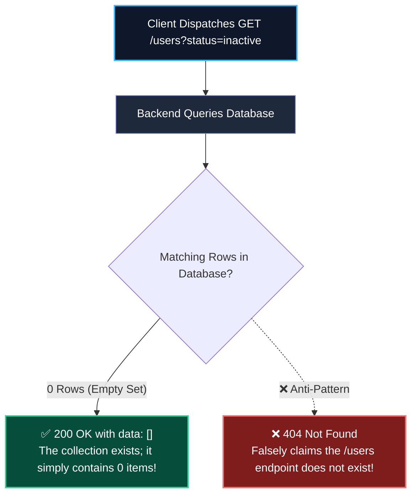
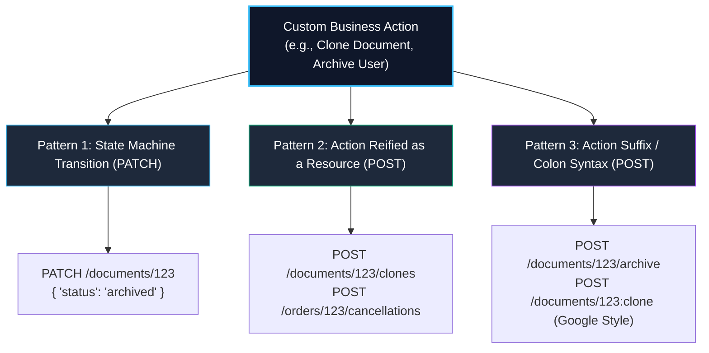
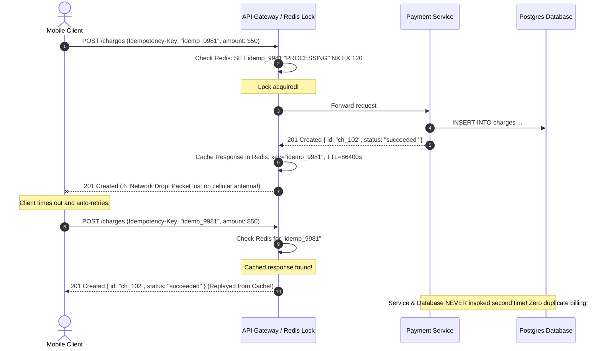
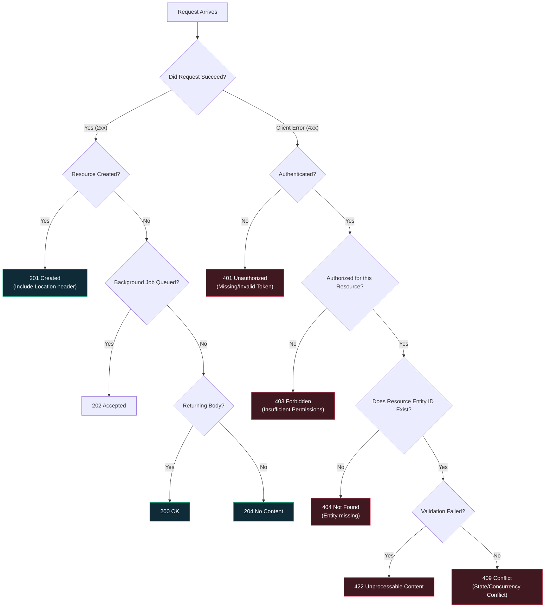

import { Callout } from 'fumadocs-ui/components/callout';
import { Tabs, Tab } from 'fumadocs-ui/components/tabs';
import { Steps, Step } from 'fumadocs-ui/components/steps';
import { Cards, Card } from 'fumadocs-ui/components/card';

While resource modeling establishes the nouns of your system, **protocol execution** dictates how clients communicate actions, recover from transient network failures, and interpret server responses.

In production APIs, engineering decisions around status codes, custom actions (such as archiving or cloning records), distributed idempotency locks, and response envelopes make the difference between a resilient developer platform and a fragile service that causes frontend crashes.

---

## 1. The Empty Collection 404 Anti-Pattern

One of the most widespread and damaging bugs in modern API engineering is returning `HTTP 404 Not Found` when a collection query matches zero records:

```http
# ❌ THE EMPTY COLLECTION 404 ANTI-PATTERN
GET /api/v1/users?status=inactive HTTP/1.1
Host: api.company.com

HTTP/1.1 404 Not Found
Content-Type: application/json

{ "error": "No inactive users found" }
```

```http
# ✅ THE PROFESSIONAL PRODUCTION STANDARD
GET /api/v1/users?status=inactive HTTP/1.1
Host: api.company.com

HTTP/1.1 200 OK
Content-Type: application/json

{
  "data": [],
  "meta": {
    "totalCount": 0,
    "limit": 20,
    "hasMore": false
  }
}
```



### Why Returning 404 for Empty Collections Destroys Client Applications

1. **A Collection is a Container (The "Empty Box" Analogy)**:
   If you look inside an empty shoebox in your closet, the shoebox **still exists**. You do not say *"The shoebox has ceased to exist in space and time"*; you say *"The shoebox is empty."* 
   The resource is `/users`. The collection exists. It currently holds 0 elements.
2. **`404 Not Found` is Strictly for Missing Entity IDs**:
   - `GET /users/usr_9999` $\rightarrow$ **`404 Not Found`** (The unique entity identified by ID does not exist).
   - `GET /users?status=inactive` $\rightarrow$ **`200 OK` with `[]`** (The query was executed successfully; the result set has 0 matches).
3. **Frontend Error Handlers Treat 404 as System Failures**:
   In modern frontend codebases (React Query, SWR, RTK Query), any 4xx response rejects the promise and triggers an error boundary, rendering a red crash banner or "Server Unreachable" screen instead of a friendly "No inactive users found" empty state card.
4. **Breaks CDN and HTTP Caching**:
   Shared proxies, CDNs (Cloudflare), and browser HTTP caches often refuse to cache 404 responses or cache them with error TTLs. Returning `200 OK` with `[]` allows proper cache headers (`Cache-Control: max-age=60`).
5. **Corrupts Sentry and Telemetry Monitoring**:
   Engineering teams monitor HTTP 4xx/5xx spike alerts. If every user searching for an obscure keyword generates a `404 Not Found`, your alerts will fire constantly on normal user behavior.

<Callout type="error" title="The Golden Rule of Collections">
**Querying a collection that yields 0 items MUST return HTTP 200 OK with an empty array `[]`. NEVER return 404 Not Found.**
</Callout>

---

## 2. Modeling Custom Actions: Beyond Standard CRUD

In pure textbook REST, every operation is a standard CRUD mutation on a noun (`GET`, `POST`, `PUT`, `PATCH`, `DELETE`). 

However, real business systems require operations that do not map cleanly to standard field updates:
- *Archive an organization*
- *Clone a complex document*
- *Cancel an airline flight*
- *Publish a blog post*
- *Reboot a cloud server*

How do we architect these actions without reverting to chaotic RPC endpoints like `/doArchive`? Production architectures employ three proven patterns:



### Pattern 1: State Machine Transition via `PATCH`

Treat the operation as a partial update to an enumerated state machine field:

```http
PATCH /api/v1/invoices/inv_901 HTTP/1.1
Content-Type: application/json

{
  "status": "archived",
  "archivedReason": "Fiscal year 2025 closed"
}
```
- **Best When**: The operation simply transitions the lifecycle of an existing record without creating child entities.

### Pattern 2: Action Reified as a First-Class Resource (`POST`)

Turn the action itself into a concrete domain noun (reification). 

Instead of "cloning a document", you are **creating a clone**:
```http
POST /api/v1/documents/doc_102/clones HTTP/1.1
Content-Type: application/json

{
  "targetTitle": "Copy of Q3 Financial Report",
  "includeComments": false
}

HTTP/1.1 201 Created
Location: /api/v1/documents/doc_103
```

Instead of "cancelling an order", you are **creating a cancellation record**:
```http
POST /api/v1/orders/ord_442/cancellations HTTP/1.1
Content-Type: application/json

{
  "reason": "Found lower price elsewhere"
}
```
- **Best When**: The action produces a durable audit trail, has its own unique lifecycle, or accepts complex configuration parameters.

### Pattern 3: Custom Action Suffix or Colon Syntax

When an operation represents an immediate operational trigger that does not create a durable sub-resource:

<Tabs items={["Sub-Path Suffix (Stripe / GitHub)", "Google Cloud Colon Syntax"]}>
  <Tab value="Sub-Path Suffix (Stripe / GitHub)">
    Use a sub-path noun/verb on the entity URI:
    ```http
    POST /api/v1/campaigns/cmp_88/publish HTTP/1.1
    POST /api/v1/users/usr_42/archive HTTP/1.1
    ```
  </Tab>

  <Tab value="Google Cloud Colon Syntax">
    Google's official API Design Guide standardizes the colon (`:`) separator:
    ```http
    POST /api/v1/virtual-machines/vm_88:reboot HTTP/1.1
    POST /api/v1/documents/doc_102:clone HTTP/1.1
    ```
    This cleanly distinguishes standard sub-resources (`/documents/102/comments`) from custom actions (`/documents/102:clone`).
  </Tab>
</Tabs>

---

## 3. The Idempotency-Key Header Contract for `POST`

Network failures frequently occur **after** a server processes a mutation, but **before** the client receives the HTTP response packet:



### The 4 Requirements of Production Idempotency Keys

1. **Client-Generated UUID**: The client creates a unique UUID v4 before dispatching the request.
2. **Distributed Mutex Lock**: The gateway uses Redis `SET key "PROCESSING" NX EX 120` to prevent concurrent in-flight race conditions.
3. **Payload Verification**: If a client sends the same `Idempotency-Key` with a **different request body**, the server must reject it immediately with `422 Unprocessable Content` (or `400 Bad Request`) to prevent tampering.
4. **Full Response Caching**: The response headers and body are cached for 24 hours. Retries receive the exact cached status code and payload without re-executing business logic.

---

## 4. Extensible JSON Response Envelopes

A common mistake is returning naked JSON arrays directly from collection endpoints:

```json
// ❌ ANTI-PATTERN: Naked JSON Array
[
  { "id": "usr_1", "name": "Alice" },
  { "id": "usr_2", "name": "Bob" }
]
```

### Why Naked Arrays Break Systems
1. **Zero Extensibility**: You cannot add metadata (`hasMore`, `totalCount`, `nextCursor`, `queryExecutionTimeMs`) without changing the root type and breaking every existing client parser.
2. **Security Vulnerability**: In older ECMAScript environments, top-level arrays were vulnerable to JSON Array Hijacking via prototype poisoning.

### The Production Response Envelope

Always wrap collections in a top-level JSON object:

```json
{
  "data": [
    { "id": "usr_1", "name": "Alice" },
    { "id": "usr_2", "name": "Bob" }
  ],
  "meta": {
    "limit": 20,
    "hasMore": true,
    "nextCursor": "ZXlKaGJHY2lPaUpTVXpVeE5pSXNJblI1Y0NJN...",
    "totalCount": 420
  },
  "links": {
    "self": "https://api.store.com/v1/users?limit=20",
    "next": "https://api.store.com/v1/users?limit=20&cursor=ZXlKa..."
  }
}
```

---

## 5. Exhaustive HTTP Status Code Architectural Guide

HTTP status codes are the universal grammar of distributed systems. Using them accurately allows standard proxies, CDNs, load balancers, and client SDKs to automate retry logic, caching, and error recovery:



### 1. 2xx Success Class

- **`200 OK`**: Standard response for successful `GET`, `PUT`, or `PATCH` operations returning data. Also the **mandatory response** for collection queries returning zero matches (`{ "data": [] }`).
- **`201 Created`**: Returned on successful resource creation via `POST`. **Mandatory:** Include a `Location: /api/v1/orders/ord_123` header pointing to the newly created entity.
- **`202 Accepted`**: The request is valid and accepted, but processing has been handed off to an asynchronous background worker. Returns a tracking task ID (`{"taskId": "task_881", "status": "PENDING"}`).
- **`204 No Content`**: The action succeeded, but there is intentionally no response body (common for `DELETE` operations or status updates).

### 2. 3xx Redirection Class

- **`301 Moved Permanently`**: The URI has permanently changed. Clients and search engines update bookmarks and caches indefinitely.
- **`304 Not Modified`**: Crucial for HTTP caching. When a client sends `If-None-Match: "etag-abc"`, the server returns `304` with an empty body if the content has not changed, saving massive egress bandwidth.
- **`307 Temporary Redirect`**: Redirects to a new URI while strictly guaranteeing the client preserves the original HTTP verb (e.g. `POST` remains `POST`).

### 3. 4xx Client Error Class

- **`400 Bad Request`**: The server cannot parse the request due to malformed syntax (e.g. unparsable JSON syntax error).
- **`401 Unauthorized`**: *Actually means Unauthenticated.* The user provided invalid credentials or omitted the `Authorization` header.
- **`403 Forbidden`**: The user is authenticated and known, but lacks sufficient permissions (RBAC/ABAC) to perform the action.
- **`404 Not Found`**: The target resource URI does not exist. (Used strictly for missing specific entity IDs, never for empty filtered collections).
- **`405 Method Not Allowed`**: The URI exists, but does not support that verb (e.g. `DELETE /api/v1/users` when mass deletion is disabled).
- **`409 Conflict`**: Request conflicts with current state of the server (e.g. duplicate email, unique constraint violation, or optimistic lock version mismatch).
- **`422 Unprocessable Content`**: The JSON syntax is valid, but internal validation rules failed (e.g. email regex failed, age < 18).
- **`429 Too Many Requests`**: Client has breached rate limits. Always include `Retry-After: <seconds>` header.

### 4. 5xx Server Error Class

- **`500 Internal Server Error`**: An unhandled exception or bug crashed the route handler. Never leak raw stack traces to clients!
- **`502 Bad Gateway`**: A reverse proxy or API gateway received an invalid response because the upstream app crashed or closed the socket abruptly.
- **`503 Service Unavailable`**: The server is temporarily overloaded or undergoing scheduled maintenance.
- **`504 Gateway Timeout`**: The upstream app or database took longer to respond than the gateway's timeout budget (`proxy_read_timeout`).

---

## 6. Production Implementation: Custom Action & Idempotency Router

Here is an enterprise-grade Express/TypeScript router demonstrating:
1. Custom action routing (`POST /orders/:id/cancel` and `POST /documents/:id/clone`).
2. Distributed idempotency check with Redis.
3. Extensible response envelope.
4. Proper status code semantics:

```typescript title="src/routes/order-actions.routes.ts"
import { Router, Request, Response, NextFunction } from "express";
import { z } from "zod";

const router = Router();

const CancelOrderBodySchema = z.object({
  reason: z.string().min(5, "Cancellation reason must be at least 5 characters").max(200),
}).strict();

// ─────────────────────────────────────────────────────────────
// 1. EMPTY COLLECTION TEST: GET /users?status=inactive
// ─────────────────────────────────────────────────────────────
router.get("/users", async (req: Request, res: Response) => {
  const { status } = req.query;

  // Simulate database search matching 0 records
  const matchedUsers: any[] = []; 

  // ✅ 200 OK with empty array, NEVER 404!
  return res.status(200).json({
    data: matchedUsers,
    meta: {
      totalCount: 0,
      limit: 20,
      hasMore: false,
    },
  });
});

// ─────────────────────────────────────────────────────────────
// 2. CUSTOM ACTION: POST /orders/:id/cancel (Guarded by Idempotency-Key)
// ─────────────────────────────────────────────────────────────
router.post("/orders/:id/cancel", async (req: Request, res: Response, next: NextFunction) => {
  try {
    const { id } = req.params;
    const idempotencyKey = req.headers["idempotency-key"] as string | undefined;

    if (!idempotencyKey) {
      return res.status(400).json({
        type: "https://api.company.com/errors/missing-header",
        title: "Bad Request",
        status: 400,
        detail: "Missing required 'Idempotency-Key' header for order cancellation.",
      });
    }

    // Validate body schema
    const parsed = CancelOrderBodySchema.safeParse(req.body);
    if (!parsed.success) {
      return res.status(422).json({
        type: "https://api.company.com/errors/validation-failed",
        title: "Unprocessable Content",
        status: 422,
        invalidParams: parsed.error.issues,
      });
    }

    // In production: check Redis for existing idempotencyKey cache here!

    const cancelledOrder = {
      id,
      status: "CANCELLED",
      reason: parsed.data.reason,
      cancelledAt: new Date().toISOString(),
    };

    // Return extensible response envelope
    return res.status(200).json({
      data: cancelledOrder,
      meta: {
        timestamp: new Date().toISOString(),
        idempotencyKey,
      },
    });
  } catch (err) {
    return next(err);
  }
});

// ─────────────────────────────────────────────────────────────
// 3. REIFIED ACTION RESOURCE: POST /documents/:id/clones
// ─────────────────────────────────────────────────────────────
router.post("/documents/:id/clones", async (req: Request, res: Response) => {
  const { id } = req.params;
  const newDocumentId = `doc_${Date.now()}`;

  // 201 Created with Location header pointing to the clone!
  res.setHeader("Location", `/api/v1/documents/${newDocumentId}`);
  return res.status(201).json({
    data: {
      id: newDocumentId,
      clonedFromId: id,
      title: "Copy of Document",
      createdAt: new Date().toISOString(),
    },
  });
});

export default router;
```

---

## 7. Architecture Review Checklist

<Cards>
  <Card
    title="No Empty Collection 404s"
    description="Collection queries returning 0 results must return HTTP 200 OK with data: [], never 404 Not Found. Reserve 404 exclusively for missing specific entity IDs."
  />
  <Card
    title="Idempotency-Key on Mutations"
    description="Guard all mission-critical POST actions (orders, payments, cancellations) with an Idempotency-Key header and distributed Redis lock."
  />
  <Card
    title="Extensible JSON Envelopes"
    description="Wrap collections in top-level JSON objects with data and meta properties to allow adding pagination and metadata without breaking clients."
  />
  <Card
    title="Semantic Custom Actions"
    description="Model non-CRUD actions using state machine PATCH updates, reified child resources (POST /clones), or clean sub-path action verbs."
  />
</Cards>
