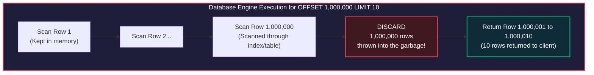
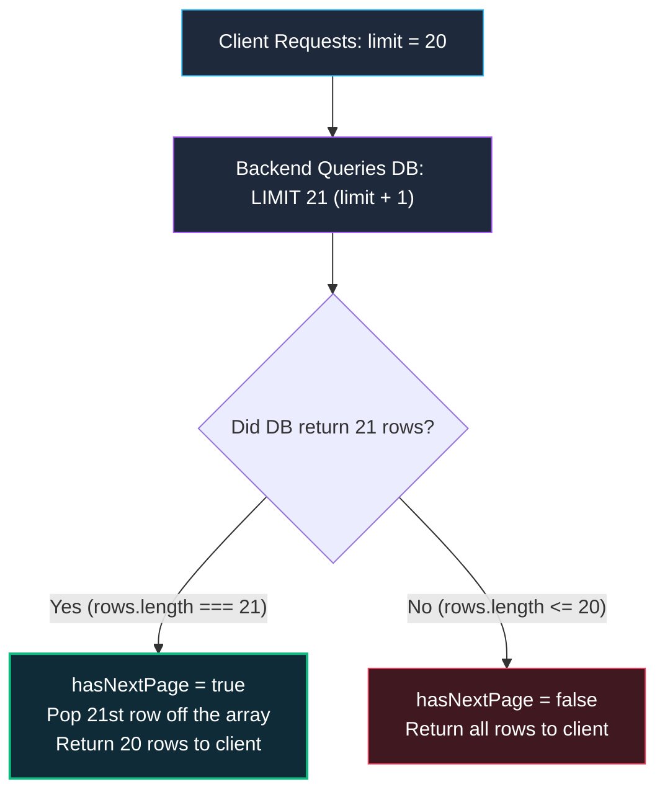
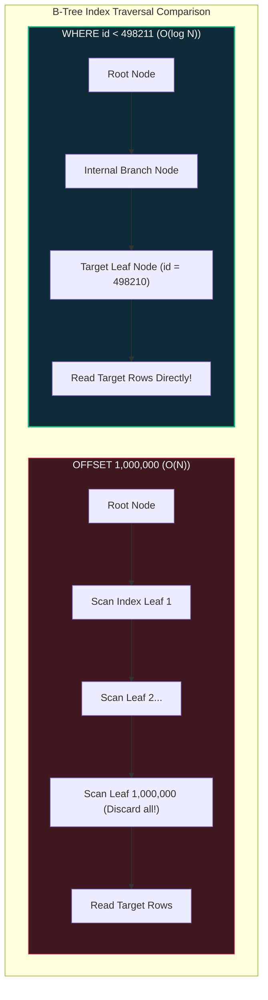

import { Callout } from 'fumadocs-ui/components/callout';
import { Tabs, Tab } from 'fumadocs-ui/components/tabs';
import { Steps, Step } from 'fumadocs-ui/components/steps';

When an API manages a collection of 50 items, almost any database query design appears fast. But when your collection grows to 5 million items, fetching a list of records becomes one of the most dangerous bottlenecks in backend engineering.

Naive pagination can exhaust database buffer caches, trigger multi-second query latencies, and cause bizarre UI bugs where users see duplicate items or skip records entirely. This lesson dives into the mechanics of **Offset-Based Pagination**, the **Limit + 1** query optimization, and how to construct high-throughput **Keyset/Cursor-Based Pagination** using opaque Base64 tokens.

---

## The Illusion of `OFFSET`: How Databases Actually Read Data

The simplest way to paginate in SQL is using `LIMIT` and `OFFSET`:

```sql
-- Fetching Page 1 (Fast)
SELECT id, title, created_at FROM articles ORDER BY id DESC LIMIT 10 OFFSET 0;

-- Fetching Page 100,000 (Catastrophically Slow!)
SELECT id, title, created_at FROM articles ORDER BY id DESC LIMIT 10 OFFSET 1000000;
```

Most engineers intuitively believe that `OFFSET 1000000` causes the database to magically jump directly to row 1,000,001. **This is fundamentally false.**



### The $O(N)$ Disk I/O Trap

To satisfy `OFFSET 1,000,000 LIMIT 10`, the database engine must:
1. Traverse the index or table to find the first 1,000,010 matching records.
2. Read the tuple headers or heap pages off disk or memory cache.
3. Count 1,000,000 rows and **discard every single one of them**.
4. Return only the final 10 rows to your client.

As `OFFSET` increases, the query execution time scales linearly ($O(N)$). On high-volume tables, deep-page offset queries cause severe database CPU spikes and flush hot working data out of your buffer pool.

---

## The "Data Drift" Flaw: Duplicates & Missing Records

Beyond catastrophic performance at depth, Offset-based pagination suffers from an inherent data consistency defect known as **Page Drift (or Phantom Windows)**:

```text
SCENARIO: User is scrolling through a social feed (Page Size = 3)

STATE AT T0: Database contains 6 posts [P6, P5, P4, P3, P2, P1]
Client fetches Page 1 (LIMIT 3 OFFSET 0):
  --> Client receives: [P6, P5, P4]

STATE AT T1: While the user reads, a new post (P7) is published!
Database now contains: [P7, P6, P5, P4, P3, P2, P1]

STATE AT T2: Client requests Page 2 (LIMIT 3 OFFSET 3):
Database skips first 3 items ([P7, P6, P5]) and returns the next 3:
  --> Client receives: [P4, P3, P2]

❌ BUG OBSERVED BY USER:
Page 1 had [P6, P5, P4]
Page 2 had [P4, P3, P2]
Notice that Post P4 was returned TWICE!
```

If items were deleted instead of inserted, records are silently skipped without the user ever seeing them. For infinite-scroll mobile feeds and real-time activity streams, Offset pagination is architecturally broken.

---

## The "Limit + 1" Trick: Eliminating Costly `COUNT(*)`

When building paginated APIs, engineers often attempt to return total page metadata:

```json
// The Costly Metadata Envelope
{
  "data": [...],
  "page": 1,
  "pageSize": 20,
  "totalPages": 5000,
  "totalItems": 100000 // ⚠️ REQUIRES A FULL TABLE COUNT!
}
```

To populate `totalItems`, the backend executes:

```sql
SELECT COUNT(*) FROM orders WHERE tenant_id = 'acme_corp';
```

<Callout type="warn" title="Why SELECT COUNT(*) is an Architectural Bottleneck">
In MVCC databases like PostgreSQL, `COUNT(*)` cannot read a cached counter because row visibility depends on the current transaction snapshot. The database must physically scan the index or table pages. On a table with 20 million rows, `SELECT COUNT(*)` can take **2,000ms to 8,000ms**, even when the actual data query takes only 2ms!
</Callout>

### The "Limit + 1" Solution

If your UI only needs to know whether a "Next Page" button should be enabled (or if more items exist for infinite scroll), you do not need `COUNT(*)`. You only need to query **one extra item beyond the requested limit**:



```typescript
// Production Implementation of Limit + 1
async function getPaginatedArticles(limit: number, offset: number) {
  // Query 1 extra row beyond what was requested
  const items = await db.query(
    "SELECT * FROM articles ORDER BY id DESC LIMIT $1 OFFSET $2",
    [limit + 1, offset]
  );

  const hasNextPage = items.rows.length > limit;

  // Trim the extra exploratory record before sending to client
  const data = hasNextPage ? items.rows.slice(0, limit) : items.rows;

  return {
    data,
    meta: {
      pageSize: limit,
      hasNextPage, // Instant boolean calculation without running COUNT(*)
    },
  };
}
```

---

## Keyset / Cursor-Based Pagination: $O(\log N)$ Index Seeks

To eliminate both Page Drift and the $O(N)$ deep-offset scanning penalty, high-scale platforms (Slack, Stripe, Twitter, GitHub) use **Keyset / Cursor-Based Pagination**.

Instead of telling the database *"skip 1,000,000 rows"*, we tell the database:
> **"Give me the next 10 rows whose indexed ordering key is strictly less than the last item I saw."**

```sql
-- Keyset Query: Traverses B-Tree directly to the target leaf!
SELECT id, title, created_at
FROM articles
WHERE id < 498211
ORDER BY id DESC
LIMIT 10;
```



Because the index is stored as a balanced B-Tree, the database traverses directly to the boundary in $O(\log N)$ time (typically just 3 to 4 page reads), regardless of whether you are reading row 10 or row 10,000,000!

---

## Handling Multi-Column Sorts & Tie-Breaking

What happens if you want to sort by a non-unique field, such as `created_at`?

If two records have the exact same millisecond timestamp (`2026-10-05T12:00:00.000Z`), using `WHERE created_at < $cursor` will skip records that share the identical timestamp.

To guarantee deterministic, lossless pagination, **your cursor must include a unique tie-breaker column** (almost always the primary key `id`):

```sql
-- Compound Keyset Query (Tuple Comparison)
SELECT id, title, created_at
FROM articles
WHERE (created_at, id) < ('2026-10-05 12:00:00', 'art_0982')
ORDER BY created_at DESC, id DESC
LIMIT 11;
```

<Callout type="info" title="The Composite Index Requirement">
To achieve $O(\log N)$ performance with compound cursor pagination, your database table **must have a composite index** covering both the sort column and the tie-breaker in the matching order:
```sql
CREATE INDEX idx_articles_created_at_id ON articles (created_at DESC, id DESC);
```
Without this index, the query will trigger a full table scan, defeating the purpose of cursor pagination.
</Callout>

---

## Designing Opaque Base64 Cursors

Never expose raw database column values or SQL conditions directly in public API query parameters (e.g. `?last_id=42&last_created_at=170000`). Exposing internal column names leaks your schema and locks you into internal database representations.

Instead, serialize the cursor payload into JSON and encode it into an **opaque URL-safe Base64 string**:

```text
RAW CURSOR DATA (Internal State):
{
  "sortValue": "2026-10-05T14:30:00.000Z",
  "id": "ord_88192"
}
       │
       ▼ JSON.stringify()
'{"sortValue":"2026-10-05T14:30:00.000Z","id":"ord_88192"}'
       │
       ▼ Buffer.from(...).toString("base64url")
OPAQUE CURSOR FOR CLIENT API:
"eyJzb3J0VmFsdWUiOiIyMDI2LTEwLTA1VDE0OjMwOjAwLjAwMFoiLCJpZCI6Im9yZF84ODE5MiJ9"
```

The client simply treats this as an opaque string token:

```http
GET /api/v1/orders?limit=20&cursor=eyJzb3J0VmFsdWUiOiIyMDI2LTEwLTA1V... HTTP/1.1
```

---

## Interactive Simulation: The Cursor Seek Lifecycle

Follow a pagination request across a table of 10 million transactions:

<Tabs items={['Phase 1: Inbound Request & Cursor Decoding', 'Phase 2: Controller & Query Validation', 'Phase 3: Service Layer Limit + 1 Query', 'Phase 4: Database B-Tree Index Seek', 'Phase 5: Next Cursor Generation & Response Envelope']}>
  <Tab value="Phase 1: Inbound Request & Cursor Decoding">
    ### 1. Inbound Request & Cursor Decoding
    The client requests the next page of transactions:

    ```http
    GET /api/v1/transactions?limit=10&cursor=eyJ2YWx1ZSI6MTcyODEwOTIwMDAwMCwiaWQiOiJ0eF85ODIxIn0 HTTP/1.1
    Host: api.bank.com
    Authorization: Bearer eyJhbG...
    ```

    **Decoding the Cursor:**
    1. Middleware extracts the query string `cursor`.
    2. Decodes base64url string to JSON:
       ```json
       {
         "value": 1728109200000,
         "id": "tx_9821"
       }
       ```
    3. Validates that the cursor payload matches expected cryptographic or structural constraints.
  </Tab>

  <Tab value="Phase 2: Controller & Query Validation">
    ### 2. Controller & Query Validation
    The controller ensures the requested limit is within safe bounds to prevent Denial-of-Service memory crashes:

    ```typescript
    const PaginationQuerySchema = z.object({
      limit: z.coerce.number().int().min(1).max(100).default(20),
      cursor: z.string().optional(),
    });
    ```
    If a client sends `?limit=1000000`, the validator fails fast, forcing the limit back to a safe maximum (`100`).
  </Tab>

  <Tab value="Phase 3: Service Layer Limit + 1 Query">
    ### 3. Service Layer Limit + 1 Query
    The domain service plans the query parameters.
    - User requested: `limit = 10`.
    - Internal query limit: `fetchLimit = 10 + 1 = 11`.
    - Cursor parameters: `lastTimestamp = 2026-10-05T06:20:00Z`, `lastId = "tx_9821"`.

    ```mermaid
    sequenceDiagram
        autonumber
        participant S as TransactionService
        participant R as TransactionRepository
        participant DB as PostgreSQL DB

        S->>R: listTransactions({ limit: 11, cursor })
        R->>DB: SELECT * FROM transactions WHERE (created_at, id) < ($1, $2) ORDER BY created_at DESC, id DESC LIMIT 11
        DB-->>R: Returns 11 rows (Duration: 1.2ms)
        R-->>S: Return records
    ```
  </Tab>

  <Tab value="Phase 4: Database B-Tree Index Seek">
    ### 4. Database B-Tree Index Seek
    PostgreSQL utilizes composite index `idx_tx_created_at_id`:

    ```text
    QUERY PLAN:
    Index Scan Backward using idx_tx_created_at_id on transactions
      Index Cond: (ROW(created_at, id) < ROW('2026-10-05 06:20:00'::timestamp, 'tx_9821'::text))
      Limit: 11
    Total Execution Time: 0.84ms (Even on 10,000,000 rows!)
    ```
    Zero rows are discarded. The database visits exactly 11 index pointers and fetches 11 table rows.
  </Tab>

  <Tab value="Phase 5: Next Cursor Generation & Response Envelope">
    ### 5. Next Cursor Generation & Response Envelope
    The service evaluates the 11 rows:
    - 11 rows returned > requested limit of 10 -> `hasNextPage = true`.
    - 11th record is popped off.
    - 10th record is: `{ id: "tx_9811", created_at: "2026-10-05T06:14:02Z" }`.
    - Generates new cursor from the 10th record.

    **Client Receives Final JSON:**
    ```json
    {
      "success": true,
      "data": [
        { "id": "tx_9820", "amount": 1500, "status": "COMPLETED" },
        "..."
      ],
      "meta": {
        "limit": 10,
        "hasNextPage": true,
        "nextCursor": "eyJ2YWx1ZSI6MTcyODEwODg0MjAwMCwiaWQiOiJ0eF85ODExIn0="
      }
    }
    ```
  </Tab>
</Tabs>

---

## Production Implementation: Complete TypeScript Cursor Engine

Below is a production-grade, type-safe cursor pagination helper for PostgreSQL and modern TypeScript backends:

```typescript
// src/utils/pagination.ts
import { z } from "zod";

export interface CursorPayload {
  sortValue: string | number;
  id: string;
}

export class CursorEngine {
  /**
   * Encodes internal ordering keys into an opaque URL-safe Base64 token.
   */
  static encode(sortValue: string | number | Date, id: string): string {
    const value = sortValue instanceof Date ? sortValue.toISOString() : sortValue;
    const payload: CursorPayload = { sortValue: value, id };
    return Buffer.from(JSON.stringify(payload), "utf8").toString("base64url");
  }

  /**
   * Decodes and validates an opaque token. Returns null if invalid or tampered with.
   */
  static decode(cursorToken: string): CursorPayload | null {
    try {
      const json = Buffer.from(cursorToken, "base64url").toString("utf8");
      const parsed = JSON.parse(json);
      if (typeof parsed.sortValue !== "undefined" && typeof parsed.id === "string") {
        return parsed as CursorPayload;
      }
      return null;
    } catch {
      return null;
    }
  }
}
```

### Repository Implementation with Limit + 1

```typescript
// src/repositories/article.repository.ts
import { CursorEngine } from "../utils/pagination";

export interface PaginatedResult<T> {
  data: T[];
  meta: {
    limit: number;
    hasNextPage: boolean;
    nextCursor: string | null;
  };
}

export interface ArticleRecord {
  id: string;
  title: string;
  createdAt: Date;
}

export class ArticleRepository {
  async listArticles(limit: number, cursor?: string): Promise<PaginatedResult<ArticleRecord>> {
    // 1. Cap maximum limit defensively
    const safeLimit = Math.min(Math.max(limit, 1), 100);
    const fetchLimit = safeLimit + 1; // 🛡️ The Limit + 1 Trick

    const cursorData = cursor ? CursorEngine.decode(cursor) : null;

    // 2. Build parameterized keyset SQL
    let query = `
      SELECT id, title, created_at AS "createdAt"
      FROM articles
    `;
    const params: unknown[] = [];

    if (cursorData) {
      query += ` WHERE (created_at, id) < ($1, $2)`;
      params.push(cursorData.sortValue, cursorData.id);
    }

    query += ` ORDER BY created_at DESC, id DESC LIMIT $${params.length + 1}`;
    params.push(fetchLimit);

    // 3. Execute query (simulated database query)
    const rows: ArticleRecord[] = await dbClient.query(query, params);

    // 4. Evaluate Limit + 1 result
    const hasNextPage = rows.length > safeLimit;
    const items = hasNextPage ? rows.slice(0, safeLimit) : rows;

    // 5. Generate next opaque cursor from the last item
    let nextCursor: string | null = null;
    if (hasNextPage && items.length > 0) {
      const lastItem = items[items.length - 1];
      nextCursor = CursorEngine.encode(lastItem.createdAt, lastItem.id);
    }

    return {
      data: items,
      meta: {
        limit: safeLimit,
        hasNextPage,
        nextCursor,
      },
    };
  }
}
```

---

## Architectural Decision Matrix: Offset vs Cursor

| Dimension | Offset Pagination (`OFFSET N`) | Keyset / Cursor Pagination (`WHERE id < C`) |
| :--- | :--- | :--- |
| **Performance at Scale** | $O(N)$ - Degrades severely on deep pages. | $O(\log N)$ - Consistently fast regardless of depth. |
| **Data Drift (Consistency)**| Vulnerable to duplicate records and skipped rows. | 100% deterministic and immune to concurrent writes. |
| **UI Compatibility** | **Ideal for traditional page numbers** (e.g. "Jump to Page 42"). | **Ideal for Infinite Scroll**, "Load More", feeds, and APIs. |
| **Total Record Count** | Easy (via expensive `COUNT(*)`). | Incompatible with direct page jumps; requires separate estimate counters. |
| **Implementation Complexity**| Very Low (Built into all SQL dialects). | Moderate (Requires composite indexes & tie-breaking logic). |
| **Index Dependency** | Works without specific indexes (though slow). | **Requires specific composite B-Tree indexes**. |

---

## Pagination Architecture Checklist

- [ ] **Defensive Limits:** Does your API enforce a strict maximum page size (`limit <= 100`) to prevent memory exhaustion attacks?
- [ ] **No Naked `COUNT(*)`:** Have you replaced expensive table counts with the **Limit + 1** pattern on public feeds and lists?
- [ ] **Composite B-Tree Indexes:** For every cursor pagination endpoint, does the database have an index matching the exact columns and sort directions: `(sort_col DESC, id DESC)`?
- [ ] **Unique Tie-Breaker:** Does your cursor query include a guaranteed unique identifier (such as `id`) to prevent skipped rows on duplicate timestamps?
- [ ] **Opaque Encoding:** Are cursors serialized as Base64URL opaque tokens instead of exposing raw SQL predicates or database column names?
