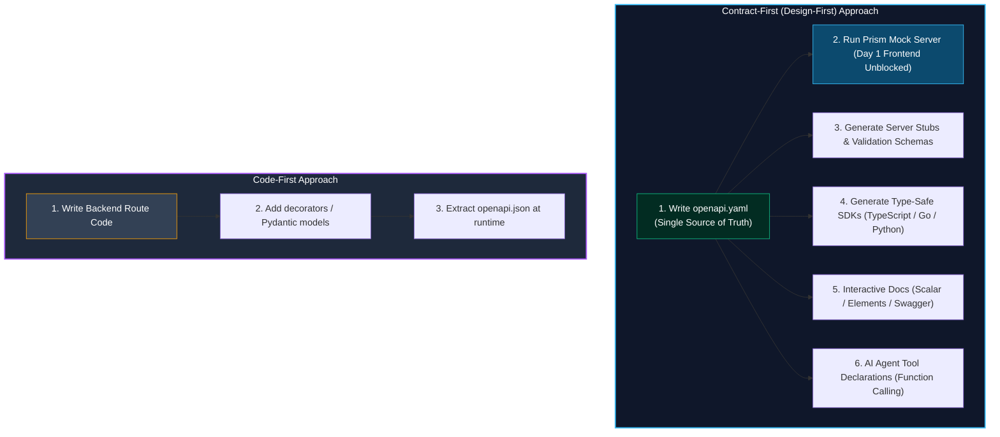
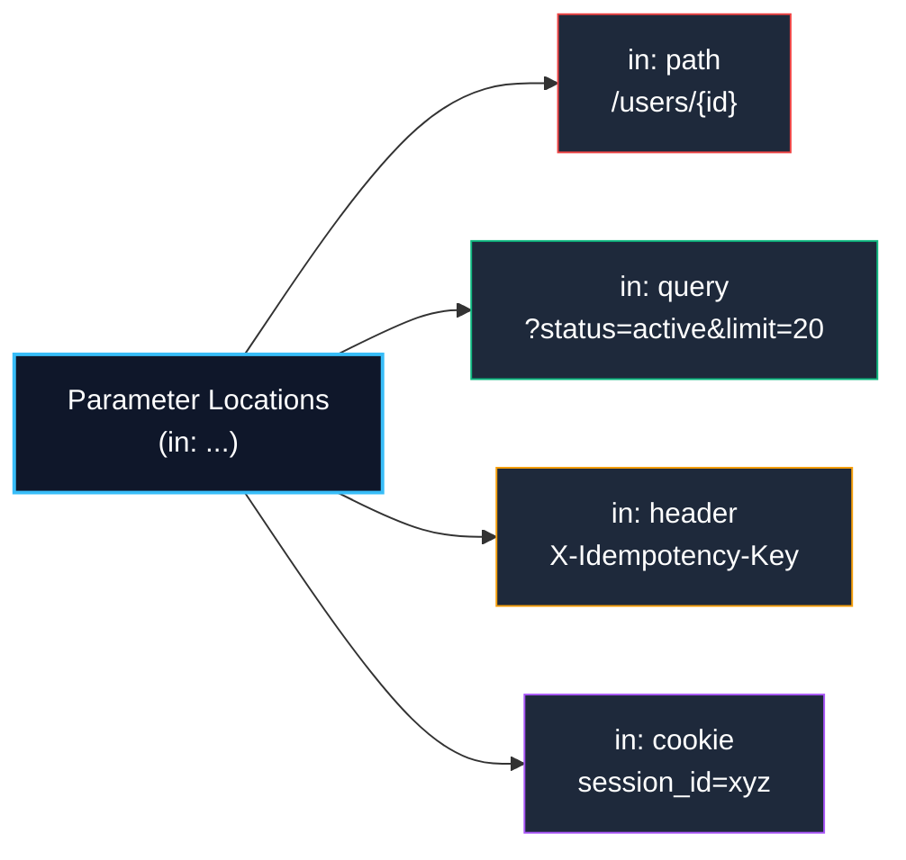
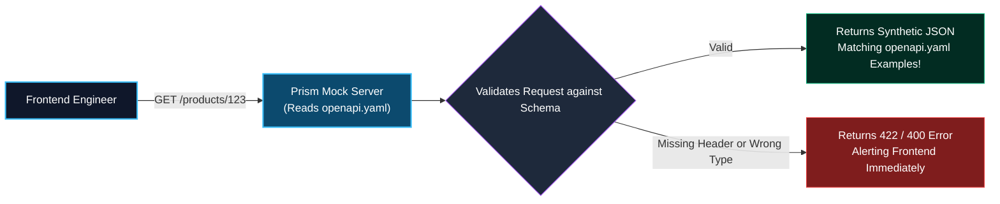
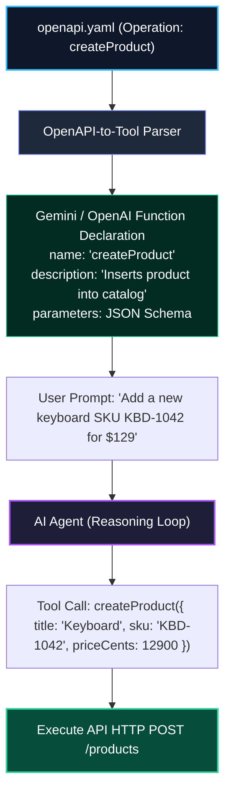

import { Callout } from 'fumadocs-ui/components/callout';
import { Tabs, Tab } from 'fumadocs-ui/components/tabs';
import { Steps, Step } from 'fumadocs-ui/components/steps';
import { Cards, Card } from 'fumadocs-ui/components/card';

Modern APIs do not exist in isolation. They serve mobile applications, single-page web frontends, internal microservices, external third-party enterprise integrations, and autonomous AI agents. Without formal machine-readable contracts, engineering organizations suffer from constant interface drift, broken serializers, and undocumented breaking changes.

The **OpenAPI Specification (OAS)** is the global industry standard for describing RESTful HTTP APIs. With OAS 3.1, the specification aligns 100% with the official JSON Schema (Draft 2020-12) standard, enabling identical validation schemas across backend route handlers, documentation portals, automated client generators, and LLM function calling.

---

## 1. OpenAPI 3.1: Contract-First vs. Code-First Design

Before writing code or specifications, teams must choose an architectural workflow:



### Architectural Comparison

| Dimension | Contract-First (Design-First) | Code-First |
| :--- | :--- | :--- |
| **Workflow** | API designers and frontend teams agree on the contract before code is written. | Backend engineers write routes, controllers, and models first. |
| **Tooling** | OpenAPI YAML/JSON, Stoplight Studio, Spectral linter, Prism mock server. | FastAPI, NestJS decorators, tRPC, ElysiaJS, Spring Boot annotations. |
| **Parallel Development** | **Instant**: Frontends can mock the API from Day 1 using mock servers (Prism). | Blocked until backend engineers implement and expose endpoints. |
| **Consistency** | Strict naming, standards, and reusable schema components (`components/schemas`). | Subject to individual developer coding quirks and controller drift. |
| **Ideal For** | Public APIs, microservice mesh contracts, multi-team organizations, AI tools. | Rapid prototyping, monolithic startups, small full-stack solo projects. |

---

## 2. Root OpenAPI YAML Anatomy

An OpenAPI 3.1 document is structured into five fundamental top-level sections:

```
openapi.yaml
├── openapi: 3.1.0               (Specification version declaration)
├── info                         (Metadata: title, version, description, license)
├── servers                      (Array of target deployment environments)
├── paths                        (Endpoints, HTTP operations, parameters, responses)
└── components                   (Reusable schemas, parameters, security schemes)
```

Here is a complete, production-grade root structure demonstrating OpenAPI 3.1:

```yaml title="openapi.yaml"
openapi: 3.1.0
info:
  title: CloudStore E-Commerce & Inventory API
  summary: High-performance RESTful API for inventory and orders
  description: |
    Production REST API providing catalog querying, cart management,
    and payment processing. Adheres strictly to RFC 9457 error formats.
  termsOfService: https://api.cloudstore.io/terms
  contact:
    name: API Platform Engineering Team
    email: api-support@cloudstore.io
    url: https://developer.cloudstore.io
  license:
    name: Apache 2.0
    identifier: Apache-2.0
  version: 1.4.0

servers:
  - url: https://api.cloudstore.io/v1
    description: Production Cluster (Global Anycast CDN)
  - url: https://staging-api.cloudstore.io/v1
    description: Staging Environment (Pre-release testing)
  - url: http://localhost:{port}/v1
    description: Local Development Server
    variables:
      port:
        default: "8080"
        enum:
          - "8080"
          - "3000"
          - "4000"

paths:
  /products/{productId}:
    # Operations defined here...

components:
  schemas:
    # Reusable JSON schemas defined here...
  securitySchemes:
    BearerAuth:
      type: http
      scheme: bearer
      bearerFormat: JWT
```

---

## 3. Parameters Structure & The Critical Path Parameter Invariant

In OpenAPI, parameters are inputs passed outside the request body. They are classified by the `in` attribute:



### Parameter Types Breakdown

1. **`in: path`**: Embedded directly in the URI template (e.g. `/products/{productId}`).
2. **`in: query`**: Appended to the URL after `?` for filtering, sorting, and pagination (e.g. `?limit=20&sort=-createdAt`).
3. **`in: header`**: Transmitted as HTTP request headers (e.g. `Idempotency-Key`, `X-Client-Version`).
4. **`in: cookie`**: Transmitted inside the browser `Cookie` header (e.g. `sessionId`).

<Callout type="error" title="Critical OpenAPI Invariant: Path Parameters MUST Always Be required: true">
According to the official OpenAPI 3.1 specification (Section 4.8.12):
> *"If the parameter location is 'path', the **required** property is **REQUIRED** and its value **MUST be true**."*

A path parameter represents an integral part of the URI route template (`/users/{userId}`). If the path parameter were optional or omitted, the request would target a completely different resource URI (`/users/`), triggering route mismatch or collection handler invocation. Any OpenAPI document with `in: path` and `required: false` (or missing `required`) is strictly invalid!
</Callout>

### Parameter Definition Example

```yaml
paths:
  /orders/{orderId}:
    get:
      summary: Retrieve order by ID
      operationId: getOrderById
      tags:
        - Orders
      parameters:
        # 1. Path Parameter (MUST BE required: true)
        - name: orderId
          in: path
          required: true
          description: Unique UUID of the order
          schema:
            type: string
            format: uuid
            example: "9b1deb4d-3b7d-4bad-9bdd-2b0d7b3dcb6d"

        # 2. Query Parameter
        - name: includeItems
          in: query
          required: false
          description: When true, expands nested line items
          schema:
            type: boolean
            default: false

        # 3. Header Parameter
        - name: X-Client-Trace-Id
          in: header
          required: false
          description: Distributed tracing correlation ID
          schema:
            type: string
            format: uuid

        # 4. Cookie Parameter
        - name: session_token
          in: cookie
          required: false
          description: Optional guest session identification cookie
          schema:
            type: string
```

---

## 4. Reusable Schemas with `$ref`

Writing full JSON schemas inline inside every endpoint creates massive duplication and guarantees schema drift. OpenAPI solves this with the `$ref` pointer keyword, referencing reusable definitions under `#/components/schemas`:

```yaml title="components/schemas.yaml"
components:
  schemas:
    # Base Reusable Entity
    User:
      type: object
      required:
        - id
        - email
        - fullName
        - role
        - createdAt
      properties:
        id:
          type: string
          format: uuid
          example: "usr_01H7XRP5F6Z2YQ"
        email:
          type: string
          format: email
          example: "alice@company.com"
        fullName:
          type: string
          minLength: 2
          maxLength: 100
          example: "Alice Johnson"
        role:
          type: string
          enum: [admin, manager, customer]
          default: customer
        avatarUrl:
          type:
            - string
            - "null" # OpenAPI 3.1 allows JSON Schema Draft 2020-12 null types!
          format: uri
        createdAt:
          type: string
          format: date-time
          example: "2026-10-05T14:30:00Z"

    # RFC 9457 Standard Problem Details Schema
    ErrorResponse:
      type: object
      required:
        - type
        - title
        - status
        - detail
      properties:
        type:
          type: string
          format: uri
          example: "https://api.cloudstore.io/errors/not-found"
        title:
          type: string
          example: "Resource Not Found"
        status:
          type: integer
          example: 404
        detail:
          type: string
          example: "The requested user 'usr_99' does not exist."
        instance:
          type: string
          example: "/v1/users/usr_99"
        invalidParams:
          type: array
          items:
            type: object
            required:
              - name
              - reason
            properties:
              name:
                type: string
                example: "email"
              reason:
                type: string
                example: "Must be a valid email address"
```

### Referencing Schemas in Operations

```yaml
paths:
  /users/{userId}:
    get:
      summary: Fetch user details
      operationId: getUserById
      parameters:
        - name: userId
          in: path
          required: true
          schema:
            type: string
      responses:
        '200':
          description: User found successfully
          content:
            application/json:
              schema:
                $ref: '#/components/schemas/User'
        '404':
          description: User ID not found
          content:
            application/problem+json:
              schema:
                $ref: '#/components/schemas/ErrorResponse'
```

---

## 5. RequestBody & Responses: Complete Operation Example

Here is a complete, production-ready specification of a `POST /products` operation showing request bodies, MIME types, multiple response status codes, and security requirements:

```yaml
paths:
  /products:
    post:
      summary: Create a new catalog product
      description: |
        Inserts a new product into the catalog. Requires inventory manager
        permissions and an active JWT bearer token.
      operationId: createProduct
      tags:
        - Products
      security:
        - BearerAuth: []
      parameters:
        - name: Idempotency-Key
          in: header
          required: false
          description: Unique UUID key to prevent duplicate creation on network retries
          schema:
            type: string
            format: uuid
      requestBody:
        description: Product creation attributes
        required: true
        content:
          application/json:
            schema:
              type: object
              required:
                - title
                - sku
                - priceCents
                - currency
              properties:
                title:
                  type: string
                  minLength: 3
                  maxLength: 120
                  example: "Mechanical Gaming Keyboard"
                sku:
                  type: string
                  pattern: "^[A-Z]{3}-[0-9]{4}$"
                  example: "KBD-1042"
                priceCents:
                  type: integer
                  minimum: 1
                  example: 12900
                currency:
                  type: string
                  enum: [USD, EUR, GBP]
                  default: USD
                tags:
                  type: array
                  items:
                    type: string
                  maxItems: 10
                  example: ["peripherals", "hardware"]
      responses:
        '201':
          description: Product successfully created
          headers:
            Location:
              description: URI of the newly created product
              schema:
                type: string
                format: uri
                example: "/v1/products/prd_01H7XSQ89B"
          content:
            application/json:
              schema:
                $ref: '#/components/schemas/Product'
        '400':
          description: Malformed JSON syntax
          content:
            application/problem+json:
              schema:
                $ref: '#/components/schemas/ErrorResponse'
        '401':
          description: Missing or invalid authentication token
          content:
            application/problem+json:
              schema:
                $ref: '#/components/schemas/ErrorResponse'
        '422':
          description: Schema validation failed (e.g. invalid SKU format)
          content:
            application/problem+json:
              schema:
                $ref: '#/components/schemas/ErrorResponse'
        '409':
          description: Conflict (Product SKU already exists)
          content:
            application/problem+json:
              schema:
                $ref: '#/components/schemas/ErrorResponse'
```

---

## 6. Instant Mock Server Generation with Prism

The greatest friction point in full-stack development is the **"Backend Blocker"**: frontend engineers cannot build or test UI components until backend engineers finish implementing databases and route handlers.

**Prism** (by Stoplight) eliminates this bottleneck completely. It reads your `openapi.yaml` file and spins up an instant, high-performance mock server on `localhost` with zero backend code:

```bash
# Start an instant HTTP mock server on port 4010
npx @stoplight/prism-cli mock openapi.yaml --port 4010
```

```text
[CLI Output]
[14:32:01] [CLI] …  info      Starting Prism…
[14:32:01] [CLI] ℹ  info      Mock server listening on http://127.0.0.1:4010
[14:32:01] [CLI] ℹ  info      Routes:
[14:32:01] [CLI]              GET    http://127.0.0.1:4010/products
[14:32:01] [CLI]              POST   http://127.0.0.1:4010/products
[14:32:01] [CLI]              GET    http://127.0.0.1:4010/products/{productId}
```



### Why Prism Unblocks Teams on Day 1
1. **Dynamic Example Generation**: Prism inspects the `example`, `format` (e.g. `uuid`, `email`), and `enum` values in your YAML and generates realistic fake data.
2. **Strict Request Validation**: If the frontend developer sends an invalid field or forgets a required header, Prism replies with a `422 Unprocessable Content` error, alerting the developer before reaching staging.
3. **Status Code Switching via Headers**: Frontend developers can test edge cases (like a 404 or 500) without modifying server code:
   ```bash
   # Tell Prism to simulate a 404 Not Found response:
   curl -H "Prefer: code=404" http://localhost:4010/products/prd_999
   ```

---

## 7. Automated API Style Linting with Spectral

Just as ESLint prevents JavaScript code smells, **Spectral** (by Stoplight) enforces corporate API design guidelines and governance across your OpenAPI contracts.

### 1. Install & Run Spectral

```bash
# Run Spectral against your contract
npx @stoplight/spectral-cli lint openapi.yaml
```

### 2. Configure Custom Spectral Rulesets

Create a `.spectral.yaml` file in your repository root to enforce strict engineering rules:

```yaml title=".spectral.yaml"
extends: [[spectral:oas, all]]

rules:
  # Rule 1: Ensure all collection paths use kebab-case
  paths-kebab-case:
    description: All URI paths must use lowercase kebab-case.
    message: Path "{{property}}" must be lowercase and use hyphens.
    severity: error
    given: $.paths[*]~
    then:
      function: pattern
      functionOptions:
        match: "^(/[a-z0-9-]+|/{[a-zA-Z0-9]+})+$"

  # Rule 2: Force every operation to declare an operationId
  operation-operationId-valid:
    description: Every operation must have an operationId for SDK generation.
    severity: error
    given: $.paths.*[get,post,put,delete,patch]
    then:
      field: operationId
      function: defined

  # Rule 3: Enforce RFC 9457 Problem Details for all 4xx/5xx responses
  error-response-schema:
    description: All 4xx and 5xx responses must return application/problem+json.
    severity: warn
    given: $.paths.*.*.responses[?(@property >= '400')].content
    then:
      field: application/problem+json
      function: defined

  # Rule 4: Require descriptions on every parameter
  parameter-description:
    description: Every parameter must document its business meaning.
    severity: error
    given: $.paths.*.*.parameters[*]
    then:
      field: description
      function: defined
```

Running this linter in your CI/CD pipeline (e.g., GitHub Actions) prevents non-compliant APIs from ever being merged into main.

---

## 8. Type-Safe Client SDK Generation

Manually writing `fetch()` wrappers or Axios calls is an anti-pattern: field renames in the backend silently break clients at runtime.

With **`openapi-typescript`** and **`openapi-fetch`**, you generate zero-runtime, compile-time verified TypeScript types directly from your OpenAPI contract:

```bash
# Generate pure TypeScript types from the OpenAPI YAML
npx openapi-typescript ./openapi.yaml -o ./src/api/schema.d.ts
```

```typescript title="src/api/client.ts"
import createClient from 'openapi-fetch';
import type { paths } from './schema'; // Generated from openapi.yaml!

export const api = createClient<paths>({ baseUrl: 'https://api.cloudstore.io/v1' });

// 1. Fully type-safe GET request
const { data, error } = await api.GET('/products/{productId}', {
  params: {
    path: { productId: 'prd_01H7XSQ89B' }, // TypeScript error if omitted or wrong type!
  },
});

if (data) {
  // TypeScript knows data is { title: string; priceCents: number; ... }
  console.log(`Product: ${data.title}, Price: $${data.priceCents / 100}`);
}

// 2. Fully type-safe POST request
const response = await api.POST('/products', {
  body: {
    title: 'Wireless Mechanical Mouse',
    sku: 'MOU-8821',
    priceCents: 7900,
    currency: 'USD',
  },
});
```

If the backend team changes `priceCents` to `priceInCents` in `openapi.yaml`, running the generator instantly causes a TypeScript compiler error across the entire frontend codebase!

---

## 9. AI Agent & LLM Tool-Calling Integration

One of the most transformative modern applications of OpenAPI is powering **Autonomous AI Agents** and **LLM Tool-Calling (Function Calling)**.

LLMs (Gemini, Claude, GPT-4) do not interact with software via graphical user interfaces; they interact through structured tool definitions. Because OpenAPI 3.1 is 100% compliant with JSON Schema, **every OpenAPI operation can be converted directly into an AI tool definition**:



### Converting OpenAPI Operations into Tool Declarations

Here is how an OpenAPI operation maps into a Google Gemini / OpenAI function declaration:

```typescript title="openapi-to-agent-tool.ts"
import { GoogleGenAI, Type, FunctionDeclaration } from '@google/genai';

// An OpenAPI operation maps directly into an LLM Function Declaration:
export const createProductTool: FunctionDeclaration = {
  name: "createProduct",
  description: "Creates a new catalog product in the inventory database with SKU and price.",
  parameters: {
    type: Type.OBJECT,
    properties: {
      title: {
        type: Type.STRING,
        description: "The marketing title of the product",
      },
      sku: {
        type: Type.STRING,
        description: "Stock keeping unit in pattern ABC-1234",
      },
      priceCents: {
        type: Type.INTEGER,
        description: "Price in integer cents (e.g. 12900 for $129.00)",
      },
      currency: {
        type: Type.STRING,
        enum: ["USD", "EUR", "GBP"],
        description: "ISO 4217 currency code",
      },
    },
    required: ["title", "sku", "priceCents", "currency"],
  },
};

// Pass directly to the Gemini Agent model:
const ai = new GoogleGenAI();
const response = await ai.models.generateContent({
  model: 'gemini-2.5-flash',
  contents: 'Please create a new product named "Ergonomic Desk Mat" with SKU DSK-9021 for $35 USD.',
  config: {
    tools: [{ functionDeclarations: [createProductTool] }],
  },
});

// The model will automatically output a structured function call:
// { name: "createProduct", args: { title: "Ergonomic Desk Mat", sku: "DSK-9021", priceCents: 3500, currency: "USD" } }
```

By maintaining high-quality OpenAPI 3.1 contracts with clear descriptions and parameter constraints, your backend becomes instantly accessible to both human developers and autonomous AI agents without writing custom glue code.

---

## 10. Architecture Checklist & Key Takeaways

<Cards>
  <Card
    title="OpenAPI 3.1 Single Source of Truth"
    description="Establish machine-readable OAS 3.1 specifications before implementation to unblock frontend teams and guarantee interface consistency across teams."
  />
  <Card
    title="Path Parameter Invariant"
    description="Path parameters (in: path) MUST always be specified with required: true. Omitting this breaks spec compliance and causes route matching bugs."
  />
  <Card
    title="Instant Day-1 Prism Mocking"
    description="Run npx @stoplight/prism-cli mock openapi.yaml to give frontend engineers working API mocks on localhost before the backend is even coded."
  />
  <Card
    title="Spectral CI/CD Governance"
    description="Enforce casing standards, RFC 9457 problem details, and complete descriptions using automated linting in your build pipeline."
  />
  <Card
    title="AI Agent Tool-Calling Ready"
    description="OpenAPI 3.1 contracts translate directly into LLM function declarations, allowing autonomous AI agents to operate your API safely."
  />
  <Card
    title="Compile-Time Type Safety"
    description="Generate TypeScript types using openapi-typescript to catch backend field renames and schema breaking changes at build time."
  />
</Cards>
