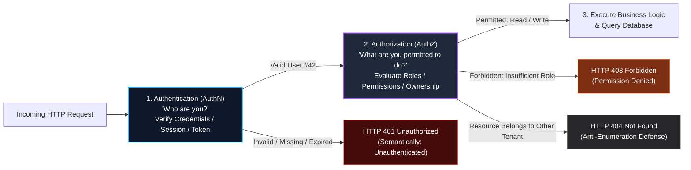
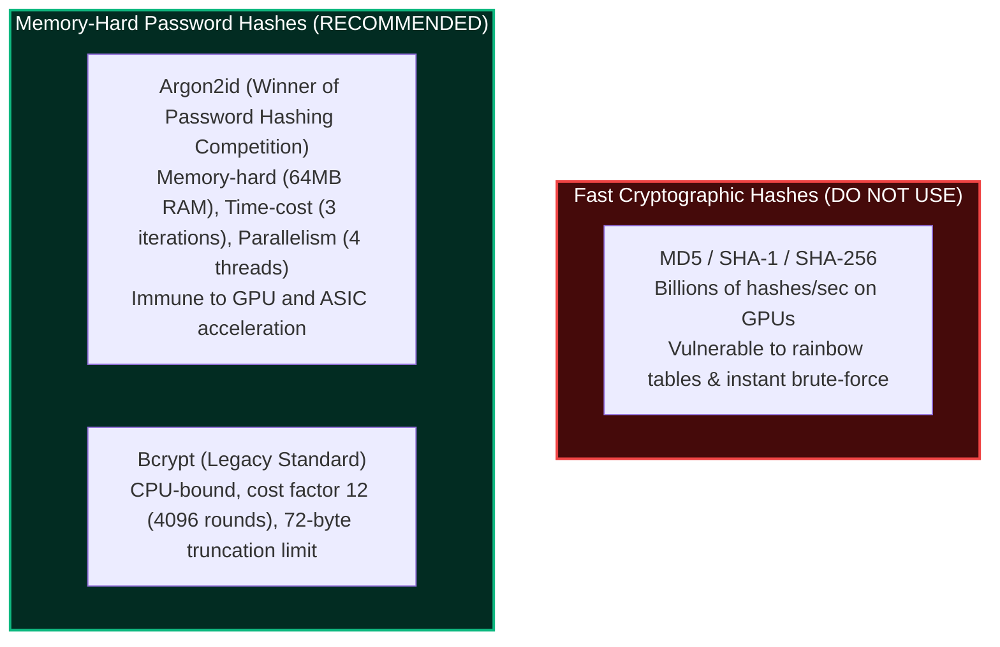
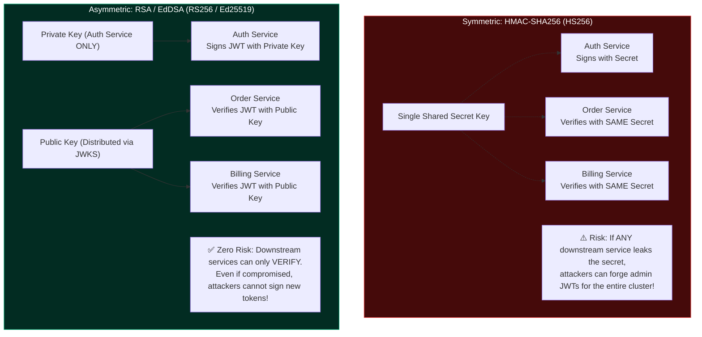
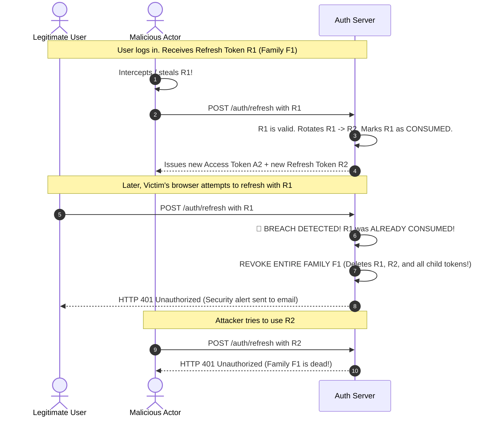
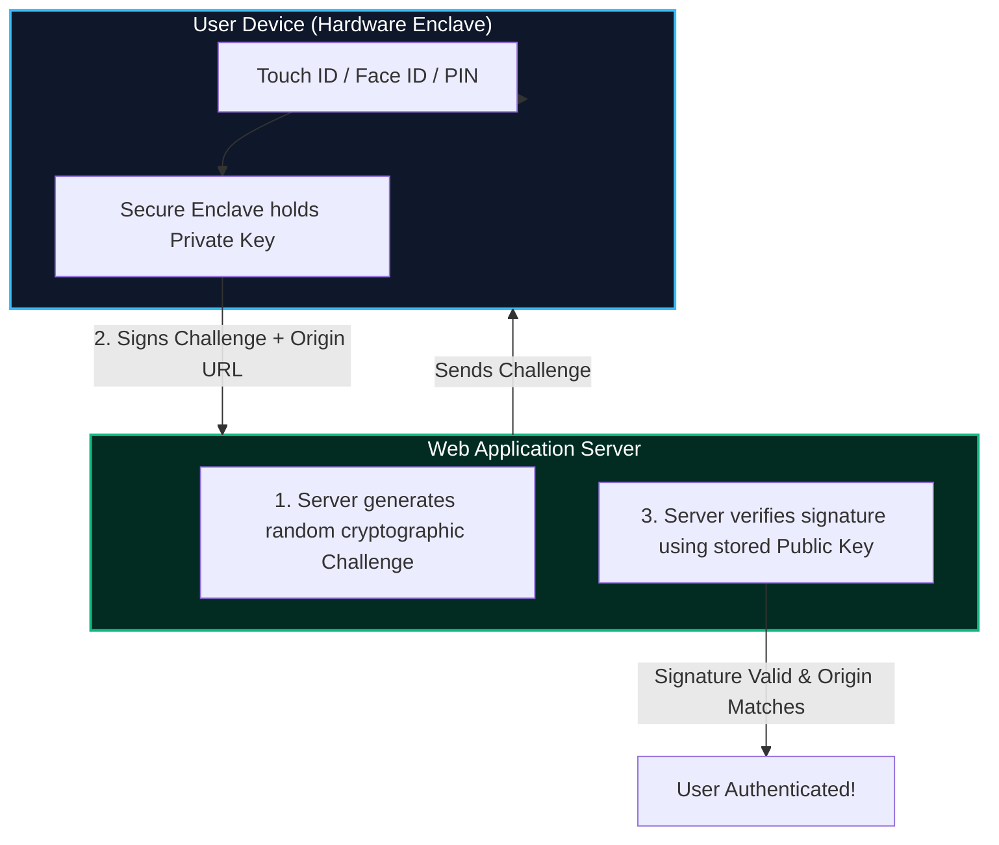

import { Callout } from 'fumadocs-ui/components/callout';
import { Tabs, Tab } from 'fumadocs-ui/components/tabs';
import { Steps, Step } from 'fumadocs-ui/components/steps';

User authentication is the foundation of digital identity on the web. It establishes whether an incoming HTTP request is initiated by a legitimate, verified human being, and maintains that trust over time across untrusted networks and browser runtimes.

Designing robust user authentication requires understanding the boundary between **Authentication (AuthN)** and **Authorization (AuthZ)**, securing credentials with memory-hard cryptography, and choosing between stateful sessions and stateless tokens.

---

## 1. Authentication (AuthN) vs. Authorization (AuthZ)

Although frequently conflated under the catch-all term *"Auth"*, authentication and authorization solve two distinct security problems:



### The Airport Analogy
- **Authentication (AuthN)** is showing your **Passport** at the border. The border agent inspects the photo, hologram, and cryptographic chip to confirm that *you are indeed John Doe*.
- **Authorization (AuthZ)** is your **Boarding Pass**. Having a valid passport does not grant you permission to board Flight 305 to Tokyo or enter the cockpit. The boarding pass grants permission to sit in Seat 14B on that specific flight.

### The Defensive Contract: Status Codes

| Dimension | Authentication (AuthN) | Authorization (AuthZ) |
| :--- | :--- | :--- |
| **Core Question** | *"Who is the principal making this request?"* | *"Is this principal allowed to perform action $A$ on resource $R$?"* |
| **Proof Mechanism** | Passwords, TOTP codes, session IDs, JWT signatures, WebAuthn assertions. | Roles (RBAC), attributes (ABAC), tenant ID filters, object ownership. |
| **Failure Status Code** | **`401 Unauthorized`** (Client must supply valid credentials). | **`403 Forbidden`** (Identity verified, but permission denied) or **`404 Not Found`**. |
| **Pipeline Stage** | Executed at the outer perimeter (Ingress gateway / Auth middleware). | Executed in the domain service layer right before database queries. |

<Callout type="warn" title="Defensive Status Codes: Anti-Enumeration">
When a user requests an object belonging to another organization (e.g. `GET /api/v1/projects/proj_9912`), returning `403 Forbidden` confirms that `proj_9912` exists. Return **`404 Not Found`** instead to prevent horizontal scanning and resource enumeration attacks.
</Callout>

---

## 2. Cryptographic Core: Password Storage & Verification

Passwords must **never** be stored in plaintext or encrypted with symmetric two-way encryption (because an encryption key can be stolen or leaked). Instead, passwords must be **irreversibly hashed**.

### Why Fast Hashes (MD5, SHA-256) are Fatal for Passwords

Cryptographic hash functions like SHA-256 are engineered to run **as fast as possible** (for verifying file checksums and SSL signatures). Modern consumer GPUs can compute over **15 billion SHA-256 hashes per second**. An attacker with a leaked database dump can crack an 8-character password in minutes using rainbow tables or brute force.

Password hashes must be **deliberately slow and computationally expensive**.



### Salts vs. Peppers
- **Salt:** A cryptographically random, unique byte sequence (at least 16 bytes) generated per user and stored alongside the hash in the database. Salts ensure that identical passwords (e.g. `Password123!`) yield completely different hashes, completely eliminating precomputed **Rainbow Table** attacks.
- **Pepper:** A high-entropy secret key stored **outside the database** (in environment variables, AWS KMS, or HashiCorp Vault). The pepper is combined with the password before hashing. If an attacker dumps the SQL database via an SQL injection exploit, they cannot crack the hashes without also stealing the application server's pepper key.

### Production Password Hashing with Argon2id

Argon2id is the state-of-the-art password hashing algorithm, combining resistance to side-channel timing attacks (Argon2i) and GPU cracking attacks (Argon2d).

```typescript
import argon2 from 'argon2';
import crypto from 'crypto';

// Server pepper stored in secure environment variable
const PEPPER = process.env.PASSWORD_PEPPER || 'app-wide-secret-pepper-min-32-chars';

export class PasswordService {
  /**
   * Hashes a password using Argon2id with OWASP recommended parameters
   */
  static async hashPassword(password: string): Promise<string> {
    // Combine password with application pepper
    const pepperedPassword = crypto
      .createHmac('sha256', PEPPER)
      .update(password)
      .digest('hex');

    return argon2.hash(pepperedPassword, {
      type: argon2.argon2id,
      memoryCost: 65536, // 64 MB of RAM
      timeCost: 3,       // 3 iterations
      parallelism: 4,    // 4 parallel threads
      hashLength: 32,    // 32-byte hash output
    });
  }

  /**
   * Verifies a password against an Argon2id hash in constant time
   */
  static async verifyPassword(password: string, hash: string): Promise<boolean> {
    const pepperedPassword = crypto
      .createHmac('sha256', PEPPER)
      .update(password)
      .digest('hex');

    try {
      return await argon2.verify(hash, pepperedPassword);
    } catch {
      return false;
    }
  }
}
```

### Timing Attacks & Constant-Time String Comparison

When comparing secret strings (such as reset tokens, API keys, or HMAC signatures), standard equality operators (`===`) compare strings byte-by-byte from left to right and return `false` on the **first mismatched character**.

An attacker measuring network latency in microseconds can deduce character-by-character whether their guess matched:
```typescript
// ❌ VULNERABLE TO TIMING ATTACKS: Short-circuits on first wrong byte
if (userToken === expectedToken) { /* ... */ }

// ✅ SAFE: Constant-time comparison prevents timing side channels
import crypto from 'crypto';

function safeCompare(a: string, b: string): boolean {
  const bufA = Buffer.from(a);
  const bufB = Buffer.from(b);
  if (bufA.length !== bufB.length) return false;
  return crypto.timingSafeEqual(bufA, bufB);
}
```

---

## 3. Stateful Sessions & Hardened Cookie Management

In a **Stateful Session** architecture, the backend generates an opaque, high-entropy session identifier upon login, stores the session data in a fast in-memory database (Redis), and issues the session ID to the browser inside an HTTP cookie.

```mermaid
sequenceDiagram
    autonumber
    actor User as User Browser
    participant App as Backend API
    participant Redis as Redis Session Store
    participant DB as Primary SQL DB

    User->>App: POST /api/v1/auth/login { email, password }
    App->>DB: Fetch user & verify Argon2id hash
    App->>Redis: SET session:sid_88a7b { userId: 42, role: 'admin' } EX 86400
    App->>User: 200 OK + Set-Cookie: __Host-sid=sid_88a7b; HttpOnly; Secure; SameSite=Lax; Path=/
    Note over User,App: Subsequent requests automatically attach cookie
    User->>App: GET /api/v1/user/profile (Cookie: __Host-sid=sid_88a7b)
    App->>Redis: GET session:sid_88a7b
    Redis-->>App: { userId: 42, role: 'admin' }
    App-->>User: 200 OK { profileData }
```

### Essential Hardened Cookie Flags

Never set raw session cookies without modern security flags:

```http
Set-Cookie: __Host-sid=a94f83b2...; Secure; HttpOnly; SameSite=Lax; Path=/; Max-Age=86400
```

1. **`HttpOnly`**: Prevents client-side JavaScript (`document.cookie`) from reading the cookie. If an attacker exploits an XSS vulnerability, they cannot steal the session cookie!
2. **`Secure`**: Guarantees the browser will only transmit the cookie over encrypted TLS/HTTPS connections. It will never be transmitted over plaintext HTTP.
3. **`SameSite=Lax` / `Strict`**: Instructs the browser when to attach the cookie on cross-site requests, mitigating Cross-Site Request Forgery (CSRF).
4. **Cookie Prefix `__Host-`**: The strongest RFC 6265bis security attribute. Enforces that:
   - The cookie must have the `Secure` attribute.
   - The cookie must be sent from an HTTPS origin.
   - The cookie cannot set a `Domain` attribute (cannot be shared with subdomains like `blog.example.com`).
   - The `Path` attribute must be strictly `/`.

### Instant Session Revocation
The biggest advantage of stateful sessions is **instant, authoritative revocation**:
- **Logout:** `DEL session:sid_88a7b` instantly destroys the session.
- **Log Out All Other Devices:** `DEL session:user:42:*` terminates all active sessions across phones, laptops, and tablets in a single operation.
- **Account Ban / Password Reset:** The moment an administrator suspends an account, their Redis session is deleted, terminating access on the very next HTTP request.

---

## 4. Stateless JWT Architecture: HS256 vs. RS256

A **JSON Web Token (JWT)** is a compact, URL-safe container for cryptographically signed claims. Unlike sessions, the server does not store JWT state in memory or database; instead, the token is validated purely through cryptographic signature verification.

```
+----------------------------------------------------------------------------------------+
| eyJhbGciOiJSUzI1NiIsInR5cCI6IkpXVCJ9.eyJzdWIiOiI0MiIsImV4cCI6MTcxMjM0OTAwMCwicm9sZSI6ImFkbWluIn0.V8k2Z_... |
+----------------------------------------------------------------------------------------+
  [Header: Algorithm & Type]         . [Payload: Claims & Expiration]           . [Digital Signature]
```

### Symmetric (HS256) vs. Asymmetric (RS256 / Ed25519)



### Common JWT Security Vulnerabilities

1. **The `alg: "none"` Vulnerability:** Attackers modify the header to `{ "alg": "none" }` and strip the signature. Vulnerable libraries accept the unverified token. Always explicitly specify allowed algorithms (e.g. `algorithms: ['RS256']`).
2. **Weak Secrets in HS256:** HS256 secrets shorter than 256 bits can be brute-forced offline at billions of guesses per second using Hashcat.
3. **No Expiration Validation:** Always require the `exp` claim and enforce a short lifespan (5 to 15 minutes).
4. **Key ID (`kid`) Header Injection:** If your server retrieves public keys by SQL query using the `kid` header, an attacker can perform SQL injection inside the token header. Validate the `kid` format strictly against a trusted in-memory JWKS set.

---

## 5. Dual-Token Architecture: Refresh Token Rotation with Reuse Detection

Because stateless access tokens cannot be easily revoked before they expire, best practice requires:
1. **Short-Lived Access Tokens (5 - 15 minutes):** Sent in the `Authorization: Bearer <token>` header for daily API requests.
2. **Long-Lived Refresh Tokens (7 - 30 days):** Stored in a hardened `__Host-` `HttpOnly` cookie and used exclusively to request new access tokens.

### The Threat: Stolen Refresh Tokens
If an attacker steals a user's refresh token (via malware or physical device access), how does the server detect that two entities are using the same identity?

### The Solution: Token Family Tracking & Reuse Detection

Under **Refresh Token Rotation (RTR)** with **Family Tracking**:
- Every login creates a **Token Family** with a unique `familyId`.
- Every time a refresh token is used, it is **consumed immediately** and replaced with a new one.
- If a token that was **already consumed** is presented again, the server detects a security breach! It immediately **revokes all tokens in that family**, invalidating both the attacker's and victim's sessions and forcing a fresh login.



### Production Refresh Token Rotation Implementation

```typescript
import { Request, Response } from 'express';
import crypto from 'crypto';
import jwt from 'jsonwebtoken';
import Redis from 'ioredis';

const redis = new Redis(process.env.REDIS_URL || 'redis://localhost:6379');
const JWT_PRIVATE_KEY = process.env.JWT_PRIVATE_KEY!;

interface StoredRefreshToken {
  tokenHash: string;
  familyId: string;
  userId: string;
  isUsed: boolean;
  expiresAt: number;
}

export class TokenRotationService {
  /**
   * Rotates a refresh token with automatic breach reuse detection
   */
  static async rotateTokens(req: Request, res: Response): Promise<void> {
    const rawRefreshToken = req.cookies['__Host-refresh-token'];
    if (!rawRefreshToken) {
      res.status(401).json({ error: 'Refresh token required' });
      return;
    }

    // 1. Hash the incoming token to look up its record
    const incomingHash = crypto.createHash('sha256').update(rawRefreshToken).digest('hex');
    const recordRaw = await redis.get(`rt:${incomingHash}`);

    if (!recordRaw) {
      res.status(401).json({ error: 'Invalid or expired refresh token' });
      return;
    }

    const record: StoredRefreshToken = JSON.parse(recordRaw);

    // 2. REUSE DETECTION: If this token was ALREADY USED, a breach occurred!
    if (record.isUsed) {
      console.warn(`[SECURITY_ALERT] Token reuse detected for user ${record.userId}! Revoking family ${record.familyId}`);
      
      // Revoke all tokens belonging to this family
      const familyTokens = await redis.smembers(`family:${record.familyId}`);
      const pipeline = redis.pipeline();
      for (const tHash of familyTokens) {
        pipeline.del(`rt:${tHash}`);
      }
      pipeline.del(`family:${record.familyId}`);
      await pipeline.exec();

      res.clearCookie('__Host-refresh-token', { path: '/' });
      res.status(401).json({
        error: 'Compromised session detected. All sessions revoked. Please log in again.',
      });
      return;
    }

    // 3. Mark the current token as used
    record.isUsed = true;
    await redis.set(`rt:${incomingHash}`, JSON.stringify(record), 'EX', 86400);

    // 4. Issue a new Refresh Token in the same family
    const newRawRefreshToken = crypto.randomBytes(32).toString('hex');
    const newHash = crypto.createHash('sha256').update(newRawRefreshToken).digest('hex');

    const newRecord: StoredRefreshToken = {
      tokenHash: newHash,
      familyId: record.familyId,
      userId: record.userId,
      isUsed: false,
      expiresAt: Date.now() + 7 * 24 * 60 * 60 * 1000, // 7 days
    };

    const pipeline = redis.pipeline();
    pipeline.set(`rt:${newHash}`, JSON.stringify(newRecord), 'EX', 7 * 24 * 60 * 60);
    pipeline.sadd(`family:${record.familyId}`, newHash);
    await pipeline.exec();

    // 5. Issue short-lived access token (15 mins)
    const newAccessToken = jwt.sign(
      { sub: record.userId },
      JWT_PRIVATE_KEY,
      { algorithm: 'RS256', expiresIn: '15m' }
    );

    // Set new refresh token in hardened cookie
    res.cookie('__Host-refresh-token', newRawRefreshToken, {
      httpOnly: true,
      secure: true,
      sameSite: 'lax',
      path: '/',
      maxAge: 7 * 24 * 60 * 60 * 1000,
    });

    res.json({ accessToken: newAccessToken });
  }
}
```

---

## 6. Multi-Factor Authentication (MFA) & WebAuthn / Passkeys

Single-factor password authentication is fundamentally vulnerable to phishing, credential stuffing, and keyloggers. Modern enterprise applications require second-factor validation.

### 1. TOTP: Time-Based One-Time Passwords (RFC 6238)
- Generates a 6-digit numeric code that changes every 30 seconds (Google Authenticator, 1Password).
- Based on an initial shared secret seed $K$ between client and server.
- The formula:
  $$\text{Counter} = \left\lfloor \frac{\text{Current UNIX Time}}{30} \right\rfloor$$
  $$\text{Code} = \text{Truncate}(\text{HMAC-SHA1}(K, \text{Counter})) \pmod{10^6}$$
- Always verify the current time step as well as $t-1$ and $t+1$ to tolerate minor client clock drift.

### 2. FIDO2 / WebAuthn Passkeys: The Phishing-Resistant Future
Passkeys replace passwords with asymmetric public-key cryptography built into hardware authenticators (Apple Touch ID / Face ID, Windows Hello, YubiKey).



**Why Passkeys are Immune to Phishing:**
When the hardware authenticator signs the authentication assertion, it mathematically signs the **Origin URL** of the current browser tab (`https://bank.com`). If an attacker tricks a user into visiting a fake phishing site (`https://bänk.com`), the browser submits the phishing domain in the client data. The signature fails server validation because the origins do not match.

---

## 7. User Authentication Implementation Checklist

<Steps>
  <Step>
    ### Use Memory-Hard Password Hashing (Argon2id)
    Never store plaintext or fast hashes. Configure Argon2id with 64MB RAM, 3 iterations, 4 threads, and an out-of-band application pepper.
  </Step>
  <Step>
    ### Enforce Hardened Cookie Security
    Always configure `__Host-` cookie prefixes with `HttpOnly`, `Secure`, and `SameSite=Lax` or `SameSite=Strict`.
  </Step>
  <Step>
    ### Choose Asymmetric RS256 / Ed25519 for Microservices
    Never distribute shared symmetric secrets across multiple downstream microservices. Sign tokens with an auth-tier private key and verify with public keys.
  </Step>
  <Step>
    ### Implement Refresh Token Rotation with Reuse Detection
    Rotate refresh tokens on every single use. Track token families in Redis and instantly revoke the entire family if an already-consumed token is replayed.
  </Step>
  <Step>
    ### Prevent Timing Attacks
    Always use `crypto.timingSafeEqual` when comparing hashes, HMAC signatures, or authorization tokens.
  </Step>
</Steps>
