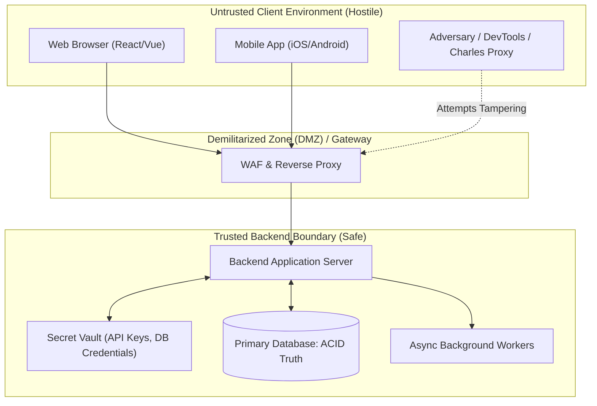
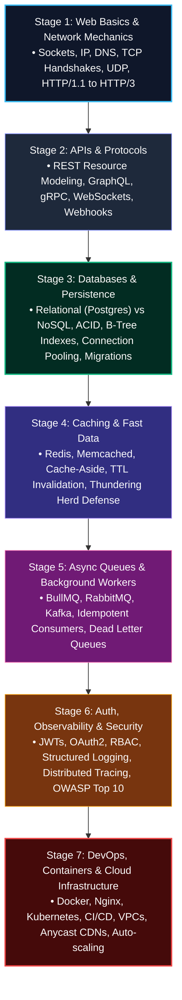
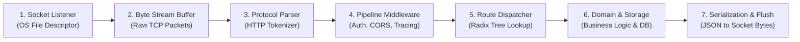
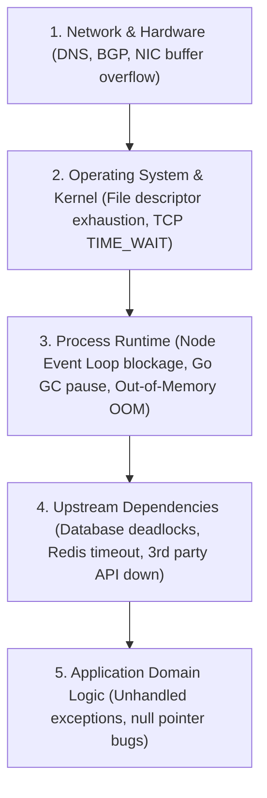

import { Callout } from 'fumadocs-ui/components/callout';
import { Tabs, Tab } from 'fumadocs-ui/components/tabs';
import { Steps, Step } from 'fumadocs-ui/components/steps';
import { Cards, Card } from 'fumadocs-ui/components/card';

Every year, a new backend framework promises revolutionary developer ergonomics. In JavaScript alone, developers have moved from raw Node `http` to Express, Koa, Hapi, NestJS, Fastify, Hono, and Elysia. Across languages, engineers debate Go's `chi` vs `gin`, Python's `Django` vs `FastAPI`, and Rust's `actix-web` vs `axum`.

This relentless churn creates **syntax fatigue**—the paralyzing fear that you are falling behind because you haven't memorized the decorators or middleware signatures of the newest tool.

Here is the truth: **Frameworks are thin syntactic sugar wrappers around seven unchanging computer science primitives.** Once you master the invariant laws of sockets, memory streams, serialization, state machines, and distributed storage, any backend framework becomes trivial to pick up in a single afternoon.

---

## 1. Why Do Backends Exist? (The Four Pillars)

Why can't client applications (browsers and mobile phones) connect directly to a database? Why does an intermediate backend server exist at all?



Every backend server exists to solve four fundamental problems that client applications cannot solve on their own:

### Pillar 1: The Security Boundary (The Client is Hostile Territory)
Code running in a browser or on a phone is running on hardware owned and controlled by an external user. A user can:
- Open Chrome DevTools, pause execution, and alter JavaScript variables in memory.
- Inspect network traffic, intercept tokens, and tamper with payload fields (e.g., changing `"price": 100` to `"price": 0.01`).
- Decompile native mobile binaries to extract hardcoded API secrets or encryption keys.

A backend server operates inside a **trusted execution environment** (a private VPC or secure cloud server). It enforces authentication, authorizes actions, sanitizes input, and conceals secret keys (such as Stripe private keys or database passwords) that must never touch client hardware.

### Pillar 2: ACID State Persistence and Concurrency
Client devices are ephemeral. Phones lose cellular reception in tunnels; users clear local storage; laptops run out of battery. 
Furthermore, clients cannot resolve **race conditions**:
- If two users on opposite sides of the world attempt to book the final remaining concert seat simultaneously, an untrusted client cannot coordinate the lock.
- A centralized backend serializes conflicting operations using database transactions, row-level locks, and consensus protocols to guarantee that only one seat is sold.

### Pillar 3: Multi-Client Business Logic Centralization
Modern companies do not maintain a single web application. They serve web dashboards, iOS apps, Android apps, public API consumers, partner webhooks, and CLI tools. 
If business logic (such as tax calculation or fraud detection) lived in the client, you would have to write and maintain that logic across TypeScript, Swift, and Kotlin—and a single bug in one client would break compliance across the entire business.

### Pillar 4: Asymmetric Compute and Data Aggregation
Mobile devices and browser tabs have constrained CPU power and battery life. Querying a 100-million-row dataset, running machine learning inferences, generating high-resolution PDF invoices, or rendering video must occur on high-performance multi-core servers with dedicated memory and NVMe arrays.

---

## 2. The 7-Stage Backend Engineering Roadmap

To become a staff-level backend architect, you cannot jump straight to Kubernetes or distributed event meshes. Backend engineering has a strict, progressive dependency hierarchy where each layer builds on the laws of the layer beneath it:



```
+---------------------------------------------------------------------------------------------------+
|                            THE 7-STAGE BACKEND ARCHITECTURE ROADMAP                               |
+---------------------------------------------------------------------------------------------------+
|  [Stage 1]  Web Basics & Network: OS Sockets -> DNS -> TCP Handshake -> HTTP Wire Format         |
|      ↓                                                                                            |
|  [Stage 2]  APIs & Protocols: REST Modeling -> Status Codes -> GraphQL -> gRPC -> WebSockets      |
|      ↓                                                                                            |
|  [Stage 3]  Databases & Storage: SQL DDL -> ACID Transactions -> B-Tree Indexes -> Connection Pool |
|      ↓                                                                                            |
|  [Stage 4]  Caching & Fast Data: In-Memory Redis -> Cache-Aside -> Invalidation -> Stampede Guard |
|      ↓                                                                                            |
|  [Stage 5]  Async Queues & Jobs: Producers -> BullMQ/Kafka -> Idempotent Consumer -> DLQ Retries |
|      ↓                                                                                            |
|  [Stage 6]  Security & Observability: JWT/OAuth2 -> Rate Limiting -> OpenTelemetry Traces -> Logs  |
|      ↓                                                                                            |
|  [Stage 7]  DevOps & Cloud Infra: Docker -> Nginx Reverse Proxy -> Linux Epoll -> AWS/K8s VPC    |
+---------------------------------------------------------------------------------------------------+
```

### The First-Principles Rationale: Why Stages Follow This Exact Order

1. **Stage 1 (Web Basics & Network) Before Stage 2 (APIs)**:
   You cannot design high-throughput REST or gRPC APIs if you don't understand that HTTP runs over TCP/UDP sockets, that every TLS handshake adds round-trip latency, or how headers and byte streams are framed.
2. **Stage 2 (APIs) Before Stage 3 (Databases)**:
   API contracts dictate the access patterns and query shapes required by client applications. Designing database tables before knowing API query shapes leads to un-indexed table scans and N+1 query catastrophes.
3. **Stage 3 (Databases) Before Stage 4 (Caching)**:
   Caching is **never a replacement for bad database design**. If you do not understand B-Tree indexes, transaction isolation levels, and connection pooling, introducing Redis will only produce cache-invalidation anomalies and race conditions.
4. **Stage 4 (Caching) Before Stage 5 (Async Queues)**:
   Background workers and distributed message brokers (RabbitMQ, Kafka, BullMQ) rely heavily on in-memory datastores (Redis) for distributed locking, idempotency tracking, and deduplication tokens.
5. **Stage 5 (Async Queues) Before Stage 6 (Observability & Security)**:
   Asynchronous workflows decouple request spikes. Once systems become asynchronous and distributed, finding bugs requires distributed tracing correlation IDs (`Trace-Id`) passing across HTTP hops and message queues.
6. **Stage 6 (Security & Observability) Before Stage 7 (DevOps & Cloud)**:
   Deploying un-monitored, insecure microservices to Kubernetes clusters creates unmanageable security vectors. Containerization and cloud orchestration are mechanisms to host applications whose security and telemetry boundaries are already defined.

---

## 3. The Seven Invariant Primitives

Behind every framework, from Express to Go Gin, lies the same architectural pipeline:



| Primitive | What It Actually Does | Node.js / Express | Go (`net/http`) | Python (FastAPI) |
| :--- | :--- | :--- | :--- | :--- |
| **1. Socket Listener** | Binds to an IP & port; listens for TCP SYN packets. | `net.createServer()` / `listen()` | `net.Listen("tcp", port)` | `uvicorn.run()` / asyncio socket |
| **2. Byte Stream Buffer** | Gathers raw bytes from network card into memory chunks. | `req.on('data', chunk => ...)` | `io.Reader` / `bufio.Reader` | `async for chunk in request.stream()` |
| **3. Protocol Parser** | Tokenizes text/binary stream into Method, Path, and Headers. | `http_parser` (C++ / llhttp) | `http.ReadRequest` | `httptools` or `h11` |
| **4. Pipeline Middleware** | Sequential chain executing pre/post processing. | `app.use((req, res, next) => ...)` | `func(next http.Handler) http.Handler` | `BaseHTTPMiddleware` |
| **5. Route Dispatcher** | Matches URL path against registered handler table. | Path-to-regexp / Router | `http.ServeMux` or Radix Tree | Starlette Router |
| **6. Domain & Storage** | Executes core domain invariants and queries database. | Service layer + ORM/SQL | Struct methods + `sql.DB` | Dependency injection + SQLAlchemy |
| **7. Serialization & Flush** | Encodes runtime object to wire format and writes to socket. | `res.json()` / `res.end()` | `json.NewEncoder(w).Encode()` | Pydantic model dump to JSON |

<Callout type="info" title="The Cure for Syntax Fatigue">
Whenever you evaluate a new backend framework, **ignore the branding**. Ask seven structural questions:
1. *How does it listen to the OS socket?*
2. *How does it parse incoming byte streams?*
3. *How does it compose middleware pipelines?*
4. *What data structure does its router use (Linear search vs Radix Tree)?*
5. *How does it handle async I/O and concurrency?*
6. *How does it handle validation and errors?*
7. *How does it serialize responses back onto the wire?*
</Callout>

---

## 4. The Three Core Mental Models

To reason about backends like a senior engineer, adopt these three cognitive models:

### Mental Model 1: The Server as a Pure State Machine
A backend server is an engine that evaluates state transitions:

$$S_{t+1} = f(S_t, \text{Request})$$

Where:
- $S_t$ is the current state of your system (the database rows, Redis cache entries, and in-memory configs).
- $\text{Request}$ is the incoming immutable message.
- $f$ is your deterministic business logic.
- $S_{t+1}$ is the newly committed system state (plus an outgoing $\text{Response}$).

If an operation does not modify state (e.g., `GET /users/42`), it is **idempotent and safe**: $S_{t+1} = S_t$.

### Mental Model 2: The Assembly Line (Middleware Chain)
Think of an incoming request as an unfinished chassis moving down an automotive factory conveyor belt:

```
[Raw HTTP Packet]
       |
       v
[Station 1: Logger] --------> Stamps Request ID and start time
       |
       v
[Station 2: CORS Guard] ----> Validates Origin header against whitelist
       |
       v
[Station 3: Authenticator] -> Decodes JWT; attaches User Context
       |
       v
[Station 4: Validator] -----> Rejects invalid body payloads immediately (422)
       |
       v
[Station 5: Route Handler] -> Runs Business Logic & Database queries
       |
       v
[Assembled HTTP Response]
```

Each station has two choices:
1. **Enrich or verify** the request, then hand it off to `next()`.
2. **Short-circuit the line** (e.g., invalid token) and immediately return a formatted error response without wasting downstream compute.

### Mental Model 3: The Inverted Failure Pyramid
Server failures cascade from low-level infrastructure up to application logic. When an outage occurs, senior engineers isolate the failure layer systematically:



---

## 5. Simulation of Working: Inside the Request Lifecycle

Let us simulate what actually happens across memory and CPU registers when a client requests `GET /api/v1/orders/8812`.

<Tabs items={['Step 1: Raw Socket Event', 'Step 2: Buffer Parsing', 'Step 3: Route Dispatch', 'Step 4: Response Flush']}>
  <Tab value="Step 1: Raw Socket Event">
    ### The OS Kernel Delivers Bytes to Userland
    
    1. A network interface card (NIC) receives an Ethernet frame.
    2. The OS kernel processes the TCP packet, validates the sequence number, and places the bytes into the socket's receive buffer (`SO_RCVBUF`).
    3. The kernel triggers an I/O event notification (`epoll` on Linux, `kqueue` on macOS, or `IOCP` on Windows).
    4. The application runtime (Node.js Libuv / Go Netpoller) awakens a worker thread or event loop callback.

    ```text
    [NIC Hardware] -> [Kernel Ring Buffer] -> [epoll_wait] -> [Userland Socket 'data' event]
    ```
  </Tab>

  <Tab value="Step 2: Buffer Parsing">
    ### Tokenizing the Raw Byte Stream
    
    The server runtime reads raw chunks from memory. Because TCP is a streaming protocol without native message boundaries, the HTTP parser incrementally inspects ASCII bytes looking for carriage-return line-feeds (`\r\n`):

    ```http
    GET /api/v1/orders/8812 HTTP/1.1\r\n
    Host: api.store.com\r\n
    Authorization: Bearer eyJhbGciOi...\r\n
    Accept: application/json\r\n
    \r\n
    ```

    The parser separates this stream into:
    - **Method:** `"GET"`
    - **Path:** `"/api/v1/orders/8812"`
    - **Headers Map:** `{ "host": "api.store.com", "authorization": "Bearer ...", ... }`
  </Tab>

  <Tab value="Step 3: Route Dispatch">
    ### Navigating the Router Tree
    
    The router feeds the string `"/api/v1/orders/8812"` into its routing tree.
    
    1. Matches prefix `/api/v1/orders/`.
    2. Encounters dynamic token `:orderId`.
    3. Extracts parameter: `{ orderId: "8812" }`.
    4. Executes the registered controller function: `OrderController.getById(req, res)`.
    5. The controller executes an indexed database query over an open connection pool socket:
       ```sql
       SELECT id, customer_id, total_amount, status 
       FROM orders 
       WHERE id = '8812' LIMIT 1;
       ```
  </Tab>

  <Tab value="Step 4: Response Flush">
    ### Serializing and Writing Back to the Kernel
    
    1. The database returns raw binary tuples; the driver hydrates a JavaScript/Go object.
    2. The controller serializes the object into a JSON byte buffer (`Buffer.from(JSON.stringify(order))`).
    3. The application sets headers:
       - `HTTP/1.1 200 OK`
       - `Content-Type: application/json; charset=utf-8`
       - `Content-Length: 142`
    4. The runtime issues a `write()` system call to the socket file descriptor.
    5. The kernel sends the TCP packet back across the wire to the client.
  </Tab>
</Tabs>

---

## 6. Deconstructing the Magic: Raw Node.js vs Frameworks

To prove that frameworks do not possess magic, let us build a production-grade request dispatcher using **raw Node.js standard libraries (`node:http`)** without installing any third-party dependencies:

```typescript title="raw-primitives-server.ts"
import http, { IncomingMessage, ServerResponse } from 'node:http';

interface Context {
  req: IncomingMessage;
  res: ServerResponse;
  params: Record<string, string>;
  startTime: bigint;
}

type Middleware = (ctx: Context, next: () => Promise<void>) => Promise<void>;
type RouteHandler = (ctx: Context) => Promise<void> | void;

class MinimalEngine {
  private middlewares: Middleware[] = [];
  private routes = new Map<string, RouteHandler>();

  use(fn: Middleware): this {
    this.middlewares.push(fn);
    return this;
  }

  get(path: string, handler: RouteHandler): this {
    this.routes.set(`GET:${path}`, handler);
    return this;
  }

  private async executePipeline(ctx: Context, finalHandler: () => Promise<void>): Promise<void> {
    let index = -1;

    const dispatch = async (i: number): Promise<void> => {
      if (i <= index) throw new Error('next() called multiple times!');
      index = i;

      if (i < this.middlewares.length) {
        const middleware = this.middlewares[i];
        await middleware(ctx, () => dispatch(i + 1));
      } else {
        await finalHandler();
      }
    };

    await dispatch(0);
  }

  listen(port: number, cb: () => void): void {
    const server = http.createServer(async (req, res) => {
      const ctx: Context = {
        req,
        res,
        params: {},
        startTime: process.hrtime.bigint(),
      };

      try {
        await this.executePipeline(ctx, async () => {
          const routeKey = `${req.method}:${req.url}`;
          const handler = this.routes.get(routeKey);

          if (handler) {
            await handler(ctx);
          } else {
            res.writeHead(404, { 'Content-Type': 'application/json' });
            res.end(JSON.stringify({ error: 'NotFound', path: req.url }));
          }
        });
      } catch (err: unknown) {
        const error = err as Error;
        console.error('[Pipeline Error]', error.message);
        if (!res.headersSent) {
          res.writeHead(500, { 'Content-Type': 'application/json' });
          res.end(JSON.stringify({ error: 'InternalServerError' }));
        }
      }
    });

    server.listen(port, '0.0.0.0', cb);
  }
}

const app = new MinimalEngine();

app.use(async (ctx, next) => {
  await next();
  const elapsedMs = Number(process.hrtime.bigint() - ctx.startTime) / 1_000_000;
  console.log(`[HTTP] ${ctx.req.method} ${ctx.req.url} -> ${ctx.res.statusCode} (${elapsedMs.toFixed(2)}ms)`);
});

app.use(async (ctx, next) => {
  ctx.res.setHeader('X-Content-Type-Options', 'nosniff');
  ctx.res.setHeader('X-Frame-Options', 'DENY');
  await next();
});

app.get('/users/me', (ctx) => {
  ctx.res.writeHead(200, { 'Content-Type': 'application/json' });
  ctx.res.end(JSON.stringify({
    userId: 'usr_99812',
    name: 'Ada Lovelace',
    role: 'Engineer',
  }));
});

const PORT = 3000;
app.listen(PORT, () => {
  console.log(`🚀 Production engine running on http://localhost:${PORT}`);
});
```

---

## 7. Architecture Review & Key Takeaways

<Cards>
  <Card
    title="The 7-Stage Progression"
    description="Follow the dependency hierarchy: Network mechanics -> APIs -> Databases -> Caching -> Queues -> Security & Observability -> Cloud Infrastructure."
  />
  <Card
    title="The Client is Hostile Territory"
    description="Never rely on frontend validation for business integrity or security. Backends provide the perimeter of trust for secrets and ACID transactions."
  />
  <Card
    title="Master Invariants, Not Syntax"
    description="If you understand how the OS hands socket buffers to an HTTP parser and how a middleware pipeline traverses callers, transitioning between Node, Go, Rust, and Python is trivial."
  />
  <Card
    title="Isolate the Failure Layer"
    description="Diagnose bugs using the Inverted Failure Pyramid: from physical cables and DNS down to operating system file descriptors, runtimes, database locks, and application code."
  />
</Cards>
