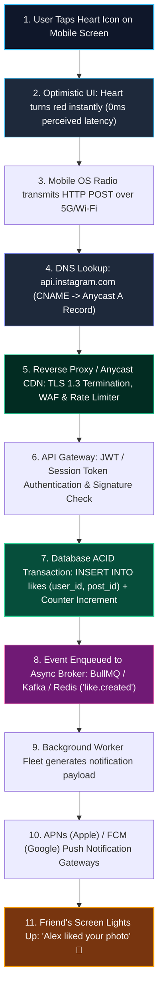
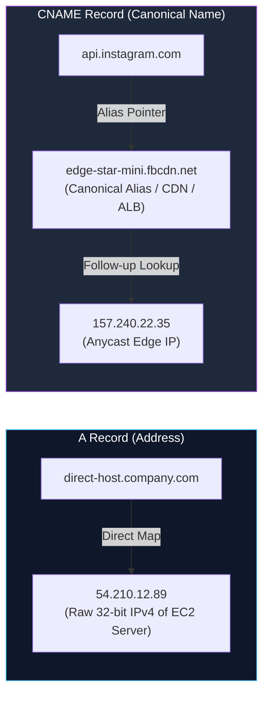
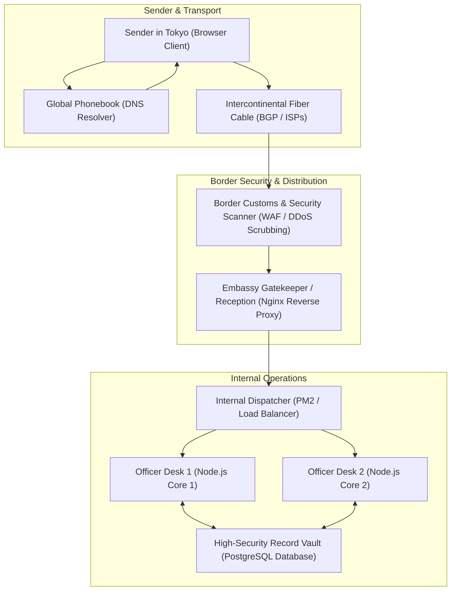
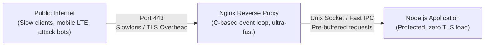
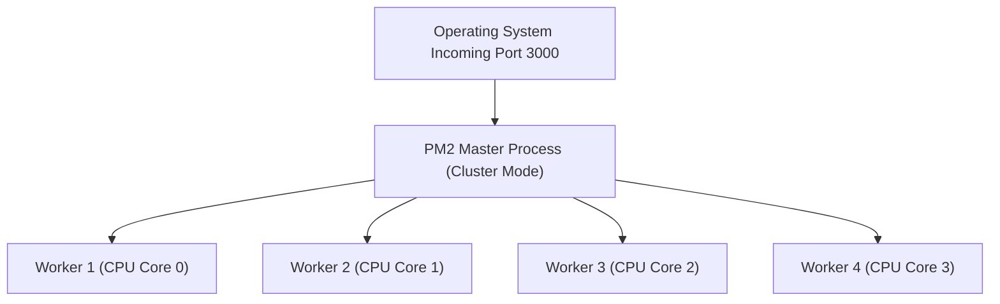
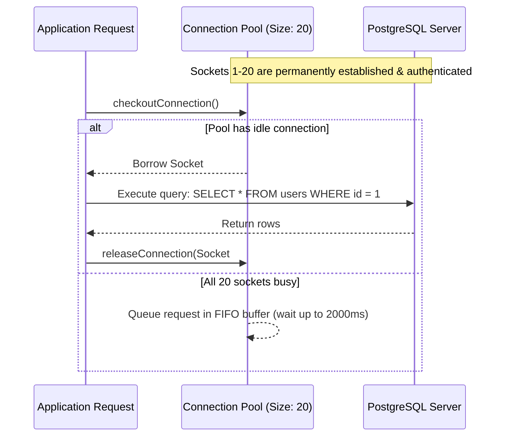

import { Callout } from 'fumadocs-ui/components/callout';
import { Tabs, Tab } from 'fumadocs-ui/components/tabs';
import { Steps, Step } from 'fumadocs-ui/components/steps';
import { Cards, Card } from 'fumadocs-ui/components/card';

When a software developer enters a URL or taps a button on their phone, it is easy to view an HTTP request as an abstract JavaScript function call (`fetch('/api/likes')`). But in the physical universe, a request is a train of electromagnetic pulses propagating through fiber-optic cables under oceans, traversing silicon switches, negotiating firewalls, and queuing in kernel buffers before triggering a transistor in an NVMe storage controller.

Understanding this physical infrastructure distinguishes junior developers who write code that only works on `localhost` from senior engineers who build fault-tolerant distributed systems that survive hardware failures, traffic spikes, and network partitions.

---

## 1. The Core Mental Model: Arpit's Instagram Like Button Walkthrough

To understand why backends exist and how physical infrastructure operates, consider what happens when you tap the **heart icon** on a friend's Instagram photo:



### The Step-by-Step Mechanical Journey

1. **Tap on Glass (The Optical UI)**: The user's finger touches the capacitive touchscreen. The mobile app immediately turns the heart red and increments the on-screen counter by 1. This is **Optimistic UI**—providing zero-latency tactile feedback before the network packet even leaves the antenna.
2. **Radio Transmission**: The mobile operating system wraps the action into an HTTP payload:
   ```http
   POST /v1/posts/post_9921/likes HTTP/1.1
   Host: api.instagram.com
   Authorization: Bearer eyJhbGciOi...
   ```
   The phone's cellular baseband modem converts this into radio frequency (RF) electromagnetic waves directed at the nearest 5G cellular tower or Wi-Fi router.
3. **DNS Resolution (A Records vs CNAME Records)**: The phone must resolve `api.instagram.com` to an actual IP address. (See deep dive below).
4. **Edge Ingress & Reverse Proxy (Nginx / Cloudflare)**: The packet arrives at an Anycast Edge data center. High-speed C-based reverse proxies terminate the TLS 1.3 encryption, absorb DDoS attacks, verify rate limits (e.g. max 50 likes/min per user), and forward the unencrypted request over a private high-speed backbone.
5. **Authentication Verification**: An API gateway decodes the cryptographic signature on the JWT Bearer token, verifying that the user ID in the token actually matches the user attempting the like.
6. **Database Concurrency & ACID Mutation**: The backend opens a transaction in the database:
   ```sql
   BEGIN;
   -- Unique composite constraint guarantees a user cannot like a post twice
   INSERT INTO post_likes (post_id, user_id, created_at)
   VALUES ('post_9921', 'usr_441', NOW());

   -- Atomic counter increment avoids race conditions
   UPDATE posts SET likes_count = likes_count + 1 WHERE id = 'post_9921';
   COMMIT;
   ```
7. **Asynchronous Notification Job**: The backend **must not** attempt to send push notifications to the friend's phone synchronously inside the HTTP request. If the push notification service is slow, the user's mobile app will freeze. Instead, the backend enqueues a lightweight message into a durable message broker (Kafka, RabbitMQ, or Redis/BullMQ):
   ```json
   {
     "event": "post.liked",
     "actorId": "usr_441",
     "targetPostId": "post_9921",
     "authorId": "usr_882",
     "timestamp": "2026-10-05T14:30:00Z"
   }
   ```
8. **Background Worker Processing & Fanout**: An independent fleet of worker servers consumes the message from the queue, checks the recipient's notification preferences, and opens persistent HTTP/2 connections to Apple APNs (for iOS) or Google FCM (for Android).
9. **Delivery to Friend's Screen**: Apple's APNs servers push a cryptographically signed packet down an active background TCP socket maintained by the friend's iPhone. The screen illuminates: *"Alex liked your photo"*.

---

### Why This Walkthrough Proves Backends Exist

The simple act of tapping a like button proves the three non-negotiable reasons why centralized backends must exist:

1. **The Security Boundary (The Client is Compromised Territory)**:
   If there were no backend, client phones would have to update database records directly. A malicious user could edit local memory or run a script to award themselves 10,000,000 likes or like posts on behalf of other celebrities. The backend is the **sovereign security perimeter** verifying identity and enforcing business rules.
2. **Database Synchronization & Concurrency**:
   If 50,000 people tap the like button simultaneously during a live stream, untrusted client phones cannot coordinate row locks. Without a centralized database transaction, simultaneous writes will overwrite each other, causing the counter to drift and corrupt data.
3. **Asymmetric Hardware Compute & Fanout**:
   When a profile with 80 million followers publishes a post, notifying followers and updating timelines requires gigawatts of compute, distributed worker pools, and petabytes of RAM. A mobile phone running on a battery cannot fan out millions of messages or coordinate global distribution.

---

## 2. DNS Mechanics: A Records vs CNAME Records

Before any TCP connection or HTTP request can occur, the client must translate the human-readable domain name (`api.instagram.com`) into a machine-routable IP address:



### Architectural Comparison: A Record vs CNAME Record

| Dimension | A Record (Address Record) | CNAME Record (Canonical Name) |
| :--- | :--- | :--- |
| **Target Destination** | Points directly to a **raw IPv4 address** (e.g. `198.51.100.42`). | Points to **another domain name alias** (e.g. `app.aws-elb.com`). |
| **Lookup Hops** | **1 Hop**: The DNS resolver immediately receives the IP address. | **2+ Hops**: The resolver receives another hostname and must perform a secondary DNS lookup to resolve the final IP. |
| **Zone Apex (Root Domain)** | Permitted on root domains (e.g. `@` / `example.com`). | **Forbidden on zone apex by RFC 1034** (must use ALIAS/ANAME record flattening). |
| **Infrastructure Coupling**| Tightly coupled: If your server IP changes, you must update DNS records globally. | Decoupled: Cloud load balancers (AWS ALB, Cloudflare) can rotate backend IPs transparently. |
| **Typical Production Use** | Direct cloud VM (EC2) instances, bare-metal servers, legacy hosts. | CDNs (Cloudflare, Fastly), cloud load balancers, multi-region routing. |

<Callout type="info" title="The CNAME Apex Restriction">
RFC 1034 dictates that if a CNAME record exists for a node, no other data records (such as `MX` for email or `NS` for nameservers) can exist for that name. Because root domains (`example.com`) require `NS` and `SOA` records, you cannot put a standard CNAME on a root domain. Modern DNS providers (Route53, Cloudflare) solve this with **ALIAS or CNAME Flattening**, which resolves the canonical name internally and returns a synthetic A record to the client.
</Callout>

---

## 3. The Real-World Analogy: The International Diplomatic Courier

To visualize how the physical layers work together, imagine sending an urgent diplomatic dispatch from Tokyo to an embassy office in Washington, D.C.:



- **The Directory (DNS):** You don't know the exact GPS coordinates of the embassy desk; you look up the name in an international registry (A/CNAME records).
- **Customs & Security (WAF / Edge CDN):** Before the letter enters the building, high-speed scanners inspect it for weapons, explosives, or poison (DDoS scrubbing, SQL injection patterns, geo-blocking).
- **The Embassy Gatekeeper (Nginx):** Checks credentials, handles visitor parking, verifies diplomatic seals (TLS termination), and routes visitors to the correct department.
- **The Internal Desks (PM2 Cluster Workers):** Single officers reading requests. If one officer is busy, the dispatcher assigns the letter to the next available desk.
- **The Record Vault (Database Connection Pool):** Officers don't build a new vault door every time they need a file; they check out a pre-authorized security badge from a limited pool of 20 keys, fetch the document, and return the key.

---

## 4. The Complete Physical Request Journey

Here is the exact journey from keyboard stroke to silicon persistence:

```
+-------------------------------------------------------------------------------------------------------+
|                                    THE PHYSICAL PACKET JOURNEY                                        |
+-------------------------------------------------------------------------------------------------------+
| [1. USER BROWSER / MOBILE PHONE]                                                                      |
|   | Enter: https://api.production.io/v1/checkout                                                      |
|   | OS Cache -> Recursive DNS (1.1.1.1) -> Root (.) -> TLD (.io) -> Authoritative Nameserver         |
|   v Yields Anycast IP: 104.18.22.41 via CNAME -> A Record flattening                                   |
| [2. BGP ROUTING & PHYSICAL BACKBONE]                                                                  |
|   | Packets traverse Autonomous Systems (AS) via Border Gateway Protocol (BGP)                        |
|   | Undersea optical fiber -> Regional Internet Exchange Point (IXP)                                  |
|   v Arrives at nearest Cloudflare Edge Point of Presence (PoP)                                        |
| [3. ANYCAST EDGE / CLOUDFLARE CDN]                                                                    |
|   | DDoS Mitigation (SYN Flood absorption, Anycast IP distribution)                                   |
|   | Web Application Firewall (WAF) inspects payload for OWASP signatures                              |
|   | TLS 1.3 Handshake completed at Edge (Client <-> Edge TLS termination)                             |
|   v Re-encrypted upstream proxy connection over dedicated private backbone                           |
| [4. HOST GATEWAY & HARDWARE FIREWALL]                                                                 |
|   | AWS VPC Internet Gateway / Cloud Security Group                                                   |
|   | Linux iptables / nftables drops non-whitelisted ports (only 80, 443 open)                         |
|   v Packets delivered to Host Network Interface Card (NIC)                                            |
| [5. NGINX REVERSE PROXY] (Port 443)                                                                  |
|   | Decrypts TLS (Offloads CPU load from Node.js)                                                     |
|   | Evaluates Rate Limiting (leaky-bucket / token-bucket: max 100 req/sec per IP)                      |
|   | Serves static assets directly from disk cache via sendfile() syscall                              |
|   v Upstream proxy pass: Forward via Unix Domain Socket (/run/app.sock) or Loopback (127.0.0.1:3000)  |
| [6. OPERATING SYSTEM KERNEL]                                                                          |
|   | Socket buffer (SO_RCVBUF) queues packet                                                           |
|   | Kernel epoll/kqueue notifies userland process event loop                                          |
|   v Context switch from kernel mode to userland                                                       |
| [7. APPLICATION RUNTIME & PROCESS MANAGER] (Node.js under PM2 Cluster)                                |
|   | PM2 runs N worker processes matching CPU core count (e.g., 8 vCPUs = 8 Node processes)            |
|   | OS round-robin distributes connections across worker file descriptors                             |
|   | Worker decodes HTTP byte stream into Request Object                                               |
|   v Controller calls Database Repository                                                              |
| [8. DATABASE CONNECTION POOL] (pg-pool / HikariCP)                                                    |
|   | Checks out pre-warmed, authenticated TCP socket from pool of 20 connections                        |
|   | Emits binary wire query: SELECT * FROM inventory WHERE item_id = $1 FOR UPDATE;                   |
|   v Database acquires row-level exclusive lock                                                        |
| [9. PHYSICAL DISK STORAGE (NVMe SSD)]                                                                 |
|   | PostgreSQL engine writes transaction to Write-Ahead Log (WAL)                                     |
|   | Disk controller flushes cache via fsync() syscall to persistent NAND flash                        |
|   v Returns row tuple -> App writes HTTP 200 response -> Transmitted back down wire                   |
+-------------------------------------------------------------------------------------------------------+
```

---

## 5. Deep Dive into Infrastructure Components

### A. The Reverse Proxy (Nginx)

Why shouldn't you expose your Node.js, Go, or Python application directly to the internet on port 80/443?



1. **Slowloris Attack Prevention:** In Node.js, an attacker can open 10,000 connections and send 1 byte every 10 seconds. Node's memory would saturate rapidly. Nginx buffers the entire incoming request in fast C buffers and only passes it to Node once the complete request has arrived.
2. **TLS / SSL Termination:** Encrypting and decrypting TLS 1.3 handshakes requires cryptographic computation. Offloading this to Nginx frees your Node.js single-threaded event loop to focus entirely on application logic.
3. **Static File Offloading:** When serving images, CSS, or PDFs, Node.js reads files from disk into V8 heap memory and copies them to the socket. Nginx uses the Linux kernel `sendfile()` system call, which transfers bytes directly from disk cache to the network card via Direct Memory Access (DMA)—bypassing userland memory entirely.

### B. Process Managers & Multi-Core Scaling (PM2)

Node.js runs on a single thread. If your cloud server has 16 CPU cores and you run `node server.js`, **15 cores sit completely idle (0% utilization)** while core 0 runs at 100%.



Process managers like **PM2** or **Docker with Kubernetes** solve this:
- **Clustering:** Forks an instance per CPU core using Node's `child_process.fork()` and shares the server port via OS socket handle passing.
- **Zero-Downtime Reloads:** Updates code by reloading workers sequentially (`pm2 reload all`). Worker 1 restarts while Workers 2, 3, and 4 continue handling traffic.
- **Watchdog Restarts:** If an unhandled exception causes a worker to crash, PM2 immediately spawns a replacement in milliseconds.

### C. The Database Connection Pool

One of the most common causes of backend outages is **connection starvation**.

<Callout type="error" title="Why Opening a DB Connection Per Request Kills Databases">
In PostgreSQL, each incoming connection is **not** a lightweight thread; it is a full operating system process forked by the Postgres master. 
- A single connection consumes **~10MB of RAM** on the database server.
- Establishing a connection requires a **TCP 3-way handshake + SSL handshake + Authentication + Postgres Backend Process Fork**, taking **50ms–150ms** before a single query can run!
- If 1,000 concurrent requests arrive, your database attempts to spawn 1,000 processes, consuming 10GB of RAM, exhausting CPU memory limits, and crashing with `FATAL: remaining connection slots are reserved`.
</Callout>

A **Connection Pool** maintains a warm set of persistent connections (e.g., 20 sockets). Requests check out a socket, execute their query in 2ms, and immediately release it back to the pool:



---

## 6. Simulation of Working: Tracing the Packet Hops

<Tabs items={['Hop 1: DNS & Anycast Edge', 'Hop 2: Nginx Reverse Proxy', 'Hop 3: Node Process & Socket Queue', 'Hop 4: DB Connection Pool Checkout']}>
  <Tab value="Hop 1: DNS & Anycast Edge">
    ### 1. Browser Resolution to Anycast PoP
    
    1. Browser checks internal DNS cache: `chrome://net-internals/#dns` (Cache miss).
    2. OS queries local recursive DNS resolver via UDP port 53.
    3. Resolver traverses Root nameserver (`.`), TLD nameserver (`.io`), and Authoritative NS (`ns1.cloudflare.com`).
    4. DNS returns an **Anycast BGP IP Address**. Anycast allows hundreds of data centers worldwide to advertise the exact same IP address. Routers automatically deliver the packet to the geographically closest data center.
    5. TLS 1.3 handshake is established in **1 Round Trip Time (1-RTT)** using Elliptic Curve Diffie-Hellman (ECDHE).
  </Tab>

  <Tab value="Hop 2: Nginx Reverse Proxy">
    ### 2. Edge Ingress and Forwarding
    
    The packet reaches the cloud VM network interface (eth0). Nginx receives the packet:

    ```nginx
    # Nginx matches server block and applies rate limit
    limit_req zone=api_limit burst=20 nodelay;
    
    # Decrypts TLS certs: ssl_certificate /etc/letsencrypt/fullchain.pem
    # Sanitizes headers:
    proxy_set_header X-Real-IP $remote_addr;
    proxy_set_header X-Forwarded-For $proxy_add_x_forwarded_for;
    proxy_set_header X-Forwarded-Proto $scheme;
    
    # Forwards via loopback TCP socket to Node:
    proxy_pass http://127.0.0.1:3000;
    ```
  </Tab>

  <Tab value="Hop 3: Node Process & Socket Queue">
    ### 3. Userland Wakeup via Epoll
    
    1. Linux kernel accepts TCP segment on port 3000.
    2. Kernel places bytes into Node's socket receive buffer.
    3. `epoll_wait()` informs the Libuv event loop that file descriptor `FD #14` is readable.
    4. Node.js executes the `data` callback on the main event loop thread:
       ```typescript
       // Native Node.js HTTP stream
       req.on('data', (chunk: Buffer) => {
         bodyBuffer.push(chunk);
       });
       ```
    5. The routing engine matches `/v1/checkout` and invokes the controller.
  </Tab>

  <Tab value="Hop 4: DB Connection Pool Checkout">
    ### 4. Zero-Handshake Database Query
    
    The controller needs to debit user balance:

    ```typescript
    // Checks out a warm socket from the pool (0ms connection overhead)
    const client = await pool.connect();
    try {
      await client.query('BEGIN');
      const res = await client.query('UPDATE accounts SET balance = balance - 50 WHERE id = $1', [userId]);
      await client.query('COMMIT');
    } finally {
      client.release(); // Returns socket back to pool for next request
    }
    ```
    
    The database controller flushes the transaction to disk via `fsync()`, guaranteeing ACID durability even if power cuts immediately after.
  </Tab>
</Tabs>

---

## 7. Production Code Implementation

Here is a production-grade infrastructure setup demonstrating:
1. An optimal **Nginx Reverse Proxy Configuration**.
2. A resilient **Node.js Server with Connection Pooling and Cluster Mode**.

### Part 1: Production Nginx Configuration

```nginx title="/etc/nginx/sites-available/api.conf"
# Rate limiting zone: 10MB memory can track ~160,000 IP addresses
limit_req_zone $binary_remote_addr zone=api_limit:10m rate=50r/s;

# Upstream cluster pointing to our Node application processes
upstream backend_nodes {
    least_conn; # Route to worker with fewest active connections
    server 127.0.0.1:3001 max_fails=3 fail_timeout=10s;
    server 127.0.0.1:3002 max_fails=3 fail_timeout=10s;
    keepalive 32; # Keep warm TCP connections open to Node
}

server {
    listen 80;
    server_name api.production.io;
    return 301 https://$host$request_uri; # Force HTTPS
}

server {
    listen 443 ssl http2;
    server_name api.production.io;

    # High-performance SSL parameters
    ssl_certificate /etc/letsencrypt/live/api.production.io/fullchain.pem;
    ssl_certificate_key /etc/letsencrypt/live/api.production.io/privkey.pem;
    ssl_protocols TLSv1.2 TLSv1.3;
    ssl_ciphers HIGH:!aNULL:!MD5;
    ssl_session_cache shared:SSL:10m;
    ssl_session_timeout 1d;

    # Gzip compression for text payloads
    gzip on;
    gzip_types application/json text/plain text/css application/javascript;
    gzip_min_length 1024;

    # Fast static asset serving directly from disk
    location /static/ {
        alias /var/www/static/;
        expires 30d;
        add_header Cache-Control "public, no-transform";
        sendfile on;
        tcp_nopush on;
    }

    # API Proxy location
    location / {
        limit_req zone=api_limit burst=20 nodelay;

        proxy_pass http://backend_nodes;
        proxy_http_version 1.1;
        proxy_set_header Connection "";
        
        # Preserve original client IP & proto
        proxy_set_header Host $host;
        proxy_set_header X-Real-IP $remote_addr;
        proxy_set_header X-Forwarded-For $proxy_add_x_forwarded_for;
        proxy_set_header X-Forwarded-Proto $scheme;

        # Timeouts preventing hung backend connections
        proxy_connect_timeout 5s;
        proxy_send_timeout 15s;
        proxy_read_timeout 15s;
    }
}
```

### Part 2: Node.js Clustered Server with PostgreSQL Connection Pooling

```typescript title="server-cluster.ts"
import cluster from 'node:cluster';
import http from 'node:http';
import os from 'node:os';
import { Pool } from 'pg';

const dbPool = new Pool({
  host: process.env.DB_HOST || 'localhost',
  port: 5432,
  user: process.env.DB_USER || 'postgres',
  password: process.env.DB_PASSWORD || 'secret',
  database: 'production_db',
  max: 20,                   // Maximum 20 simultaneous connections
  min: 4,                    // Keep 4 warm connections always idle
  idleTimeoutMillis: 30000,  // Close connections idle for >30s
  connectionTimeoutMillis: 2000, // Fail fast if pool cannot acquire in 2s
});

if (cluster.isPrimary) {
  const numCPUs = os.cpus().length;
  console.log(`[Master ${process.pid}] Spawning ${numCPUs} worker processes...`);

  for (let i = 0; i < numCPUs; i++) {
    cluster.fork();
  }

  cluster.on('exit', (worker, code, signal) => {
    console.warn(`[Master] Worker ${worker.process.pid} died (${signal || code}). Spawning replacement...`);
    cluster.fork();
  });
} else {
  const server = http.createServer(async (req, res) => {
    if (req.url === '/health') {
      res.writeHead(200, { 'Content-Type': 'application/json' });
      res.end(JSON.stringify({ status: 'ok', workerPid: process.pid }));
      return;
    }

    if (req.url === '/users' && req.method === 'GET') {
      try {
        const client = await dbPool.connect();
        try {
          const result = await client.query('SELECT id, name, email FROM users LIMIT 10;');
          res.writeHead(200, { 'Content-Type': 'application/json' });
          res.end(JSON.stringify({ data: result.rows }));
        } finally {
          client.release();
        }
      } catch (err: unknown) {
        const error = err as Error;
        res.writeHead(500, { 'Content-Type': 'application/json' });
        res.end(JSON.stringify({ error: 'DatabaseError', message: error.message }));
      }
      return;
    }

    res.writeHead(404, { 'Content-Type': 'application/json' });
    res.end(JSON.stringify({ error: 'NotFound' }));
  });

  const PORT = 3000;
  server.listen(PORT, '127.0.0.1', () => {
    console.log(`[Worker ${process.pid}] Listening on http://127.0.0.1:${PORT}`);
  });
}
```

---

## 8. Architecture Review & Key Takeaways

<Cards>
  <Card
    title="Instagram Like Mental Model"
    description="Trace the request: UI -> 5G RF -> DNS -> Reverse Proxy -> Gateway -> DB Transaction -> Async Queue -> Push Notification -> Screen."
  />
  <Card
    title="DNS A vs CNAME Records"
    description="A records point directly to raw IPv4 addresses; CNAME records point to domain aliases, enabling CDN failover and cloud load balancing."
  />
  <Card
    title="Why Backends Must Exist"
    description="Backends provide the untampered security boundary, serialize concurrent database transactions, and execute heavy asymmetric background compute."
  />
  <Card
    title="Connection Pools are Invariant"
    description="Never open fresh database connections inside HTTP handlers. Reuse pre-warmed sockets to avoid 100ms handshakes and database RAM crashes."
  />
</Cards>
