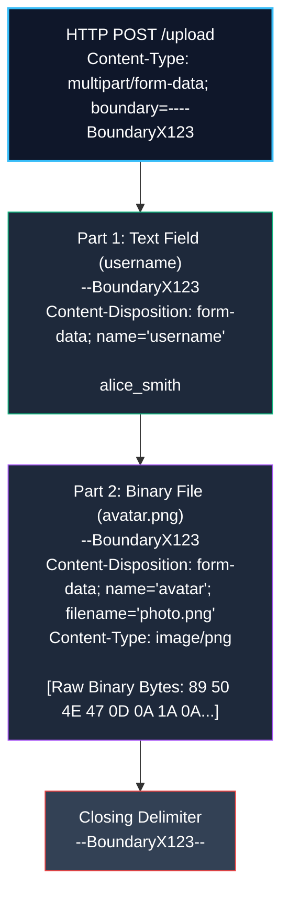
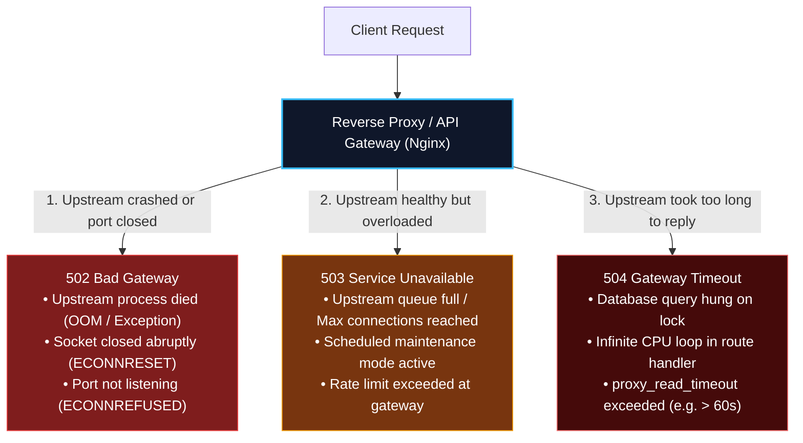

import { Callout } from 'fumadocs-ui/components/callout';
import { Tabs, Tab } from 'fumadocs-ui/components/tabs';
import { Steps, Step } from 'fumadocs-ui/components/steps';
import { Cards, Card } from 'fumadocs-ui/components/card';

The Hypertext Transfer Protocol (HTTP) is the nervous system of modern computing. Every web page, REST API, GraphQL query, webhook, and microservice RPC call relies upon it.

Yet many engineers treat HTTP as a black box that magically maps URLs to JSON. When subtle bugs arise—such as inexplicable CORS preflight delays, Head-of-Line blocking latency, cache poisoning, multipart boundary corruption, or 502/504 gateway disconnects—developers without low-level protocol knowledge are left guessing.

In this deep dive, we break down HTTP from transport datagrams and binary frames to wire encoding, content negotiation, and gateway infrastructure.

---

## 1. Real-World Analogy: From Messengers to Pneumatic Tubes

To understand the evolution of web protocols, picture a hospital logistics system moving blood samples and medical charts:


---

## 2. The Transport Foundation: TCP vs UDP

HTTP is an **Application Layer (Layer 7)** protocol that relies on an underlying **Transport Layer (Layer 4)** protocol:

```
+-------------------------------------------------------------------------+
|                  OSI / INTERNET PROTOCOL SUITE STACK                     |
+-------------------------------------------------------------------------+
| Layer 7: Application  | HTTP/1.1, HTTP/2 (over TCP) | HTTP/3 (over UDP) |
| Layer 6: Presentation | TLS 1.2 / TLS 1.3 Encryption                     |
| Layer 4: Transport    | Transmission Control Protocol (TCP) | UDP (QUIC)|
| Layer 3: Network      | Internet Protocol (IPv4 / IPv6)                 |
| Layer 2: Data Link    | Ethernet / Wi-Fi (Frames & MAC Addresses)       |
| Layer 1: Physical     | Copper wire, Fiber-optic light, Radio RF        |
+-------------------------------------------------------------------------+
```

### TCP (Transmission Control Protocol)
TCP is **connection-oriented, ordered, and reliable**:
1. **Three-Way Handshake:** Every connection requires `SYN` $\rightarrow$ `SYN-ACK` $\rightarrow$ `ACK` before transmitting any application data (1 RTT overhead).
2. **Guaranteed Delivery:** Every byte is acknowledged (`ACK`). If a packet drops on a noisy cellular tower, the sender retransmits it.
3. **Strict In-Order Reassembly:** If packet #3 drops, packets #4 and #5 must sit in kernel memory waiting until #3 arrives and is retransmitted. This is called **Transport-Layer Head-of-Line (HoL) Blocking**.

### UDP (User Datagram Protocol)
UDP is **connectionless, lightweight, and unordered**:
- No handshake, no state, no packet ordering, and no retransmission.
- Packets ("datagrams") are fired into the network. If one drops, the receiver does not wait.
- Traditionally used for real-time multiplayer gaming, VoIP, and DNS queries where low latency matters more than 100% reliability.

<Callout type="info" title="The Genius of HTTP/3 (QUIC)">
Why did HTTP/3 abandon TCP in favor of UDP? Because TCP's in-order guarantee is hardcoded into operating system kernels. If a packet drops in HTTP/2, all multiplexed streams stall. HTTP/3 implements **QUIC**, which rebuilds encryption and per-stream reliability **on top of UDP in userland**. If stream 4 loses a packet, stream 5 and stream 6 continue rendering without a millisecond of delay!
</Callout>

---

## 3. Protocol Evolution: HTTP/1.1 vs HTTP/2 vs HTTP/3

| Feature | HTTP/1.1 (1997) | HTTP/2 (2015) | HTTP/3 / QUIC (2022) |
| :--- | :--- | :--- | :--- |
| **Transport Layer** | TCP | TCP | **UDP (via QUIC)** |
| **Format** | Plaintext ASCII | Binary Frames | Binary Frames |
| **Connection Model** | 1 request per TCP socket at a time (Keep-Alive) | Multiplexed streams over 1 TCP socket | Multiplexed independent streams over UDP |
| **Head-of-Line Blocking** | Application level (HTTP HoL) | Transport level (TCP HoL) | **Completely Eliminated** |
| **Header Compression** | None (repetitive cookies sent raw) | HPACK (Indexed table) | QPACK (Out-of-order dynamic table) |
| **Handshake Latency** | 2-3 RTT (TCP + TLS) | 2-3 RTT (TCP + TLS) | **0-1 RTT (Combined Crypto + Transport)** |
| **Connection Migration** | Breaks on IP change (Wi-Fi $\rightarrow$ LTE) | Breaks on IP change | **Preserved via 64-bit Connection ID** |

---

## 4. Multipart/form-data Wire Mechanics

When uploading files (images, videos, PDFs) alongside standard form fields, APIs cannot use standard `application/json`. JSON has no native representation for raw binary bytes; encoding binary files as Base64 strings expands the payload size by **~33%** due to the $4/3$ ASCII inflation ratio.

To transmit raw binary streams efficiently, HTTP utilizes **`multipart/form-data`** (RFC 7578):



### The Anatomy of the Wire Stream

Here is the exact ASCII and byte layout sent over the socket:

```http
POST /api/v1/profiles/avatar HTTP/1.1
Host: api.cloudstore.io
Content-Type: multipart/form-data; boundary=----WebKitFormBoundary7MA4YWxkTrZu0gW
Content-Length: 34821

------WebKitFormBoundary7MA4YWxkTrZu0gW
Content-Disposition: form-data; name="userId"

usr_99812
------WebKitFormBoundary7MA4YWxkTrZu0gW
Content-Disposition: form-data; name="avatar"; filename="profile.png"
Content-Type: image/png

PNG

... [Raw Uncompressed Binary Bytes Streamed Directly] ...
------WebKitFormBoundary7MA4YWxkTrZu0gW--
```

### The 3 Rules of Multipart Delimiters
1. **The Header Boundary**: Declared in the HTTP `Content-Type` header: `boundary=XYZ`.
2. **The Part Boundary**: Preceded by two hyphens (`--XYZ`) on its own line before each part.
3. **The Closing Boundary**: Appended with two trailing hyphens (`--XYZ--`) indicating the end of the entire request stream.

---

## 5. Content Negotiation & Compression Benchmarks

Content negotiation allows the client and server to agree on representation formats, media types, and compression algorithms.

### `Accept` vs `Content-Type`
- **`Accept` (Client Request)**: Declares what representation the client is able and willing to parse (e.g. `Accept: application/json, text/csv;q=0.5`).
- **`Content-Type` (Request or Response)**: Declares the actual format of the payload body being transmitted (e.g. `Content-Type: application/json; charset=utf-8`).

### Compression Mechanics: `Accept-Encoding` vs `Content-Encoding`
Modern backends compress text responses before writing them to the network socket:

```http
# Client Request
GET /api/v1/products HTTP/1.1
Accept-Encoding: gzip, deflate, br, zstd

# Server Response
HTTP/1.1 200 OK
Content-Encoding: br
Content-Type: application/json
```

### Compression Algorithm Comparison & Benchmarks

| Compression Algorithm | Header Token | Typical JSON Compression Ratio | Compression Speed (CPU Load) | Decompression Speed | Best Used For |
| :--- | :--- | :--- | :--- | :--- | :--- |
| **Brotli** | `br` | **78% - 85% reduction** (Highest) | Slower at level 11; Fast at level 4 | Very Fast | High-traffic static assets & JSON payloads |
| **Gzip (Deflate)** | `gzip` | **70% - 75% reduction** | Moderate | Fast | Universal compatibility fallback |
| **Zstandard (Meta)** | `zstd` | **76% - 82% reduction** | **Ultra-Fast** | **Extreme Speed** | Internal microservice RPC & real-time streaming |

<Callout type="tip" title="Brotli Dynamic vs Static Recommendation">
When serving pre-built static assets (CSS, JS bundles), compress them using Brotli level 11 ahead of time. For dynamic REST API JSON responses, compress using **Brotli level 4** or Gzip level 6 to achieve 80% compression with near-zero CPU latency overhead.
</Callout>

---

## 6. The Strict 3 Triggers for CORS Preflight

<Callout type="error" title="CORS is a Browser Sandbox Security Mechanism, NOT a Backend Firewall!">
CORS exists solely to protect **the user's browser** from malicious third-party websites reading data from your API using the user's ambient authentication cookies. Direct calls via `curl`, Postman, or server-to-server HTTP clients do not enforce CORS.
</Callout>

A browser classifies an outbound cross-origin HTTP request as either **Simple** (dispatched immediately) or **Preflighted** (requiring an initial `OPTIONS` handshake).

A Preflight check is triggered if **ANY ONE** of the following three conditions is met:

```mermaid
flowchart TD
    Req["Outbound Cross-Origin Fetch"] --> C1{"1. Method Check<br/>Is it PUT, PATCH, DELETE?"}
    C1 -->|Yes| Preflight["DISPATCH CORS PREFLIGHT<br/>(HTTP OPTIONS Handshake)"]
    C1 -->|No (GET/HEAD/POST)| C2{"2. Header Check<br/>Any non-safelisted headers?<br/>(Authorization, X-Custom-*)"}
    C2 -->|Yes| Preflight
    C2 -->|No| C3{"3. Content-Type Check<br/>Is it application/json?"}
    C3 -->|Yes| Preflight
    C3 -->|No (Simple type)| Simple["Execute Direct Request<br/>(No Preflight!)"]

    style Req fill:#0f172a,stroke:#38bdf8,stroke-width:2px,color:#ffffff
    style Preflight fill:#7f1d1d,stroke:#f87171,stroke-width:2px,color:#ffffff
    style Simple fill:#064e3b,stroke:#34d399,stroke-width:2px,color:#ffffff
```

### The Strict 3 Triggers:

1. **Trigger 1: Non-Simple HTTP Methods**:
   The request uses any HTTP verb other than `GET`, `HEAD`, or `POST`.
   $\rightarrow$ Using **`PUT`**, **`PATCH`**, or **`DELETE`** automatically triggers a preflight check!
2. **Trigger 2: Non-Simple Request Headers**:
   The request includes any header other than the narrow CORS-safelisted set (`Accept`, `Accept-Language`, `Content-Language`, `Range`).
   $\rightarrow$ Adding **`Authorization: Bearer ...`**, **`X-Api-Key`**, or **`Idempotency-Key`** automatically triggers a preflight check!
3. **Trigger 3: Non-Simple `Content-Type`**:
   The `Content-Type` header is anything other than:
   - `application/x-www-form-urlencoded`
   - `multipart/form-data`
   - `text/plain`
   $\rightarrow$ **`application/json` is NOT a simple content type!** Because 99% of modern REST APIs communicate via JSON bodies, virtually every state-modifying mutation triggers a CORS preflight handshake!

---

## 7. Gateway Error Nuances: 502 vs 503 vs 504

When an edge reverse proxy (Nginx, AWS ALB, Cloudflare) communicates with upstream application processes (Node.js, Go, Python), errors in the 5xx family pinpoint the exact failure boundary:



### Deep Diagnostic Breakdown

| Status Code | Exact Technical Cause | How to Diagnose & Fix |
| :--- | :--- | :--- |
| **`502 Bad Gateway`** | The gateway opened a socket to the application, but the application **refused connection (`ECONNREFUSED`) or terminated the socket abruptly (`ECONNRESET`)**. | Check process manager (PM2 / Kubernetes pods): Did the process crash due to an unhandled exception or Out-of-Memory (OOM) kill? |
| **`503 Service Unavailable`** | The upstream system or gateway is **temporarily out of capacity or in maintenance**. The application server is reachable but refusing new requests. | Scale up replica pods, inspect connection pool capacity, or verify if a deployment maintenance mode was triggered. |
| **`504 Gateway Timeout`** | The gateway successfully forwarded the request, but the upstream application **did not finish sending a response before the timeout budget expired**. | Inspect database slow queries (table locks), third-party HTTP client timeouts, or increase Nginx `proxy_read_timeout`. |

---

## 8. Conditional Caching & ETags: 304 Not Modified

Sending 500KB of unchanged data over a mobile network wastes bandwidth and slows page loads. HTTP solves this via **Conditional Caching**:

```
Client (First Request)   --> GET /api/v1/catalog
Server (200 OK)         <-- ETag: "w/hash-789a", Body: [500KB catalog]

Client (5 minutes later) --> GET /api/v1/catalog
                            If-None-Match: "w/hash-789a"

Server evaluates ETag:
- If catalog unchanged  <-- 304 Not Modified (0 bytes body transferred!)
- If catalog modified   <-- 200 OK + New ETag + New 500KB body
```

---

## 9. Production Code: Advanced HTTP Server in TypeScript

Here is a full-featured, zero-dependency Node.js HTTP server implementing **dynamic CORS, ETag computation, conditional 304 matching, and Brotli compression**:

```typescript title="advanced-http-server.ts"
import http, { IncomingMessage, ServerResponse } from 'node:http';
import crypto from 'node:crypto';
import zlib from 'node:zlib';

const ALLOWED_ORIGINS = new Set([
  'http://localhost:3000',
  'https://my-frontend-app.com',
]);

function applyCors(req: IncomingMessage, res: ServerResponse): boolean {
  const origin = req.headers.origin;

  if (origin && ALLOWED_ORIGINS.has(origin)) {
    res.setHeader('Access-Control-Allow-Origin', origin);
    res.setHeader('Access-Control-Allow-Credentials', 'true');
    res.setHeader('Access-Control-Allow-Methods', 'GET, POST, PUT, DELETE, OPTIONS');
    res.setHeader('Access-Control-Allow-Headers', 'Content-Type, Authorization, If-None-Match');
    res.setHeader('Access-Control-Max-Age', '86400'); // 24 hours preflight cache
  }

  // Handle CORS preflight OPTIONS request
  if (req.method === 'OPTIONS') {
    res.writeHead(204);
    res.end();
    return true;
  }

  return false;
}

function computeETag(body: string | Buffer): string {
  const hash = crypto.createHash('sha1').update(body).digest('hex').slice(0, 16);
  return `"${hash}"`;
}

const server = http.createServer((req, res) => {
  if (applyCors(req, res)) return;

  if (req.method === 'GET' && req.url === '/api/v1/products') {
    const products = [
      { id: 'p_1', name: 'Mechanical Keyboard', price: 149.99, stock: 24 },
      { id: 'p_2', name: 'Ultra-Wide Monitor', price: 499.00, stock: 8 },
    ];

    const jsonString = JSON.stringify({ data: products });
    const etag = computeETag(jsonString);

    // Conditional Cache Validation (304 Not Modified)
    const clientETag = req.headers['if-none-match'];
    if (clientETag === etag) {
      res.writeHead(304, {
        'ETag': etag,
        'Cache-Control': 'public, max-age=60, stale-while-revalidate=30',
      });
      res.end();
      return;
    }

    // Content Negotiation & Compression (Brotli vs Gzip)
    const acceptEncoding = req.headers['accept-encoding'] || '';
    const bodyBuffer = Buffer.from(jsonString, 'utf-8');

    res.setHeader('Content-Type', 'application/json; charset=utf-8');
    res.setHeader('ETag', etag);
    res.setHeader('Cache-Control', 'public, max-age=60, stale-while-revalidate=30');

    if (acceptEncoding.includes('br')) {
      res.setHeader('Content-Encoding', 'br');
      res.writeHead(200);
      zlib.brotliCompress(bodyBuffer, (_, compressed) => {
        res.end(compressed);
      });
    } else if (acceptEncoding.includes('gzip')) {
      res.setHeader('Content-Encoding', 'gzip');
      res.writeHead(200);
      zlib.gzip(bodyBuffer, (_, compressed) => {
        res.end(compressed);
      });
    } else {
      res.writeHead(200);
      res.end(bodyBuffer);
    }
    return;
  }

  res.writeHead(404, { 'Content-Type': 'application/json' });
  res.end(JSON.stringify({ error: 'RouteNotFound' }));
});

const PORT = 4000;
server.listen(PORT, () => {
  console.log(`[HTTP Server] Listening on http://localhost:${PORT}`);
});
```

---

## 10. Summary Checklist for Senior Engineers

<Cards>
  <Card
    title="Multipart/form-data Wire Rules"
    description="Use boundary delimiters to stream raw binary files without the 33% Base64 JSON size inflation penalty."
  />
  <Card
    title="Strict CORS Preflight Triggers"
    description="Remember the 3 triggers: Non-simple methods (PUT/PATCH/DELETE), non-simple headers (Authorization), and non-simple Content-Type (application/json)."
  />
  <Card
    title="Gateway Error Distinction"
    description="502 means app crashed or closed socket; 503 means overloaded or maintenance; 504 means app or database timed out."
  />
  <Card
    title="Brotli Dynamic Compression"
    description="Leverage Brotli level 4 on dynamic JSON responses for ~80% size reduction with negligible CPU latency."
  />
</Cards>
