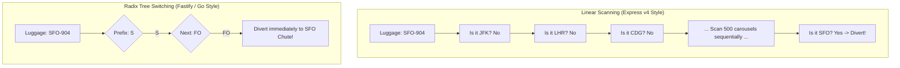
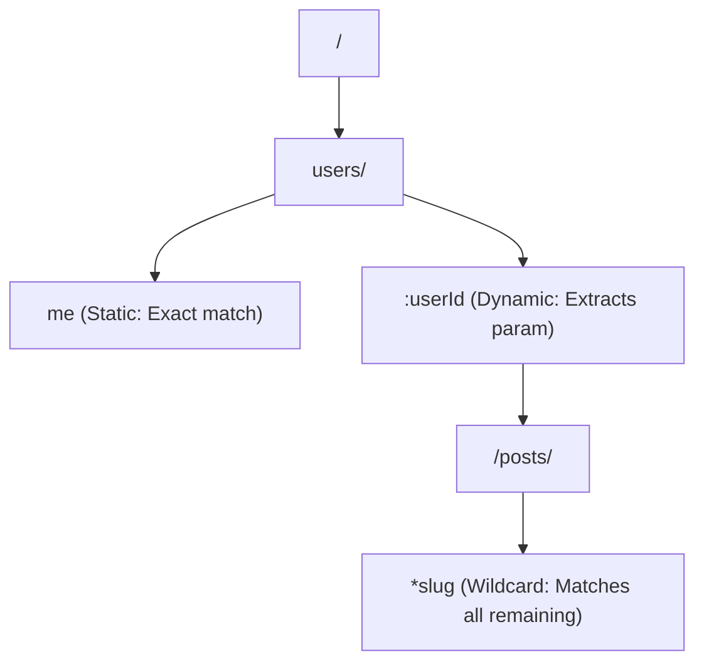
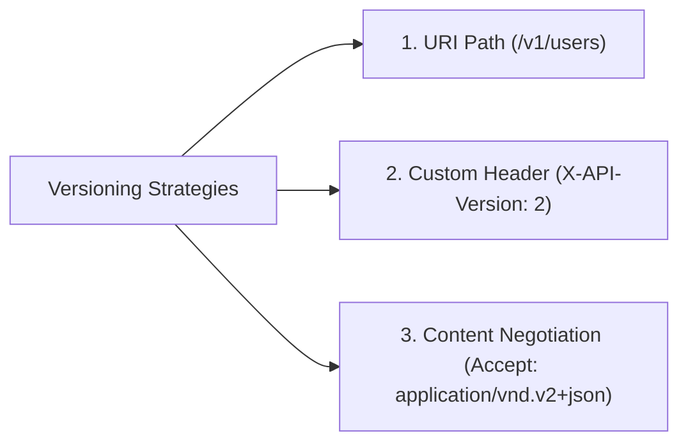

import { Callout } from 'fumadocs-ui/components/callout';
import { Tabs, Tab } from 'fumadocs-ui/components/tabs';
import { Steps, Step } from 'fumadocs-ui/components/steps';

When an HTTP request enters an application server, the runtime holds an incoming URL string (such as `"/v1/organizations/org_99/members/usr_42"`). The router is the core engine tasked with matching that string against hundreds of registered endpoints and invoking the correct handler in microseconds.

How does a router achieve this without melting the CPU when handling 50,000 requests per second? Why do frameworks like Fastify and Go Gin run 5x faster than legacy Express routers?

The secret lies in the underlying data structure: **The Radix Tree (Compressed Prefix Trie)**.

---

## 1. Real-World Analogy: Airport Baggage Sorting

Imagine an automated baggage handling facility at a major international hub:



- **Linear Array Matching ($O(N)$):** The conveyor belt walks suitcase by suitcase past all 500 conveyor gates. If your flight is the 500th gate on the list, the system evaluates 499 negative checks.
- **Radix Tree Routing ($O(K)$):** The conveyor reads the destination code prefix. It branches immediately by letter (`S`), then by terminal (`FO`). The lookup duration is governed solely by the length of the flight code, **completely independent of how many gates exist in the airport!**

---

## 2. Linear Regex vs Radix Tree Routing

### The Legacy Linear Array ($O(N)$)
Historically, frameworks like Express v3/v4 stored routes in an ordered array of regular expressions:

```typescript
// Express internal stack:
[
  { path: /^\/api\/v1\/health\/?$/i, handler: fn1 },
  { path: /^\/api\/v1\/auth\/login\/?$/i, handler: fn2 },
  // ... 250 routes later ...
  { path: /^\/api\/v1\/users\/([^/]+)\/?$/i, handler: fn252 },
]
```

When a request arrives for `GET /api/v1/users/42`, the engine executes a regular expression test against every single registered route from index 0 upward. If an application contains 300 routes, the 300th route pays a latency tax of 300 regex evaluations!

### The Radix Tree ($O(K)$)
Modern high-performance engines (Fastify, Elysia, Go `chi`, Go `gin`, Rust `axum`) organize routes into a **Compressed Prefix Tree (Radix Tree)**:

```
                  /api/v1/
                  ├── health     -> [Handler: Health]
                  ├── auth/
                  │   └── login  -> [Handler: AuthLogin]
                  └── users/
                      ├── me     -> [Handler: CurrentUser]
                      └── :id    -> [Handler: UserById]
                          └── /orders -> [Handler: UserOrders]
```

- $K$ is the number of path segments or characters in the incoming URL.
- $N$ is the total number of registered routes.
- **Time Complexity:** $O(K)$. Whether the router has 10 routes or 10,000 routes, matching `/api/v1/health` takes the exact same number of pointer hops!

---

## 3. Anatomy of a URL & Parameter Extraction

A web URL contains distinct semantic components, each handled by different subsystems:

```
  https://api.domain.com:443 /v1/teams/:teamId/projects ?status=active&limit=10 #section
  \________________________/ \________________________/ \____________________/ \______/
           Origin                   Path Name               Search / Query      Fragment
      (Handled by DNS/Host)     (Handled by Router)       (Handled by Parser)  (Browser only)
```

### Static vs Dynamic vs Wildcard Segments



1. **Static Segment (`/users/me`):** Requires an exact character match. Highest lookup priority.
2. **Dynamic Parameter (`/users/:userId`):** Matches any single segment up to the next slash (`/`). Binds value into `params.userId`.
3. **Wildcard / Catch-All (`/static/*filepath`):** Greedily consumes everything remaining in the URL path.
4. **Query Parameters (`?sort=desc&limit=20`):** Do **NOT** belong in the router tree! Query parameters are separated by the `?` character and parsed into an arbitrary key-value map by an independent parser.

<Callout type="warn" title="The Ambiguity & Precedence Trap">
Consider two routes:
- Route A: `GET /users/me`
- Route B: `GET /users/:id`

If a user visits `/users/me`, what should happen?
In a naive router, `:id` might capture `"me"` as the user ID! 
Production Radix Trees enforce strict **precedence rules**:
$$\text{Static Paths} > \text{Dynamic Param Paths} > \text{Wildcard Paths}$$
`GET /users/me` will always evaluate before the dynamic fallback `:id`.
</Callout>

---

## 4. Sub-Resource Hierarchies & REST Modeling

APIs often represent relational hierarchies between database entities:

```http
GET /organizations/:orgId/teams/:teamId/members/:memberId
```

### The "Deep Nesting Anti-Pattern"
While expressive, URLs nested more than two levels deep create severe operational liabilities:
- **URL Clutter:** Client code becomes verbose and fragile (`/orgs/1/teams/2/boards/3/lists/4/cards/5`).
- **Cache Invalidation Complexity:** Edge CDNs cannot easily invalidate cached items when parent IDs change.
- **Authorization Overhead:** Every handler must query 4 parent foreign keys in the database just to confirm relationship ownership.

### The Shallow URL Design Pattern
Follow the industry standard adopted by Stripe, GitHub, and Shopify: **Nest for collections, flatten for individual resources.**

```
GOOD (Shallow & Clean):
GET    /teams/:teamId/members           -> List all members in a team
POST   /teams/:teamId/members           -> Add a new member to a team
GET    /members/:memberId               -> Fetch a specific member directly!
DELETE /members/:memberId               -> Remove a specific member directly!
```

---

## 5. Route Versioning Strategies

When breaking changes occur, how do you evolve your API without breaking existing mobile apps and public API consumers?



| Strategy | Example | Pros | Cons |
| :--- | :--- | :--- | :--- |
| **1. URI Path (Recommended)** | `GET /v1/users` | Highly explicit, easy to route at Nginx/gateway level, trivially cacheable by CDNs. | Violates pure REST theory that a URI represents a resource, not a version. |
| **2. Custom Header** | `X-API-Version: 2` | Clean URLs; allows default fallback versions for clients. | Harder to debug in browsers; requires custom CDN cache key configuration. |
| **3. Content Negotiation** | `Accept: application/vnd.app.v2+json` | Academically pure REST standard. | Obscure; high barrier for external developers; difficult to test via simple browser links. |

---

## 6. Safe API Deprecation: The RFC 8594 Standard

Never delete a deprecated API route without a structured, automated warning period. The Internet Engineering Task Force (IETF) standardized API deprecation via **RFC 8594**:

```http
HTTP/1.1 200 OK
Content-Type: application/json
Deprecation: @1762819200
Sunset: Wed, 11 Nov 2026 00:00:00 GMT
Link: <https://api.docs.io/migrations/v2>; rel="sunset"; type="text/html"

{
  "data": { ... }
}
```

- **`Deprecation` Header:** Indicates that the endpoint is obsolete. Can contain a boolean or a Unix timestamp indicating when deprecation began.
- **`Sunset` Header:** An immutable deadline date. After this timestamp, the server will permanently shut down the route and return `410 Gone`.
- **`Link` Header:** Points developers directly to the migration guide.

### The "Brownout" Strategy
Three months before a route is decommissioned, execute scheduled **Brownouts**:
1. During week 1, inject a deliberate 500ms sleep into `v1` routes during off-peak hours.
2. During week 2, return `410 Gone` to 5% of requests for 1 hour.
3. This triggers alerting inside lazy client development teams, forcing them to migrate *before* the hard deadline.

---

## 7. Simulation of Working: Inside the Radix Tree

Let us trace how the router matches `GET /users/42/orders` in memory.

<Tabs items={['Pass 1: Root Node Check', 'Pass 2: Segment Match /users', 'Pass 3: Parameter Binding :id', 'Pass 4: Dispatch to Handler']}>
  <Tab value="Pass 1: Root Node Check">
    ### 1. Root Node Comparison
    
    Incoming path: `/users/42/orders`.
    The router begins at Root Node `/`.
    
    - Character 0 is `'/'`.
    - Remaining path: `users/42/orders`.
    - Root checks child edges: `['auth', 'users', 'products']`.
    - Match found: Edge `'users'` matches the next prefix.
  </Tab>

  <Tab value="Pass 2: Segment Match /users">
    ### 2. Traversing Static Node
    
    The router hops to node `Node(users/)`.
    
    - Consumes 6 characters (`users/`).
    - Remaining path: `42/orders`.
    - Node inspects child edges:
      - Static edge: `me` (Mismatch: `'42'` does not match `'me'`).
      - Dynamic edge: `:id` (Match! Dynamic parameter wildcards accept any segment up to `/`).
  </Tab>

  <Tab value="Pass 3: Parameter Binding :id">
    ### 3. Extracting Token
    
    The router consumes characters up to the next slash:
    - Extracted string: `"42"`.
    - Parameter assigned: `ctx.params['id'] = "42"`.
    - Remaining path: `/orders`.
    - Next edge: Static edge `orders`.
    - Characters match identically: `orders` consumed. Remaining path: `""` (Empty).
  </Tab>

  <Tab value="Pass 4: Dispatch to Handler">
    ### 4. Terminal Node Execution
    
    The traversal reaches a **Terminal Leaf Node**:
    - Registered method table inspected for key `"GET"`.
    - Handler retrieved: `OrdersController.getUserOrders`.
    - Context injected with extracted params: `{ id: '42' }`.
    - Invocation executes in $O(1)$ memory lookup.
  </Tab>
</Tabs>

---

## 8. Production Code: Building a Radix Tree Router from Scratch

Here is a working, typed TypeScript implementation of a **Compressed Radix Tree Router** supporting static paths, dynamic `:param` tokens, and parameter extraction.

```typescript title="radix-router.ts"
export type Handler = (params: Record<string, string>) => string;

interface RouteResult {
  handler: Handler;
  params: Record<string, string>;
}

class RadixNode {
  segment: string;
  isParam: boolean;
  paramName?: string;
  handler?: Handler;
  children: RadixNode[] = [];

  constructor(segment: string, isParam = false, paramName?: string) {
    this.segment = segment;
    this.isParam = isParam;
    this.paramName = paramName;
  }
}

export class RadixRouter {
  private root = new RadixNode('');

  // Register a route: e.g. "/users/:id/posts"
  insert(path: string, handler: Handler): void {
    const segments = path.split('/').filter(Boolean);
    let currentNode = this.root;

    for (const seg of segments) {
      const isParam = seg.startsWith(':');
      const paramName = isParam ? seg.slice(1) : undefined;
      const matchSegment = isParam ? ':' : seg;

      let child = currentNode.children.find((c) => 
        isParam ? c.isParam : c.segment === seg
      );

      if (!child) {
        child = new RadixNode(matchSegment, isParam, paramName);
        // Ensure static children take precedence over dynamic parameters
        if (isParam) {
          currentNode.children.push(child);
        } else {
          currentNode.children.unshift(child);
        }
      }

      currentNode = child;
    }

    currentNode.handler = handler;
  }

  // Lookup incoming URL path: e.g. "/users/42/posts"
  lookup(path: string): RouteResult | null {
    const segments = path.split('/').filter(Boolean);
    const params: Record<string, string> = {};
    let currentNode = this.root;

    for (const seg of segments) {
      let matchedChild: RadixNode | undefined;

      // Check static matches first (Precedence Rule)
      matchedChild = currentNode.children.find((c) => !c.isParam && c.segment === seg);

      // If no static match, fall back to dynamic parameter
      if (!matchedChild) {
        matchedChild = currentNode.children.find((c) => c.isParam);
        if (matchedChild && matchedChild.paramName) {
          params[matchedChild.paramName] = seg;
        }
      }

      if (!matchedChild) {
        return null; // 404 Route Not Found
      }

      currentNode = matchedChild;
    }

    if (!currentNode.handler) {
      return null;
    }

    return {
      handler: currentNode.handler,
      params,
    };
  }
}

// -------------------------------------------------------------
// Verification & Test Suite
// -------------------------------------------------------------
const router = new RadixRouter();

// Register endpoints
router.insert('/users/me', () => 'Current authenticated user profile');
router.insert('/users/:id', (p) => `User Profile for ID: ${p.id}`);
router.insert('/users/:id/orders', (p) => `Orders list for User: ${p.id}`);

// Test 1: Static Precedence Check
const test1 = router.lookup('/users/me');
console.log('Lookup /users/me ->', test1?.handler(test1.params));
// Output: Current authenticated user profile

// Test 2: Dynamic Parameter Extraction
const test2 = router.lookup('/users/9981');
console.log('Lookup /users/9981 ->', test2?.handler(test2.params));
// Output: User Profile for ID: 9981 (params: { id: '9981' })

// Test 3: Sub-resource hierarchy
const test3 = router.lookup('/users/9981/orders');
console.log('Lookup /users/9981/orders ->', test3?.handler(test3.params));
// Output: Orders list for User: 9981 (params: { id: '9981' })

// Test 4: Unmatched route (404)
const test4 = router.lookup('/products/gadgets');
console.log('Lookup /products/gadgets ->', test4);
// Output: null
```

---

## 9. Architectural Takeaways

1. **Radix Trees Enable Predictable Latency:** By structuring route matching as an $O(K)$ prefix tree, routing latency remains stable whether your backend has 5 routes or 5,000 routes.
2. **Favor Shallow REST Hierarchies:** Avoid nesting deeper than two resource tiers. Use collection paths for association (`/teams/:id/members`) and direct canonical paths for mutation (`/members/:id`).
3. **Respect API Consumers with RFC 8594:** Never break public contracts without explicit `Sunset` and `Deprecation` headers, followed by planned brownouts.

In the next lesson, we master how machines format and exchange data across disparate runtimes: **Serialization & Wire Formats: In-Memory Objects vs Byte Streams, JSON vs Protobuf/gRPC, and Serde/Marshalling.**
