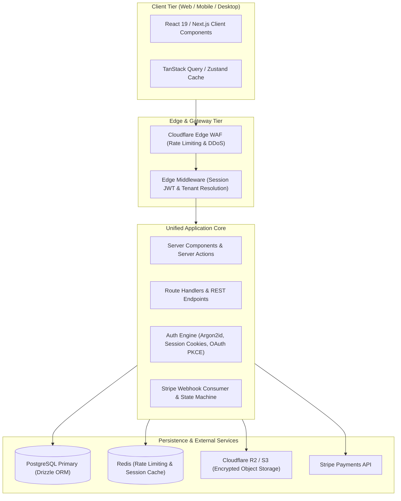

import { Callout } from 'fumadocs-ui/components/callout';
import { Cards, Card } from 'fumadocs-ui/components/card';
import { Steps, Step } from 'fumadocs-ui/components/steps';

The ultimate benchmark of full-stack engineering is synthesizing isolated technologies—data persistence, network security, authentication, payment state machines, and reactive user interfaces—into a cohesive, production-ready system.

In this capstone, you will architect and deploy **Pulse**, an end-to-end multi-tenant digital asset management SaaS.

---

## Architecture Overview

---

## Architectural Milestones

<Steps>
<Step>
### Milestone 1: Multi-Tenant Schema & ORM Modeling
Design a relational PostgreSQL schema supporting organization multi-tenancy, user roles (Admin, Member, Viewer), and soft deletes. Generate and run type-safe migrations using Drizzle ORM.
</Step>

<Step>
### Milestone 2: Hardened Authentication & RBAC
Implement dual-token session management with HTTP-only `__Host-` cookies, Argon2id hashing, and Role-Based Access Control (RBAC).
</Step>

<Step>
### Milestone 3: Direct Object Storage Pipeline
Enable users to upload high-resolution media directly to Cloudflare R2 / AWS S3 using presigned PUT URLs, verifying magic bytes and applying background resizing jobs.
</Step>

<Step>
### Milestone 4: Stripe Subscription Lifecycle
Build checkout session flows with Stripe Elements, handle asynchronous webhooks with cryptographic HMAC signature verification, and handle subscription downgrades and payment retries gracefully.
</Step>

<Step>
### Milestone 5: Observability & Production Deployment
Package the application with a multi-stage Dockerfile, configure OpenTelemetry / Sentry error reporting, and deploy to containerized cloud infrastructure with automated GitHub Actions CI/CD.
</Step>
</Steps>

<Callout type="info" title="Verification & Next Steps">
Completing this capstone demonstrates proficiency across all foundational layers of modern full-stack web development.
</Callout>
