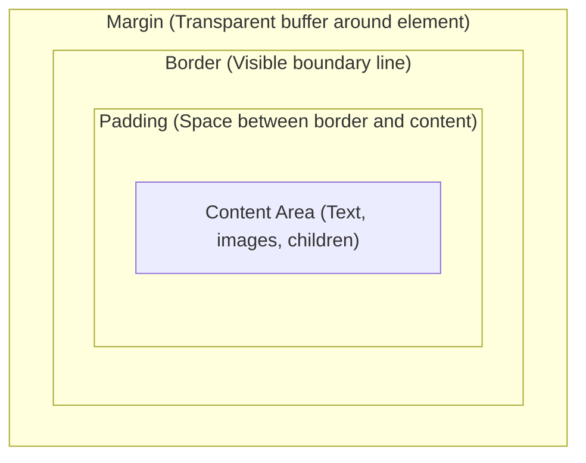

import { Callout } from 'fumadocs-ui/components/callout';
import { Tabs, Tab } from 'fumadocs-ui/components/tabs';

Every element rendered on a web page is computed as a geometric box. Mastering how borders, paddings, and margins impact spatial layout is the bedrock of frontend development.

---

## 1. The CSS Box Model Anatomy



### The Sizing Problem: `content-box` vs `border-box`

By default, browsers calculate dimensions using `box-sizing: content-box`:
- If you declare `width: 200px; padding: 20px; border: 5px solid black;`, the actual rendered width is `200 + 40 + 10 = 250px`!
- This causes layouts to break when paddings are added.

### The Modern Universal Reset:
```css
*,
*::before,
*::after {
  box-sizing: border-box;
  margin: 0;
  padding: 0;
}
```
With `box-sizing: border-box`, declaring `width: 200px` guarantees the element will **never exceed 200px**; paddings and borders are drawn inside that boundary.

---

## 2. Margin Collapse Mechanics

When two vertical margins touch in normal document flow, they **collapse** into a single margin equal to the largest of the two, rather than adding together:

```css
/* If item A has margin-bottom: 30px, and item B has margin-top: 20px */
.item-a { margin-bottom: 30px; }
.item-b { margin-top: 20px; }
/* The actual rendered distance between them is 30px (NOT 50px!) */
```

<Callout type="tip" title="How Modern CSS Avoids Margin Collapse">
In modern layouts, margin collapse is almost entirely bypassed by using Flexbox or CSS Grid with the `gap` property. The `gap` property never collapses and only places space *between* items.
</Callout>

---

## 3. Sizing Units: Relative vs Absolute

| Unit | Reference Point | Best Use Case |
| :--- | :--- | :--- |
| `px` | Physical hardware screen pixel approximation | Thin borders (`1px`), small box shadows |
| `rem` | Root font size (`1rem = 16px` by default) | **Typography, margins, paddings, layout sizing** |
| `em` | Parent/current element's font size | Icons or buttons that scale proportionally with text |
| `%` | Dimension of the parent element | Widths in responsive containers |
| `vw` / `vh` | 1% of viewport width or height | Fullscreen hero sections |
| `dvh` | **Dynamic Viewport Height** | Full-height mobile layouts that adapt to address bar collapse |

### The Mobile `100vh` Bug & The Fix: `100dvh`
On mobile devices (iOS Safari, Android Chrome), the browser URL bar slides in and out during scrolling. Using `height: 100vh` causes bottom buttons to be hidden under the URL bar.

Modern CSS provides three viewport height units:
- `100svh` (Small Viewport Height): Assumes address bar is expanded.
- `100lvh` (Large Viewport Height): Assumes address bar is hidden.
- `100dvh` (Dynamic Viewport Height): Continuously adapts as the user scrolls!

```css
.hero-screen {
  min-height: 100dvh; /* Smooth, perfect mobile scaling */
}
```

---

## 4. Modern CSS Math Functions

Avoid manual pixel recalculations using native math functions:

```css
/* 1. calc(): Basic arithmetic with mixed units */
.content {
  width: calc(100% - 2rem);
}

/* 2. min() & max(): Establish dynamic caps */
.sidebar {
  width: max(250px, 20vw);  /* Never shrinks below 250px */
  max-width: min(800px, 90vw); /* Never exceeds 800px */
}

/* 3. clamp(minimum, preferred, maximum): Fluid Typography */
h1 {
  /* Scales fluidly with screen width, clamped between 2rem (32px) and 4rem (64px) */
  font-size: clamp(2rem, 5vw + 1rem, 4rem);
}
```

---

## 5. Modern Colors & Design Tokens with OKLCH

Modern CSS favors the **OKLCH** color space over hex or rgb:
- **L (Lightness)**: `0` (black) to `1` (white).
- **C (Chroma)**: Purity and saturation (`0` to ~`0.4`).
- **H (Hue)**: Color angle (`0` to `360`).

OKLCH is perceptually uniform: two colors with lightness `0.7` will have identical human-perceived brightness across different hues.

```css
:root {
  /* Modern design tokens in OKLCH */
  --color-primary: oklch(0.65 0.24 260);
  --color-primary-hover: oklch(0.55 0.24 260);
  --color-surface: oklch(0.99 0.005 260);
  --color-text: oklch(0.18 0.02 260);
  
  --radius-sm: 0.25rem;
  --radius-md: 0.5rem;
  --radius-lg: 1rem;
}

/* Dark Mode Theme Tokens */
[data-theme="dark"] {
  --color-surface: oklch(0.16 0.02 260);
  --color-text: oklch(0.96 0.01 260);
}

.card {
  background-color: var(--color-surface);
  color: var(--color-text);
  border-radius: var(--radius-md);
  padding: 1.5rem;
  border: 1px solid oklch(from var(--color-text) l c h / 0.1); /* Alpha transparency */
}
```
