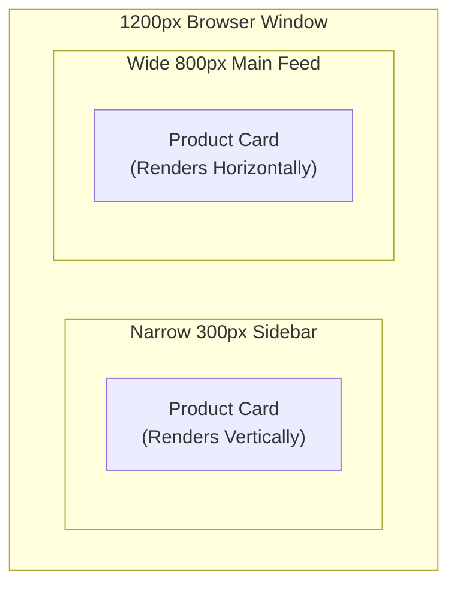

import { Callout } from 'fumadocs-ui/components/callout';
import { Tabs, Tab } from 'fumadocs-ui/components/tabs';

Responsive web design ensures user interfaces adapt seamlessly across smartphones, tablets, laptops, and ultra-wide desktop monitors. Modern CSS in 2025–2026 shifts the focus from viewport-level media queries to **component-level container queries**.

---

## 1. The Mobile-First Paradigm

In mobile-first styling, default CSS rules represent the narrowest mobile screen. Media queries are introduced progressively using `min-width` to layer on complexity as screen width expands:

```css
/* 1. Base Mobile Styles (Applies to all devices by default) */
.content-grid {
  display: flex;
  flex-direction: column;
  padding: 1rem;
}

/* 2. Tablet Enhancement (min-width: 768px) */
@media (min-width: 768px) {
  .content-grid {
    display: grid;
    grid-template-columns: repeat(2, 1fr);
    padding: 2rem;
  }
}

/* 3. Desktop Enhancement (min-width: 1024px) */
@media (min-width: 1024px) {
  .content-grid {
    grid-template-columns: repeat(4, 1fr);
    padding: 3rem;
  }
}
```

### Modern Media Query Range Syntax
Modern browsers support algebraic comparisons:

```css
/* Legacy Syntax */
@media (min-width: 600px) and (max-width: 1024px) { ... }

/* Modern Clean Syntax (2025+) */
@media (600px <= width <= 1024px) { ... }
```

---

## 2. Touch vs Mouse: Hover Media Queries

Never assume a desktop has a mouse or a mobile device lacks one (e.g. iPads with keyboards, touch-screen laptops):

```css
/* Targets only devices with a precise pointer (mouse/trackpad) capable of hovering */
@media (hover: hover) and (pointer: fine) {
  .card:hover {
    transform: translateY(-4px);
    box-shadow: 0 8px 24px rgba(0, 0, 0, 0.12);
  }
}

/* Targets devices with primary touch screens (large tap targets) */
@media (pointer: coarse) {
  button {
    min-height: 48px; /* Accessible minimum touch target */
  }
}
```

---

## 3. Container Queries (`@container`): The Modern Revolution

Media queries test the width of the **browser window**. But modern web applications are built with reusable components (React, Vue, Web Components) that may be placed in different layout slots:
- Inside a full-width feed: width = `800px` -> Should render horizontally.
- Inside a narrow sidebar: width = `300px` -> Should render vertically.

With viewport media queries, the card cannot know where it is rendered. **Container Queries solve this completely!**



### How to Implement Container Queries:

```css
/* Step 1: Define the parent container */
.component-slot {
  container-type: inline-size; /* Measures container's horizontal width */
  container-name: card-slot;   /* Optional name for specific targeting */
}

/* Step 2: Write default component layout (narrow) */
.user-card {
  display: flex;
  flex-direction: column;
  gap: 1rem;
  padding: 1rem;
}

/* Step 3: Query the parent container's width */
@container card-slot (min-width: 450px) {
  .user-card {
    flex-direction: row; /* Automatically switches to horizontal layout! */
    align-items: center;
  }

  .user-avatar {
    width: 80px;
    height: 80px;
  }
}
```

### Container Query Units
CSS introduces units relative to the container size:
- `1cqw`: 1% of query container's width.
- `1cqh`: 1% of query container's height.
- `1cqi`: 1% of query container's inline size.

```css
.card-headline {
  /* Font size scales with the width of the parent card, not the screen! */
  font-size: clamp(1rem, 4cqi, 2rem);
}
```

---

## 4. Modern Aspect Ratio (`aspect-ratio`)

Eliminate legacy "padding-bottom hacks" for responsive video embeds and image banners:

```css
.video-thumbnail {
  width: 100%;
  aspect-ratio: 16 / 9; /* Always maintains widescreen ratio */
  object-fit: cover;
}

.avatar-circle {
  width: 64px;
  aspect-ratio: 1 / 1;  /* Guaranteed perfect square */
  border-radius: 50%;
}
```
