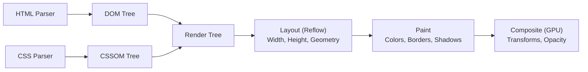

import { Cards, Card } from 'fumadocs-ui/components/card';
import { Callout } from 'fumadocs-ui/components/callout';

Welcome to the **CSS3 & Modern Styling Curriculum**.

CSS (Cascading Style Sheets) governs the visual presentation, geometry, and responsive behavior of web applications. Modern CSS in 2025–2026 has evolved into a sophisticated, hardware-accelerated declarative layout language featuring native 1D and 2D layout engines, component-level Container Queries (`@container`), native nesting, and relational selectors like `:has()`.

Whatever component framework you choose — Tailwind CSS, Vanilla Extract, CSS Modules, or Styled Components — mastering the underlying browser layout engine is essential for architecting robust user interfaces.

---

## Curriculum Lessons

<Cards>
  <Card
    title="01. Selectors, Specificity & Cascade Layers"
    href="/docs/full-stack-development/css/01-selectors-and-cascade"
    description="Combinators, pseudo-classes (:is, :where), specificity calculations, and managing architectural priority with @layer."
  />
  <Card
    title="02. The Box Model, Sizing & Modern Units"
    href="/docs/full-stack-development/css/02-box-model-and-units"
    description="Universal border-box reset, margin collapse, rem vs em, dynamic mobile viewport units (100dvh), and OKLCH color spaces."
  />
  <Card
    title="03. Flexbox Layout System"
    href="/docs/full-stack-development/css/03-flexbox"
    description="One-dimensional alignment, main vs cross axes, flex-grow, flex-shrink, flex-basis, gap, and responsive navbar patterns."
  />
  <Card
    title="04. CSS Grid & 2D Layouts"
    href="/docs/full-stack-development/css/04-grid"
    description="Two-dimensional layouts, repeat(auto-fit, minmax), named grid-template-areas, bento grids, and subgrid."
  />
  <Card
    title="05. Positioning, Stacking Context & Z-Index"
    href="/docs/full-stack-development/css/05-positioning-and-stacking"
    description="Static, relative, absolute, fixed, sticky positioning, and mastering stacking context mechanics."
  />
  <Card
    title="06. Responsive Design & Container Queries"
    href="/docs/full-stack-development/css/06-responsive-and-container-queries"
    description="Mobile-first media queries, container queries (@container) for modular component styling, and fluid clamp() typography."
  />
  <Card
    title="07. Modern Features, Transitions & Motion"
    href="/docs/full-stack-development/css/07-modern-features-and-animations"
    description="The :has() parent selector, native CSS nesting, 60fps GPU transforms, @keyframes, and prefers-reduced-motion."
  />
  <Card
    title="CSS3 Glossary & Quick Reference"
    href="/docs/full-stack-development/css/glossary"
    description="Comprehensive quick-reference glossary of properties, selectors, design tokens, and shorthand conventions."
  />
</Cards>

---

## Browser CSS Rendering Pipeline

When the browser parses an HTML document and associated stylesheets, it constructs the visual interface through the following stages:

### Layout Thrashing & GPU Acceleration
- **Expensive Operations (Reflow / Layout)**: Modifying geometry properties like `width`, `height`, `margin`, or `top` forces the browser to recalculate the positions of all surrounding elements.
- **Cheap Operations (Composite)**: Modifying `transform` (`translate`, `scale`, `rotate`) and `opacity` is offloaded directly to the GPU without triggering reflow or repaint, delivering smooth 60 FPS animations.

<Callout type="tip" title="Mental Model: Declarative Constraints">
Think of CSS not as a list of procedural instructions, but as a set of elastic geometric rules. You describe how elements should distribute space and respond to constraints, and the browser calculates the precise pixel coordinates dynamically.
</Callout>
