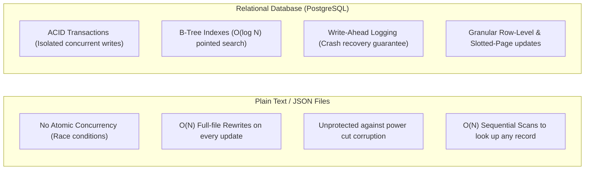
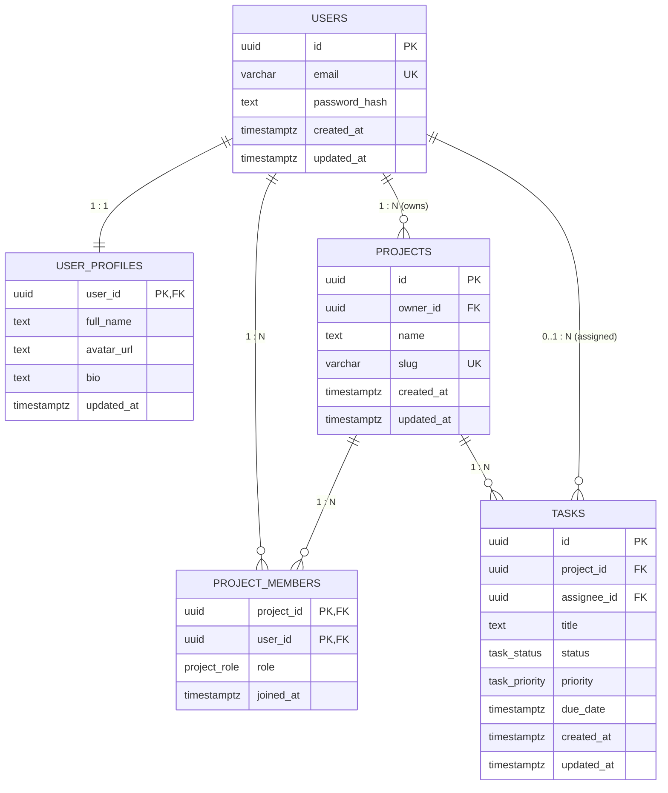
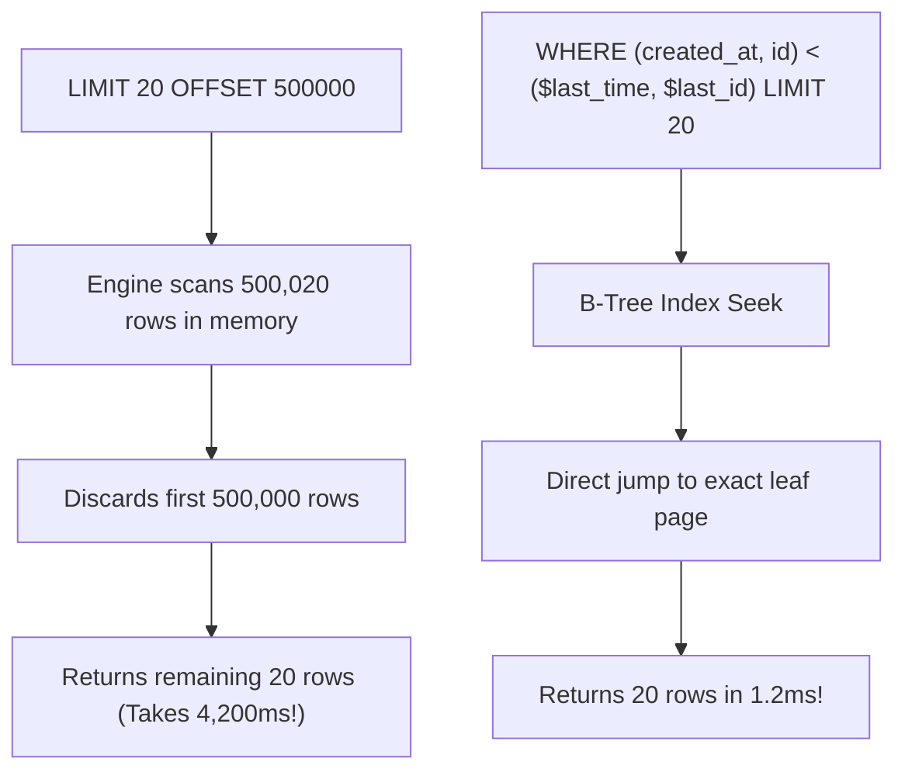
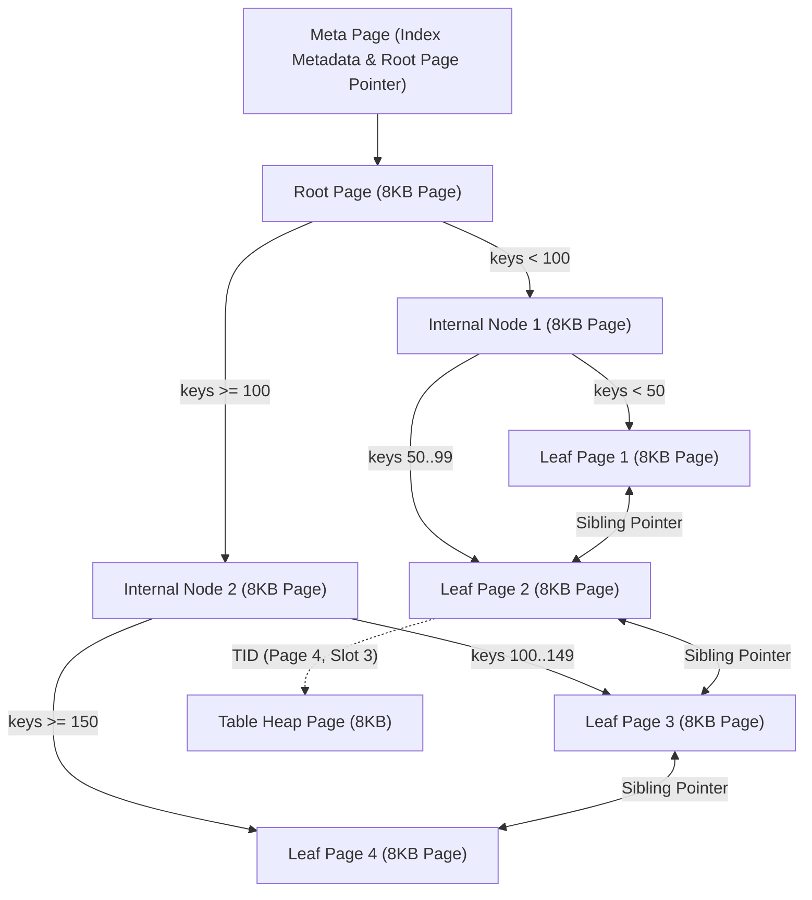
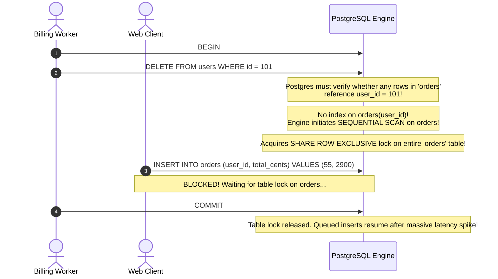
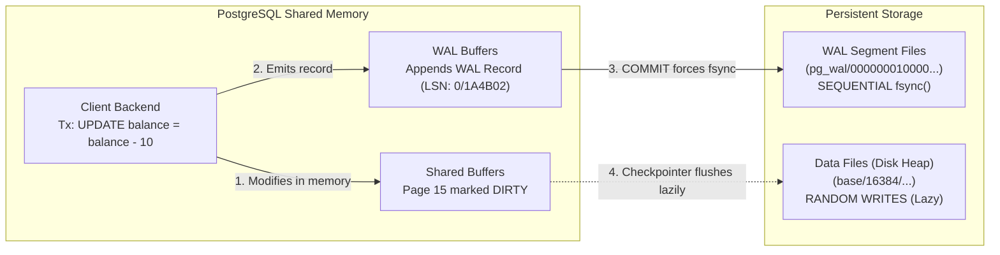

import { Tabs, Tab } from 'fumadocs-ui/components/tabs';
import { Callout } from 'fumadocs-ui/components/callout';
import { Steps, Step } from 'fumadocs-ui/components/steps';

Every full-stack engineer knows how to write `SELECT * FROM users WHERE email = ?`. But when traffic spikes by 50x, queries lock each other up, connection pools exhaust within seconds, and autovacuum grinds your NVMe drives to a halt, writing queries is no longer enough.

To build resilient data systems, you must master relational architecture on two fronts:
1. **Application Architecture & Schema Design**: How to model entities, select precise data types, enforce referential integrity, manage database migrations, and write scalable joins.
2. **Engine Internals & Hardware Execution**: How the storage engine lays out 8KB pages on disk, traverses B-Tree indexes, isolates transactions under MVCC, journals writes into WAL, and pools client connections.

---

# Part I: Application Architecture, Schema Design & Migrations

---

## 1. Persistence Fundamentals: Databases vs. Text Files

Why can't a production backend simply persist user accounts, orders, and balances to JSON or CSV files on an SSD using `fs.writeFile('db.json', JSON.stringify(data))`?



| Dimension | Flat Files (`.json` / `.csv`) | Relational Database (PostgreSQL) |
| :--- | :--- | :--- |
| **Concurrency** | OS file locks block the entire file; concurrent writes cause silent overwrites and lost data. | Row-level locking and Multi-Version Concurrency Control (MVCC) support thousands of concurrent transactions. |
| **Crash Safety** | A server crash or power interruption mid-`fs.writeFile()` leaves the file truncated or permanently corrupted. | Write-Ahead Log (WAL) ensures every committed transaction is durably recorded and recoverable upon restart. |
| **Lookup Speed** | Searching for a user by email requires reading the entire file into memory: $\mathcal{O}(N)$. | B-Tree and Hash indexes provide direct page traversal in $\mathcal{O}(\log N)$ disk page reads. |
| **Write Amplification** | Modifying 1 user profile out of 1,000,000 requires rewriting all 1,000,000 rows back to disk. | Only the modified 8KB page and a tiny WAL record are written to disk. |
| **Data Integrity** | Any process can write invalid schemas, broken references, or null values. | Strict constraints (`CHECK`, `FOREIGN KEY`, `NOT NULL`, `UNIQUE`) are enforced at the storage engine level. |

---

## 2. PostgreSQL Data Types, Sizes & Common Myths

Choosing the wrong data type inflates storage volume, blows through CPU memory cache lines, and can introduce subtle financial calculation bugs.

```
+---------------------------------------------------------------------------------------+
| Category    | Type              | Storage Size | Range / Representation               |
| :---------- | :---------------- | :----------- | :----------------------------------- |
| Integer     | smallint          | 2 bytes      | -32,768 to +32,767                   |
| Integer     | integer           | 4 bytes      | -2,147,483,648 to +2,147,483,647     |
| Integer     | bigint            | 8 bytes      | -9.22 × 10^18 to +9.22 × 10^18       |
| Exact Math  | numeric(p, s)     | Variable     | Exact decimal arithmetic (No drift)  |
| Inexact     | double precision  | 8 bytes      | IEEE 754 15-digit precision float    |
| Identifier | uuid              | 16 bytes     | 128-bit RFC 4122 random identifier    |
| Identifier | bigserial / identity| 8 bytes     | Auto-increment sequence integer      |
| Text        | text              | Variable     | Unlimited length, variable header    |
| Text        | varchar(n)        | Variable     | Limit n, identical performance to text|
+---------------------------------------------------------------------------------------+
```

### The Financial Arithmetic Trap: `numeric` vs. `float`

Never store currency, prices, account balances, or interest rates in `float`, `real`, or `double precision`. Floating-point numbers use binary IEEE 754 representations: numbers like `0.1` cannot be represented with finite binary digits, introducing rounding errors:

```sql
-- The IEEE 754 Inaccuracy Bug in SQL:
SELECT (0.1::float8 + 0.2::float8) = 0.3::float8; 
-- Returns: FALSE! (Result is 0.30000000000000004)

-- The Correct Production Pattern: Exact numeric arithmetic
SELECT (0.1::numeric + 0.2::numeric) = 0.3::numeric; 
-- Returns: TRUE!
```

- **Use `numeric(12, 4)` or `numeric(18, 2)`** when exact fractional math is required.
- **Alternative**: Store currency as integer cents (e.g., `$49.99` stored as `4999` in a `bigint` column).

### Primary Keys: `UUID` vs. `SERIAL` / `BIGSERIAL`

| Attribute | `BIGSERIAL` / `GENERATED ALWAYS AS IDENTITY` | `UUID` (`uuid_generate_v4()` / `gen_random_uuid()`) |
| :--- | :--- | :--- |
| **Storage Size** | 8 bytes (compact index) | 16 bytes ($2\times$ index overhead) |
| **Generation** | Centralized database sequence | Decentralized client or server generation |
| **Security Risk** | **Enumeration Vulnerability**: An attacker can crawl `/api/orders/1`, `/api/orders/2` and infer total company volume. | **Collision-Proof & Opaque**: Unguessable 128-bit values prevent enumeration. |
| **B-Tree Locality** | Monotonically increasing; appends cleanly to the right-most B-Tree leaf. | Random UUID v4 causes random B-Tree page splits unless using UUIDv7 (time-ordered). |

<Callout type="tip" title="Production Primary Key Standard">
Use `UUIDv7` or `gen_random_uuid()` for public-facing resources where enumeration is a security risk. If internal join speed is paramount and URLs use opaque slugs, `bigint GENERATED ALWAYS AS IDENTITY` is the fastest option.
</Callout>

### Debunking the Myth: `VARCHAR(255)` vs. `TEXT`

A pervasive myth from legacy MySQL 5.x teaches developers that `VARCHAR(255)` is faster or uses less memory than `TEXT`.

> **In PostgreSQL, `VARCHAR(n)`, `VARCHAR`, and `TEXT` use the identical underlying C structure (`varlena`) and storage engine.**

```text
PostgreSQL Varlena Layout (On-Disk):
├── 1-byte header: strings up to 126 bytes (no length padding)
├── 4-byte header: strings up to 1GB
└── Values > 2KB: Automatically compressed and moved out-of-line via TOAST
```

- There is **zero performance difference** in reading, writing, indexing, or querying `VARCHAR(255)` vs `TEXT` in PostgreSQL.
- Setting `VARCHAR(255)` simply adds an extra CPU instruction during inserts to verify `character_length <= 255`. If a future product requirement demands 300 characters, changing `VARCHAR(255)` to `TEXT` requires an unnecessary schema migration.
- **Rule of thumb**: Use `TEXT` by default. Only use `VARCHAR(n)` when an explicit business limit is mandatory (e.g., country code `VARCHAR(2)` or postal code `VARCHAR(10)`).

---

## 3. Relational Schema Design: Project Management Application

To understand relationships, constraints, and cascading actions, consider a production Project Management Application (similar to Jira or Linear):
- **Users**: Application accounts.
- **User Profiles**: 1:1 relationship with users (metadata, bio, avatar).
- **Projects**: 1:N relationship (one user owns many projects).
- **Project Members**: N:M junction table between projects and users, with specific permission roles.
- **Tasks**: Tasks belonging to a project, assigned to an optional project member.



### Complete Production SQL DDL

```sql
-- 1. Enable cryptographic extensions
CREATE EXTENSION IF NOT EXISTS "pgcrypto";

-- 2. Define domain enums
CREATE TYPE project_role AS ENUM ('owner', 'admin', 'member', 'viewer');
CREATE TYPE task_status AS ENUM ('backlog', 'todo', 'in_progress', 'in_review', 'done', 'canceled');
CREATE TYPE task_priority AS ENUM ('low', 'medium', 'high', 'urgent');

-- 3. Users Table (Core Identity)
CREATE TABLE users (
    id UUID PRIMARY KEY DEFAULT gen_random_uuid(),
    email VARCHAR(255) NOT NULL,
    password_hash TEXT NOT NULL,
    is_active BOOLEAN NOT NULL DEFAULT TRUE,
    created_at TIMESTAMPTZ NOT NULL DEFAULT NOW(),
    updated_at TIMESTAMPTZ NOT NULL DEFAULT NOW(),
    CONSTRAINT uq_users_email UNIQUE (email)
);

-- 4. User Profiles Table (1:1 Relationship)
-- Note: user_id is simultaneously PRIMARY KEY and FOREIGN KEY
CREATE TABLE user_profiles (
    user_id UUID PRIMARY KEY,
    full_name TEXT NOT NULL,
    avatar_url TEXT,
    bio TEXT,
    updated_at TIMESTAMPTZ NOT NULL DEFAULT NOW(),
    CONSTRAINT fk_user_profiles_user
        FOREIGN KEY (user_id) 
        REFERENCES users (id) 
        ON DELETE CASCADE
);

-- 5. Projects Table (1:N Ownership)
CREATE TABLE projects (
    id UUID PRIMARY KEY DEFAULT gen_random_uuid(),
    owner_id UUID NOT NULL,
    name TEXT NOT NULL,
    slug VARCHAR(64) NOT NULL,
    created_at TIMESTAMPTZ NOT NULL DEFAULT NOW(),
    updated_at TIMESTAMPTZ NOT NULL DEFAULT NOW(),
    CONSTRAINT uq_projects_slug UNIQUE (slug),
    CONSTRAINT fk_projects_owner 
        FOREIGN KEY (owner_id) 
        REFERENCES users (id) 
        ON DELETE RESTRICT
);

-- 6. Project Members (N:M Junction Table with Enum Role)
CREATE TABLE project_members (
    project_id UUID NOT NULL,
    user_id UUID NOT NULL,
    role project_role NOT NULL DEFAULT 'member',
    joined_at TIMESTAMPTZ NOT NULL DEFAULT NOW(),
    PRIMARY KEY (project_id, user_id),
    CONSTRAINT fk_members_project 
        FOREIGN KEY (project_id) 
        REFERENCES projects (id) 
        ON DELETE CASCADE,
    CONSTRAINT fk_members_user 
        FOREIGN KEY (user_id) 
        REFERENCES users (id) 
        ON DELETE CASCADE
);

-- 7. Tasks Table (1:N with Projects, Nullable 1:N with Assignee)
CREATE TABLE tasks (
    id UUID PRIMARY KEY DEFAULT gen_random_uuid(),
    project_id UUID NOT NULL,
    assignee_id UUID,
    title TEXT NOT NULL,
    description TEXT,
    status task_status NOT NULL DEFAULT 'todo',
    priority task_priority NOT NULL DEFAULT 'medium',
    due_date TIMESTAMPTZ,
    created_at TIMESTAMPTZ NOT NULL DEFAULT NOW(),
    updated_at TIMESTAMPTZ NOT NULL DEFAULT NOW(),
    CONSTRAINT fk_tasks_project 
        FOREIGN KEY (project_id) 
        REFERENCES projects (id) 
        ON DELETE CASCADE,
    CONSTRAINT fk_tasks_assignee 
        FOREIGN KEY (assignee_id) 
        REFERENCES users (id) 
        ON DELETE SET NULL
);

-- 8. Indexes for Foreign Keys & Range Lookups
CREATE INDEX idx_projects_owner_id ON projects (owner_id);
CREATE INDEX idx_project_members_user_id ON project_members (user_id);
CREATE INDEX idx_tasks_project_id ON tasks (project_id);
CREATE INDEX idx_tasks_assignee_id ON tasks (assignee_id);
CREATE INDEX idx_tasks_status_priority ON tasks (project_id, status, priority);
```

---

## 4. Referential Actions: CASCADE vs. SET NULL vs. RESTRICT

Foreign key constraints dictate what happens to child records when their parent row is deleted or modified:

```
                  DELETE FROM users WHERE id = 'usr_123';
                                    │
         ┌──────────────────────────┼──────────────────────────┐
         ▼                          ▼                          ▼
   user_profiles                  tasks                     projects
 [ON DELETE CASCADE]       [ON DELETE SET NULL]       [ON DELETE RESTRICT]
         │                          │                          │
Profile row deleted        assignee_id set to NULL    Deletion is BLOCKED!
automatically.             Task remains in project.   User still owns projects.
```

### 1. `ON DELETE CASCADE`
- **Behavior**: If the parent row is deleted, all matching child rows are automatically deleted in the same transaction.
- **Ideal For**: Child records that have zero meaning without the parent (e.g. `user_profiles`, `project_members`, `order_items`).

### 2. `ON DELETE SET NULL`
- **Behavior**: If the parent row is deleted, the foreign key column in the child table is set to `NULL`.
- **Constraint Requirement**: The child foreign key column must be declared nullable (omit `NOT NULL`).
- **Ideal For**: Optional associations (e.g. `tasks.assignee_id`). If an employee leaves the company and their user record is removed, existing tasks remain in the project board, marked unassigned.

### 3. `ON DELETE RESTRICT` (and `NO ACTION`)
- **Behavior**: The database engine immediately aborts the transaction with a foreign key violation error if child records exist.
- **Ideal For**: Guarding critical business assets. A user cannot be deleted if they still hold primary ownership of an active billing account or production `project`. Ownership must first be transferred explicitly.

---

## 5. Database Migrations & Version Control

In professional engineering organizations, **manual DDL (`ALTER TABLE`, `CREATE TABLE`) is strictly forbidden in production**.

### Why Manual DDL in Production is Banned
1. **Schema Drift**: Staging, developer local machines, and production environments diverge, causing unpredictable runtime failures.
2. **Lack of Audit Trail**: There is no git commit hash showing *who* ran the change, *why*, or *when*.
3. **Rollback Impossibility**: Manual changes often lack documented reverse scripts (`down.sql`), making emergency rollbacks perilous.
4. **Lock Escalation Hazards**: Adding columns with default values or unindexed constraints without review can lock large production tables for minutes, causing massive downtime.

### Migration Files & Tracking Table

Production migration tools (Prisma, Drizzle, Flyway, Golang Migrate) enforce sequential versioning using matched pairs of forward and backward SQL files:

```
migrations/
├── 20261005120000_create_users_table.up.sql
├── 20261005120000_create_users_table.down.sql
├── 20261005120500_add_user_profiles.up.sql
└── 20261005120500_add_user_profiles.down.sql
```

The migration runner maintains a dedicated audit table inside PostgreSQL:

```sql
CREATE TABLE schema_migrations (
    version VARCHAR(255) PRIMARY KEY,
    name VARCHAR(255) NOT NULL,
    applied_at TIMESTAMPTZ NOT NULL DEFAULT NOW(),
    checksum VARCHAR(64) NOT NULL
);
```

When a deployment begins, the migration runner inspects `schema_migrations`:
1. Queries all executed versions.
2. Identifies unapplied `.up.sql` scripts.
3. Wraps each migration script in an atomic database transaction:
   ```sql
   BEGIN;
   -- Execute contents of 20261005120500_add_user_profiles.up.sql
   INSERT INTO schema_migrations (version, name, checksum) 
   VALUES ('20261005120500', 'add_user_profiles', 'sha256_hash_abc');
   COMMIT;
   ```
4. If any error occurs, the entire transaction rolls back, leaving the database in a known, stable state.

---

## 6. Automated Timestamp Auditing via Triggers

Application backends frequently forget to update `updated_at = NOW()` in application-level SQL updates or ORM queries. In PostgreSQL, you can enforce this invariant at the database engine level using a trigger.

### 1. Create the Reusable Trigger Function

```sql
CREATE OR REPLACE FUNCTION update_updated_at_column()
RETURNS TRIGGER AS $$
BEGIN
    -- NEW represents the incoming row being updated
    NEW.updated_at = NOW();
    RETURN NEW;
END;
$$ LANGUAGE plpgsql;
```

### 2. Attach the `BEFORE UPDATE` Trigger to Tables

```sql
CREATE TRIGGER trg_users_updated_at
    BEFORE UPDATE ON users
    FOR EACH ROW
    EXECUTE FUNCTION update_updated_at_column();

CREATE TRIGGER trg_projects_updated_at
    BEFORE UPDATE ON projects
    FOR EACH ROW
    EXECUTE FUNCTION update_updated_at_column();

CREATE TRIGGER trg_tasks_updated_at
    BEFORE UPDATE ON tasks
    FOR EACH ROW
    EXECUTE FUNCTION update_updated_at_column();
```

Now, any standard `UPDATE tasks SET status = 'in_progress' WHERE id = '...';` automatically refreshes `updated_at` with microsecond accuracy, regardless of whether the query was issued by Node.js, Python, or an admin CLI.

---

## 7. Querying, Joins & Cursor-Based Pagination

### `INNER JOIN` vs. `LEFT JOIN`

```sql
-- 1. INNER JOIN: Returns only tasks that currently have an assigned user
SELECT 
    t.id AS task_id,
    t.title,
    u.email AS assignee_email
FROM tasks t
INNER JOIN users u ON t.assignee_id = u.id
WHERE t.project_id = '00000000-0000-0000-0000-000000000001';

-- 2. LEFT JOIN: Returns ALL tasks in the project, filling user fields with NULL if unassigned
SELECT 
    t.id AS task_id,
    t.title,
    t.status,
    COALESCE(u.email, 'Unassigned') AS assignee
FROM tasks t
LEFT JOIN users u ON t.assignee_id = u.id
WHERE t.project_id = '00000000-0000-0000-0000-000000000001';
```

### Pagination: The `OFFSET` Anti-Pattern vs. Keyset (Cursor) Pagination

When paginating through millions of records, `LIMIT 20 OFFSET 500000` is catastrophic:



```sql
-- SLOW: O(N) Degradation
SELECT id, title, created_at 
FROM tasks 
ORDER BY created_at DESC 
LIMIT 20 OFFSET 100000;

-- FAST: O(log N) Keyset / Cursor Pagination
-- Client passes the timestamp and ID of the last item on the previous page
SELECT id, title, created_at 
FROM tasks 
WHERE (created_at, id) < ('2026-10-05 18:30:00+00', 'a0eebc99-9c0b-4ef8-bb6d-6bb9bd380a11')
ORDER BY created_at DESC, id DESC 
LIMIT 20;
```

---

# Part II: Engine Internals & Production Performance

---

## 8. The Physical Unit of Storage: 8KB Slotted Pages

At the lowest level of PostgreSQL storage, tables and indexes do not exist as continuous streams of records. PostgreSQL organizes all data on disk into discrete **8 Kilobyte (8192 bytes)** blocks called **Pages** (or Buffers when cached in RAM).

```
Relation (Table)
  └── Split into 8KB Pages on disk (e.g., base/16384/26839)
        ├── Page 0 (8192 bytes)
        ├── Page 1 (8192 bytes)
        └── Page N (8192 bytes)
```

Whenever Postgres reads or writes even a single byte from a row, it must read or write the entire 8KB page through the **Shared Buffers** cache pool.

### Slotted Page Architecture

Within each 8KB page, PostgreSQL uses a **slotted-page layout** to allow variable-length tuples (rows) without requiring continuous memory reorganization.

```
+-----------------------------------------------------------------------+
|  Page Header (24 bytes): LSN, checksum, free space offsets            |
+-----------------------------------------------------------------------+
|  ItemPointer (Line Pointer 1): offset to Tuple 1, length (4 bytes)    |
|  ItemPointer (Line Pointer 2): offset to Tuple 2, length (4 bytes)    |
|  ItemPointer (Line Pointer 3): offset to Tuple 3, length (4 bytes)    |
|  ---> (Line pointers grow DOWNWARD)                                   |
+-----------------------------------------------------------------------+
|                        FREE SPACE REGION                              |
|                                                                       |
+-----------------------------------------------------------------------+
|  <--- (Heap Tuples grow UPWARD from bottom of page)                   |
|  Heap Tuple 3 (variable size: Header + null bitmap + payload)         |
+-----------------------------------------------------------------------+
|  Heap Tuple 2 (variable size: Header + null bitmap + payload)         |
+-----------------------------------------------------------------------+
|  Heap Tuple 1 (variable size: Header + null bitmap + payload)         |
+-----------------------------------------------------------------------+
|  Special Space (optional, used in B-Trees for sibling pointers)       |
+-----------------------------------------------------------------------+
```

1. **Page Header (24 bytes)**: Contains the Log Sequence Number (LSN) of the last WAL record affecting this page, flags, and pointers to the start (`pd_lower`) and end (`pd_upper`) of free space.
2. **Line Pointers (4 bytes each)**: An array of `(offset, length)` indicators pointing to tuples within the page. These line pointers never change their index position within the page, even if the tuple is moved or defragmented.
3. **Item Pointer ID (`ctid`)**: The physical identifier of any row is a tuple coordinate `(page_number, line_pointer_index)`—for example, `(0, 1)`.
4. **Heap Tuples**: The physical rows, growing upward from the end of the page.

### Anatomy of a Heap Tuple Header

Every row in Postgres carries a mandatory header of **23 bytes** before any user data begins:

```text
[ HeapTupleHeader: 23 bytes ]
├── t_xmin      (4 bytes) : Transaction ID that inserted this tuple
├── t_xmax      (4 bytes) : Transaction ID that deleted or updated this tuple (0 if active)
├── t_cid       (4 bytes) : Command identifier within inserting/deleting transaction
├── t_ctid      (6 bytes) : Physical location of current or newer version of this tuple
├── t_infomask2 (2 bytes) : Number of attributes + HOT flags
├── t_infomask  (2 bytes) : Status flags (HEAP_XMIN_COMMITTED, HEAP_XMAX_INVALID, etc.)
├── t_hoff      (1 byte)  : Offset to start of user data (accounts for NULL bitmap padding)
└── [ NULL Bitmap ]       : Optional bitmask marking which columns are NULL
```

<Callout type="warn" title="Why UPDATE is an INSERT + Soft-Delete">
In PostgreSQL, an `UPDATE` does not overwrite the row in place. It:
1. Sets `t_xmax` of the existing tuple to the current transaction ID (marking it dead).
2. Appends a brand-new tuple into the heap with `t_xmin = current_tx` and its own user data.
3. Sets the old tuple's `t_ctid` to point to the new tuple's `(page, line_pointer)`.

This creates **dead tuples**. If a table undergoes heavy update traffic without proper autovacuum tuning, disk consumption balloons, cache hit ratios drop, and queries slow down significantly due to **table bloat**.
</Callout>

---

## 9. B-Tree Indexes & Lehman-Yao Traversal

PostgreSQL uses **Lehman & Yao High-Concurrency B-Trees** for standard indexes. A B-Tree index is also stored as an array of 8KB pages, structured into three distinct tiers:



- **Leaf Nodes**: Hold pairs of `(Indexed Column Value, ctid)`. The `ctid` points directly to the line pointer on a heap page.
- **Internal Nodes**: Hold pairs of `(Key, Child Page Number)`.
- **Sibling Pointers**: Every page at the leaf tier contains pointers to its immediate left and right neighbors, allowing fast range scans without backtracking to parent nodes.

### Interactive Simulation: B-Tree Index Traversal

Let's simulate how PostgreSQL resolves `SELECT username FROM users WHERE user_id = 42;`:

<Tabs items={['Step 1: Read Meta Page', 'Step 2: Binary Search Internal Node', 'Step 3: Leaf Node Scan', 'Step 4: Heap Fetch & MVCC Check']}>
  <Tab value="Step 1: Read Meta Page">
```text
[Engine Action: Buffer Lookup]
Target: Index "users_pkey" on column "user_id"
1. Read Meta Page (Page 0 of index fork).
2. Locate root page reference: root_page_id = 3.
3. Request Page 3 from PostgreSQL Shared Buffers (RAM).
   Result: Cache HIT (Buffer pinned in memory).
```
The query planner starts at the index root page. If the page is already cached in `shared_buffers`, zero disk I/O occurs.
  </Tab>

  <Tab value="Step 2: Binary Search Internal Node">
```text
[Engine Action: In-Memory Binary Search]
Page 3 Keys: [ (20 -> Child Page 7), (50 -> Child Page 9), (100 -> Child Page 12) ]
Target Key: 42

Comparison:
  20 <= 42 < 50
Routing: Follow Child Page 9.
Request Page 9 from Shared Buffers. Cache HIT.
```
Internal nodes contain compact routing pivots. The engine performs an in-memory binary search to locate the child page containing key `42`.
  </Tab>

  <Tab value="Step 3: Leaf Node Scan">
```text
[Engine Action: Leaf Page Evaluation]
Leaf Page 9 contains data items:
  - Key: 40 -> ctid: (Page 12, Item 4)
  - Key: 41 -> ctid: (Page 12, Item 5)
  - Key: 42 -> ctid: (Page 15, Item 2)  <-- MATCH FOUND!
  - Key: 45 -> ctid: (Page 15, Item 8)

Extract ctid: (Block 15, Offset 2).
```
The leaf page provides the exact physical coordinates on the heap: page block 15, item pointer index 2.
  </Tab>

  <Tab value="Step 4: Heap Fetch & MVCC Check">
```text
[Engine Action: Heap Verification & MVCC Check]
1. Read Table Heap Page 15 from Shared Buffers.
2. Read Line Pointer 2: points to byte offset 4820 with length 142.
3. Read Heap Tuple Header at offset 4820:
   - xmin = 1042 (Committed before our snapshot? YES)
   - xmax = 0 (Has it been deleted or updated? NO)
4. Tuple is VISIBLE.
5. Extract column "username" = 'alex_dev'.
6. Return row to client.
```
The database reads the physical tuple and inspects `xmin` and `xmax` against the transaction's visibility snapshot. If the tuple was deleted by another committed transaction, it is silently skipped.
  </Tab>
</Tabs>

---

## 10. The Foreign Key Trap: The Silent Lock Catastrophe

One of the most dangerous performance traps in production relational databases is an **unindexed foreign key**.

When you define a foreign key constraint:
```sql
CREATE TABLE orders (
    id BIGSERIAL PRIMARY KEY,
    user_id BIGINT REFERENCES users(id) ON DELETE CASCADE,
    total_cents INT NOT NULL
);
```
PostgreSQL automatically builds a unique B-Tree index on `users(id)`. **It does NOT automatically build an index on `orders(user_id)`.**



### Why Does This Happen?

1. When a row in `users` is deleted or its primary key updated, PostgreSQL must guarantee referential integrity.
2. Without an index on `orders(user_id)`, the engine must scan the entire `orders` table.
3. In PostgreSQL versions prior to 12, this frequently escalated to an aggressive lock on the child table. Even in modern versions, the sequential scan forces row-level shared locks on millions of rows, stalling concurrent write traffic.

```sql
-- DETECTION QUERY: Find unindexed foreign keys in your database
SELECT
    conrelid::regclass AS child_table,
    conname AS fk_constraint_name,
    pg_get_constraintdef(c.oid) AS fk_definition
FROM pg_constraint c
WHERE contype = 'f'
  AND NOT EXISTS (
      SELECT 1
      FROM pg_index i
      WHERE i.indrelid = c.conrelid
        AND (i.indkey::smallint[])[0] = (c.conkey)[1]
  );

-- REMEDIATION: Always add the index concurrently in production
CREATE INDEX CONCURRENTLY idx_orders_user_id ON orders(user_id);
```

<Callout type="info" title="Why CREATE INDEX CONCURRENTLY?">
Standard `CREATE INDEX` acquires an `ACCESS EXCLUSIVE` lock on the target table, blocking all reads and writes until the entire index is built. `CREATE INDEX CONCURRENTLY` performs two scans over the table and acquires only a `SHARE UPDATE EXCLUSIVE` lock, allowing reads and writes to proceed unhindered.
</Callout>

---

## 11. ACID Invariants, WAL, and Crash Recovery

To uphold ACID (Atomicity, Consistency, Isolation, Durability) without crushing write throughput, PostgreSQL uses **Write-Ahead Logging (WAL)**.

Writing random 8KB pages directly to disk for every transaction commit would overwhelm SSD controller IOPS and mechanical storage heads. Instead, PostgreSQL uses an append-only journal:



### The WAL Invariant Rule

> **The Invariant**: A dirty data page in `shared_buffers` must NEVER be written to the data files on disk until the WAL records describing changes to that page have first been flushed to persistent storage (`fsync`).

When you issue `COMMIT`:
1. Postgres flushes only the WAL buffer up to the current transaction's LSN to disk via sequential write + `fsync()`.
2. The dirty 8KB heap pages remain in RAM.
3. The server immediately returns success (`OK`) to the client.

### Crash Recovery Mechanism

If power is cut abruptly:
- The heap pages on disk might be inconsistent or partially written.
- Upon restart, PostgreSQL enters **Redo Recovery**:
  1. Finds the last valid **Checkpoint** record in the WAL.
  2. Replays every WAL record from that checkpoint forward up to the end of the log.
  3. Re-applies changes to data pages if the page's header LSN is older than the WAL record LSN.
  4. Discards uncommitted transactions.

---

## 12. Isolation Levels and Concurrency Anomalies

SQL-92 defines four transaction isolation levels. PostgreSQL implements three of them using MVCC snapshots.

| Isolation Level | Dirty Read | Non-Repeatable Read | Phantom Read | Serialization Anomaly / Write Skew |
| :--- | :--- | :--- | :--- | :--- |
| **Read Committed** (Default) | Impossible | **Possible** | **Possible** | **Possible** |
| **Repeatable Read** | Impossible | Impossible | Impossible | **Possible** |
| **Serializable** | Impossible | Impossible | Impossible | Impossible |

### 1. Non-Repeatable Read (Read Committed)
Within the same transaction, querying the same row twice returns different values because another transaction committed in between.

```sql
-- Session 1
BEGIN;
SELECT balance FROM accounts WHERE id = 1; -- Returns 100

-- Session 2
BEGIN;
UPDATE accounts SET balance = 50 WHERE id = 1;
COMMIT;

-- Session 1
SELECT balance FROM accounts WHERE id = 1; -- Returns 50! (Value changed mid-transaction)
COMMIT;
```

### 2. Write Skew (Repeatable Read)
Repeatable Read guarantees that you see a snapshot from the start of the transaction. However, two transactions can read overlapping data and make conflicting decisions that violate global business constraints:

```sql
-- Rule: The sum of balance_checking + balance_savings must remain >= 0
-- Initial: Checking = 100, Savings = 100 (Total: 200)

-- Session 1 (Wants to withdraw 150 from Checking)
BEGIN TRANSACTION ISOLATION LEVEL REPEATABLE READ;
SELECT SUM(balance) FROM accounts WHERE user_id = 1; -- Reads 200 (Valid!)
UPDATE accounts SET balance = balance - 150 WHERE user_id = 1 AND type = 'checking';

-- Session 2 (Concurrent: Wants to withdraw 150 from Savings)
BEGIN TRANSACTION ISOLATION LEVEL REPEATABLE READ;
SELECT SUM(balance) FROM accounts WHERE user_id = 1; -- Reads 200 (Valid!)
UPDATE accounts SET balance = balance - 150 WHERE user_id = 1 AND type = 'savings';

-- Both commit successfully!
-- Final state: Checking = -50, Savings = -50. Total = -100! (Constraint Violated)
```

<Callout type="error" title="Solving Concurrency Hazards">
To prevent Write Skew, you have two choices:
1. **Pessimistic Locking**: Use `SELECT ... FOR UPDATE` to lock the rows explicitly.
2. **Serializable Isolation**: Set `TRANSACTION ISOLATION LEVEL SERIALIZABLE`. Postgres tracks data dependencies using SIREAD locks. If a conflict cycle is detected, one transaction is aborted with `ERROR: 40001: could not serialize access due to read/write dependencies among transactions`.
</Callout>

---

## 13. Connection Scaling & The PgBouncer Architecture

A standard PostgreSQL server does not handle thousands of concurrent client connections well. Each incoming client connection causes PostgreSQL to call `fork()` and spawn a separate OS process:

```text
Postmaster (PID 1000)
  ├── postgres: backend user_app 10.0.1.5 (PID 1001) ~ 10MB RAM + work_mem
  ├── postgres: backend user_app 10.0.1.6 (PID 1002) ~ 10MB RAM + work_mem
  ├── postgres: backend user_app 10.0.1.7 (PID 1003) ~ 10MB RAM + work_mem
  └── ... (Spawning 1000 connections consumes 10GB+ RAM in OS context-switching overhead)
```

When 1,000 backend application containers each open a pool of 20 connections, 20,000 PostgreSQL processes compete for CPU caches and disk channels, causing **connection thrashing**.

```mermaid
flowchart LR
    subgraph Clients["Application Tier (500 Pods)"]
        A1["API Server 1"]
        A2["API Server 2"]
        A3["Worker 1"]
    end

    subgraph Pooler["PgBouncer Layer (Proxy)"]
        PB["PgBouncer Daemon<br/>Single-threaded epoll loop<br/>Pool size: 50"]
    end

    subgraph Postgres["PostgreSQL Database Server"]
        M1["Postgres Backend 1"]
        M2["Postgres Backend 2"]
        MN["Postgres Backend 50"]
    end

    A1 -->|"5,000 idle client connections"| PB
    A2 -->|"Low RAM footprint (~2KB each)"| PB
    A3 -->|""| PB
    PB -->|"Multiplexed onto 50 persistent connections"| M1
    PB -->|""| M2
    PB -->|""| MN
```

### PgBouncer Pooling Modes

| Mode | Connection Lifecycle | Safe for Session State? | Safe for Prepared Statements? |
| :--- | :--- | :--- | :--- |
| **Session** | Client keeps server connection from `connect()` until `disconnect()`. | Yes | Yes |
| **Transaction** (Standard) | Server connection is assigned only for the duration of a `BEGIN ... COMMIT` block. Immediately returned to pool afterwards. | **No** (Session variables reset) | **Requires special handling** (PgBouncer 1.21+ or protocol-level unnamed statements) |
| **Statement** | Server connection is released after every single SQL statement. | No | No (Multi-statement transactions break!) |

### Production Configuration Example

```ini
; pgbouncer.ini
[databases]
production_db = host=127.0.0.1 port=5432 dbname=prod_db pool_size=50 reserve_pool=10

[pgbouncer]
listen_addr = 0.0.0.0
listen_port = 6432
auth_type = scram-sha-256
auth_file = /etc/pgbouncer/userlist.txt

; Use transaction pooling for high-throughput microservices
pool_mode = transaction
max_client_conn = 10000
default_pool_size = 50
min_pool_size = 10
reserve_pool_size = 5
reserve_pool_timeout = 5.0
max_db_connections = 100
server_idle_timeout = 600
```

---

## 14. PostgreSQL Diagnostic & Incident Toolkit

Run these diagnostic queries during incident triage:

### 1. Inspect Buffer Usage with `EXPLAIN (ANALYZE, BUFFERS)`

```sql
EXPLAIN (ANALYZE, BUFFERS, COSTS OFF)
SELECT * FROM tasks WHERE project_id = '00000000-0000-0000-0000-000000000001' ORDER BY created_at DESC LIMIT 5;
```

Look for:
- `Buffers: shared hit=42`: Read directly from PostgreSQL memory buffer pool.
- `Buffers: shared read=840`: Read from OS disk cache or NVMe storage (costly disk I/O).
- `Buffers: shared dirtied=12`: Pages modified during query execution.

### 2. Identify Blocking & Deadlocked Queries

```sql
SELECT
    blocked_locks.pid         AS blocked_pid,
    blocked_activity.usename  AS blocked_user,
    blocking_locks.pid        AS blocking_pid,
    blocking_activity.usename AS blocking_user,
    blocked_activity.query    AS blocked_statement,
    blocking_activity.query   AS blocking_statement
FROM pg_catalog.pg_locks blocked_locks
JOIN pg_catalog.pg_stat_activity blocked_activity ON blocked_activity.pid = blocked_locks.pid
JOIN pg_catalog.pg_locks blocking_locks 
    ON blocking_locks.locktype = blocked_locks.locktype
    AND blocking_locks.database IS NOT DISTINCT FROM blocked_locks.database
    AND blocking_locks.relation IS NOT DISTINCT FROM blocked_locks.relation
    AND blocking_locks.page IS NOT DISTINCT FROM blocked_locks.page
    AND blocking_locks.tuple IS NOT DISTINCT FROM blocked_locks.tuple
    AND blocking_locks.virtualxid IS NOT DISTINCT FROM blocked_locks.virtualxid
    AND blocking_locks.transactionid IS NOT DISTINCT FROM blocked_locks.transactionid
    AND blocking_locks.classid IS NOT DISTINCT FROM blocked_locks.classid
    AND blocking_locks.objid IS NOT DISTINCT FROM blocked_locks.objid
    AND blocking_locks.objsubid IS NOT DISTINCT FROM blocked_locks.objsubid
    AND blocking_locks.pid != blocked_locks.pid
JOIN pg_catalog.pg_stat_activity blocking_activity ON blocking_activity.pid = blocking_locks.pid
WHERE NOT blocked_locks.granted;
```

---

## Key Takeaways & Architecture Principles

1. **Model with exact types**: Use `numeric` for finance, `UUID` or `identity` for keys, and `text` for strings—avoid the arbitrary `VARCHAR(255)` myth.
2. **Enforce referential rules intentionally**: Use `CASCADE` for owned children, `SET NULL` for optional references, and `RESTRICT` for critical parent entities.
3. **Automate schema lifecycle with migrations**: Ban manual production DDL; track all schema versions in a migration history table inside transactions.
4. **Always index Foreign Keys**: Missing foreign key indexes cause destructive table-level lock escalation during deletes or parent primary key updates.
5. **Pages are 8KB atomic chunks**: You never read a single row in isolation; you always read and cache the surrounding 8KB page.
6. **Every UPDATE generates a dead tuple**: Tune autovacuum to clean dead versions before table bloat slows queries down.
7. **WAL protects Durability at high speed**: `COMMIT` flushes sequential WAL records via `fsync`, allowing dirty data pages to be flushed asynchronously.
8. **Pool connections with PgBouncer**: Multiplex thousands of ephemeral web requests onto a small, optimal pool of backend PostgreSQL processes.
