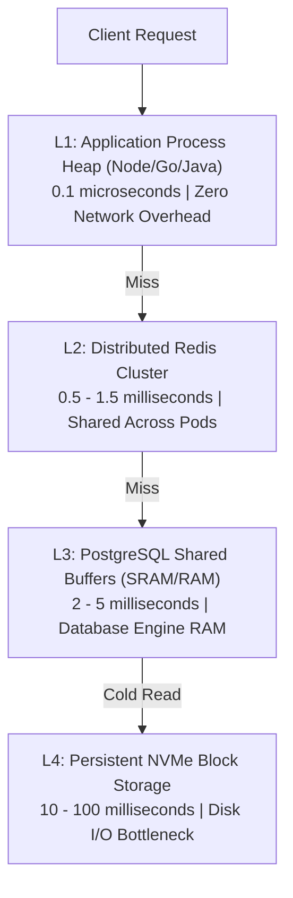
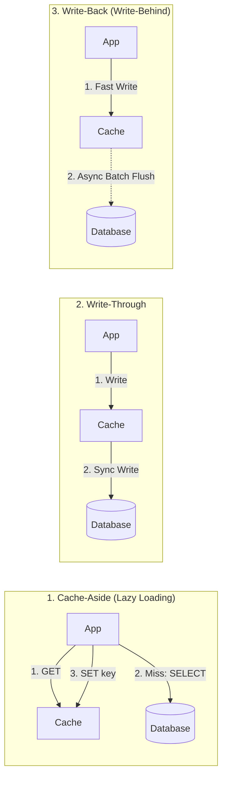
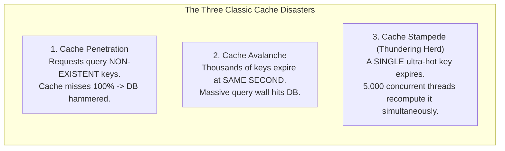

import { Tabs, Tab } from 'fumadocs-ui/components/tabs';
import { Callout } from 'fumadocs-ui/components/callout';

In modern high-scale backends, caching is not just an optimization—it is the barrier between a resilient system and an immediate cascading database failure. When 50,000 concurrent requests strike an endpoint that takes 40ms of database computation, no database cluster can survive without an intelligent, consistent caching layer in front of it.

This lesson explores the physical latency hierarchy, cache topologies, Redis memory internals, eviction algorithms, and mathematical strategies for defeating the Thundering Herd.

---

## 1. The Physical Caching Hierarchy

To design effective caching systems, you must develop an instinct for the orders of magnitude separating CPU cycles, local RAM, network hops, and persistent storage.

```
+-------------------------------------------------------------------------+
| Level               | Typical Latency  | Relative Scale (Scaled to 1 sec)|
+-------------------------------------------------------------------------+
| L1 Cache Hit        | 0.5 - 1 ns       | 1 second                        |
| L2 / L3 Cache Hit   | 3 - 10 ns        | 3 - 10 seconds                  |
| Process Heap (RAM)  | 50 - 100 ns      | ~1.5 minutes                    |
| Redis (over LAN)    | 0.3 - 1.0 ms     | ~11.5 days                      |
| NVMe SSD Read       | 50 - 150 µs      | ~1.7 days                       |
| RDBMS Query (Index) | 2 - 20 ms        | ~7 months                       |
| RDBMS Complex Join  | 100 - 500 ms     | ~3 - 15 years                   |
| Cross-Region WAN    | 50 - 150 ms      | ~1.5 - 4.5 years                |
+-------------------------------------------------------------------------+
```



---

## 2. Caching Access Patterns

There are three primary architectural patterns for caching backend reads and writes.



### Pattern 1: Cache-Aside (Lazy Loading)
The application code coordinates between the cache and the database directly.
- **Read Path**: The app checks the cache. On a hit, it returns the value. On a miss, it fetches data from the database, writes it into the cache with a TTL (Time to Live), and returns it to the client.
- **Write Path**: The app writes directly to the database, then **invalidates (deletes)** the cache key.
- **Pros**: Only requested data is cached. Cache failure does not take down the write path.
- **Cons**: Cache miss penalty on cold starts; potential race conditions between write invalidation and concurrent reads.

<Callout type="warn" title="Why Delete the Cache Key Instead of Updating It?">
Never update the cache key directly on a write (`SET key value`). If Transaction A and Transaction B update the same record concurrently, network delays can cause them to write to Redis in reverse order:
1. Tx A updates DB (`name = 'Alice'`).
2. Tx B updates DB (`name = 'Bob'`).
3. Tx B writes Redis (`name = 'Bob'`).
4. Tx A writes Redis (`name = 'Alice'`). *(Cache is now permanently stale until TTL!)*

**Always `DEL` the cache key** after committing to the database. The next read will reconstruct the authoritative state.
</Callout>

### Pattern 2: Write-Through
The application writes only to the cache layer. The cache infrastructure synchronously updates the underlying database before returning success.
- **Pros**: Data in the cache is always fresh; read misses are rare.
- **Cons**: High write latency (double writes); unread data consumes expensive Redis memory.

### Pattern 3: Write-Back (Write-Behind)
The application writes immediately to the cache, which acknowledges the write instantly. A background worker periodically drains updates from the cache and batches them into the persistent database.
- **Pros**: Enormous write throughput (e.g. tracking video view counts or analytics counters).
- **Cons**: High risk of data loss. If the cache node crashes before flushing dirty pages, unwritten data is lost forever.

---

## 3. Redis Memory Architecture & Eviction Policies

Redis is an in-memory, single-threaded (event-loop multiplexed) key-value engine. It allocates memory using `jemalloc` and tracks metadata per object.

### The Anatomy of a Redis Object (`robj`)

Every key-value entry in Redis is wrapped in a 16-byte `redisObject` header:

```c
typedef struct redisObject {
    unsigned type:4;       // OBJ_STRING, OBJ_LIST, OBJ_SET, OBJ_ZSET, OBJ_HASH
    unsigned encoding:4;   // OBJ_ENCODING_RAW, OBJ_ENCODING_INT, OBJ_ENCODING_HT, etc.
    unsigned lru:24;       // LRU timestamp (seconds) OR LFU frequency counter
    int refcount;          // Reference counter for memory sharing
    void *ptr;             // Pointer to the physical value (e.g., sds string or dict)
} robj;
```

Notice the **`unsigned lru:24`** bitfield: Redis dedicates 24 bits to evictions without paying the memory overhead of a full double-linked list across millions of keys!

### Eviction Policies Overview

When Redis memory reaches `maxmemory`, it must discard keys according to its configured `maxmemory-policy`:

| Policy | Target Keys | Eviction Criteria |
| :--- | :--- | :--- |
| `noeviction` | None | Returns `OOM command not allowed` error on writes. |
| `allkeys-lru` | All keys | Discards keys with oldest last-accessed time. |
| `volatile-lru`| Keys with TTL | Discards expired/expiring keys with oldest access time. |
| `allkeys-lfu` | All keys | Discards least frequently accessed keys. |
| `volatile-lfu`| Keys with TTL | Discards keys with lowest frequency counter among TTL set. |
| `volatile-ttl`| Keys with TTL | Discards keys closest to their expiration time. |
| `allkeys-random`| All keys | Discards keys completely at random. |

### Approximated LRU vs True LRU

True LRU requires maintaining every entry in a global doubly-linked list. Every read (`GET`) requires detaching the node and splicing it to the head of the list—a costly operation that would thrash CPU caches and waste 16 bytes of pointer overhead per key.

Instead, Redis uses an **Approximated LRU algorithm**:
1. When eviction triggers, Redis samples $N$ random keys (configured by `maxmemory-samples`, default `5`).
2. It examines the 24-bit `lru` clock in each sampled key's `redisObject`.
3. It evicts the key with the oldest idle time from that sample pool into an eviction pool of 16 best candidates.
4. With a sample size of `10`, Redis approximated LRU is statistically indistinguishable from theoretical LRU while consuming zero extra memory pointers.

---

## 4. Cache Failure Modes & Catastrophes



### Mitigating Cache Penetration: Bloom Filters
If attackers flood your API with requests for random non-existent IDs (`/users/-999999`), every request misses the cache and scans the database.
- **Solution 1**: Cache the `null` result with a short TTL (e.g., 60 seconds).
- **Solution 2**: Use a **Bloom Filter** in front of Redis. A Bloom filter is a bit array that tests membership in $O(k)$ time. If the Bloom filter says the ID does not exist, reject the query immediately without hitting Redis or the DB.

### Mitigating Cache Avalanche: Jittered TTL
If your cron job warms 100,000 product pages at midnight with `EXPIRE 86400` (exactly 24 hours), tomorrow at midnight all 100,000 keys vanish in the same millisecond.
- **Solution**: Add pseudo-random jitter:
  $$\text{TTL} = \text{base\_ttl} + \text{random}(0, \text{jitter\_window})$$

---

## 5. The Thundering Herd / Cache Stampede

When a key viewed by 10,000 users per second (e.g. `homepage:featured-products`) expires, all 10,000 requests experience a cache miss simultaneously. Every request sends an identical heavy query to PostgreSQL. The database CPU spikes to 100%, query latency increases from 5ms to 5,000ms, connections exhaust, and the database crashes.

Let's simulate the three approaches to solving this disaster:

<Tabs items={['Failure: Stampede Collision', 'Defense A: Distributed Mutex Lock', 'Defense B: Probabilistic Early Expiration (XFetch)']}>
  <Tab value="Failure: Stampede Collision">
```text
[TIME 00:00.000] Key "homepage:data" EXPIRES from Redis.
[TIME 00:00.001] Request 1 -> Cache MISS -> Begins DB Query (Duration: 50ms)
[TIME 00:00.002] Request 2 -> Cache MISS -> Begins DB Query (Duration: 50ms)
[TIME 00:00.003] Request 3 -> Cache MISS -> Begins DB Query (Duration: 50ms)
...
[TIME 00:00.020] Request 500 -> Cache MISS -> Begins DB Query!

[DATABASE STATUS: CATASTROPHE]
- 500 parallel transactions executing identical expensive GROUP BY queries.
- Postgres connection pool (max 100) exhausted.
- 400 requests queuing in socket buffer. Latency spikes to 8,000ms.
- Pod liveness probes fail -> Kubernetes restarts pods -> Cascading failure!
```
  </Tab>

  <Tab value="Defense A: Distributed Mutex Lock">
```text
[TIME 00:00.000] Key "homepage:data" EXPIRES from Redis.
[TIME 00:00.001] Request 1 -> Cache MISS.
                 Executes: SET lock:homepage:data "uuid-1" NX PX 5000 -> SUCCESS (Lock Acquired!)
                 Request 1 proceeds to execute DB query.

[TIME 00:00.002] Request 2 -> Cache MISS.
                 Executes: SET lock:homepage:data "uuid-2" NX PX 5000 -> NIL (Lock Busy!)
                 Request 2 sleeps 50ms, then retries reading Redis cache.

[TIME 00:00.040] Request 1 finishes DB query -> Writes "homepage:data" to Redis -> Releases Lock.
[TIME 00:00.052] Request 2 wakes up -> Reads "homepage:data" from Redis -> Cache HIT!

[DATABASE STATUS: PROTECTED]
- Exactly 1 query reached the database.
- All other concurrent requests waited briefly and received the warm cache entry.
```
  </Tab>

  <Tab value="Defense B: Probabilistic Early Expiration (XFetch)">
```text
[ALGORITHM: Optimal Probabilistic Cache Regeneration (Vattani et al.)]
Formula: currentTime - (delta * beta * ln(random(0,1))) > expiryTime

Parameters:
  delta = 45ms (measured compute duration)
  beta  = 1.0 (aggressiveness multiplier)
  remaining_ttl = 300ms

[SIMULATION: 100 concurrent requests arriving before key hard-expires]
- Request 1-94: random() returns 0.85 -> formula evaluates FALSE -> Return current cache!
- Request 95: random() returns 0.002 -> ln(0.002) = -6.21
              45ms * 1.0 * 6.21 = 279ms > remaining_ttl (300ms)
              EVALUATES TRUE! (Early trigger fired!)

[ACTION]: Request 95 recomputes value IN BACKGROUND while returning current cache to user.
- New value written to Redis BEFORE the old key ever expires!
- HARD CACHE MISS RATE: 0.00%. Zero user threads ever blocked!
```
  </Tab>
</Tabs>

---

## 6. Production Implementation: Resilient Cache-Aside Pattern

Here is a production-grade TypeScript implementation implementing Cache-Aside with Distributed Mutex locking and Jittered TTL:

```typescript
import Redis from "ioredis";
import { randomUUID } from "node:crypto";

export class ResilientCache {
  constructor(private readonly redis: Redis) {}

  /**
   * Fetches data with stampede prevention via distributed lock.
   */
  async getOrSet<T>(
    key: string,
    ttlSeconds: number,
    computeFn: () => Promise<T>,
    jitterPercent: number = 0.2
  ): Promise<T> {
    // 1. Attempt fast read from Redis
    const cached = await this.redis.get(key);
    if (cached !== null) {
      return JSON.parse(cached) as T;
    }

    // 2. Cache MISS: Acquire distributed mutex to prevent stampede
    const lockKey = `lock:${key}`;
    const lockToken = randomUUID();
    const lockTtlMs = 10000; // 10s maximum compute time

    const acquired = await this.redis.set(
      lockKey,
      lockToken,
      "PX",
      lockTtlMs,
      "NX"
    );

    if (!acquired) {
      // Another worker is actively computing this key. Back off and poll.
      return this.waitForCache<T>(key, 50, 10);
    }

    try {
      // 3. We hold the lock: Recompute value from authoritative source
      const freshData = await computeFn();

      // 4. Calculate jittered TTL to avoid avalanche
      // e.g. 3600s with 20% jitter -> [3600, 4320] seconds
      const jitter = Math.floor(Math.random() * (ttlSeconds * jitterPercent));
      const finalTtl = ttlSeconds + jitter;

      await this.redis.set(key, JSON.stringify(freshData), "EX", finalTtl);
      return freshData;
    } finally {
      // 5. Release lock safely using Lua script (only release if token matches!)
      await this.releaseLock(lockKey, lockToken);
    }
  }

  private async waitForCache<T>(
    key: string,
    intervalMs: number,
    retries: number
  ): Promise<T> {
    for (let i = 0; i < retries; i++) {
      await new Promise((r) => setTimeout(r, intervalMs));
      const cached = await this.redis.get(key);
      if (cached !== null) {
        return JSON.parse(cached) as T;
      }
    }
    throw new Error(`Cache warm-up timeout for key: ${key}`);
  }

  private async releaseLock(lockKey: string, lockToken: string): Promise<void> {
    // Lua script guarantees atomic check-and-delete
    const luaScript = `
      if redis.call("get", KEYS[1]) == ARGV[1] then
        return redis.call("del", KEYS[1])
      else
        return 0
      end
    `;
    await this.redis.eval(luaScript, 1, lockKey, lockToken);
  }
}
```

<Callout type="info" title="Why Lua for Lock Release?">
Releasing a lock with a separate `GET` followed by `DEL` is vulnerable to a race condition: if your process pauses for garbage collection right after the `GET`, the lock might expire and be granted to another worker. Your subsequent `DEL` would then delete the *other worker's* lock! 
A Lua script runs atomically inside the Redis execution thread, eliminating this hazard.
</Callout>

---

## 7. Redis Core Data Structures & When to Use Them

| Data Structure | Internal Representation | Optimal Use Case | Time Complexity |
| :--- | :--- | :--- | :--- |
| **String** | SDS (Simple Dynamic String) | Session tokens, raw JSON objects, atomic counters (`INCR`). | $O(1)$ |
| **Hash** | `listpack` (small) or `hashtable` | User profiles, mutable object fields (update 1 field without re-serializing entire JSON). | $O(1)$ per field |
| **List** | `quicklist` (linked list of listpacks) | Message queues (`LPUSH` / `BRPOP`), fixed-size event logs (`LTRIM`). | $O(1)$ push/pop |
| **Set** | `intset` (integers) or `hashtable` | Unique tag collections, mutual friends (`SINTER`), IP blocklists. | $O(1)$ add/check |
| **Sorted Set (ZSET)** | `skiplist` + `dict` | High-score leaderboards, sliding window rate limiters (`ZREMRANGEBYSCORE`). | $O(\log N)$ add/rank |
| **HyperLogLog** | Dense/Sparse bit array (12KB fixed) | Cardinality counting (e.g. unique website visitors per day with $\le 0.81\%$ error). | $O(1)$ add/count |

---

## Key Architecture Takeaways

1. **Delete, do not update, on mutation**: Always delete cache keys after database commits to prevent stale overwrite races.
2. **Never deploy static TTLs for bulk-generated keys**: Always introduce $\pm 10\text{--}20\%$ randomized TTL jitter to prevent catastrophic cache avalanches.
3. **Guard hot keys against the Thundering Herd**: Use distributed mutexes (`SET NX PX`) with atomic Lua releases, or implement probabilistic early expiration (XFetch) for ultra-high-traffic keys.
4. **Choose memory policies deliberately**: For a pure caching layer, configure `maxmemory-policy allkeys-lru` or `allkeys-lfu`. Never allow Redis to default to `noeviction` in an ephemeral caching cluster.
