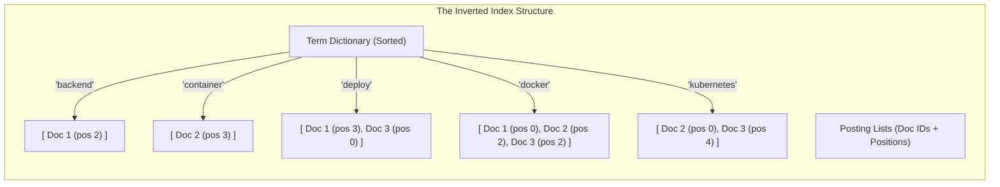
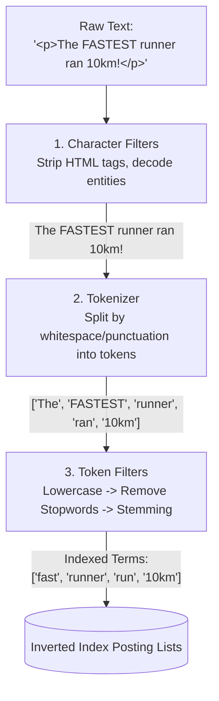
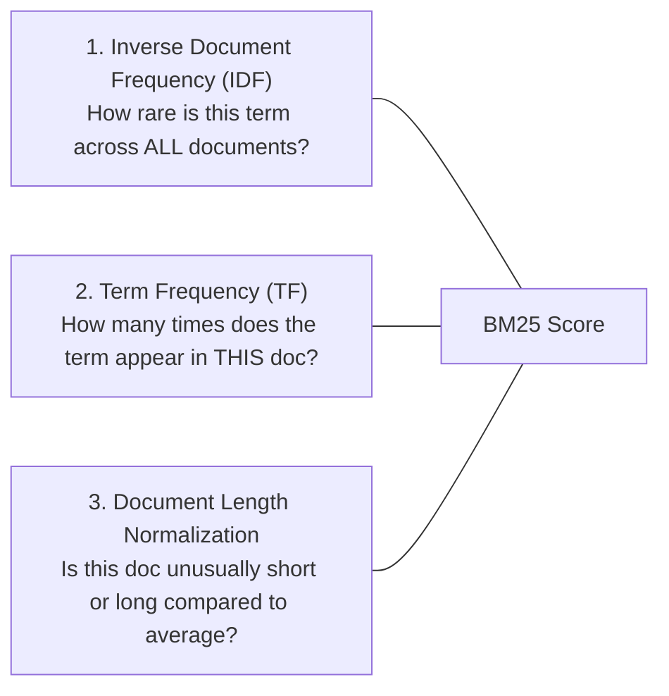
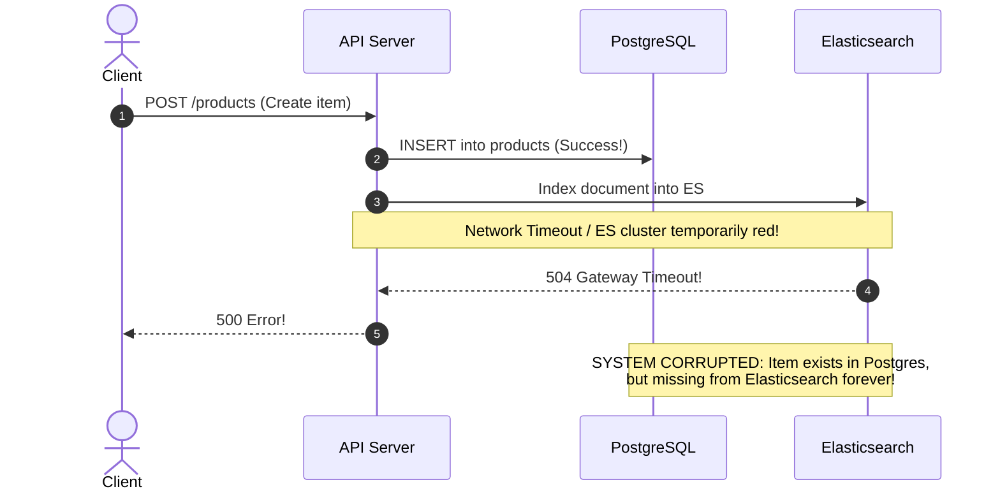
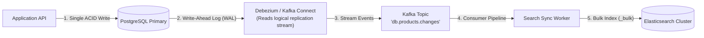

import { Tabs, Tab } from 'fumadocs-ui/components/tabs';
import { Callout } from 'fumadocs-ui/components/callout';

Every application starts with:
```sql
SELECT * FROM articles WHERE title LIKE '%postgres%';
```
And it works—until you hit 500,000 articles. Suddenly, queries take 4 seconds, CPU spikes to 100%, and users complain that searching for `"running shoes"` fails to match an article titled `"Best Run Shoe"`.

Relational databases were engineered for exact-match predicates and transactional consistency. Search engines like Elasticsearch (built on Apache Lucene) were engineered for **linguistic analysis, fuzzy matching, and statistical relevance ranking**.

---

## 1. Why SQL `LIKE` Fails at Scale

To understand why specialized search engines exist, we must examine why B-Tree indexes in relational databases surrender when searching natural text.

```text
B-Tree Index on "title" (Sorted alphabetically):
[ Apple ] -> [ Banana ] -> [ Cherry ] -> [ Date ] -> ... -> [ Zebra ]
```

1. **The Leading Wildcard Problem**: A B-Tree can execute an index range scan for `title LIKE 'post%'` because keys starting with `"post"` are physically clustered together. But when a user types `LIKE '%postgres%'`, the target string could appear anywhere. The database planner is forced to discard the index and execute a **Sequential Scan** ($O(N)$), reading every 8KB disk page in the table.
2. **Zero Linguistic Awareness**: SQL does not understand that `"running"`, `"ran"`, and `"runs"` share the root stem `"run"`.
3. **No Relevance Scoring**: An article mentioning `"postgres"` 50 times in a 200-word tutorial is ranked identically to a 10,000-word document that mentions `"postgres"` once in a footnote.
4. **Typo Intolerance**: A search for `"postgre"` returns zero matches.

---

## 2. Inverted Index Mechanics

Instead of mapping **Documents $\to$ Words**, an inverted index inverts the relationship: it maps **Words $\to$ Documents**.

Imagine we have three documents:
- **Doc 1**: "Docker simplifies backend deployments"
- **Doc 2**: "Kubernetes orchestrates Docker containers"
- **Doc 3**: "Deployments in Docker and Kubernetes"



### Fast Boolean Queries via Posting List Intersections

When a user searches for `"Docker AND Kubernetes"`:
1. Lookup `"docker"` in Term Dictionary $\to$ Posting List: `[1, 2, 3]`
2. Lookup `"kubernetes"` in Term Dictionary $\to$ Posting List: `[2, 3]`
3. Perform a linear intersection of the two sorted arrays using skip pointers:
   - Match: Doc 2
   - Match: Doc 3
4. Result: `[Doc 2, Doc 3]` in $O(M + N)$ time—taking microseconds across millions of documents.

---

## 3. The Lucene Analysis Pipeline

Text never enters the inverted index raw. It must pass through an **Analyzer**, composed of three sequential processing phases:



1. **Character Filters**: Transform the raw character stream (e.g. `html_strip` converts `<b>Hello</b>` to `Hello`).
2. **Tokenizer**: Breaks the stream into discrete tokens at word boundaries (e.g. `standard` tokenizer breaks on spaces and punctuation).
3. **Token Filters**: Modify, add, or delete tokens:
   - `lowercase`: Converts `FASTEST` $\to$ `fastest`.
   - `stop`: Drops low-information words like `the`, `is`, `at`.
   - `stemmer` (e.g. Porter or Snowball): Reduces inflected words to their root stem (`runner` $\to$ `runner`, `ran` $\to$ `run`, `fastest` $\to$ `fast`).
   - `synonym`: Expands terms (e.g., `quick` $\to$ `fast`).

---

## 4. Relevance Ranking: Demystifying BM25

When a query matches 10,000 documents, how does Elasticsearch decide which 10 appear on page one?

It uses **Okapi BM25** (Best Matching 25), a probabilistic relevance ranking algorithm based on three core signals:



### The BM25 Formula

$$\text{Score}(D, Q) = \sum_{i=1}^{n} \text{IDF}(q_i) \cdot \frac{f(q_i, D) \cdot (k_1 + 1)}{f(q_i, D) + k_1 \cdot \left(1 - b + b \cdot \frac{|D|}{\text{avgdl}}\right)}$$

Where:
- $f(q_i, D)$: Raw count of term $q_i$ in document $D$.
- $|D|$: Length of document $D$ in tokens.
- $\text{avgdl}$: Average length of all documents in the index.
- $k_1$ (typically `1.2`): **Term frequency saturation parameter**.
- $b$ (typically `0.75`): **Document length penalty parameter**.

### Why BM25 Beat Traditional TF-IDF: The Saturation Curve

In classic TF-IDF, term frequency scaled linearly or logarithmically without a ceiling: mentioning `"database"` 100 times scored roughly $5\times$ higher than mentioning it 20 times. This encouraged keyword stuffing.

In **BM25**, the term frequency curve asymptotically saturates at $k_1 + 1$:

```
Relevance
Score ^
      |                  /--- Classic TF-IDF (keeps climbing)
      |                /
      |    +----------+------- BM25 (Saturates at limit!)
      |   /
      |  /
      | /
      +------------------------------> Term Frequency (f)
```

Whether a document mentions the keyword 20 times or 200 times, the score bonus plateaus, prioritizing genuine relevance over repetitive spam.

---

## 5. Interactive Simulation: Inverted Index & Query Pipeline

Trace how two documents are analyzed, indexed, and queried:

<Tabs items={['Step 1: Raw Document Ingestion', 'Step 2: Token Pipeline Execution', 'Step 3: Inverted Index Storage', 'Step 4: Query Search & BM25 Scoring']}>
  <Tab value="Step 1: Raw Document Ingestion">
```text
[INGESTION EVENT]
Doc A (id: 1): "Building high-performance backend systems with Go"
Doc B (id: 2): "Mastering high-performance database queries in SQL"

Document metadata:
  Index: "articles"
  Field: "body" (type: text)
  Analyzer: "standard" with "english_stemmer"
```
  </Tab>

  <Tab value="Step 2: Token Pipeline Execution">
```text
[ANALYZER EXECUTION]
Doc A Token Transformation:
  1. Tokenize:   ["Building", "high", "performance", "backend", "systems", "with", "Go"]
  2. Lowercase:  ["building", "high", "performance", "backend", "systems", "with", "go"]
  3. Stopwords:  ["building", "high", "performance", "backend", "systems", "go"] ("with" removed)
  4. Stemmer:    ["build", "high", "perform", "backend", "system", "go"]

Doc B Token Transformation:
  1. Tokenize:   ["Mastering", "high", "performance", "database", "queries", "in", "SQL"]
  2. Lowercase:  ["mastering", "high", "performance", "database", "queries", "in", "sql"]
  3. Stopwords:  ["mastering", "high", "performance", "database", "queries", "sql"] ("in" removed)
  4. Stemmer:    ["master", "high", "perform", "databas", "queri", "sql"]
```
  </Tab>

  <Tab value="Step 3: Inverted Index Storage">
```text
[LUCENE SEGMENT INVERTED INDEX GENERATED]

Term Dictionary      | Posting List (DocID : Position)
-------------------------------------------------------
"backend"            | [ Doc 1 : pos 3 ]
"build"              | [ Doc 1 : pos 0 ]
"databas"            | [ Doc 2 : pos 3 ]
"go"                 | [ Doc 1 : pos 5 ]
"high"               | [ Doc 1 : pos 1, Doc 2 : pos 1 ]
"master"             | [ Doc 2 : pos 0 ]
"perform"            | [ Doc 1 : pos 2, Doc 2 : pos 2 ]
"queri"              | [ Doc 2 : pos 4 ]
"sql"                | [ Doc 2 : pos 5 ]
"system"             | [ Doc 1 : pos 4 ]
```
  </Tab>

  <Tab value="Step 4: Query Search & BM25 Scoring">
```text
[USER SEARCH QUERY: "high performance Go"]

1. Query Analyzed through identical pipeline:
   Tokens: ["high", "perform", "go"]

2. Posting List Matches:
   - "high":    Doc 1, Doc 2
   - "perform": Doc 1, Doc 2
   - "go":      Doc 1 (Rare term! High IDF score!)

3. Scoring Calculation:
   - Doc 1 matches 3/3 terms ("high", "perform", "go").
     "go" adds huge IDF weight because it appears in only 1 document.
     Doc 1 Total Score: 2.842
   - Doc 2 matches 2/3 terms ("high", "perform").
     Doc 2 Total Score: 0.914

Result: Doc 1 ranked #1, Doc 2 ranked #2.
```
  </Tab>
</Tabs>

---

## 6. The Dual-Store Architecture: Syncing PostgreSQL to Elasticsearch

In real-world architectures, PostgreSQL is your **Single Source of Truth (OLTP)** for ACID compliance, while Elasticsearch is your read-only **Search Secondary Index**.

### The Anti-Pattern: Application Dual-Writes



If your application writes to both systems in sequence, network timeouts or crashes will inevitably cause **silent data divergence**.

### The Solution: Change Data Capture (CDC) via Transactional Log



1. The API writes **only to PostgreSQL**. The transaction commits atomically.
2. PostgreSQL emits change events to its internal **Write-Ahead Log (WAL)** via logical replication.
3. **Debezium** tails the WAL without impacting database performance and publishes structured change events (`CREATE`, `UPDATE`, `DELETE`) to Apache Kafka.
4. An indexing worker consumes Kafka batches and writes bulk updates (`_bulk` API) to Elasticsearch.
5. If Elasticsearch experiences downtime, messages buffer safely in Kafka with zero data loss.

---

## 7. Production Elasticsearch Query Example

Here is a production-grade multi-match query with typo tolerance (fuzziness), exact phrase boosting, and BM25 tuning:

```json
POST /products/_search
{
  "query": {
    "bool": {
      "must": [
        {
          "multi_match": {
            "query": "wireless noise canceling headphone",
            "fields": [
              "title^3",       // 3x score multiplier for matches in title
              "brand^2",       // 2x score multiplier for matches in brand
              "description"    // 1x baseline score multiplier
            ],
            "type": "best_fields",
            "fuzziness": "AUTO:4,7", // Allow 1 typo for 4-7 char words, 2 typos for 8+ chars
            "prefix_length": 2,      // First 2 letters must match exactly
            "operator": "and"
          }
        }
      ],
      "filter": [
        { "term": { "status": "active" } },
        { "range": { "price": { "gte": 50.0, "lte": 500.0 } } }
      ]
    }
  },
  "highlight": {
    "fields": {
      "title": {},
      "description": {}
    }
  }
}
```

<Callout type="info" title="Why use `filter` clauses for non-text predicates?">
Clauses placed inside the `filter` block bypass relevance scoring entirely: they return a binary yes/no match. Because they do not compute BM25 scores, Elasticsearch automatically caches filter bitsets in memory, making them nearly instantaneous.
</Callout>

---

## Key Architecture Takeaways

1. **SQL `LIKE '%term%'` forces an $O(N)$ sequential scan**: B-Trees cannot utilize indexes with leading wildcards.
2. **Inverted Indexes invert document relations**: Mapping terms to posting lists enables multi-term search in microsecond array intersections.
3. **Analyzers make text searchable**: The triple-stage pipeline (Character Filter $\to$ Tokenizer $\to$ Token Filters) standardizes text, strips stopwords, and reduces words to root stems.
4. **BM25 prevents keyword stuffing**: The term frequency saturation curve ($k_1$) and document length normalization ($b$) rank documents by true semantic relevance.
5. **Never dual-write from application code**: Use the Transactional Outbox Pattern or Change Data Capture (CDC with Debezium) to synchronize PostgreSQL with Elasticsearch without split-brain corruption.
