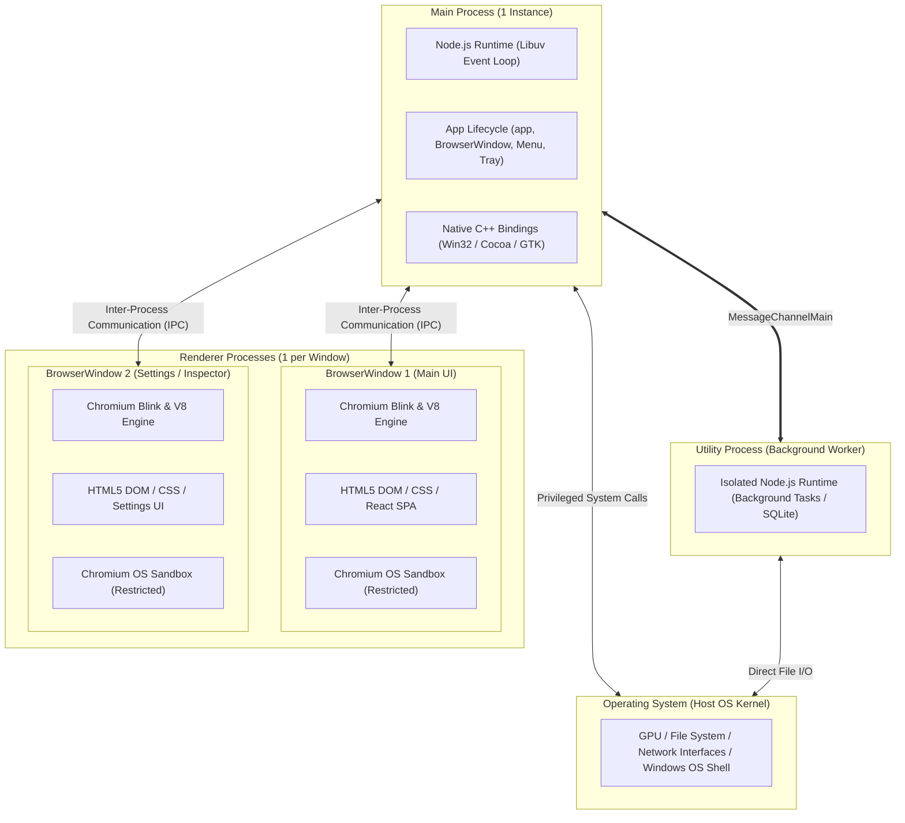
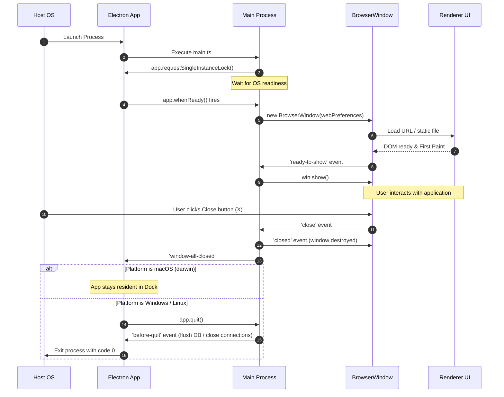
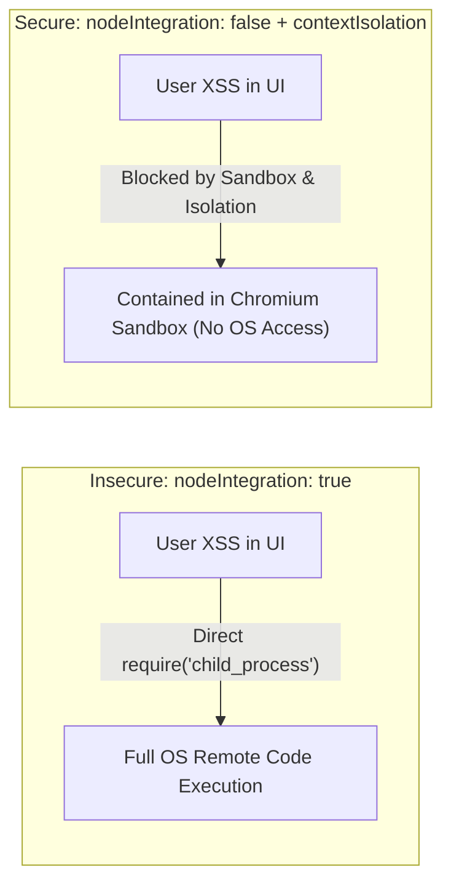

import { Callout } from 'fumadocs-ui/components/callout';
import { Tabs, Tab } from 'fumadocs-ui/components/tabs';
import { Steps, Step } from 'fumadocs-ui/components/steps';

In traditional desktop frameworks such as Qt (C++) or WPF (C#), an application typically executes inside a single monolithic operating system process. If a background rendering task encounters an unhandled memory fault, or a UI view corrupts its layout buffer, the entire application crashes immediately to the desktop.

Electron operates on an entirely different paradigm: the **Multi-Process Architecture**, inherited directly from Google Chromium. By separating user interface rendering from operating system privileged operations, Electron provides structural fault isolation and establishes critical security boundaries.

Understanding how these processes communicate, how they are sandboxed, and why legacy practices like `nodeIntegration: true` created catastrophic security vulnerabilities is the foundation of professional desktop engineering.

---

## 1. Chromium's Multi-Process Foundation

When Google designed Chromium in 2008, the central engineering insight was that web browsers had become operating systems in their own right, running complex, untrusted web applications. To prevent a bug in one tab from crashing the entire browser, Chromium isolated each tab, plugin, and GPU pipeline into separate OS processes.

Electron adopts this exact architecture, dividing responsibilities into distinct execution contexts:



### The Architectural Separation of Powers

| Process Type | Count | Runtime Engine | Capabilities & Access | Primary Responsibility |
| :--- | :--- | :--- | :--- | :--- |
| **Main Process** | Exactly **1** per running app | Full Node.js + Libuv | Full OS kernel access, filesystem, networking, native menus, windows | Orchestrates app lifecycle, creates windows, manages native desktop integrations |
| **Renderer Process** | **1 or more** (1 per `BrowserWindow` or `<webview>`) | Chromium Blink + V8 | Sandboxed web environment; **Zero direct OS or Node.js access** | Renders HTML/CSS/JavaScript UI, handles user clicks, displays graphics |
| **Preload Script** | 1 per `BrowserWindow` | Hybrid Context | Limited Electron API access (`contextBridge`, `ipcRenderer`); DOM accessible | Acts as a secure, hardened firewall bridging Renderer and Main processes |
| **Utility Process** | 0 or more (on-demand) | Full Node.js without GUI | Full filesystem and Node.js access, no DOM / Blink engine | Offloads CPU-intensive computation, SQLite queries, or data parsing from Main |

---

## 2. The Main Process: The Application Engine

The **Main Process** is the entry point of your desktop application. It is defined by the `"main"` field in your `package.json` (e.g., `dist/main/index.js`).

### Core Responsibilities
1. **Window Management**: Instantiating, resizing, positioning, and closing `BrowserWindow` instances.
2. **Application Lifecycle**: Handling OS startup hooks, single-instance locking, quit signals, and system sleep/wake events.
3. **Native Desktop APIs**: Configuring native menu bars, dock/taskbar icons, system trays, native file choosers, and global keyboard shortcuts.
4. **IPC Hub**: Serving as the secure message coordinator that receives requests from renderers, validates parameters, performs privileged operations, and replies.

### Production Main Process Structure

Here is a production-ready, hardened main process entry point written in modern TypeScript:

```typescript
// src/main/main.ts
import { app, BrowserWindow, shell, session } from 'electron';
import path from 'node:path';

// Enforce single instance lock to prevent duplicate app instances
const gotTheLock = app.requestSingleInstanceLock();

if (!gotTheLock) {
  // Another instance is already running; terminate this one immediately
  app.quit();
} else {
  let mainWindow: BrowserWindow | null = null;

  // When another instance attempts to launch, focus our existing window
  app.on('second-instance', () => {
    if (mainWindow) {
      if (mainWindow.isMinimized()) mainWindow.restore();
      mainWindow.focus();
    }
  });

  function createMainWindow(): BrowserWindow {
    const win = new BrowserWindow({
      width: 1280,
      height: 800,
      minWidth: 800,
      minHeight: 600,
      show: false, // Prevent white flash before rendering is ready
      backgroundColor: '#0f172a',
      webPreferences: {
        // ── MANDATORY SECURITY SETTINGS ──
        contextIsolation: true,       // Run preload in isolated execution context
        nodeIntegration: false,       // Prohibit Node.js execution in renderer DOM
        sandbox: true,                // Enable OS-level Chromium sandboxing
        preload: path.join(__dirname, '../preload/preload.js'),
        
        // ── DEFENSE-IN-DEPTH HARDENING ──
        webSecurity: true,            // Enforce Same-Origin Policy
        allowRunningInsecureContent: false, // Disallow HTTP assets on HTTPS pages
        plugins: false,               // Disable legacy NPAPI / PPAPI plugins
        experimentalFeatures: false,  // Disable unstable Chromium experimental flags
      },
    });

    // Graceful presentation: show only when first paint is ready
    win.once('ready-to-show', () => {
      win.show();
    });

    // Handle unexpected renderer process termination (crash or OOM kill)
    win.webContents.on('render-process-gone', (_event, details) => {
      console.error(`Renderer crashed: reason=${details.reason}, exitCode=${details.exitCode}`);
      // In production: log to telemetry (Sentry) and optionally reload or show recovery UI
    });

    // Prevent navigation hijacking: block external link navigation inside our app window
    win.webContents.on('will-navigate', (event, navigationUrl) => {
      const parsedUrl = new URL(navigationUrl);
      const isLocal = parsedUrl.origin === 'http://localhost:5173' || parsedUrl.protocol === 'file:';
      if (!isLocal) {
        event.preventDefault();
        shell.openExternal(navigationUrl); // Open in user's default OS browser
      }
    });

    // Prevent opening unauthorized popup windows
    win.webContents.setWindowOpenHandler(({ url }) => {
      try {
        const parsed = new URL(url);
        if (parsed.protocol === 'https:' || parsed.protocol === 'http:') {
          shell.openExternal(url);
        }
      } catch (err) {
        console.warn(`Malformed URL blocked: ${url}`);
      }
      return { action: 'deny' }; // Always deny creating new Electron browser windows
    });

    // Load the UI: Vite dev server in development, compiled static HTML in production
    if (process.env.NODE_ENV === 'development') {
      win.loadURL('http://localhost:5173');
      win.webContents.openDevTools({ mode: 'detach' });
    } else {
      win.loadFile(path.join(__dirname, '../renderer/index.html'));
    }

    return win;
  }

  // Application Lifecycle Handlers
  app.whenReady().then(() => {
    // Configure strict Content Security Policy (CSP) on all sessions
    session.defaultSession.webRequest.onHeadersReceived((details, callback) => {
      callback({
        responseHeaders: {
          ...details.responseHeaders,
          'Content-Security-Policy': [
            "default-src 'self'; script-src 'self'; style-src 'self' 'unsafe-inline'; img-src 'self' data: https:; font-src 'self' data:; connect-src 'self' https:;"
          ],
        },
      });
    });

    mainWindow = createMainWindow();

    // macOS specific behavior: re-create window when dock icon is clicked
    app.on('activate', () => {
      if (BrowserWindow.getAllWindows().length === 0) {
        mainWindow = createMainWindow();
      }
    });
  });

  // Quit when all windows are closed, except on macOS (where apps stay open until Cmd+Q)
  app.on('window-all-closed', () => {
    if (process.platform !== 'darwin') {
      app.quit();
    }
  });

  // Perform clean shutdown of database handles, background sockets, or temp files
  app.on('before-quit', () => {
    console.log('Application shutting down gracefully...');
  });
}
```

---

## 3. The Lifecycle of an Electron Application

Managing desktop lifecycles requires handling events across both the OS-level host application and individual window instances:



<Callout type="warning" title="Platform Distinction: darwin vs win32">
On macOS (`darwin`), closing all application windows does **not** terminate the application. The menu bar remains active in the top bar, and the dock icon retains its running indicator dot. Clicking the dock icon triggers the `app.on('activate')` event, which must instantiate a new `BrowserWindow`. On Windows (`win32`) and Linux, closing the last window must quit the process via `app.quit()`.
</Callout>

---

## 4. The Renderer Process: The Presentation Sandbox

Each `BrowserWindow` contains a **Renderer Process**. The Renderer runs an embedded Chromium browser engine (Blink for rendering and layout, V8 for JavaScript execution).

### What the Renderer Has Access To
- Full HTML5 DOM (`document`, `window`, WebGL, Canvas, Web Workers, IndexedDB).
- Modern web frontend frameworks (React 19, Next.js static exports, Vue 3, Svelte, Tailwind CSS).
- Browser Web APIs (`fetch`, `crypto.subtle`, `AudioContext`, `ResizeObserver`).
- The custom bridge object exposed securely by the preload script (e.g., `window.electronAPI`).

### What the Renderer Does NOT Have Access To (in Secure Apps)
- Direct filesystem APIs (`node:fs`, `node:path`).
- Operating system execution primitives (`node:child_process`, `node:os`).
- Direct Electron native objects (`BrowserWindow`, `dialog`, `Menu`, `app`).
- Raw sockets or native C++ modules.

---

## 5. Security Vulnerabilities: Why nodeIntegration=false is Mandatory

To understand modern Electron security, you must understand the historical design catastrophe of `nodeIntegration: true`.

### The Catastrophic RCE Exploit Scenario

In early versions of Electron, developers frequently set `nodeIntegration: true` to allow writing code like this inside a web component:

```javascript
// ❌ INSECURE ANTI-PATTERN (NEVER DO THIS)
const fs = require('fs');
const { exec } = require('child_process');

function exportReport() {
  fs.writeFileSync('C:\\Users\\User\\Desktop\\report.txt', 'data');
}
```

While convenient for prototyping, consider what happens when your application displays content from external or user-controlled sources:
- Rendering a markdown comment containing ``
- Loading an external webpage inside a webview or iframe
- Displaying an RSS feed, chat message, or file preview

If an attacker injects an **XSS (Cross-Site Scripting)** payload into your UI, look at what they could execute when `nodeIntegration: true` is enabled:

```html
<!-- Malicious payload delivered via chat message, markdown, or profile name -->

```

Because the renderer possessed unrestricted access to Node.js, an XSS flaw was not merely a browser session cookie theft—it was **an instantaneous, full remote takeover of the user's host operating system**.



### Why contextIsolation=true is Non-Negotiable

Even if you set `nodeIntegration: false`, if you set `contextIsolation: false`, the preload script and the web page share the **same V8 JavaScript heap and prototype chain**.

In this un-isolated state, malicious code in the web page can perform a **Prototype Pollution / Prototype Hijacking Attack**:

```javascript
// Attacker overrides Array.prototype.push or Object.prototype before preload executes
Array.prototype.push = function (...args) {
  // Intercept data passed from privileged preload script
  sendToAttackerServer(args);
  return originalPush.apply(this, args);
};
```

When `contextIsolation: true` is enabled, Chromium instantiates two completely disjoint V8 contexts for the same frame:
1. **Isolated World**: Where the preload script executes.
2. **Main World**: Where the website scripts and UI framework execute.

Even if an attacker modifies built-in prototypes (`Object.prototype`, `Array.prototype`, `Function.prototype`) in the Main World, the changes have zero effect on the Isolated World running the preload script.

---

## 6. Chromium OS Sandboxing

Modern Electron applications should always set `sandbox: true` in `webPreferences`.

When sandboxing is active:
1. The Renderer process is executed under operating system sandbox profiles (e.g., Windows AppContainer / Integrity Levels, macOS Sandbox Seatbelt, Linux seccomp BPF filters).
2. The operating system kernel directly prohibits the renderer process from opening arbitrary file descriptors, querying hardware, or binding to raw network ports.
3. The only way the renderer can access system data is by asking the Main Process over IPC.

<Callout type="info" title="Defense in Depth: The Four Pillars of Electron Security">
1. **`contextIsolation: true`**: Isolates preload script scope from the renderer DOM scope.
2. **`nodeIntegration: false`**: Completely removes `require`, `process`, and `Buffer` from the renderer.
3. **`sandbox: true`**: Instructs the OS kernel to restrict the renderer process permissions.
4. **Strict Content Security Policy (CSP)**: Disallows `eval()`, inline scripts, and unauthorized remote domains.
</Callout>

In the next chapter, **[02. Secure IPC Communication](/docs/full-stack-development/electron-desktop/02-secure-ipc-communication)**, we will explore how to build a cryptographic, type-safe communication channel across these hardened process boundaries.
