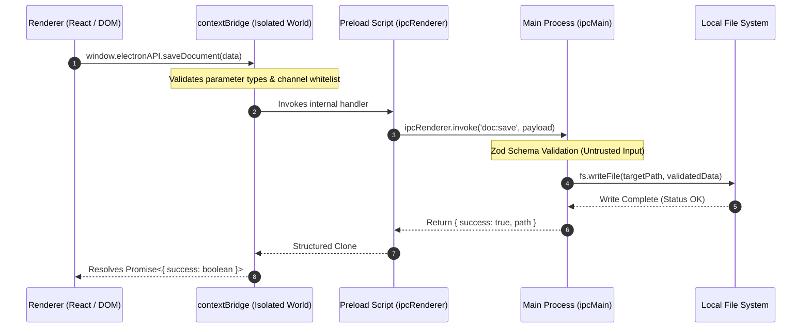
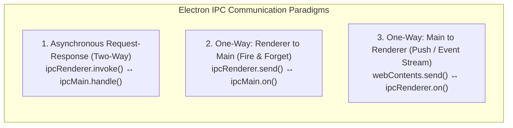

import { Callout } from 'fumadocs-ui/components/callout';
import { Tabs, Tab } from 'fumadocs-ui/components/tabs';
import { Steps, Step } from 'fumadocs-ui/components/steps';

In a secure Electron application, the Renderer process is sandboxed and completely blind to the underlying operating system. It cannot write files, access databases, or spawn child processes. To perform any privileged operation, the Renderer must send a request across the process chasm to the Main Process.

This mechanism is **Inter-Process Communication (IPC)**.

Because IPC is the **sole gateway** between untrusted UI code and privileged OS execution, designing and hardening IPC channels is one of the most critical responsibilities of a desktop systems engineer. In this guide, we will analyze modern IPC patterns, understand how `contextBridge` stops prototype tampering, and build an end-to-end type-safe IPC contract with TypeScript and Zod.

---

## 1. The IPC Security Boundary

In older Electron tutorials, developers often wrote:

```javascript
// ❌ CRITICAL SECURITY VULNERABILITY (DO NOT USE)
// In preload.js:
window.ipcRenderer = require('electron').ipcRenderer;
```

Exposing raw `ipcRenderer` directly onto the global `window` object completely destroys your security boundary. If an attacker discovers an XSS vector in the UI, having raw `ipcRenderer` allows them to send arbitrary IPC messages on any channel, invoke undocumented handlers, and attach listeners to spy on system events.

The modern standard relies on **Preload Scripts** coupled with **`contextBridge.exposeInMainWorld`**:



### Why `contextBridge` is Mandatory

When `contextIsolation: true` is enabled, Chromium isolates the Preload script and the Renderer into separate V8 contexts. But how do you share an API between them without allowing the Renderer to tamper with it?

If you simply attach an object:
```javascript
// ❌ WRONG: Renderer can modify or prototype-pollute this object
window.myAPI = { saveFile: () => ipcRenderer.invoke(...) };
```
The renderer could override `saveFile.prototype` or mutate internal helper methods.

**`contextBridge.exposeInMainWorld`** solves this by:
1. Deeply cloning data across the boundary using the **Structured Clone Algorithm**.
2. Ensuring that functions exposed across the bridge cannot have their prototypes tampered with by the receiving context.
3. Preventing object reference leaks that could let the renderer access the preload script's execution scope.

---

## 2. The Three Fundamental IPC Patterns

Electron provides three core IPC mechanisms. Choosing the correct pattern depends on message directionality and whether a response is required.



### Pattern 1: Asynchronous Two-Way (Request-Response)

This is the **primary pattern** in modern desktop apps. The renderer invokes a command, and the main process asynchronously returns a value or throws an error.

- **Renderer**: `ipcRenderer.invoke(channel, ...args): Promise<Result>`
- **Main**: `ipcMain.handle(channel, async (event, ...args) => Result)`

```typescript
// Main Process Handler
ipcMain.handle('system:get-disk-space', async (_event, drivePath: string) => {
  const stats = await checkDiskUsage(drivePath);
  return stats; // Automatically serialized back to the caller
});

// Preload Script Exposure
contextBridge.exposeInMainWorld('systemAPI', {
  getDiskSpace: (path: string) => ipcRenderer.invoke('system:get-disk-space', path),
});

// Renderer Execution
const usage = await window.systemAPI.getDiskSpace('C:');
console.log(`Free space: ${usage.freeGB} GB`);
```

<Callout type="info" title="Automatic Error Propagation">
When an error is thrown inside `ipcMain.handle()`, Electron serializes the exception message and rejects the Promise returned by `ipcRenderer.invoke()` in the renderer. The UI can handle it cleanly using standard `try/catch` blocks.
</Callout>

### Pattern 2: One-Way Renderer to Main (Fire-and-Forget)

Used when the renderer wants to notify the main process of an action but **does not care about a reply or error state** (e.g., UI telemetry, window minimize request, analytics ping).

- **Renderer**: `ipcRenderer.send(channel, ...args): void`
- **Main**: `ipcMain.on(channel, (event, ...args) => void)`

```typescript
// Renderer asks to minimize window
window.windowAPI.minimizeWindow();

// Main executes window operation
ipcMain.on('window:minimize', (event) => {
  const win = BrowserWindow.fromWebContents(event.sender);
  win?.minimize();
});
```

### Pattern 3: One-Way Main to Renderer (Push Notifications & Events)

Used when the operating system or main process needs to stream data or push asynchronous events to the UI (e.g., auto-updater download progress, network status changes, file watcher updates).

- **Main**: `mainWindow.webContents.send(channel, ...args): void`
- **Preload/Renderer**: `ipcRenderer.on(channel, (event, ...args) => void)`

```typescript
// Main Process: Emits download progress
autoUpdater.on('download-progress', (progressObj) => {
  mainWindow.webContents.send('updater:progress', progressObj.percent);
});
```

<Callout type="error" title="Never Use Synchronous IPC (ipcRenderer.sendSync)">
`ipcRenderer.sendSync()` halts the entire Chromium rendering thread until the Main process finishes executing and responds. This **freezes the application UI**, drops frames, locks CSS animations, and creates a terrible user experience. It must never be used in production.
</Callout>

---

## 3. Memory Leaks: Proper Listener Cleanup

When listening to push events from the main process (`webContents.send`), forgetting to remove listeners when React or Vue components unmount causes **severe memory leaks**.

Every time a component mounts, a new callback is attached to `ipcRenderer`. If the user navigates between views 20 times, 20 duplicate callbacks fire for every incoming message.

### The Correct Cleanup Subscription Pattern

Expose an unsubscription function from your preload script:

```typescript
// In src/preload/preload.ts
contextBridge.exposeInMainWorld('electronAPI', {
  onUpdateProgress: (callback: (percent: number) => void) => {
    const subscription = (_event: Electron.IpcRendererEvent, percent: number) => {
      callback(percent);
    };
    ipcRenderer.on('updater:progress', subscription);

    // Return a disposable cleanup function!
    return () => {
      ipcRenderer.removeListener('updater:progress', subscription);
    };
  },
});
```

Now, in your React component, bind it directly to `useEffect`:

```tsx
// In src/renderer/components/UpdateModal.tsx
import React, { useEffect, useState } from 'react';

export function UpdateModal() {
  const [progress, setProgress] = useState(0);

  useEffect(() => {
    // Subscribe and receive cleanup teardown
    const unsubscribe = window.electronAPI.onUpdateProgress((percent) => {
      setProgress(percent);
    });

    // Cleanup executes automatically on unmount!
    return () => {
      unsubscribe();
    };
  }, []);

  return <div>Downloading update: {progress}%</div>;
}
```

---

## 4. End-to-End Type-Safe IPC Contract with TypeScript

In a large enterprise codebase, IPC channel names should never be raw strings like `'save-file'`. A typo in a string causes silent failures.

We will design a **fully type-safe contract architecture** across three files:
1. `shared/types/ipc.ts` (shared contract definitions)
2. `preload/preload.ts` (typed context bridge)
3. `main/ipc-handlers.ts` (type-safe handler registry with Zod input validation)

### Step 1: Define the Shared Contract

```typescript
// src/shared/types/ipc.ts
export interface DocumentSaveRequest {
  filename: string;
  content: string;
  encoding?: 'utf-8' | 'base64';
}

export interface DocumentSaveResponse {
  success: boolean;
  absolutePath: string;
  sizeBytes: number;
}

export interface SystemMetrics {
  cpuUsagePercent: number;
  freeMemoryMB: number;
  totalMemoryMB: number;
}

// Map each channel name to its exact Request and Response types
export interface IpcContract {
  'doc:save': {
    request: DocumentSaveRequest;
    response: DocumentSaveResponse;
  };
  'system:get-metrics': {
    request: void;
    response: SystemMetrics;
  };
}

export type IpcChannel = keyof IpcContract;
```

### Step 2: Implement the Preload Bridge

```typescript
// src/preload/preload.ts
import { contextBridge, ipcRenderer } from 'electron';
import type { IpcContract, DocumentSaveRequest, DocumentSaveResponse, SystemMetrics } from '../shared/types/ipc';

// Define the strongly-typed API interface exposed to the window object
export interface DesktopAPI {
  saveDocument: (req: DocumentSaveRequest) => Promise<DocumentSaveResponse>;
  getMetrics: () => Promise<SystemMetrics>;
  onThemeChanged: (callback: (theme: 'dark' | 'light') => void) => () => void;
}

const api: DesktopAPI = {
  saveDocument: (req) => {
    return ipcRenderer.invoke('doc:save', req);
  },
  getMetrics: () => {
    return ipcRenderer.invoke('system:get-metrics');
  },
  onThemeChanged: (callback) => {
    const listener = (_event: Electron.IpcRendererEvent, theme: 'dark' | 'light') => callback(theme);
    ipcRenderer.on('system:theme-changed', listener);
    return () => ipcRenderer.removeListener('system:theme-changed', listener);
  },
};

// Expose API into the isolated world
contextBridge.exposeInMainWorld('desktopAPI', api);
```

### Step 3: Extend the Global Window Interface

To ensure full autocomplete and type-checking in your React / Vite renderer:

```typescript
// src/renderer/global.d.ts
import type { DesktopAPI } from '../preload/preload';

declare global {
  interface Window {
    desktopAPI: DesktopAPI;
  }
}

export {};
```

### Step 4: Implement Validated Handlers in the Main Process

Always treat IPC arguments like untrusted incoming HTTP API requests. A compromised renderer could invoke `'doc:save'` with malicious or unexpected parameters. Use **Zod** to validate every payload:

```typescript
// src/main/ipc-handlers.ts
import { ipcMain, app } from 'electron';
import fs from 'node:fs/promises';
import path from 'node:path';
import os from 'node:os';
import { z } from 'zod';
import type { DocumentSaveResponse, SystemMetrics } from '../shared/types/ipc';

// 1. Zod schema for input validation
const DocumentSaveSchema = z.object({
  filename: z.string().min(1).max(255).regex(/^[\w\-. ]+$/, 'Invalid filename characters'),
  content: z.string(),
  encoding: z.enum(['utf-8', 'base64']).default('utf-8'),
});

export function registerIpcHandlers(): void {
  // Handler for 'doc:save'
  ipcMain.handle('doc:save', async (_event, rawInput: unknown): Promise<DocumentSaveResponse> => {
    // Validate input against schema
    const parseResult = DocumentSaveSchema.safeParse(rawInput);
    if (!parseResult.success) {
      throw new Error(`Validation failed: ${parseResult.error.issues.map(i => i.message).join(', ')}`);
    }

    const { filename, content, encoding } = parseResult.data;
    
    // Confine output safely within user documents directory
    const documentsDir = app.getPath('documents');
    const destinationPath = path.join(documentsDir, filename);

    // Prevent directory traversal attacks
    if (!destinationPath.startsWith(documentsDir)) {
      throw new Error('Access denied: Path traversal detected');
    }

    const buffer = Buffer.from(content, encoding);
    await fs.writeFile(destinationPath, buffer);

    return {
      success: true,
      absolutePath: destinationPath,
      sizeBytes: buffer.byteLength,
    };
  });

  // Handler for 'system:get-metrics'
  ipcMain.handle('system:get-metrics', async (): Promise<SystemMetrics> => {
    const freeMem = Math.round(os.freemem() / (1024 * 1024));
    const totalMem = Math.round(os.totalmem() / (1024 * 1024));
    
    return {
      cpuUsagePercent: 12.5, // Computed via os.cpus() diffing in production
      freeMemoryMB: freeMem,
      totalMemoryMB: totalMem,
    };
  });
}
```

---

## 5. Structured Clone Algorithm & IPC Serialization Limits

When data travels over Electron's IPC bridge, it is serialized using the V8 **Structured Clone Algorithm**.

| Data Type | Support Status | Behavior |
| :--- | :--- | :--- |
| **Primitives** (string, number, boolean, null, undefined) | ✅ Full | Cloned by value accurately |
| **Plain Objects & Arrays** | ✅ Full | Deeply cloned recursively |
| **TypedArrays & ArrayBuffer** | ✅ Full | Cloned (or transferred for zero-copy efficiency) |
| **Date, RegExp, Map, Set** | ✅ Full | Re-instantiated with identical values |
| **Error objects** | ⚠️ Partial | Serializes `message`, `stack`, `name`; custom properties may be lost |
| **Functions & Methods** | ❌ **Unsupported** | Causes `DOMException: could not be cloned` |
| **DOM Elements (`HTMLElement`)** | ❌ **Unsupported** | Cannot cross process boundaries |
| **Node.js `Buffer`** | ⚠️ Caution | Converted to Uint8Array; avoid passing raw Node Buffers through `contextBridge` |

<Callout type="tip" title="Passing Large Binary Payloads">
For high-throughput binary transmission (e.g., video frames or raw audio samples), pass `ArrayBuffer` objects or use `MessagePort` with transferables (`postMessage(msg, [buffer])`) to transfer buffer ownership without memory copying overhead.
</Callout>

In the next chapter, **[03. Local Database with SQLite](/docs/full-stack-development/electron-desktop/03-local-database-sqlite)**, we will integrate high-performance embedded persistence using `better-sqlite3` and learn how to offload heavy queries to dedicated worker processes.
