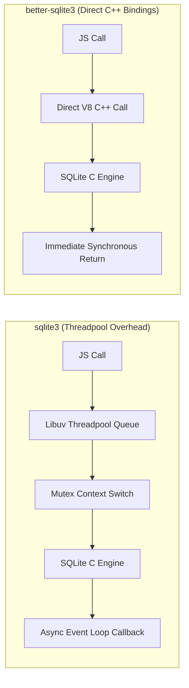
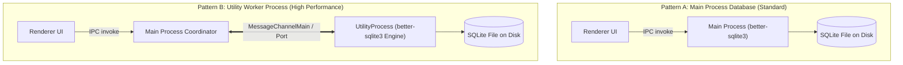
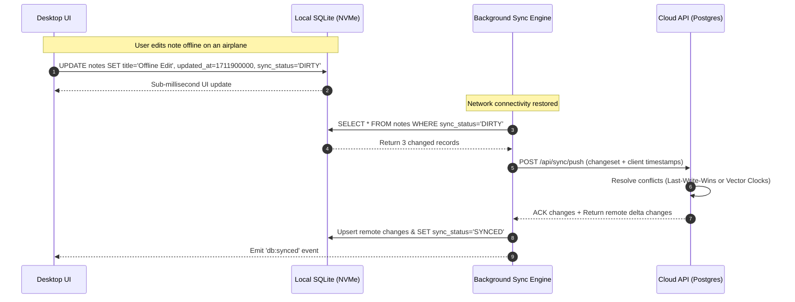

import { Callout } from 'fumadocs-ui/components/callout';
import { Tabs, Tab } from 'fumadocs-ui/components/tabs';
import { Steps, Step } from 'fumadocs-ui/components/steps';

A primary advantage of desktop engineering over web applications is the ability to persist gigabytes of data locally with sub-millisecond query access. While web applications rely on constrained in-browser storage engines like IndexedDB or round-trip HTTP latency to remote cloud databases, desktop applications can embed a full relational database engine directly on disk.

For desktop applications, **SQLite** is the industry standard. Powering desktop clients from Spotify and Slack to Apple Photos and VS Code, SQLite is an in-process, zero-configuration, ACID-compliant SQL engine.

In the Node.js and Electron ecosystem, **`better-sqlite3`** is the gold standard driver. In this masterclass, we will explore why `better-sqlite3` outperforms asynchronous alternatives, configure mission-critical Write-Ahead Logging (WAL) pragmas, evaluate process architectures (Main Process vs. `utilityProcess`), execute atomic schema migrations, and design cloud synchronization pipelines.

---

## 1. Why `better-sqlite3` over `sqlite3` or IndexedDB?

Developers coming from the web often ask: *Why not just use IndexedDB inside the Chromium renderer?*

| Feature | Browser IndexedDB | Traditional `sqlite3` (Async) | `better-sqlite3` (Sync Native) |
| :--- | :--- | :--- | :--- |
| **Storage Engine** | Browser LevelDB / SQLite | Native SQLite3 C API | Native SQLite3 C API |
| **Execution Context** | Renderer DOM thread | Node.js Threadpool (Libuv) | Node.js Main or Utility Thread |
| **API Paradigm** | Async Promises / Events | Async Callbacks | **Synchronous execution** |
| **Throughput (Ops/sec)** | ~1,500 – 5,000 ops/s | ~12,000 – 25,000 ops/s | **100,000+ ops/sec** |
| **Query Expressiveness** | No SQL (Object store keys) | Full SQL-92 | Full SQL-92 + FTS5 Full Text Search |
| **Prepared Statements** | None | Yes | **Pre-compiled V8 cached statements** |
| **Transaction Latency** | High overhead | Callback queue overhead | **In-memory C++ lock (0.01ms)** |

### The Synchronous Paradox

In web servers handling 10,000 concurrent network requests, synchronous database queries block the event loop and destroy concurrency. 

However, in a desktop application, disk I/O against local NVMe SSDs takes microseconds (`< 0.05ms`). Wrapping every tiny query in an asynchronous Libuv threadpool hop (as `sqlite3` does) introduces context switching, thread synchronization locks, and callback serialization overhead that is **slower than running the query directly**.

`better-sqlite3` runs synchronously in C++, eliminating all async abstraction penalties.



---

## 2. Compiling Native Modules: The Electron ABI Challenge

`better-sqlite3` contains compiled C++ code. Because Node.js and Electron use different internal V8 engines and Application Binary Interfaces (ABI), a binary compiled for your system's Node.js (`v20.x`) will crash with a `NODE_MODULE_VERSION` mismatch when loaded by Electron.

### Solution: Rebuilding Against Electron

To compile `better-sqlite3` for Electron's exact internal ABI:

<Tabs items={['npm / yarn', 'electron-builder', 'electron-rebuild']}>
  <Tab value="npm / yarn">
    ```bash
    # Install dependencies
    npm install better-sqlite3
    npm install --save-dev electron-rebuild

    # Rebuild native modules against installed Electron version
    npx electron-rebuild -f -w better-sqlite3
    ```
  </Tab>
  <Tab value="electron-builder">
    ```json
    // In package.json scripts:
    {
      "scripts": {
        "postinstall": "electron-builder install-app-deps"
      }
    }
    ```
    `electron-builder install-app-deps` automatically detects all native C++ dependencies and recompiles them against the Electron version specified in your project.
  </Tab>
  <Tab value="electron-rebuild">
    ```bash
    # Targeted command for specific architecture (e.g. Apple Silicon arm64 or Windows x64)
    npx @electron/rebuild --version 30.0.0 --arch arm64
    ```
  </Tab>
</Tabs>

---

## 3. High-Performance SQLite Configuration (Pragmas)

Out of the box, SQLite is tuned for conservative safety across ancient hardware, using traditional rollback journals. To maximize throughput on modern desktop SSDs, you must initialize your database with performance-tuned PRAGMAs:

```typescript
// src/main/db/connection.ts
import Database from 'better-sqlite3';
import path from 'node:path';
import { app } from 'electron';

export function initializeDatabase(): Database.Database {
  // Store database inside OS user data directory
  const dbPath = path.join(app.getPath('userData'), 'app-database.sqlite');
  
  const db = new Database(dbPath, {
    // verbose: console.log // Enable for SQL query debugging
  });

  // 1. Enable Write-Ahead Logging (WAL)
  // WAL allows concurrent readers to read simultaneously while a write is occurring!
  db.pragma('journal_mode = WAL');

  // 2. Synchronous mode: NORMAL
  // In WAL mode, NORMAL is completely crash-safe and prevents slow fsync() disk flushes
  db.pragma('synchronous = NORMAL');

  // 3. Enforce Foreign Key integrity constraints
  db.pragma('foreign_keys = ON');

  // 4. Memory cache size (negative value specifies memory in Kilobytes, e.g., 64MB)
  db.pragma('cache_size = -64000');

  // 5. Memory-mapped I/O (up to 256MB mmap for lightning-fast reads)
  db.pragma('mmap_size = 268435456');

  // 6. Store temporary tables and indexes in RAM instead of disk
  db.pragma('temp_store = MEMORY');

  return db;
}
```

<Callout type="tip" title="Why WAL Mode is Mandatory">
In default Rollback Journal mode, any write operation locks the entire database file, causing subsequent reads to block. In **WAL Mode**, writes append to a separate `-wal` file. Readers continue reading the main database concurrently without waiting for the writer, completely preventing UI stutter.
</Callout>

---

## 4. Architectural Choice: Main Process vs. Utility Process

Where should the database connection live? There are two primary architectural patterns:



### Pattern A: Main Process (Simple & Direct)
- **Best for**: 90% of desktop apps with standard query loads (fetching 100 rows, updating settings, saving a document).
- **Pros**: Simplest implementation; no secondary IPC serialization hops.
- **Cons**: A poorly written `SELECT *` across 500,000 rows can stall the Main Process event loop for 100ms, causing dropped window frames or lagging menu clicks.

### Pattern B: `utilityProcess` Worker (Enterprise / Heavy Data)
- **Best for**: Vector embeddings search, full-text search indexing, local ETL, bulk CSV imports, financial data charting.
- **Pros**: Zero possibility of blocking the Main process or UI thread; crash isolation.
- **Cons**: Slightly higher IPC setup complexity via `MessagePort`.

### Implementing the `utilityProcess` Architecture

Electron's `utilityProcess` API spawns a lightweight child process with full Node.js capabilities:

```typescript
// src/main/workers/db-worker.ts
// This file executes inside an isolated Node.js utility process
import Database from 'better-sqlite3';
import { parentPort } from 'node:worker_threads'; // Electron maps parentPort automatically

let db: Database.Database | null = null;

// Listen for messages from the Main Process
process.parentPort.on('message', (event) => {
  const { id, action, payload } = event.data;

  try {
    switch (action) {
      case 'INIT': {
        db = new Database(payload.dbPath);
        db.pragma('journal_mode = WAL');
        process.parentPort.postMessage({ id, success: true });
        break;
      }

      case 'QUERY': {
        if (!db) throw new Error('Database not initialized');
        const stmt = db.prepare(payload.sql);
        const rows = payload.params ? stmt.all(payload.params) : stmt.all();
        process.parentPort.postMessage({ id, success: true, data: rows });
        break;
      }

      case 'EXECUTE': {
        if (!db) throw new Error('Database not initialized');
        const stmt = db.prepare(payload.sql);
        const info = payload.params ? stmt.run(payload.params) : stmt.run();
        process.parentPort.postMessage({ id, success: true, data: info });
        break;
      }

      default:
        throw new Error(`Unknown action: ${action}`);
    }
  } catch (error: any) {
    process.parentPort.postMessage({ id, success: false, error: error.message });
  }
});
```

Spawning the worker from the Main Process:

```typescript
// src/main/db/db-client.ts
import { utilityProcess, app } from 'electron';
import path from 'node:path';

class DatabaseClient {
  private worker: Electron.UtilityProcess | null = null;
  private requestId = 0;
  private pendingRequests = new Map<number, { resolve: (val: any) => void; reject: (err: any) => void }>();

  public async start(): Promise<void> {
    const workerPath = path.join(__dirname, 'db-worker.js');
    this.worker = utilityProcess.fork(workerPath);

    this.worker.on('message', (response: any) => {
      const handler = this.pendingRequests.get(response.id);
      if (handler) {
        this.pendingRequests.delete(response.id);
        if (response.success) {
          handler.resolve(response.data);
        } else {
          handler.reject(new Error(response.error));
        }
      }
    });

    const dbPath = path.join(app.getPath('userData'), 'app-storage.sqlite');
    await this.send('INIT', { dbPath });
  }

  public query<T = any>(sql: string, params?: any): Promise<T[]> {
    return this.send('QUERY', { sql, params });
  }

  public execute(sql: string, params?: any): Promise<any> {
    return this.send('EXECUTE', { sql, params });
  }

  private send(action: string, payload: any): Promise<any> {
    return new Promise((resolve, reject) => {
      const id = ++this.requestId;
      this.pendingRequests.set(id, { resolve, reject });
      this.worker?.postMessage({ id, action, payload });
    });
  }
}

export const dbClient = new DatabaseClient();
```

---

## 5. Automated Schema Migrations on Launch

Unlike web applications where migrations are run during CI/CD deployments before new code reaches users, a desktop app runs migrations **on the user's personal machine at startup**.

If a migration fails or gets interrupted (e.g., user unplugs laptop), the database must not be corrupted. We utilize SQLite's native `user_version` pragma inside an atomic transaction.

```typescript
// src/main/db/migrator.ts
import type Database from 'better-sqlite3';

interface Migration {
  version: number;
  name: string;
  up: (db: Database.Database) => void;
}

const migrations: Migration[] = [
  {
    version: 1,
    name: 'create_notes_and_tags',
    up: (db) => {
      db.exec(`
        CREATE TABLE notes (
          id TEXT PRIMARY KEY,
          title TEXT NOT NULL,
          content TEXT NOT NULL,
          created_at INTEGER NOT NULL,
          updated_at INTEGER NOT NULL,
          deleted_at INTEGER DEFAULT NULL
        );

        CREATE INDEX idx_notes_updated ON notes(updated_at);
      `);
    },
  },
  {
    version: 2,
    name: 'add_pinned_column_to_notes',
    up: (db) => {
      db.exec(`
        ALTER TABLE notes ADD COLUMN is_pinned INTEGER NOT NULL DEFAULT 0;
        CREATE INDEX idx_notes_pinned ON notes(is_pinned);
      `);
    },
  },
];

export function runMigrations(db: Database.Database): void {
  // Query the current database version
  const currentVersion = db.pragma('user_version', { simple: true }) as number;
  console.log(`Current SQLite schema version: ${currentVersion}`);

  // Find all unapplied migrations
  const pending = migrations
    .filter((m) => m.version > currentVersion)
    .sort((a, b) => a.version - b.version);

  if (pending.length === 0) {
    console.log('Database schema is up to date.');
    return;
  }

  // Execute migrations atomically inside a transaction
  const executeMigration = db.transaction((migration: Migration) => {
    console.log(`Applying migration v${migration.version}: ${migration.name}`);
    migration.up(db);
    // Increment the schema version counter
    db.pragma(`user_version = ${migration.version}`);
  });

  for (const migration of pending) {
    try {
      executeMigration(migration);
    } catch (error) {
      console.error(`Migration failed at version ${migration.version}! Aborting.`, error);
      throw error; // Transaction automatically rolls back!
    }
  }

  console.log('All migrations applied successfully.');
}
```

---

## 6. Offline-First Cloud Synchronization Strategies

For modern desktop apps, local SQLite serves as the **single source of truth for the UI**, while a remote cloud backend (such as PostgreSQL with Supabase or FastAPI) provides multi-device sync.



### Soft Deletes & Tombstones

In an offline-first distributed system, you must **never use `DELETE FROM table WHERE id = ?`**. 

If User A deletes a note offline, and User B edits that same note on another device, a hard deletion leaves no record that a delete occurred. When User A reconnects, the cloud will treat User B's record as a new note and re-insert it onto User A's machine.

**The Solution: Tombstones (`deleted_at`)**

```sql
-- Soft delete: marks the record as deleted without purging the row
UPDATE notes 
SET deleted_at = unixepoch(), sync_status = 'DIRTY' 
WHERE id = 'note_123';

-- Standard UI query filters out tombstones
SELECT * FROM notes WHERE deleted_at IS NULL ORDER BY updated_at DESC;
```

When synchronizing with the cloud, the record with `deleted_at IS NOT NULL` is transmitted as a tombstone, allowing all peer devices to cleanly purge or archive the record.

In the final chapter, **[04. Native System Integration](/docs/full-stack-development/electron-desktop/04-native-system-integration)**, we will integrate native desktop features: custom application menus, system trays, native file dialogs, and automated updates.
