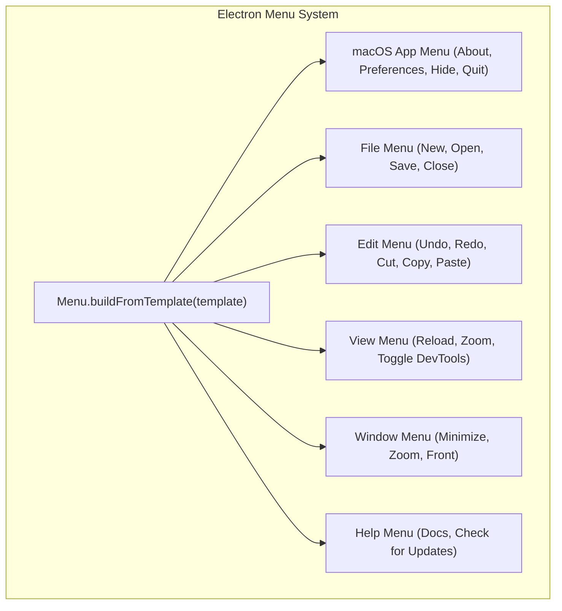
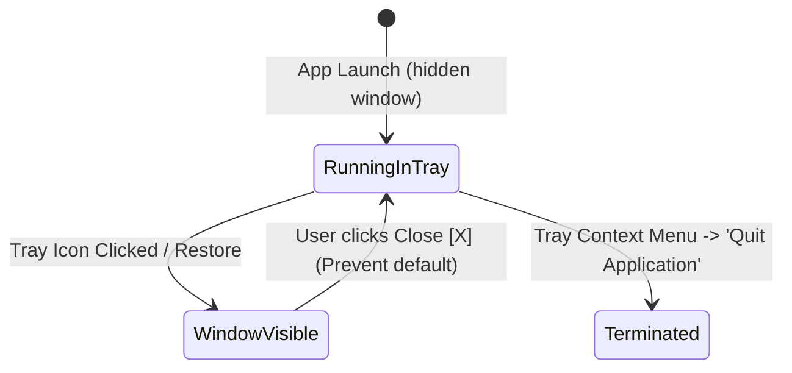
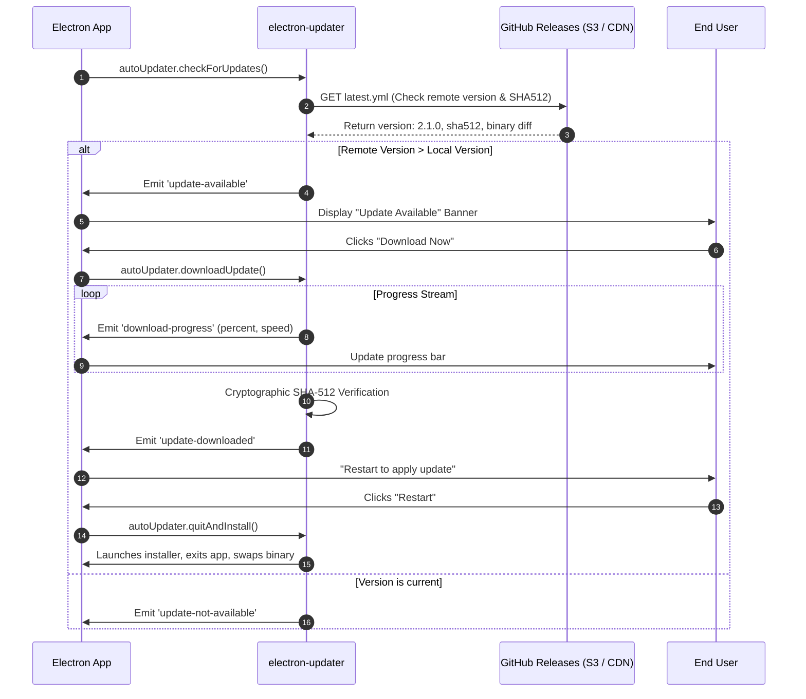
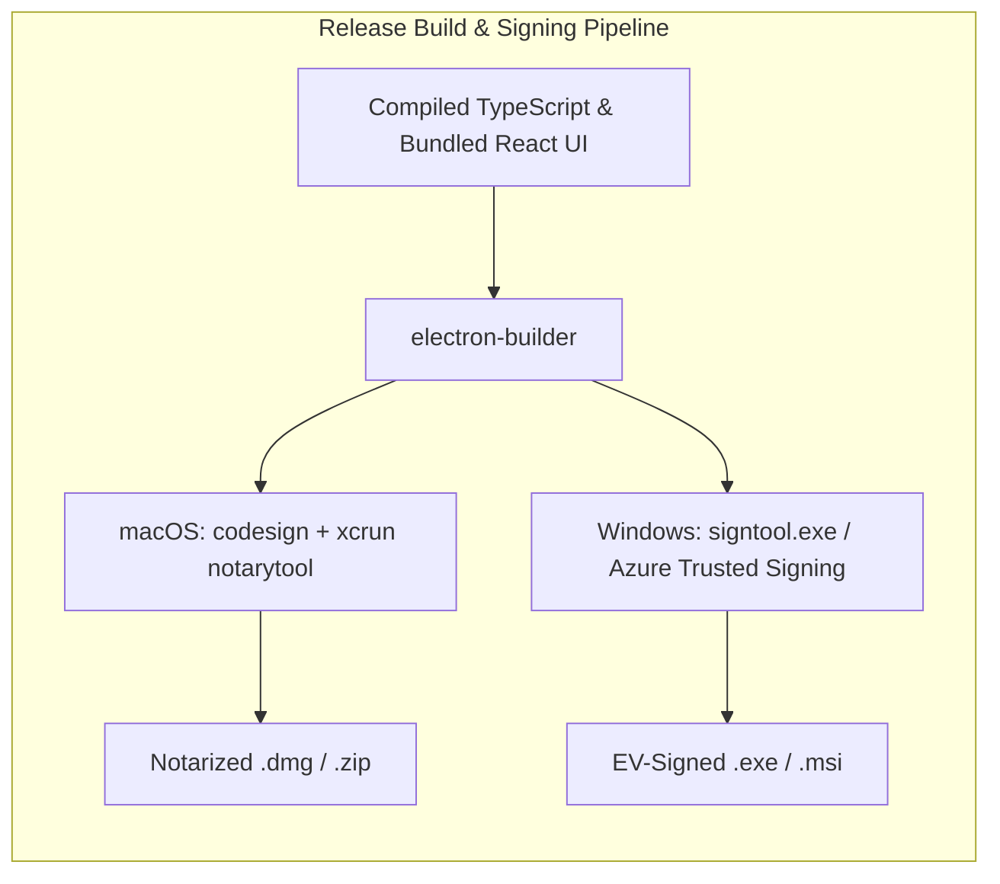

import { Callout } from 'fumadocs-ui/components/callout';
import { Tabs, Tab } from 'fumadocs-ui/components/tabs';
import { Steps, Step } from 'fumadocs-ui/components/steps';

A web application running in a standard browser feels like a visitor inside the operating system. It cannot dock into the Windows Taskbar Notification Area or macOS Status Bar, cannot respond to global system-wide key combinations while running in the background, and cannot show native modal file pickers.

To make an Electron application feel like an authentic, first-class native desktop application rather than a glorified website in a container, you must deeply integrate with native operating system capabilities.

In this lesson, we will master Electron's native OS APIs—constructing cross-platform application menus, engineering background system tray agents, capturing global keyboard shortcuts, presenting native OS dialogs, dispatching desktop notifications, and building a production-grade auto-update pipeline with code signing.

---

## 1. Native Application Menus & Context Menus

Operating systems handle application menus fundamentally differently:
- **macOS (`darwin`)**: The application menu sits permanently at the very top of the primary monitor screen, independent of which window is focused. The first menu item is always the application name (`AppMenu`).
- **Windows (`win32`) & Linux**: The menu bar is attached directly beneath the title bar of each individual window frame.



### Implementing a Cross-Platform Application Menu

Electron uses declarative templates with standard OS "roles" (`undo`, `redo`, `copy`, `paste`, `quit`). Roles automatically map to the operating system's native localization and platform keyboard accelerators (`Cmd` on macOS, `Ctrl` on Windows).

```typescript
// src/main/menu.ts
import { Menu, MenuItemConstructorOptions, app, shell, BrowserWindow } from 'electron';

export function setupApplicationMenu(mainWindow: BrowserWindow): void {
  const isMac = process.platform === 'darwin';

  const template: MenuItemConstructorOptions[] = [
    // macOS First Menu (App Name)
    ...(isMac
      ? [
          {
            label: app.name,
            submenu: [
              { role: 'about' as const },
              { type: 'separator' as const },
              {
                label: 'Preferences...',
                accelerator: 'CmdOrCtrl+,',
                click: () => {
                  mainWindow.webContents.send('navigation:open-settings');
                },
              },
              { type: 'separator' as const },
              { role: 'services' as const },
              { type: 'separator' as const },
              { role: 'hide' as const },
              { role: 'hideOthers' as const },
              { role: 'unhide' as const },
              { type: 'separator' as const },
              { role: 'quit' as const },
            ],
          },
        ]
      : []),

    // File Menu
    {
      label: 'File',
      submenu: [
        {
          label: 'New Document',
          accelerator: 'CmdOrCtrl+N',
          click: () => {
            mainWindow.webContents.send('doc:new');
          },
        },
        {
          label: 'Open Document...',
          accelerator: 'CmdOrCtrl+O',
          click: () => {
            mainWindow.webContents.send('doc:trigger-open');
          },
        },
        { type: 'separator' },
        isMac ? { role: 'close' } : { role: 'quit' },
      ],
    },

    // Edit Menu
    {
      label: 'Edit',
      submenu: [
        { role: 'undo' },
        { role: 'redo' },
        { type: 'separator' },
        { role: 'cut' },
        { role: 'copy' },
        { role: 'paste' },
        { role: 'selectAll' },
      ],
    },

    // View Menu
    {
      label: 'View',
      submenu: [
        { role: 'reload' },
        { role: 'forceReload' },
        { role: 'toggleDevTools' },
        { type: 'separator' },
        { role: 'resetZoom' },
        { role: 'zoomIn' },
        { role: 'zoomOut' },
        { type: 'separator' },
        { role: 'togglefullscreen' },
      ],
    },

    // Help Menu
    {
      role: 'help',
      submenu: [
        {
          label: 'Documentation',
          click: async () => {
            await shell.openExternal('https://myapp.com/docs');
          },
        },
        {
          label: 'Check for Updates...',
          click: () => {
            mainWindow.webContents.send('updater:manual-check');
          },
        },
      ],
    },
  ];

  const menu = Menu.buildFromTemplate(template);
  Menu.setApplicationMenu(menu);
}
```

### Context Menus (Right-Click)

Context menus are instantiated dynamically on-demand when the user clicks the right mouse button inside the renderer:

```typescript
// In src/main/ipc-handlers.ts
import { ipcMain, Menu, BrowserWindow } from 'electron';

export function registerContextMenu(): void {
  ipcMain.on('show-context-menu', (event) => {
    const template = [
      {
        label: 'Inspect Element',
        click: () => {
          const win = BrowserWindow.fromWebContents(event.sender);
          win?.webContents.openDevTools({ mode: 'detach' });
        },
      },
      { type: 'separator' },
      { role: 'copy' },
      { role: 'paste' },
    ];
    
    const menu = Menu.buildFromTemplate(template);
    const win = BrowserWindow.fromWebContents(event.sender);
    if (win) {
      menu.popup({ window: win });
    }
  });
}
```

---

## 2. System Tray & Background Agents

A background desktop utility (like Docker Desktop, Slack, or 1Password) frequently runs without an active window visible, living quietly in the system tray.



### Implementing a Resilient Tray Manager

```typescript
// src/main/tray.ts
import { Tray, Menu, nativeImage, app, BrowserWindow } from 'electron';
import path from 'node:path';

let tray: Tray | null = null;

export function setupSystemTray(mainWindow: BrowserWindow): Tray {
  // Use appropriate icon asset (macOS Template icons must end in 'Template.png' for auto dark mode)
  const iconName = process.platform === 'darwin' ? 'trayTemplate.png' : 'tray-win.ico';
  const iconPath = path.join(__dirname, `../../resources/icons/${iconName}`);
  
  // Resize nativeImage for high-DPI displays
  const trayIcon = nativeImage.createFromPath(iconPath).resize({ width: 16, height: 16 });
  
  tray = new Tray(trayIcon);
  tray.setToolTip('My Desktop App (Running)');

  const contextMenu = Menu.buildFromTemplate([
    {
      label: 'Open Main Window',
      click: () => {
        mainWindow.show();
        mainWindow.focus();
      },
    },
    {
      label: 'Sync Status: Active',
      enabled: false,
    },
    { type: 'separator' },
    {
      label: 'Quit Application',
      click: () => {
        // Bypass close interception to quit completely
        app.exit(0);
      },
    },
  ]);

  tray.setContextMenu(contextMenu);

  // Left click on Windows/Linux toggles window visibility
  tray.on('click', () => {
    if (mainWindow.isVisible()) {
      mainWindow.hide();
    } else {
      mainWindow.show();
      mainWindow.focus();
    }
  });

  // Intercept the window 'close' event so clicking (X) minimizes to tray
  mainWindow.on('close', (event) => {
    if (!app.isQuitting) {
      event.preventDefault();
      mainWindow.hide();
    }
  });

  return tray;
}
```

---

## 3. Global Keyboard Shortcuts

Accelerators defined in application menus only function when the window is currently focused. **Global Shortcuts** (`globalShortcut`) intercept key events across the entire operating system, even if your application is minimized, hidden in the tray, or in the background.

```typescript
// src/main/shortcuts.ts
import { globalShortcut, BrowserWindow, app } from 'electron';

export function registerGlobalShortcuts(mainWindow: BrowserWindow): void {
  // Register a global hotkey (e.g. Command+Shift+Space for quick spotlight launcher)
  const shortcut = process.platform === 'darwin' ? 'Command+Shift+Space' : 'Control+Shift+Space';

  const registered = globalShortcut.register(shortcut, () => {
    console.log(`Global hotkey [${shortcut}] pressed!`);
    
    if (mainWindow.isVisible() && mainWindow.isFocused()) {
      mainWindow.hide();
    } else {
      mainWindow.show();
      mainWindow.focus();
      mainWindow.webContents.send('quick-launcher:focus');
    }
  });

  if (!registered) {
    console.error(`Failed to register global shortcut: ${shortcut}`);
  }

  // CRITICAL: Clean up all shortcuts when application quits
  app.on('will-quit', () => {
    globalShortcut.unregisterAll();
  });
}
```

<Callout type="warning" title="OS Accessibility Permissions on macOS">
On macOS, certain global keyboard shortcuts require the user to grant **Accessibility Permissions** in *System Preferences > Privacy & Security > Accessibility*. If permissions are denied, `globalShortcut.register` will fail silently or return `false`.
</Callout>

---

## 4. Native OS Modal Dialogs

Web file inputs (`<input type="file">`) provide no control over default directories, custom button labels, or multi-directory selections. Electron's `dialog` module gives direct access to native operating system dialogs.

```typescript
// src/main/dialogs.ts
import { dialog, BrowserWindow, ipcMain } from 'electron';

export function registerDialogHandlers(): void {
  // Native Open File Dialog
  ipcMain.handle('dialog:open-file', async (event) => {
    const parentWin = BrowserWindow.fromWebContents(event.sender);
    if (!parentWin) return null;

    const result = await dialog.showOpenDialog(parentWin, {
      title: 'Select Project Markdown Document',
      defaultPath: app.getPath('documents'),
      buttonLabel: 'Import File',
      properties: ['openFile', 'dontAddToRecent'],
      filters: [
        { name: 'Markdown Documents', extensions: ['md', 'markdown', 'mdx'] },
        { name: 'Plain Text', extensions: ['txt'] },
        { name: 'All Files', extensions: ['*'] },
      ],
    });

    if (result.canceled || result.filePaths.length === 0) {
      return null;
    }

    return result.filePaths[0]; // Return the selected absolute filesystem path
  });

  // Native Confirmation Box (Message Box)
  ipcMain.handle('dialog:confirm-delete', async (event, itemName: string) => {
    const parentWin = BrowserWindow.fromWebContents(event.sender);
    if (!parentWin) return false;

    const { response } = await dialog.showMessageBox(parentWin, {
      type: 'warning',
      buttons: ['Cancel', 'Delete Permanently'],
      defaultId: 0, // Default highlighted button (Cancel for safety)
      cancelId: 0,
      title: 'Confirm Deletion',
      message: `Are you sure you want to permanently delete "${itemName}"?`,
      detail: 'This action cannot be undone and will remove the file from your local disk.',
    });

    return response === 1; // True if user clicked 'Delete Permanently'
  });
}
```

---

## 5. Desktop Notifications

Desktop notifications can be triggered from either the Renderer process using the HTML5 Notification API, or from the Main Process using Electron's native `Notification` module.

Using Electron's `Notification` in the Main Process provides deeper OS capabilities, including native actions, inline replies, and icon customization:

```typescript
// src/main/notifications.ts
import { Notification, nativeImage } from 'electron';
import path from 'node:path';

export function showTaskCompleteNotification(title: string, message: string): void {
  // Verify notification support on current platform
  if (!Notification.isSupported()) {
    console.warn('System notifications are not supported on this OS');
    return;
  }

  const iconPath = path.join(__dirname, '../../resources/icons/notify-icon.png');

  const notification = new Notification({
    title,
    body: message,
    icon: nativeImage.createFromPath(iconPath),
    silent: false, // Play default OS notification sound
    urgency: 'normal', // Linux notification urgency level
  });

  notification.on('click', () => {
    console.log('User clicked notification');
    // Focus or restore window
  });

  notification.show();
}
```

---

## 6. The Production Auto-Updater Pipeline

Shipping desktop software without an auto-updater is dangerous: security patches, bug fixes, and protocol updates cannot reach users without manual re-installation.

The industry standard for Electron distribution is **`electron-updater`** (part of `electron-builder`), supporting differential delta downloads via GitHub Releases, AWS S3, or custom endpoints.



### Implementing `auto-updater.ts`

```typescript
// src/main/updater.ts
import { autoUpdater } from 'electron-updater';
import { BrowserWindow, ipcMain } from 'electron';
import log from 'electron-log';

export function initAutoUpdater(mainWindow: BrowserWindow): void {
  // Configure logging
  log.transports.file.level = 'info';
  autoUpdater.logger = log;

  // Manual download flow: don't download until user confirms
  autoUpdater.autoDownload = false;
  autoUpdater.autoInstallOnAppQuit = true;

  // Event Handlers
  autoUpdater.on('checking-for-update', () => {
    log.info('Checking for application updates...');
  });

  autoUpdater.on('update-available', (info) => {
    log.info(`Update found: version ${info.version}`);
    mainWindow.webContents.send('updater:available', {
      version: info.version,
      releaseDate: info.releaseDate,
    });
  });

  autoUpdater.on('update-not-available', () => {
    log.info('Application is up to date.');
    mainWindow.webContents.send('updater:up-to-date');
  });

  autoUpdater.on('download-progress', (progress) => {
    mainWindow.webContents.send('updater:progress', {
      percent: Math.round(progress.percent),
      bytesPerSecond: progress.bytesPerSecond,
      transferredMB: (progress.transferred / 1024 / 1024).toFixed(2),
      totalMB: (progress.total / 1024 / 1024).toFixed(2),
    });
  });

  autoUpdater.on('update-downloaded', () => {
    log.info('Update downloaded successfully. Ready to install.');
    mainWindow.webContents.send('updater:downloaded');
  });

  autoUpdater.on('error', (err) => {
    log.error('Auto-update error:', err);
    mainWindow.webContents.send('updater:error', err.message);
  });

  // IPC Handlers for User Actions
  ipcMain.handle('updater:check', async () => {
    return await autoUpdater.checkForUpdates();
  });

  ipcMain.handle('updater:start-download', async () => {
    return await autoUpdater.downloadUpdate();
  });

  ipcMain.handle('updater:install-now', () => {
    autoUpdater.quitAndInstall(false, true);
  });

  // Check periodically every 6 hours in production
  if (app.isPackaged) {
    setInterval(() => {
      autoUpdater.checkForUpdates();
    }, 6 * 60 * 60 * 1000);
    
    // Initial check on launch
    autoUpdater.checkForUpdates();
  }
}
```

---

## 7. Code Signing Prerequisites

On modern operating systems, unsigned desktop applications trigger severe security warnings that prevent users from launching your software:
- **macOS Gatekeeper**: Displays `"App is damaged and can't be opened"` or blocks installation entirely unless signed with an Apple Developer ID and **Notarized** by Apple's cloud verification servers.
- **Windows SmartScreen**: Displays a prominent blue banner: `"Windows protected your PC: Microsoft Defender SmartScreen prevented an unrecognized app from starting"`.



<Callout type="important" title="Production Signing Requirements">
Before distributing to public users:
1. **macOS**: Enroll in the Apple Developer Program (\$99/year), generate a `Developer ID Application` certificate, configure hardened runtime entitlements, and automate notarization via `notarytool`.
2. **Windows**: Acquire an EV (Extended Validation) Code Signing Certificate or use Microsoft **Azure Trusted Signing**, ensuring instant SmartScreen reputation without false warnings.
</Callout>

---

## Summary of Track 4

Across this track, you have mastered the four pillars of modern full-stack desktop engineering:

1. **Multi-Process Architecture**: Separating the privileged Node.js Main Process from sandboxed Chromium Renderers, eliminating RCE vulnerabilities.
2. **Secure IPC Communication**: Enforcing context isolation with `contextBridge`, eliminating synchronous deadlocks, and writing end-to-end type-safe contracts.
3. **Embedded Local Databases**: Harnessing `better-sqlite3` in WAL mode, offloading queries with `utilityProcess`, and maintaining atomic schema migrations.
4. **Native System Integration**: Bridging OS menus, tray agents, global hotkeys, native modal dialogs, and reliable auto-update delivery.
