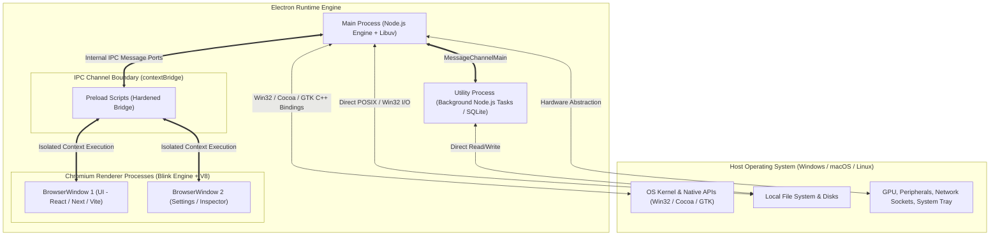
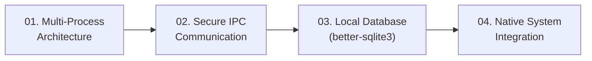

import { Callout } from 'fumadocs-ui/components/callout';
import { Tabs, Tab } from 'fumadocs-ui/components/tabs';
import { Steps, Step } from 'fumadocs-ui/components/steps';
import { Cards, Card } from 'fumadocs-ui/components/card';

Desktop application development represents one of the most powerful paradigms in modern software engineering. While web applications are constrained by the browser sandbox—restricted from direct filesystem access, background multitasking, custom protocol handlers, and low-latency local hardware—desktop applications possess **unrestricted native capabilities**.

**Electron** bridges the gap between web agility and desktop sovereignty. By bundling a customized build of **Chromium** (for rendering HTML5, CSS3, and modern frontend frameworks like React, Vue, and Svelte) with **Node.js** (for asynchronous I/O, POSIX/Win32 filesystem operations, and native C++ add-ons), Electron enables software teams to build cross-platform desktop products used daily by hundreds of millions of developers and enterprise users—including **Visual Studio Code**, **Slack**, **Discord**, **Figma**, **Notion**, and **Postman**.

---

## 1. The Anatomy of an Electron Application

An Electron application is fundamentally a composite runtime. It marries the visual presentation engine of Google Chrome with the systems execution environment of Node.js, governed by a native operating system binding layer.

### The Three Core Pillars

1. **Chromium (Presentation Layer)**:
   Chromium handles window compositing, WebGL hardware acceleration, CSS Grid layouts, font rendering, DOM events, and media playback. Each UI window is backed by an independent Chromium renderer process, ensuring UI crashes do not kill the primary host application.
2. **Node.js + Libuv (Systems Layer)**:
   Node.js supplies a non-blocking, asynchronous event loop running in the **Main Process** and **Utility Processes**. It grants direct access to the filesystem (`node:fs`), child process spawning (`node:child_process`), raw TCP/UDP networking (`node:net`), and compiled C++ modules (`node-gyp`).
3. **Native Integrations (OS Layer)**:
   Electron's C++ core wraps platform-specific desktop capabilities across Windows, macOS, and Linux into unified JavaScript APIs: custom native application menus, system tray icons with badge counters, system-wide global hotkeys, native modal file dialogs, push notifications, and cryptographic auto-update verifications.

---

## 2. Web App vs. Desktop App vs. Pure Native

Why do engineering organizations choose Electron over pure web applications or traditional native frameworks like Swift/AppKit, C#/.NET WPF, or C++/Qt?

| Dimension | Web Application (SaaS) | Electron Desktop App | Pure Native (Swift / WinUI / Qt) |
| :--- | :--- | :--- | :--- |
| **Execution Environment** | Sandboxed Web Browser (Chrome/Safari) | Dedicated Chromium + Node.js Runtime | Direct OS Native Machine Code |
| **Filesystem Access** | None (only user-selected File Picker blobs) | Full filesystem read/write, streaming, binary I/O | Full unrestricted filesystem access |
| **Offline Resilience** | Limited (Service Workers, Cache Storage) | **100% Offline-First** (Embedded SQLite, local config) | 100% Offline-First |
| **Local Compute & AI** | Severely limited (WebGPU, WASM memory caps) | **Native C++ bindings**, PyTorch, ONNX, local models | Unrestricted native hardware compute |
| **Hardware & Devices** | Restricted WebUSB, WebHID, WebSerial | Serial ports, raw USB, Bluetooth, virtual drivers | Native driver-level direct access |
| **Cross-Platform Parity** | High (browser compatibility issues) | **Single codebase for Windows, macOS, & Linux** | 3 separate native codebases required |
| **Memory & Footprint** | Low (shared across existing browser tabs) | Higher (~120–180 MB base RSS due to Chromium) | Minimal (~30–60 MB base RSS) |
| **Distribution** | Web URLs, DNS, CDN edge servers | Code-signed installers (MSI, NSIS, DMG, PKG, AppImage) | App Store & Native OS installers |

<Callout type="info" title="The Tradeoff Reality">
While Electron applications carry a baseline memory footprint due to bundling Chromium and Node.js, the developer productivity gains, cross-platform UI consistency, and rapid iteration speed make it the dominant choice for complex productivity tools, local developer environments, and offline-first enterprise applications.
</Callout>

---

## 3. The Modern Electron Paradigm (Electron 30+)

Earlier generations of Electron (v1 through v11) suffered from severe security vulnerabilities caused by insecure defaults—specifically enabling Node.js execution directly inside web pages (`nodeIntegration: true`) and disabling context isolation (`contextIsolation: false`). Any Cross-Site Scripting (XSS) flaw in a renderer window instantly escalated into a full Remote Code Execution (RCE) compromise of the user's host operating system.

In **modern Electron (v30+)**, the security paradigm has been completely re-architected around a zero-trust model:

<Steps>
<Step>
### Mandatory Context Isolation (`contextIsolation: true`)
The preload script and the renderer page run in strictly separated V8 JavaScript contexts. Even if malicious JavaScript compromises the web page DOM, it cannot access the prototype chain, Node.js internals, or internal Electron modules of the preload script.
</Step>

<Step>
### Complete Elimination of Node Integration in Renderers
Web pages render inside a secure Chromium sandbox (`nodeIntegration: false`, `sandbox: true`). Direct access to `require()`, `process`, `Buffer`, and `fs` is disabled inside the renderer.
</Step>

<Step>
### Hardened Context Bridge (`contextBridge.exposeInMainWorld`)
The only avenue of interaction between the web page and system privileges is an explicitly defined, type-safe API contract declared via `contextBridge`. Raw IPC emitters (`ipcRenderer`) are never exposed directly to the `window` object.
</Step>

<Step>
### Offloaded Computation with Utility Processes (`utilityProcess`)
Heavy background computation, CPU-bound parsing, and synchronous database operations (such as `better-sqlite3`) are extracted from the UI-coordinating Main Process and executed inside dedicated child Node.js workers via Electron's `utilityProcess` API.
</Step>
</Steps>

---

## 4. Track Learning Path

This track is engineered to teach you production-grade desktop architecture from first principles through enterprise deployment:

<Cards>
  <Card
    title="01. Multi-Process Architecture"
    href="/docs/full-stack-development/electron-desktop/01-multi-process-architecture"
    description="Understand the Chromium process model, Main vs Renderer responsibilities, lifecycle management, sandboxing, and mitigating catastrophic RCE vulnerabilities."
  />
  <Card
    title="02. Secure IPC Communication"
    href="/docs/full-stack-development/electron-desktop/02-secure-ipc-communication"
    description="Master two-way asynchronous IPC with invoke and handle, write hardened preload scripts using contextBridge, and build end-to-end type-safe contracts with TypeScript."
  />
  <Card
    title="03. Local Database with SQLite"
    href="/docs/full-stack-development/electron-desktop/03-local-database-sqlite"
    description="Implement high-performance offline storage with better-sqlite3 in WAL mode, offload queries via utilityProcess workers, and manage desktop schema migrations."
  />
  <Card
    title="04. Native System Integration"
    href="/docs/full-stack-development/electron-desktop/04-native-system-integration"
    description="Build platform-specific menus, system trays, global shortcuts, native file dialogs, desktop notifications, and production auto-update delivery pipelines."
  />
</Cards>

---

## 5. Technology Stack for This Track

Throughout this track, you will build and architect modern desktop applications using the current production gold-standard stack:

<Tabs items={['Core Desktop Runtime', 'Frontend Tooling', 'Data & Persistence', 'Packaging & Release']}>
  <Tab value="Core Desktop Runtime">
    - **Electron 30+**: Hardened security defaults, modern Chromium Blink rendering, and Node.js v20+ Libuv engine.
    - **TypeScript 5+**: Strict type-checking across Main, Preload, and Renderer process boundaries.
    - **UtilityProcess**: Child worker process architecture communicating via `MessageChannelMain`.
  </Tab>
  <Tab value="Frontend Tooling">
    - **Vite 6+ / React 19**: Ultra-fast hot module replacement (HMR) and optimized desktop UI rendering.
    - **Tailwind CSS v4**: Hardware-accelerated desktop utility styling.
    - **Lucide Icons**: Crisp vector UI icons styled for desktop interfaces.
  </Tab>
  <Tab value="Data & Persistence">
    - **better-sqlite3**: High-performance, synchronous C++ SQLite3 bindings compiled against Electron's Node ABI.
    - **WAL Journaling**: Write-Ahead Logging for non-blocking concurrent reads during database writes.
    - **Atomic Migrations**: Embedded transactional schema evolutions on application launch.
  </Tab>
  <Tab value="Packaging & Release">
    - **electron-builder**: Multi-platform distribution bundler for NSIS, DMG, and AppImage.
    - **electron-updater**: Cryptographically verified, delta-capable background auto-update engine.
    - **Code Signing**: Windows Authenticode and macOS Notarization compliance.
  </Tab>
</Tabs>

Let us begin with **[01. Multi-Process Architecture](/docs/full-stack-development/electron-desktop/01-multi-process-architecture)** to master the internal boundaries of the Electron runtime.
