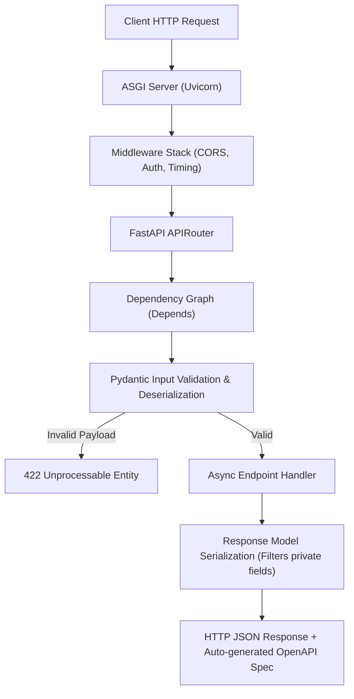

import { Cards, Card } from 'fumadocs-ui/components/card';
import { Callout } from 'fumadocs-ui/components/callout';

Welcome to the **FastAPI Curriculum**.

FastAPI is a modern, high-performance web framework for building APIs with Python 3.10+ based on standard Python type hints. Built on top of **Starlette** (for lightning-fast async HTTP routing) and **Pydantic V2** (for high-speed data validation in Rust), FastAPI delivers throughput on par with NodeJS and Go.

FastAPI is the premier framework for building microservices, AI/ML model inference endpoints, and full-stack API gateways.

---

## Curriculum Lessons

<Cards>
  <Card
    title="01. Routing, Parameters & OpenAPI"
    href="/docs/full-stack-development/fastapi-backend/01-routing-and-parameters"
    description="FastAPI application setup, OpenAPI Swagger UI (/docs), Path/Query parameter validation with Annotated, and status codes."
  />
  <Card
    title="02. Pydantic V2 Validation & Serialization"
    href="/docs/full-stack-development/fastapi-backend/02-pydantic-v2-validation"
    description="BaseModel schemas, Field constraints, @field_validator, request body parsing, response models, and model_dump."
  />
  <Card
    title="03. Dependency Injection System"
    href="/docs/full-stack-development/fastapi-backend/03-dependency-injection"
    description="The Depends() system, hierarchical sub-dependencies, yield dependencies for cleanup, and testing overrides."
  />
  <Card
    title="04. Lifespan Management & Middleware"
    href="/docs/full-stack-development/fastapi-backend/04-lifespan-and-middleware"
    description="Modern lifespan context managers for DB startup/shutdown, CORS configuration, timing middleware, and custom exceptions."
  />
  <Card
    title="05. Async Database with SQLAlchemy 2.0"
    href="/docs/full-stack-development/fastapi-backend/05-async-database-sqlalchemy"
    description="Async engines, async_sessionmaker, Mapped[] declarative models, CRUD operations with select(), and Alembic migrations."
  />
  <Card
    title="06. Security, OAuth2 & JWT Authentication"
    href="/docs/full-stack-development/fastapi-backend/06-security-and-jwt-auth"
    description="OAuth2 password bearer flow, password hashing with bcrypt, JSON Web Token (JWT) creation, and authenticated user extraction."
  />
  <Card
    title="07. Production Architecture & Background Tasks"
    href="/docs/full-stack-development/fastapi-backend/07-production-architecture-and-tasks"
    description="Modular APIRouter architecture, BackgroundTasks for async workloads, pytest with httpx.AsyncClient, and Docker deployment."
  />
  <Card
    title="FastAPI Glossary & Quick Reference"
    href="/docs/full-stack-development/fastapi-backend/glossary"
    description="Comprehensive quick-reference cheatsheet of decorators, status codes, Pydantic field types, and common production gotchas."
  />
</Cards>

---

## FastAPI Architecture & Request Pipeline

<Callout type="tip" title="Async vs Sync Handlers">
If an endpoint performs asynchronous I/O (database queries, network requests, reading Redis), define it with `async def`. If an endpoint performs CPU-intensive tasks or uses blocking synchronous libraries, define it with standard `def` — FastAPI will automatically execute it in a separate threadpool to avoid blocking the main event loop.
</Callout>
