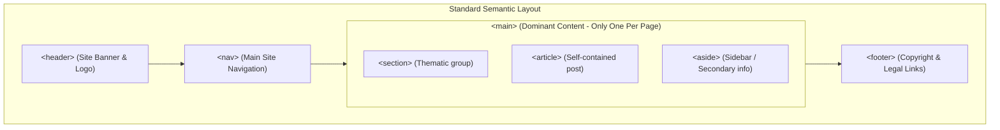

import { Callout } from 'fumadocs-ui/components/callout';
import { Tabs, Tab } from 'fumadocs-ui/components/tabs';

Semantic HTML is the practice of using elements that describe their exact meaning and purpose to the browser, assistive technologies (screen readers), and search engines, rather than wrapping all content in generic container tags like `<div>` and `<span>`.

---

## 1. Why Semantics Matter

```
┌─────────────────────────────────────────────────────────────┐
│                      Semantic Benefits                      │
├──────────────────────────┬──────────────────────────────────┤
│ 1. Accessibility (a11y)  │ Screen readers use landmarks to  │
│                          │ jump directly to navigation/main │
├──────────────────────────┼──────────────────────────────────┤
│ 2. SEO Performance       │ Web scrapers prioritize headings │
│                          │ & articles for ranking           │
├──────────────────────────┼──────────────────────────────────┤
│ 3. Maintainability       │ Code is self-documenting and     │
│                          │ easier for teams to refactor     │
└──────────────────────────┴──────────────────────────────────┘
```

### The "Div Soup" Antipattern
Before HTML5, web pages suffered from "div soup", where developers assigned arbitrary class names to `<div>` elements:

```html
<!-- The Antipattern: Div Soup (No inherent meaning) -->
<div id="header">
  <div id="nav">
    <div class="nav-item">Home</div>
  </div>
</div>
<div id="main-content">
  <div class="post">
    <div class="title">My Blog Post</div>
  </div>
</div>
<div id="footer">Copyright 2026</div>
```

```html
<!-- Modern Semantic HTML5: Clear structural meaning -->
<header>
  <nav aria-label="Main Navigation">
    <ul>
      <li><a href="/">Home</a></li>
    </ul>
  </nav>
</header>
<main>
  <article>
    <h1>My Blog Post</h1>
  </article>
</main>
<footer>
  <p>&copy; 2026</p>
</footer>
```

---

## 2. Core Landmark Elements

HTML5 specifies landmark regions that allow assistive technology users to skip directly to sections of a document:



### Landmark Tag Reference

| Element | Description | Proper Context |
| :--- | :--- | :--- |
| `<header>` | Introductory container for a page, article, or section. | Contains logos, titles, breadcrumbs, search bars. |
| `<nav>` | Section of major navigation links. | Top menus, pagination, tables of contents. |
| `<main>` | The primary, unique content of the document. | Must be unique; cannot have more than **one** `<main>` per page. |
| `<article>` | Self-contained, independently reusable/distributable content. | Blog posts, news items, product cards, user reviews. |
| `<section>` | Thematic grouping of content, typically with a heading. | "Features", "Pricing", "Testimonials" sections. |
| `<aside>` | Content tangentially related to surrounding content. | Sidebars, glossaries, related articles, advertising. |
| `<footer>` | Footer for a page, article, or section. | Copyright, author bio, related links, terms of service. |

---

## 3. Deciding: `<article>` vs `<section>` vs `<div>`

A common source of confusion for developers is choosing the right container:

```
Would this content still make complete sense if syndicated 
on an RSS feed or shared standalone on Twitter?
    ├── YES ──> Use <article> (e.g. blog post, product card, tweet)
    └── NO  ──> Does this content form a thematic group with a heading?
                 ├── YES ──> Use <section> (e.g. "Pricing Plans")
                 └── NO  ──> Is this strictly for CSS styling or layout?
                              └── YES ──> Use <div> (purely presentational)
```

<Callout type="tip" title="Rule of Thumb for <section>">
Every `<section>` should ideally contain a heading (`<h2>` - `<h6>`) identifying its topic. If a container does not warrant a heading, it is almost certainly a presentational `<div>`.
</Callout>

---

## 4. Visual Media Containers: `<figure>` and `<figcaption>`

When presenting images, diagrams, charts, or code snippets with an associated caption, use `<figure>`:

```html
<figure>
  
  <figcaption>Figure 1.1: Production cluster load balancing topology.</figcaption>
</figure>
```

---

## 5. Complete Production Page Template

Here is a semantic template showing how these elements interact in a real-world article page:

```html
<!DOCTYPE html>
<html lang="en">
  <head>
    <meta charset="UTF-8" />
    <meta name="viewport" content="width=device-width, initial-scale=1.0" />
    <title>Understanding Semantic HTML - CS Cookbook</title>
  </head>
  <body>
    <!-- Top-level site header -->
    <header>
      <a href="/" aria-label="CS Cookbook Home"><strong>CS-Cookbook</strong></a>
      <nav aria-label="Primary Navigation">
        <ul>
          <li><a href="/tutorials">Tutorials</a></li>
          <li><a href="/cheatsheets">Cheatsheets</a></li>
          <li><a href="/about">About</a></li>
        </ul>
      </nav>
    </header>

    <!-- Main document landmark -->
    <main id="main-content">
      <article>
        <header>
          <h1>Understanding Semantic HTML</h1>
          <p>Written by Alex Doe &bull; Published on <time datetime="2026-10-04">October 4, 2026</time></p>
        </header>

        <section aria-labelledby="intro-heading">
          <h2 id="intro-heading">Why We Write Semantics</h2>
          <p>Semantic markup describes meaning, allowing search engines to index our content and screen readers to convey structure.</p>
        </section>

        <section aria-labelledby="examples-heading">
          <h2 id="examples-heading">Common Semantic Landmarks</h2>
          <p>Elements like header, nav, main, and footer delineate major UI landmarks.</p>
        </section>

        <!-- Sidebar / related links within this article -->
        <aside aria-label="Related Reading">
          <h3>Related Articles</h3>
          <ul>
            <li><a href="/docs/css">CSS Grid & Flexbox Layouts</a></li>
            <li><a href="/docs/a11y">Web Accessibility Checklist</a></li>
          </ul>
        </aside>

        <footer>
          <p>Tagged under: <em>HTML5</em>, <em>Web Architecture</em></p>
        </footer>
      </article>
    </main>

    <!-- Site-wide footer -->
    <footer>
      <p>&copy; 2026 CS-Cookbook. Distributed under MIT License.</p>
      <nav aria-label="Legal Navigation">
        <a href="/privacy">Privacy Policy</a> | 
        <a href="/terms">Terms of Service</a>
      </nav>
    </footer>
  </body>
</html>
```
