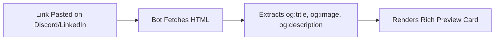

import { Callout } from 'fumadocs-ui/components/callout';
import { Tabs, Tab } from 'fumadocs-ui/components/tabs';

The `<head>` section is the command center of an HTML document. Although invisible to users on the rendered page, `<head>` metadata instructs search engine web scrapers how to index content, social platforms how to generate rich link previews, and browsers how to optimize network asset loading.

---

## 1. Core Technical Metadata

Every production web application should begin with these core tags:

```html
<head>
  <!-- 1. Universal character encoding -->
  <meta charset="UTF-8" />

  <!-- 2. Responsive mobile viewport -->
  <meta name="viewport" content="width=device-width, initial-scale=1.0" />

  <!-- 3. Page title displayed in browser tab and search results -->
  <title>High-Performance Cloud Architectures | CS Cookbook</title>

  <!-- 4. Search Engine Snippet (under 160 characters) -->
  <meta 
    name="description" 
    content="Production blueprints and battle-tested patterns for distributed systems, container orchestration, and high-availability database architectures." 
  />

  <!-- 5. Canonical link to prevent duplicate content penalties -->
  <link rel="canonical" href="https://example.com/docs/architecture" />
</head>
```

<Callout type="tip" title="Search Engine Title Length">
Keep your `<title>` between 50 to 60 characters and `<meta name="description">` between 120 to 155 characters. Search engines truncate snippets that exceed these boundaries.
</Callout>

---

## 2. Social Sharing: Open Graph & Twitter Cards

When links are pasted into platforms like Slack, Discord, Twitter/X, LinkedIn, or iMessage, crawler bots scrape metadata to generate visual cards:



```html
<!-- Open Graph Protocol (Facebook, LinkedIn, Discord, Slack) -->
<meta property="og:type" content="article" />
<meta property="og:site_name" content="CS Cookbook" />
<meta property="og:title" content="High-Performance Cloud Architectures" />
<meta property="og:description" content="Production blueprints for distributed systems and high-availability databases." />
<meta property="og:url" content="https://example.com/docs/architecture" />
<meta property="og:image" content="https://example.com/images/og-preview.png" />
<meta property="og:image:width" content="1200" />
<meta property="og:image:height" content="630" />

<!-- Twitter / X Specific Cards -->
<meta name="twitter:card" content="summary_large_image" />
<meta name="twitter:site" content="@cscookbook" />
<meta name="twitter:creator" content="@alexdoe" />
<meta name="twitter:title" content="High-Performance Cloud Architectures" />
<meta name="twitter:description" content="Production blueprints for distributed systems and high-availability databases." />
<meta name="twitter:image" content="https://example.com/images/og-preview.png" />
```

---

## 3. Favicons & PWA Icons

Modern browsers and mobile operating systems expect scalable vector icons and touch-friendly graphics:

```html
<!-- Modern SVG Favicon (Sharp on all screen scales) -->
<link rel="icon" type="image/svg+xml" href="/favicon.svg" />

<!-- Legacy fallback icon for older browsers -->
<link rel="icon" type="image/x-icon" href="/favicon.ico" />

<!-- Apple Touch Icon for iOS home screen bookmarks -->
<link rel="apple-touch-icon" sizes="180x180" href="/apple-touch-icon.png" />

<!-- Progressive Web App manifest -->
<link rel="manifest" href="/site.webmanifest" />
```

---

## 4. Performance Optimization: Resource Hints

Resource hints instruct the browser's preload scanner to start DNS lookups, TLS negotiations, or file downloads before the CSS/JS parsers discover them:

| Hint | Syntax | Best Use Case |
| :--- | :--- | :--- |
| `dns-prefetch` | `<link rel="dns-prefetch" href="//api.example.com">` | Resolve DNS early for third-party domains. |
| `preconnect` | `<link rel="preconnect" href="https://fonts.gstatic.com" crossorigin>` | Establish early DNS + TCP + TLS handshake for critical CDN origins. |
| `preload` | `<link rel="preload" href="/fonts/inter.woff2" as="font" type="font/woff2" crossorigin>` | Download critical fonts or above-the-fold hero images immediately. |
| `prefetch` | `<link rel="prefetch" href="/dashboard.js">` | Download resources anticipated for the *next* navigation during idle time. |

---

## 5. Script Loading Lifecycle: Sync vs Async vs Defer

Where you place `<script>` tags and which attributes you use directly affects the **First Contentful Paint (FCP)**:

```html
<!-- 1. Normal (Parser-blocking): Pauses HTML parsing, downloads script, executes, then resumes -->
<script src="/legacy.js"></script>

<!-- 2. Async: Downloads in parallel, executes immediately when ready (Order is unpredictable!) -->
<script async src="/analytics.js"></script>

<!-- 3. Defer: Downloads in parallel, executes strictly after HTML parsing completes (Preserves order) -->
<script defer src="/app.js"></script>
```

<Callout type="tip" title="Best Practice for Scripts">
Place `<script defer src="...">` inside the `<head>` element. This initiates script downloads as early as possible without blocking the initial HTML parser.
</Callout>
