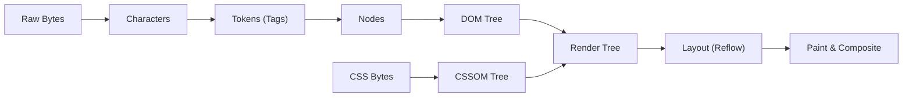

import { Cards, Card } from 'fumadocs-ui/components/card';
import { Callout } from 'fumadocs-ui/components/callout';

Welcome to the **HTML5 Curriculum**.

HTML (HyperText Markup Language) is the fundamental skeleton of the web platform. Rather than merely presenting visual text, modern HTML5 describes the **semantic meaning**, **accessibility tree**, and **data structure** of a document to browsers, screen readers, search engines, and web crawlers.

Whatever frontend framework you use — React, Next.js, Vue, Svelte, or Astro — every component ultimately renders into HTML in the user's browser.

---

## Curriculum Lessons

<Cards>
  <Card
    title="01. HTML Foundations & Core Syntax"
    href="/docs/full-stack-development/html/01-basics-and-syntax"
    description="Document boilerplate, tags, attributes, heading hierarchy, text formatting, lists, and hyperlinks."
  />
  <Card
    title="02. Semantic HTML & Page Architecture"
    href="/docs/full-stack-development/html/02-semantic-html"
    description="Build accessible document architectures with semantic landmarks (<header>, <nav>, <main>, <article>, <section>, <aside>, <footer>) instead of div soup."
  />
  <Card
    title="03. Media, Audio, Video & Embedding"
    href="/docs/full-stack-development/html/03-media-and-embedding"
    description="Embed and optimize images with  and <picture>, media playback with <video> and <audio>, and secure iframe integrations."
  />
  <Card
    title="04. Tables & Tabular Data"
    href="/docs/full-stack-development/html/04-tables"
    description="Structure complex tabular datasets accessibly using <table>, <thead>, <tbody>, <tfoot>, <th> scope, colspan, and rowspan."
  />
  <Card
    title="05. Forms, User Inputs & Native Validation"
    href="/docs/full-stack-development/html/05-forms-and-validation"
    description="Master form controls, accessible label binding, fieldsets, input types, and native HTML5 constraint validation."
  />
  <Card
    title="06. Head Metadata, SEO & Social Cards"
    href="/docs/full-stack-development/html/06-seo-and-head-metadata"
    description="Configure modern <head> tags for search engine crawlers, Open Graph social cards, favicons, and browser performance hints."
  />
  <Card
    title="07. Accessibility (a11y) & Semantic Auditing"
    href="/docs/full-stack-development/html/07-accessibility-and-best-practices"
    description="Implement WCAG principles, ARIA landmark roles, accessible name computations, keyboard navigation, and code quality audits."
  />
  <Card
    title="HTML5 Glossary & Quick Reference"
    href="/docs/full-stack-development/html/glossary"
    description="Comprehensive quick-reference glossary of HTML5 tags, global attributes, and obsolete tags to avoid."
  />
</Cards>

---

## Browser DOM Parsing & Critical Rendering Path

When a browser receives an HTML document over HTTP, it converts raw network bytes into an interactive visual interface through the **Critical Rendering Path**:



### Script Execution Modes: `defer` vs `async`

By default, `<script>` tags block HTML parsing while downloading and executing. Modern web applications optimize script loading via dedicated attributes:

```html
<!-- Blocks parsing until downloaded and executed -->
<script src="/bundle.js"></script>

<!-- Downloads in parallel, executes immediately when ready (can disrupt DOM parsing) -->
<script async src="/analytics.js"></script>

<!-- Downloads in parallel, executes in order after HTML document is fully parsed (Recommended) -->
<script defer src="/app.js"></script>
```

<Callout type="tip" title="Mental Model for Full-Stack Developers">
Always design HTML documents to be readable and functional **without CSS or JavaScript**. Assistive technologies (screen readers) and search engine web crawlers view the web almost entirely in raw HTML. If your page cannot be navigated in raw HTML, it is fundamentally broken.
</Callout>
