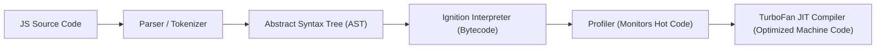

import { Callout } from 'fumadocs-ui/components/callout';
import { Tabs, Tab } from 'fumadocs-ui/components/tabs';

## 0. What is JavaScript?

**JavaScript (JS)** is a lightweight, high-level, interpreted or Just-In-Time (JIT) compiled programming language with first-class functions. Originally created by Brendan Eich in 1995 for the Netscape browser to add interactivity to static web pages, it has evolved into the universal programming language powering modern web frontends, backend APIs (Node.js, Deno, Bun), mobile applications (React Native), and desktop apps (Electron).

### The Core Nature of JavaScript

1. **High-Level & Memory-Managed**: You don't manage pointers or allocate manual bytes like in C/C++; JavaScript provides an automated Garbage Collector (Mark-and-Sweep) to reclaim unused memory.
2. **Dynamically Typed**: Variable types are determined at runtime, not compile-time. A variable holding a string can later hold a number:
   ```javascript
   let score = "100"; // string
   score = 100;       // number (no compile error)
   ```
3. **Multi-Paradigm**: JavaScript supports:
   - **Object-Oriented Programming (OOP)** via prototypal inheritance and ES6 classes.
   - **Functional Programming (FP)** with higher-order functions, pure functions, closures, and immutable transformations.
   - **Imperative / Procedural** control flow.
4. **Single-Threaded with Non-Blocking I/O**: JavaScript runs code on a **single call stack** (one command at a time). It achieves high performance through an **Event Loop** that offloads network requests, timers, and disk reads to host Web APIs or OS worker threads.

### JavaScript vs ECMAScript vs JavaScript Engines

| Term | What It Means | Real-World Example |
| :--- | :--- | :--- |
| **ECMAScript (ES)** | The official standardized language specification maintained by the TC39 committee. | ECMAScript 2015 (ES6), ES2024 |
| **JavaScript (JS)** | The concrete programming language implementing ECMAScript specifications, plus host APIs. | The language you write |
| **JavaScript Engine** | The underlying runtime program that parses, compiles, and executes JavaScript code. | **V8** (Chrome, Node.js), **SpiderMonkey** (Firefox), **JavaScriptCore** (Safari) |
| **Host Environment** | The runtime platform embedding the JS engine, providing environment-specific APIs. | **Browser** (gives `window`, `document`, DOM) vs **Node.js** (gives `process`, `fs`, `http`) |

### How JavaScript Runs: The Execution Pipeline



---

## 1. Variables & Scope: `const` vs `let` vs `var`

| Declaration | Scope | Hoisted | Re-assignable | Mutability |
| :--- | :--- | :--- | :--- | :--- |
| `const` | Block `{}` | Yes (TDZ) | No | Target value inside objects/arrays can still be mutated |
| `let` | Block `{}` | Yes (TDZ) | Yes | Fully re-assignable and mutable |
| `var` | Function | Yes (initialized to `undefined`) | Yes | Legacy; causes scoping bugs and accidental globals |

### The Temporal Dead Zone (TDZ)

Variables declared with `let` and `const` are hoisted, but remain in an uninitialized **Temporal Dead Zone** from the start of the block until the declaration line is executed:

```javascript
// Accessing 'username' before declaration throws ReferenceError
console.log(username); // ReferenceError: Cannot access 'username' before initialization
let username = "Alice";
```

<Callout type="tip" title="Rule of Thumb">
Default to `const`. Only use `let` when you explicitly intend to reassign a variable (e.g. accumulator loops). Never use `var`.
</Callout>

---

## 2. Primitive Types vs Reference Types

JavaScript divides all values into two distinct categories:

### 1. Primitives (Stored by Value on the Stack)
- `string`, `number`, `bigint`, `boolean`, `undefined`, `symbol`, `null`
- Primitives are immutable and copied by **value**:

```javascript
let scoreA = 100;
let scoreB = scoreA; // Copies the raw value
scoreB = 200;

console.log(scoreA); // 100 (Unchanged)
console.log(scoreB); // 200
```

### 2. Reference Types (Stored on the Heap, Pointer on the Stack)
- `Object`, `Array`, `Function`, `Map`, `Set`, `Date`
- Reference types store a pointer address on the stack that points to allocated memory on the heap. Assigning a variable copies the **reference pointer**, not the underlying data:

```javascript
const userA = { name: "Sarah", role: "admin" };
const userB = userA; // Copies the memory pointer!

userB.role = "editor";
console.log(userA.role); // "editor" (Both point to the same object in heap memory!)
```

To create an independent clone:
```javascript
// Shallow clone
const shallowCopy = { ...userA };

// Deep clone (recursively duplicates nested objects)
const deepCopy = structuredClone(userA);
```

---

## 3. Strict Equality vs Loose Coercion

Always use strict equality (`===`) and inequality (`!==`) to prevent hidden implicit type coercion:

```javascript
// Loose equality (==) coerces types unpredictably:
"" == 0;           // true
false == 0;        // true
null == undefined; // true
[] == false;       // true

// Strict equality (===) compares both TYPE and VALUE:
"" === 0;          // false
false === 0;       // false
null === undefined; // false
[] === false;      // false
```

### Falsy Values in JavaScript
There are exactly 8 falsy values:
`false`, `0`, `-0`, `0n`, `""` (empty string), `null`, `undefined`, and `NaN`. Everything else is truthy (including empty arrays `[]` and empty objects `{}`).

---

## 4. Modern Logical & Fallback Operators

```javascript
// 1. Logical OR (||): Returns right-side if left-side is FALSY
const port1 = userPort || 3000; // Warning: Fails if userPort is 0!

// 2. Nullish Coalescing (??): Returns right-side ONLY if left-side is null or undefined
const port2 = userPort ?? 3000; // Correct: Preserves 0 and ""

// 3. Optional Chaining (?.): Short-circuits gracefully if reference is null/undefined
const street = user?.address?.street ?? "Unknown Street";

// 4. Logical Assignment (??=, ||=, &&=)
let config = { timeout: null };
config.timeout ??= 5000; // Sets timeout to 5000 only because it was null
```

---

## 5. Control Flow: Modern Iteration

```javascript
const frameworks = ["React", "FastAPI", "Next.js"];

// for...of: Recommended for iterating over iterable values (Arrays, Sets, Maps)
for (const framework of frameworks) {
  console.log(framework);
}

// for...in: Iterates over enumerable keys of an object (Avoid for arrays!)
const server = { host: "localhost", port: 8080 };
for (const key in server) {
  console.log(`${key}: ${server[key]}`);
}
```
