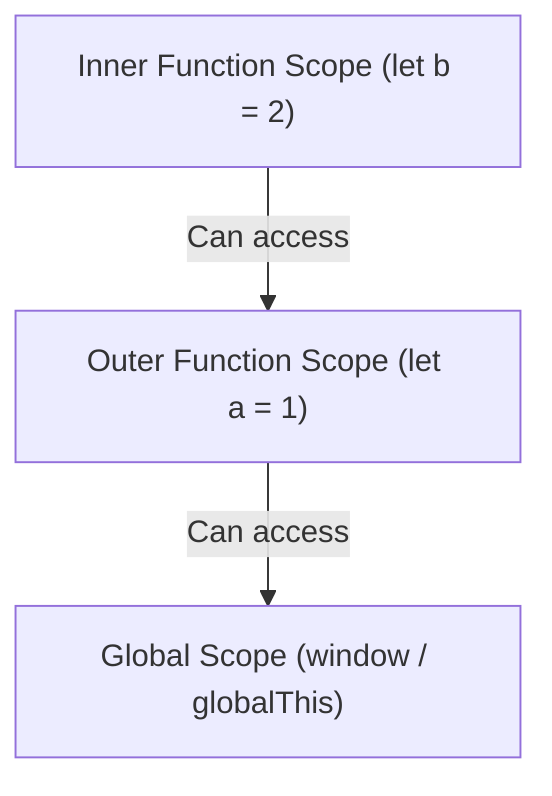

import { Callout } from 'fumadocs-ui/components/callout';
import { Tabs, Tab } from 'fumadocs-ui/components/tabs';

Functions in JavaScript are **first-class citizens**: they can be passed as arguments, returned from other functions, assigned to variables, and carry their lexical scope with them wherever they execute.

---

## 1. Function Syntax Comparison

```javascript
// 1. Function Declaration: Hoisted to the top of its scope
function calculateTotal(price, taxRate = 0.08) {
  return price + (price * taxRate);
}

// 2. Function Expression: Assigned to a variable (Not hoisted)
const formatCurrency = function(amount) {
  return `$${amount.toFixed(2)}`;
};

// 3. Arrow Function: Concise syntax with lexical 'this'
const multiply = (x, y) => x * y;
```

### Rest Parameters (`...args`)
Modern JavaScript uses rest parameters instead of the legacy `arguments` object:

```javascript
function logEvents(category, ...eventNames) {
  eventNames.forEach(event => console.log(`[${category}] ${event}`));
}

logEvents("AUTH", "LOGIN_ATTEMPT", "TOKEN_REFRESH", "LOGOUT");
```

---

## 2. Lexical Scope & The Scope Chain

Scope determines the accessibility of variables. JavaScript uses **Lexical Scoping**: variable resolution is determined by the physical placement of functions in your source code, not where they are called.



When an inner function references a variable, the engine looks locally first. If not found, it traverses up the **Scope Chain** to the enclosing lexical environment until it reaches the global scope.

---

## 3. Closures: The Definition & Mental Model

A **closure** occurs when an inner function retains access to variables from its outer enclosing scope, **even after the outer function has returned and finished executing**:

```javascript
function createCounter(initialValue = 0) {
  let count = initialValue; // Private variable trapped inside the closure

  return {
    increment() { count += 1; return count; },
    decrement() { count -= 1; return count; },
    get value() { return count; }
  };
}

const counterA = createCounter(10);
console.log(counterA.increment()); // 11
console.log(counterA.increment()); // 12
console.log(counterA.count);       // undefined (Cannot be directly mutated or tampered with!)
```

### Production Pattern: API Rate Limiter
```javascript
function createRateLimiter(maxCalls, windowMs) {
  let calls = 0;
  let resetTime = Date.now() + windowMs;

  return function execute(task) {
    const now = Date.now();
    if (now > resetTime) {
      calls = 0;
      resetTime = now + windowMs;
    }

    if (calls >= maxCalls) {
      throw new Error("Rate limit exceeded. Please wait.");
    }

    calls += 1;
    return task();
  };
}

const limiter = createRateLimiter(2, 60000); // 2 requests per minute
limiter(() => console.log("Request 1")); // Allowed
limiter(() => console.log("Request 2")); // Allowed
// limiter(() => console.log("Request 3")); // Throws Error!
```

---

## 4. Demystifying the `this` Keyword

Unlike lexical scope, the value of `this` in standard functions is determined by **how the function was invoked** at runtime.

### The 4 Rules of `this` Binding:

| Invocation Pattern | How `this` is Resolved | Example |
| :--- | :--- | :--- |
| **Default Binding** | Global object (`window` or `undefined` in strict mode) | `standaloneFunc()` |
| **Implicit Binding** | The object to the left of the dot at call-time | `authService.login()` |
| **Explicit Binding** | Manually specified using `.call()`, `.apply()`, or `.bind()` | `login.call(customContext)` |
| **`new` Binding** | The freshly instantiated instance object | `new UserService()` |

```javascript
const user = {
  name: "Alex",
  printNormal() {
    console.log(this.name); // "Alex" (Implicit binding)
  },
  printArrow: () => {
    // Arrow functions DO NOT have their own 'this'.
    // They capture 'this' lexically from surrounding scope!
    console.log(this.name); // undefined
  }
};
```

### Fixing Lost Context with `.bind()`:
```javascript
const button = document.querySelector("#submit");
const handler = user.printNormal;

// Without bind, calling handler() defaults to global/undefined
button.addEventListener("click", user.printNormal.bind(user)); // Correct!
```
