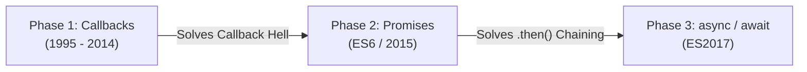
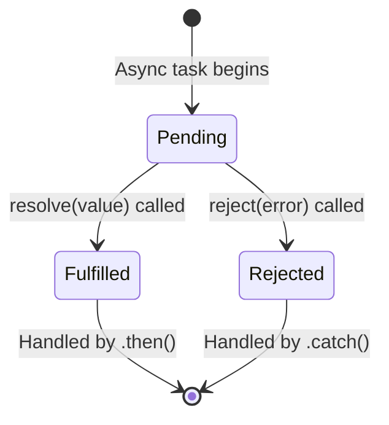

import { Callout } from 'fumadocs-ui/components/callout';
import { Tabs, Tab } from 'fumadocs-ui/components/tabs';

JavaScript executes code in a single-threaded runtime. To handle network I/O, timers, and database operations without freezing the user interface or server, it employs a non-blocking **Event Loop**.

---

## 1. The Event Loop & Queue Scheduling

The runtime divides tasks into three execution buckets:

1. **The Call Stack**: Executes synchronous functions one by one.
2. **The Microtask Queue**: Houses resolved Promise handlers (`.then()`, `.catch()`, `async/await` resumption) and `queueMicrotask`.
3. **The Macrotask (Task) Queue**: Houses timers (`setTimeout`, `setInterval`) and I/O callbacks.

```
┌────────────────────────────────────────────────────────┐
│                      Event Loop                        │
│ 1. Run synchronous Call Stack until completely empty.   │
│ 2. DRAIN the entire Microtask Queue completely.        │
│ 3. Execute ONE Macrotask.                              │
│ 4. Re-check Microtask Queue.                           │
│ 5. Render UI (if in browser).                          │
│ 6. Repeat loop.                                        │
└────────────────────────────────────────────────────────┘
```

### Execution Priority Example:

```javascript
console.log("1. Sync Start");

setTimeout(() => {
  console.log("2. Macrotask (Timer)");
}, 0);

Promise.resolve().then(() => {
  console.log("3. Microtask 1");
}).then(() => {
  console.log("4. Microtask 2");
});

console.log("5. Sync End");
```

**Output**:
```text
1. Sync Start
5. Sync End
3. Microtask 1
4. Microtask 2
2. Macrotask (Timer)
```
*Notice how microtasks ALWAYS run before macrotasks, even when the timer is set to 0 milliseconds.*

---

---

## 2. The Evolution of Asynchronous JavaScript

To understand modern asynchronous code, you must understand the problem it was created to solve: **preventing the single-threaded JavaScript call stack from freezing while waiting for slow operations (network requests, database queries, file reads).**



---

## 3. Phase 1: Callbacks & Callback Hell (Pyramid of Doom)

Originally, JavaScript relied on **callback functions** — passing a function as an argument to another function to be executed once an asynchronous operation finished:

```javascript
function fetchUser(userId, callback) {
  setTimeout(() => {
    callback(null, { id: userId, name: "Alice" });
  }, 1000);
}
```

### The Problem: The Pyramid of Doom
When multiple dependent asynchronous operations had to happen in order (e.g., fetch user, then fetch orders, then calculate totals), callbacks had to be deeply nested:

```javascript
// Callback Hell: Hard to read, fragile error handling, inversion of control
fetchUser(1, (err, user) => {
  if (err) return handleError(err);
  fetchOrders(user.id, (err, orders) => {
    if (err) return handleError(err);
    fetchOrderDetails(orders[0].id, (err, details) => {
      if (err) return handleError(err);
      sendConfirmation(details, (err, receipt) => {
        if (err) return handleError(err);
        console.log("Order complete:", receipt);
      });
    });
  });
});
```

---

## 4. Phase 2: Promises & Promise Chaining

Introduced in ES6, a **`Promise`** is an object representing the eventual completion (or failure) of an asynchronous operation and its resulting value. Think of a Promise like a restaurant order buzzer: you hold a ticket representing a future meal while you continue doing other things.

### The 3 States of a Promise

A Promise exists in one of three mutually exclusive states:



1. **`Pending`**: Initial state; the asynchronous operation is still executing.
2. **`Fulfilled`**: The operation completed successfully (`resolve()` was called).
3. **`Rejected`**: The operation failed or threw an exception (`reject()` was called).
*Once a promise transitions from `Pending` to either `Fulfilled` or `Rejected`, it is **settled** and its state is permanently immutable.*

### Creating a Promise
You create a promise using the `new Promise()` constructor, which takes an **executor function** with two callbacks: `resolve` and `reject`:

```javascript
function getUser(userId) {
  return new Promise((resolve, reject) => {
    if (!userId) {
      reject(new Error("User ID is required"));
      return;
    }

    setTimeout(() => {
      const mockDb = { 1: { id: 1, name: "Alice", active: true } };
      const user = mockDb[userId];
      
      if (user) {
        resolve(user); // Transitions to Fulfilled
      } else {
        reject(new Error("User not found in database")); // Transitions to Rejected
      }
    }, 500);
  });
}
```

### Consuming a Promise: `.then()`, `.catch()`, and `.finally()`

```javascript
getUser(1)
  .then(user => {
    // 1. Executes when Fulfilled
    console.log("User retrieved:", user.name);
  })
  .catch(error => {
    // 2. Executes if Rejected anywhere in the chain
    console.error("Error occurred:", error.message);
  })
  .finally(() => {
    // 3. Executes ALWAYS when settled (cleanup work like closing spinners)
    console.log("Database lookup operation finished.");
  });
```

### The Power of Promise Chaining
The key breakthrough of Promises is **Promise Chaining**. When a `.then()` handler returns a value or another Promise, it passes that value to the next `.then()` down the chain, flattening the Pyramid of Doom into clean, readable steps:

```javascript
// Flat, linear Promise Chain
getUser(1)
  .then(user => getOrders(user.id))
  .then(orders => getOrderDetails(orders[0].id))
  .then(details => sendConfirmation(details))
  .then(receipt => {
    console.log("Order complete:", receipt);
  })
  .catch(error => {
    // A SINGLE catch block catches errors at ANY step of the chain!
    console.error("Pipeline failure:", error.message);
  });
```

---

## 5. Phase 3: `async` & `await` (The Modern Standard)

Introduced in ES2017, **`async` and `await`** are syntactic sugar built on top of Promises. They allow you to write asynchronous code that reads like straightforward, synchronous procedural code.

### The Working Mechanics of `async` and `await`

1. **The `async` keyword**:
   - Marking a function `async` ensures that it **always returns a Promise**, even if you return a plain primitive value:
   ```javascript
   async function getNumber() {
     return 42; 
   }
   // Equivalent to: Promise.resolve(42)
   getNumber().then(val => console.log(val)); // 42
   ```

2. **The `await` keyword**:
   - `await` can only be used inside `async` functions or top-level ES modules.
   - It pauses the execution of the current function **without blocking the main thread or freezing the browser**.
   - The JavaScript engine yields control back to the Event Loop, allowing other tasks, animations, and network handlers to run.
   - When the awaited Promise settles, the remainder of the `async` function is scheduled on the **Microtask Queue** and resumes execution with the unpacked value:

```javascript
async function processOrder(userId) {
  try {
    // 1. Clean, linear execution
    const user = await getUser(userId);
    const orders = await getOrders(user.id);
    const details = await getOrderDetails(orders[0].id);
    const receipt = await sendConfirmation(details);

    console.log("Order complete:", receipt);
    return receipt;
  } catch (error) {
    // 2. Standard try...catch handles ANY rejected promise or throw
    console.error("Order processing failed:", error.message);
    throw error;
  } finally {
    // 3. Cleanup always runs
    console.log("Order pipeline finished.");
  }
}
```

### Side-by-Side Evolution: Identical Logic Compared

<Tabs items={['1. Callback Hell', '2. Promise Chaining', '3. Modern async/await']}>
  <Tab value="1. Callback Hell">
    ```javascript
    function runTask(cb) {
      stepOne((err, res1) => {
        if (err) return cb(err);
        stepTwo(res1, (err, res2) => {
          if (err) return cb(err);
          stepThree(res2, (err, res3) => {
            if (err) return cb(err);
            cb(null, res3);
          });
        });
      });
    }
    ```
  </Tab>
  <Tab value="2. Promise Chaining">
    ```javascript
    function runTask() {
      return stepOne()
        .then(res1 => stepTwo(res1))
        .then(res2 => stepThree(res2))
        .catch(err => {
          console.error(err);
          throw err;
        });
    }
    ```
  </Tab>
  <Tab value="3. Modern async/await">
    ```javascript
    async function runTask() {
      try {
        const res1 = await stepOne();
        const res2 = await stepTwo(res1);
        const res3 = await stepThree(res2);
        return res3;
      } catch (err) {
        console.error(err);
        throw err;
      }
    }
    ```
  </Tab>
</Tabs>

### Asynchronous IIFE (Immediately Invoked Function Expression)
When executing top-level asynchronous code in environments where top-level `await` is not configured:

```javascript
(async function init() {
  try {
    const config = await loadApplicationConfig();
    console.log("App initialized with config:", config);
  } catch (error) {
    console.error("Bootstrap failure:", error);
  }
})();
```

---

## 6. Promise Concurrency Combinators

When you have multiple independent asynchronous operations:

<Tabs items={['Promise.all', 'Promise.allSettled', 'Promise.race', 'Promise.withResolvers']}>
  <Tab value="Promise.all">
    Runs tasks concurrently. **Fails fast** if any single promise rejects:

    ```javascript
    const [user, posts, comments] = await Promise.all([
      fetch("/api/user").then(r => r.json()),
      fetch("/api/posts").then(r => r.json()),
      fetch("/api/comments").then(r => r.json())
    ]);
    ```
  </Tab>
  <Tab value="Promise.allSettled">
    Waits for **all** promises to settle, whether they succeed or fail. Never rejects:

    ```javascript
    const results = await Promise.allSettled([
      fetch("/api/primary-db"),
      fetch("/api/backup-db")
    ]);

    results.forEach(res => {
      if (res.status === "fulfilled") {
        console.log("Success:", res.value);
      } else {
        console.warn("Failed:", res.reason);
      }
    });
    ```
  </Tab>
  <Tab value="Promise.race">
    Resolves or rejects as soon as the **first** promise settles (useful for timeouts):

    ```javascript
    const timeout = new Promise((_, reject) => 
      setTimeout(() => reject(new Error("Request timed out")), 5000)
    );

    const data = await Promise.race([fetch("/api/data"), timeout]);
    ```
  </Tab>
  <Tab value="Promise.withResolvers">
    Modern standard (ES2024+) providing direct access to `resolve` and `reject` without callback nesting:

    ```javascript
    const { promise, resolve, reject } = Promise.withResolvers();

    // Pass resolve to an event handler or external callback
    button.addEventListener("click", () => resolve("Button clicked!"), { once: true });

    const result = await promise;
    ```
  </Tab>
</Tabs>

---

## 7. Cancelling Requests with `AbortController`

Modern web APIs support request cancellation using an `AbortController`. This prevents memory leaks and stale data when components unmount:

```javascript
async function searchProducts(query) {
  const controller = new AbortController();
  const timeoutId = setTimeout(() => controller.abort(), 3000); // 3-second timeout

  try {
    const response = await fetch(`/api/search?q=${query}`, {
      signal: controller.signal
    });
    return await response.json();
  } catch (error) {
    if (error.name === "AbortError") {
      console.warn("Search request was canceled due to timeout.");
    } else {
      console.error("Network error:", error);
    }
  } finally {
    clearTimeout(timeoutId);
  }
}
```

---

## 8. Timers: `setTimeout`, `setInterval` & Polling

JavaScript provides host timer APIs for scheduling asynchronous execution:

### `setTimeout` vs `setInterval`
- **`setTimeout(fn, delay)`**: Runs `fn` once after `delay` milliseconds. Returns a timer ID that can be cancelled via `clearTimeout(id)`.
- **`setInterval(fn, interval)`**: Runs `fn` repeatedly every `interval` milliseconds. Returns an interval ID that can be cancelled via `clearInterval(id)`.

```javascript
// One-shot timer:
const timerId = setTimeout(() => {
  console.log("Executed after 2 seconds");
}, 2000);

// Cancel if user navigates away or state changes:
clearTimeout(timerId);

// Recurring timer:
let secondsElapsed = 0;
const intervalId = setInterval(() => {
  secondsElapsed += 1;
  console.log(`Timer: ${secondsElapsed}s`);

  if (secondsElapsed >= 5) {
    clearInterval(intervalId); // Stop the timer
    console.log("Timer stopped.");
  }
}, 1000);
```

<Callout type="tip" title="Recursive setTimeout vs setInterval">
`setInterval` does not wait for asynchronous callbacks to finish before scheduling the next tick. If the callback takes longer than the interval (e.g. slow network request), invocations will queue up. To avoid overlapping requests, chain asynchronous `setTimeout` recursively:

```javascript
async function pollStatus() {
  await fetchStatusUpdate();
  // Only schedule next check AFTER previous check finishes
  setTimeout(pollStatus, 5000); 
}
```
</Callout>

---

## 9. The Fetch API Deep Dive

The browser `fetch()` API performs asynchronous HTTP requests.

### Crucial Rule: `fetch()` Does Not Reject on 404 or 500
`fetch()` only rejects on **network failures** (DNS resolution errors, offline browser). An HTTP error status like `404 Not Found` or `500 Server Error` will still resolve successfully! You must explicitly check **`response.ok`**:

```javascript
async function fetchUser(userId) {
  const response = await fetch(`https://api.example.com/users/${userId}`);

  // Must check response.ok (true if status code is in 200-299 range)
  if (!response.ok) {
    throw new Error(`HTTP Error! Status: ${response.status} (${response.statusText})`);
  }

  const userData = await response.json();
  return userData;
}
```

### Sending Data with POST / PUT / PATCH
```javascript
async function createPost(title, content) {
  const response = await fetch("https://api.example.com/posts", {
    method: "POST",
    headers: {
      "Content-Type": "application/json",
      "Authorization": "Bearer sample_token_123"
    },
    body: JSON.stringify({ title, content })
  });

  if (!response.ok) {
    const errorBody = await response.text();
    throw new Error(`Failed to create post: ${errorBody}`);
  }

  return await response.json();
}
```

