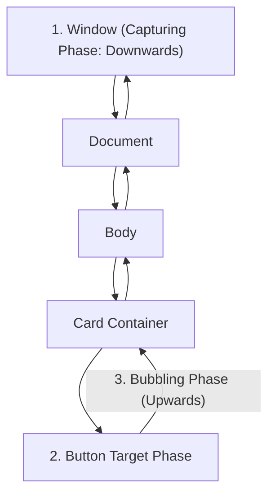

import { Callout } from 'fumadocs-ui/components/callout';
import { Tabs, Tab } from 'fumadocs-ui/components/tabs';

The **DOM (Document Object Model)** is the browser's in-memory object representation of an HTML document. JavaScript interacts with this tree to read user inputs, modify UI elements, and listen for events.

---

## 1. Querying & Manipulating the DOM

Always prefer modern selector methods over legacy `getElementsByClassName`:

```javascript
// Single element (returns first match or null)
const submitBtn = document.querySelector("#submit-btn");

// Collection of elements (returns NodeList)
const cards = document.querySelectorAll(".card");
cards.forEach(card => card.classList.add("fade-in"));
```

### Safe Content Insertion vs XSS
```javascript
const userName = "";

// DANGEROUS: Executes malicious script payload (Cross-Site Scripting / XSS)
element.innerHTML = userName; 

// SAFE: Escapes all HTML markup and inserts pure text safely
element.textContent = userName;
```

---

## 2. Event Propagation: Capturing vs Bubbling

When a user clicks a button nested inside a card, the event travels through three phases:



- **Capturing Phase**: Travels from `window` down to the target element.
- **Target Phase**: Reaches the clicked element.
- **Bubbling Phase**: Bubbles back up the tree to the `window`. By default, `addEventListener` listens on the **bubbling phase**.

```javascript
button.addEventListener("click", (e) => {
  // The exact element that was clicked
  console.log("Target:", e.target);

  // The element this listener is attached to
  console.log("CurrentTarget:", e.currentTarget);

  // Prevent default browser behavior (e.g. form submission or link jump)
  e.preventDefault();

  // Stop the event from bubbling further up the DOM tree
  e.stopPropagation();
});
```

---

## 3. High-Performance Event Delegation

Attaching individual click listeners to hundreds of list items or table rows wastes browser memory. **Event Delegation** solves this by placing a single listener on the parent container:

```javascript
const productList = document.querySelector("#product-list");

productList.addEventListener("click", (event) => {
  // Find the closest ancestor button with class .delete-item
  const deleteBtn = event.target.closest(".delete-item");
  if (!deleteBtn) return; // Click occurred elsewhere in list

  const itemId = deleteBtn.dataset.itemId;
  console.log("Deleting product with ID:", itemId);
});
```

```html
<ul id="product-list">
  <li>
    <span>Item 1</span>
    <button class="delete-item" data-item-id="101">Delete</button>
  </li>
  <li>
    <span>Item 2</span>
    <button class="delete-item" data-item-id="102">Delete</button>
  </li>
</ul>
```

---

## 4. Modern Browser Observers: `IntersectionObserver`

Listening to continuous window `scroll` events degrades performance. The modern **`IntersectionObserver`** API executes callbacks only when an element enters or leaves the viewport:

```javascript
// Infinite Scroll / Lazy Loading Component
const observer = new IntersectionObserver((entries, obs) => {
  entries.forEach(entry => {
    if (entry.isIntersecting) {
      const img = entry.target;
      img.src = img.dataset.src; // Swap data-src to real src
      obs.unobserve(img);        // Stop watching once loaded
    }
  });
}, {
  rootMargin: "200px" // Trigger 200px before scrolling into view
});

document.querySelectorAll("img[data-src]").forEach(img => observer.observe(img));
```

---

## 5. Client-Side Storage Comparison

| Storage Mechanism | Capacity | Persistence | Accessibility |
| :--- | :--- | :--- | :--- |
| `localStorage` | ~5–10 MB | Permanent until cleared | Synchronous JavaScript API |
| `sessionStorage`| ~5 MB | Lost when browser tab is closed | Synchronous JavaScript API |
| `Cookies` | ~4 KB | Configurable expiration | Sent automatically in HTTP headers |
| `IndexedDB` | Hundreds of MBs | Permanent transactional storage | Asynchronous Object Store for heavy data |

---

## 6. The DOM Node Tree: Nodes vs Elements

Every item in an HTML document is a **Node**. The DOM differentiates between general Nodes (including text, comments, and document fragments) and **Elements** (HTML tags):

```javascript
const parent = document.querySelector("#container");

// childNodes includes Text nodes (whitespace/newlines) and Comments
console.log(parent.childNodes); 

// children includes ONLY HTML Element tags (div, p, button)
console.log(parent.children); 

// Tree Traversal Properties:
console.log(parent.parentElement);       // Ancestor HTML tag
console.log(parent.firstElementChild);   // First child HTML tag
console.log(parent.nextElementSibling);  // Adjacent sibling HTML tag
```

---

## 7. Loading JavaScript in HTML: Scripts & Modules

How you load scripts dramatically impacts First Contentful Paint (FCP) and DOM readiness:

| Script Tag | Network Download | Execution Timing | DOM Parser Blocked? |
| :--- | :--- | :--- | :--- |
| `<script src="...">` | Immediate | Halts parser immediately to execute | **Yes** (blocks HTML parsing) |
| `<script defer src="...">` | In background | After HTML is completely parsed | **No** (executes in order) |
| `<script async src="...">` | In background | As soon as downloaded | Pauses parser only during execution |
| `<script type="module" src="...">` | In background | Deferred by default; strict mode & module scoped | **No** (clean imports) |

### ES Module Scripts in the Browser
```html
<!-- Automatically treated as deferred, strict mode enabled, top-level scoped -->
<script type="module">
  import { calculateTotal } from './utils.js';
  console.log(calculateTotal([10, 20]));
</script>
```

---

## 8. Browser Dialogs: `alert()`, `confirm()` & `prompt()`

Browsers expose three synchronous dialog methods on the global `window` object:

```javascript
// 1. alert: Informational message with an OK button
alert("Payment successful!");

// 2. confirm: Asks a question, returns boolean (OK = true, Cancel = false)
const shouldDelete = confirm("Are you sure you want to delete this record?");
if (shouldDelete) {
  deleteRecord();
}

// 3. prompt: Asks for text input, returns string (or null if Cancelled)
const userName = prompt("Enter your name:", "Guest");
if (userName !== null) {
  console.log("Welcome,", userName);
}
```

<Callout type="warn" title="Blocking Nature of Native Dialogs">
`alert()`, `confirm()`, and `prompt()` **halt the JavaScript execution thread and freeze the browser UI loop** until dismissed. For production web applications, use non-blocking, accessible HTML modals using the native `<dialog>` element.
</Callout>

