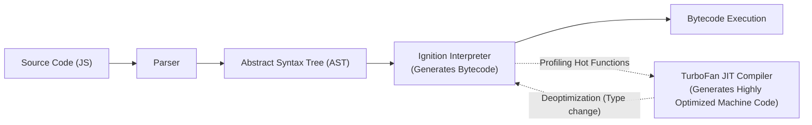

import { Callout } from 'fumadocs-ui/components/callout';
import { Tabs, Tab } from 'fumadocs-ui/components/tabs';

To write high-throughput Node.js microservices and ultra-responsive browser interfaces, developers must understand how JavaScript engines (like Google Chrome's and Node's **V8**) optimize code at runtime.

---

## 1. The V8 Compilation Pipeline

JavaScript is an interpreted language that uses **Just-In-Time (JIT)** compilation to achieve near-native execution speeds:



1. **Parser & AST**: Converts text code into an Abstract Syntax Tree.
2. **Ignition (Interpreter)**: Emits unoptimized bytecode quickly for immediate startup.
3. **TurboFan (JIT Compiler)**: Observes which functions run frequently ("hot functions") and compiles them directly into machine code.
4. **Deoptimization**: If an optimized function is called with unexpected argument types, TurboFan discards the optimized machine code and falls back to Ignition bytecode.

---

## 2. Hidden Classes (Shapes) & Inline Caches

Unlike C++ or Rust, JavaScript objects do not require predefined structs. To access object properties quickly, V8 assigns an internal **Hidden Class (Shape)** to each object:

```javascript
// GOOD: Identical property order shares the same hidden class (Shape)
function createUser(id, name) {
  this.id = id;
  this.name = name;
}

const u1 = new createUser(1, "Alice");
const u2 = new createUser(2, "Bob"); // Shares hidden class with u1 (Fast inline cache lookup)

// BAD: Inconsistent dynamic assignment creates diverging hidden classes
const objA = {};
objA.x = 1;
objA.y = 2;

const objB = {};
objB.y = 2; // Different property order!
objB.x = 1; // Creates two separate hidden classes -> slow property lookup!
```

<Callout type="tip" title="Engine Optimization Rule">
Always initialize all object properties in the constructor or object literal in the exact same order. Avoid dynamically adding or deleting (`delete obj.prop`) properties on high-frequency objects.
</Callout>

---

## 3. Garbage Collection: Mark-and-Sweep

V8 automatically reclaims memory occupied by objects that are no longer reachable from "roots" (the global object and current call stack frames).

### Generational Hypothesis:
Most objects die young. V8 divides the heap into two spaces:
1. **Young Generation (Nursery)**: Small (1–64 MB). Fast, lightweight collection (Scavenger) runs frequently.
2. **Old Generation**: Holds objects that survived multiple scavenger cycles. Collected less frequently using full Mark-Sweep-Compact cycles.

---

## 4. Identifying & Fixing Production Memory Leaks

| Leak Source | The Problem | The Fix |
| :--- | :--- | :--- |
| **Dangling Timers** | `setInterval` retains closures in memory indefinitely | Always call `clearInterval(id)` when component unmounts |
| **Global Listeners** | `window.addEventListener` retains callback references | Remove listener via `removeEventListener` or use `signal: abortController.signal` |
| **Unbounded Caches** | Standard `Map` keys holding deleted objects | Use `WeakMap` or limit cache size using an LRU eviction strategy |
| **Accidental Globals**| Missing `let`/`const` inside functions (`foo = 1`) | Enforce `"use strict"` or use TypeScript/ESLint |

```javascript
// Example: Modern event listener cleanup using AbortSignal
const controller = new AbortController();

window.addEventListener("resize", () => {
  console.log("Window resized");
}, { signal: controller.signal });

// Clean up all attached listeners in one call!
controller.abort();
```

---

## 5. Performance Optimization: Debounce vs Throttle

When handling high-frequency events (typing in a search bar, window scrolling, mouse moving):

```javascript
// Debounce: Waits until user stops firing events for N milliseconds (e.g. search input)
function debounce(fn, delayMs) {
  let timerId;
  return function(...args) {
    clearTimeout(timerId);
    timerId = setTimeout(() => fn.apply(this, args), delayMs);
  };
}

// Throttle: Guarantees function executes at most once every N milliseconds (e.g. scroll tracking)
function throttle(fn, limitMs) {
  let inThrottle = false;
  return function(...args) {
    if (!inThrottle) {
      fn.apply(this, args);
      inThrottle = true;
      setTimeout(() => inThrottle = false, limitMs);
    }
  };
}
```
