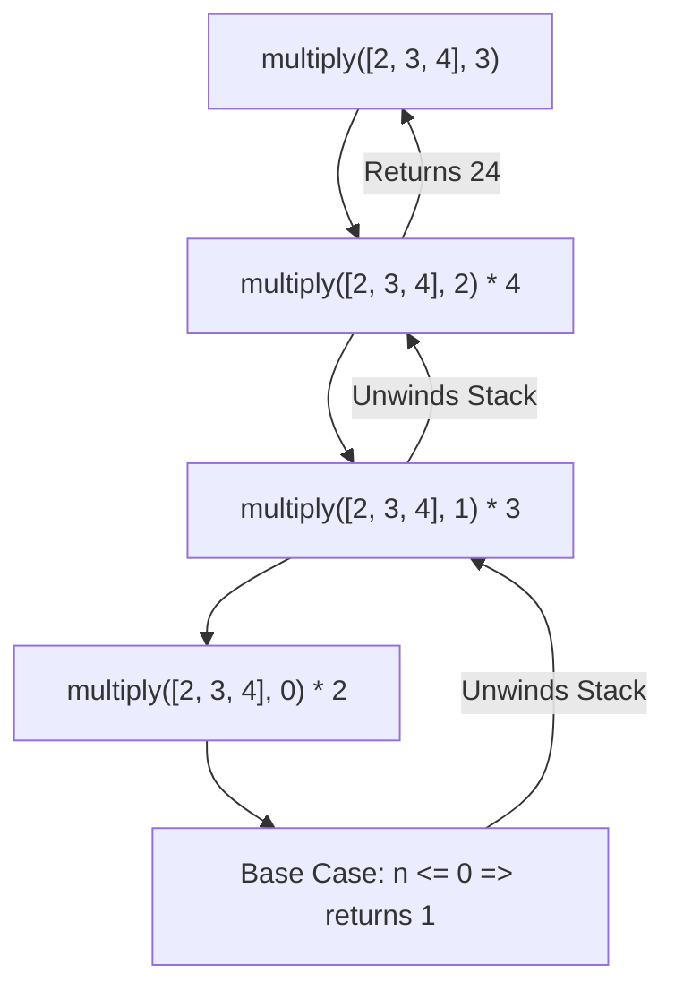

import { Callout } from 'fumadocs-ui/components/callout';
import { Tabs, Tab } from 'fumadocs-ui/components/tabs';

In Computer Science, **recursion** and fundamental **data structures** provide the mental model for decomposing complex problems, traversing nested hierarchies, and scheduling execution sequences.

---

## 1. Recursion Fundamentals

Recursion is the programming technique where a function calls itself to solve a smaller instance of the same problem. Every valid recursive function requires two core components:

1. **The Base Case**: A terminating condition where the function returns a value directly without making further recursive calls.
2. **The Recursive Step**: Calling the function with an updated argument that moves closer to the base case.



### Converting Iteration (Loops) to Recursion

Consider multiplying the first `n` elements of an array.

<Tabs items={['Iterative Loop', 'Recursive Approach']}>
  <Tab value="Iterative Loop">
    ```javascript
    function multiplyLoop(arr, n) {
      let product = 1;
      for (let i = 0; i < n; i++) {
        product *= arr[i];
      }
      return product;
    }

    console.log(multiplyLoop([2, 3, 4], 3)); // 24
    ```
  </Tab>
  <Tab value="Recursive Approach">
    Notice the recurrence relation: `multiply(arr, n) === multiply(arr, n - 1) * arr[n - 1]`.

    ```javascript
    function multiplyRecursive(arr, n) {
      // 1. Base Case: stopping condition
      if (n <= 0) {
        return 1;
      }
      // 2. Recursive Step: smaller subproblem
      return multiplyRecursive(arr, n - 1) * arr[n - 1];
    }

    console.log(multiplyRecursive([2, 3, 4], 3)); // 24
    ```
  </Tab>
</Tabs>

### The Stack Overflow Hazard
Each recursive invocation pushes a new stack frame onto the JavaScript Call Stack. If the base case is missing or unreachable, the stack runs out of allocated memory:

```javascript
// Missing base case
function infiniteLoop() {
  return infiniteLoop();
}

infiniteLoop(); // RangeError: Maximum call stack size exceeded
```

---

## 2. Linear Data Structures: Queue & Stack

### The Queue (FIFO: First-In, First-Out)
In a **Queue**, elements are inserted at the back and removed from the front (like a line of people at a counter).

```javascript
class Queue {
  constructor() {
    this.items = [];
  }

  // Add item to the back of the queue (Enqueue)
  enqueue(element) {
    this.items.push(element);
  }

  // Remove and return item from the front (Dequeue)
  dequeue() {
    if (this.isEmpty()) return null;
    return this.items.shift();
  }

  peek() {
    return this.items[0] ?? null;
  }

  isEmpty() {
    return this.items.length === 0;
  }

  size() {
    return this.items.length;
  }
}

// Practical exercise: Task line-up
function nextInLine(arr, item) {
  arr.push(item);      // Enqueue to the end
  return arr.shift();  // Dequeue and return front
}

const line = [1, 2, 3, 4, 5];
console.log("Servicing:", nextInLine(line, 6)); // 1
console.log("Updated line:", line);             // [2, 3, 4, 5, 6]
```

### The Stack (LIFO: Last-In, First-Out)
In a **Stack**, elements are added and removed from the same end (the top), like a stack of plates:

```javascript
class Stack {
  constructor() {
    this.items = [];
  }

  push(element) {
    this.items.push(element); // O(1)
  }

  pop() {
    return this.items.pop();  // O(1)
  }

  peek() {
    return this.items[this.items.length - 1];
  }
}
```

---

## 3. Object Property Metaprogramming

### The `delete` Operator
The `delete` operator removes a property from an object. If the property exists and is deleted, it returns `true`.

```javascript
const user = { id: 101, username: "alex", role: "moderator" };

delete user.role;
console.log(user); // { id: 101, username: "alex" }
console.log(user.role); // undefined
```

<Callout type="warn" title="What 'delete' Can and Cannot Do">
- `delete` only removes own properties directly on the target object; it does **not** affect properties on the prototype chain.
- Variables declared with `var`, `let`, or `const` cannot be deleted.
- Non-configurable properties (`configurable: false`) cannot be deleted.
</Callout>

### Getters, Setters & Property Descriptors
JavaScript allows defining accessor properties (`get` and `set`) directly in object literals or via `Object.defineProperty`:

```javascript
const temperature = {
  _celsius: 25,

  get celsius() {
    return this._celsius;
  },

  set celsius(value) {
    if (value < -273.15) {
      throw new RangeError("Temperature below absolute zero!");
    }
    this._celsius = value;
  },

  get fahrenheit() {
    return (this._celsius * 9) / 5 + 32;
  }
};

console.log(temperature.fahrenheit); // 77
temperature.celsius = 30;
console.log(temperature.fahrenheit); // 86
```

### Defining Immutable / Hidden Properties
```javascript
const config = {};

Object.defineProperty(config, "API_ENDPOINT", {
  value: "https://api.production.com",
  writable: false,      // Cannot be overwritten
  enumerable: true,     // Appears in Object.keys() and for...in
  configurable: false   // Cannot be deleted or re-configured
});

config.API_ENDPOINT = "https://evil.com"; // Silently fails (or throws TypeError in strict mode)
console.log(config.API_ENDPOINT); // "https://api.production.com"
```
