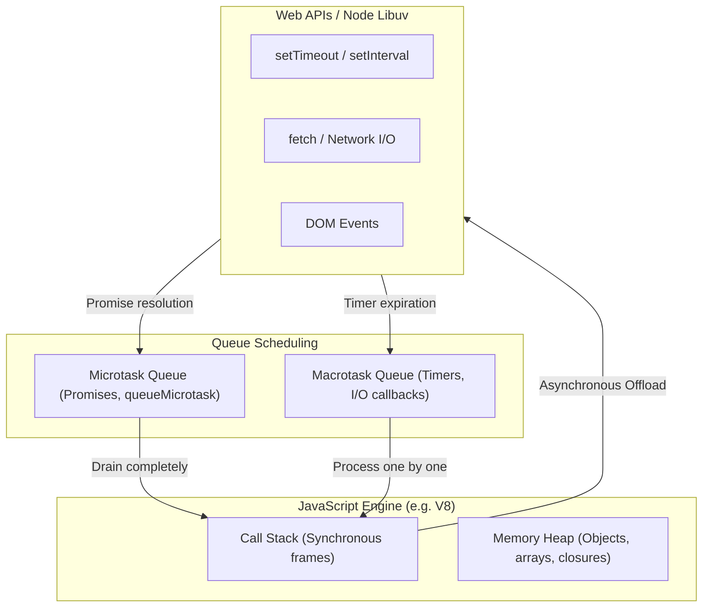

import { Cards, Card } from 'fumadocs-ui/components/card';
import { Callout } from 'fumadocs-ui/components/callout';

Welcome to the **JavaScript Curriculum**.

JavaScript is the undisputed execution language of the browser and powers mission-critical server environments through Node.js, Deno, and Bun. Mastering modern JavaScript requires understanding not just the syntax, but how the engine allocates memory, schedules asynchronous tasks on the event loop, and optimizes JIT bytecode.

Whatever modern framework you use — React, Next.js, Vue, or backend APIs — understanding the core JavaScript runtime model is essential for writing bug-free, high-throughput code.

---

## Curriculum Lessons

<Cards>
  <Card
    title="01. JavaScript Foundations & Syntax"
    href="/docs/full-stack-development/javascript/01-basics-and-syntax"
    description="Variables (const, let), Temporal Dead Zone, Stack vs Heap, coercion, strict equality, and control flow."
  />
  <Card
    title="02. Objects, Arrays & Data Structures"
    href="/docs/full-stack-development/javascript/02-objects-arrays-and-data-structures"
    description="Object prototypes, ES6 classes with #privateFields, modern array transformations, and Map/Set/WeakMap."
  />
  <Card
    title="03. Functions, Closures & Scope"
    href="/docs/full-stack-development/javascript/03-functions-closures-and-scope"
    description="Lexical scope, execution contexts, closure patterns (rate limiters, encapsulation), and the this keyword."
  />
  <Card
    title="04. Asynchronous JavaScript & Promises"
    href="/docs/full-stack-development/javascript/04-asynchronous-javascript"
    description="The Event Loop, Microtask vs Macrotask queues, async/await, Promise concurrency combinators, and AbortController."
  />
  <Card
    title="05. DOM Architecture & Browser Events"
    href="/docs/full-stack-development/javascript/05-dom-and-browser-events"
    description="DOM node traversal, event bubbling & capturing, high-performance event delegation, and Web Observers."
  />
  <Card
    title="06. Modern ECMAScript Features (ES2024–ES2026)"
    href="/docs/full-stack-development/javascript/06-modern-es-features"
    description="Object.groupBy, Promise.withResolvers, new Set operations, optional chaining, nullish coalescing, and ES modules."
  />
  <Card
    title="07. V8 Engine Internals & Performance"
    href="/docs/full-stack-development/javascript/07-v8-engine-and-performance"
    description="Ignition interpreter, TurboFan JIT compiler, hidden classes, garbage collection (Mark-and-Sweep), and memory leaks."
  />
  <Card
    title="08. Regular Expressions (RegExp)"
    href="/docs/full-stack-development/javascript/08-regular-expressions"
    description="Pattern matching, regex syntax, character classes, quantifiers, flags, greedy vs lazy evaluation, and string methods."
  />
  <Card
    title="09. Dates, Time & Mathematical Operations"
    href="/docs/full-stack-development/javascript/09-dates-time-and-math"
    description="Date constructors, UNIX epoch, UTC vs local time, date rollover arithmetic, Intl formatting, and Math random ranges."
  />
  <Card
    title="10. JSON & Data Serialization"
    href="/docs/full-stack-development/javascript/10-json-and-data-serialization"
    description="JSON syntax rules, JSON.stringify with replacers, JSON.parse with revivers, toJSON customization, and error boundaries."
  />
  <Card
    title="11. Recursion, Linear Data Structures & Property Descriptors"
    href="/docs/full-stack-development/javascript/11-recursion-and-data-structures"
    description="Recursive thinking, base cases, call stack unwinding, Queue (FIFO) and Stack (LIFO) patterns, and the delete operator."
  />
  <Card
    title="JavaScript Glossary & Quick Reference"
    href="/docs/full-stack-development/javascript/glossary"
    description="Comprehensive quick-reference cheatsheet of built-in methods, runtime traps, and prototype patterns."
  />
</Cards>

---

## JavaScript Runtime Model

<Callout type="tip" title="Single-Threaded Non-Blocking I/O">
JavaScript has only **one** call stack. To keep user interfaces responsive at 60 FPS, never block the call stack with heavy computation. Long-running mathematical or file-processing tasks should be offloaded to Web Workers or background worker threads.
</Callout>
