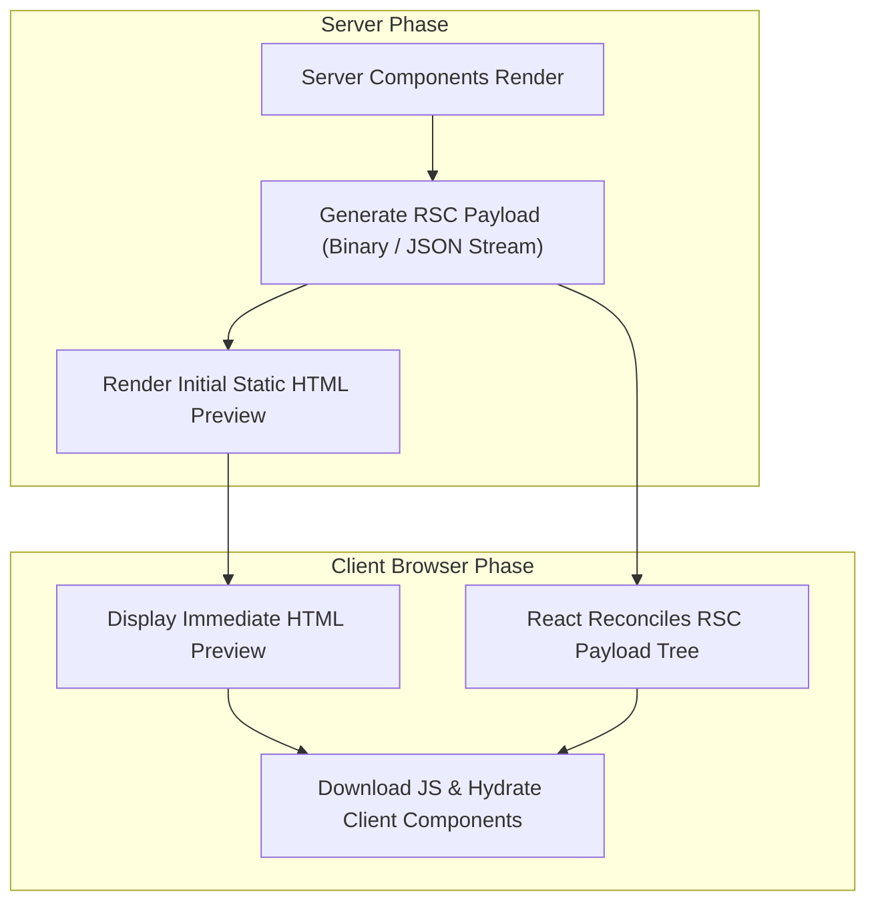

import { Callout } from 'fumadocs-ui/components/callout';
import { Tabs, Tab } from 'fumadocs-ui/components/tabs';

In the Next.js App Router, components are **React Server Components (RSC)** by default. Understanding how Server Components interoperate with Client Components is fundamental to building high-performance web applications.

---

## 1. Why Server Components by Default?

Prior to React Server Components, all React components were bundled and shipped to the client browser, increasing JavaScript parse and execution times. Server Components invert this paradigm:

- **Zero Client JavaScript**: Component code, heavy utility libraries (markdown parsers, date formatters), and data access logic remain exclusively on the server.
- **Direct Backend Integration**: Query databases (Prisma, Drizzle, SQL), internal APIs, and filesystem assets directly inside component definitions without REST API boilerplate.
- **Enhanced Security**: API keys, database credentials, and internal endpoints never leak to the client browser.
- **Automatic Streaming & Fast TTFB**: HTML shells stream immediately while asynchronous data dependencies resolve.

---

## 2. How Server Rendering Works: The RSC Payload

When a route is requested, rendering occurs across two cooperative phases:



<Callout type="info" title="What is the RSC Payload?">
The **RSC Payload** is a compact data stream representing the rendered Server Component tree. It contains:
- The rendered HTML tags and props of Server Components.
- Placeholder markers where Client Components should mount.
- Module references pointing to the JavaScript files required to hydrate Client Components.
- Any props passed from Server Components to Client Components.
</Callout>

---

## 3. Serialization Boundaries

Props passed across the Server-to-Client boundary must be **JSON-serializable**:

| Data Type | Allowed Across Boundary? | Workaround / Best Practice |
| :--- | :---: | :--- |
| Primitives (`string`, `number`, `boolean`, `null`) | <span className="text-green-500 font-bold">Yes</span> | Safe to pass directly. |
| Plain Objects and Arrays | <span className="text-green-500 font-bold">Yes</span> | Must contain serializable values. |
| Server Actions (`'use server'`) | <span className="text-green-500 font-bold">Yes</span> | Can be passed as action props to forms. |
| `Date` objects | <span className="text-red-500 font-bold">No</span> | Convert to ISO string (`date.toISOString()`). |
| `Map` and `Set` | <span className="text-red-500 font-bold">No</span> | Convert to plain Arrays or Objects. |
| Functions & Event Handlers | <span className="text-red-500 font-bold">No</span> | Define event handlers inside Client Components. |
| Class Instances & Database Connections | <span className="text-red-500 font-bold">No</span> | Sanitize into Plain Data Transfer Objects (DTOs). |

---

## 4. Key Composition Pattern: The Children Slot Pattern

A frequent architectural challenge is rendering a Server Component *inside* a Client Component (e.g. inside an interactive modal or expandable accordion).

<Callout type="warning" title="Anti-Pattern: Direct Import">
If you import a Server Component directly into a file marked `'use client'`, that Server Component is automatically converted into a Client Component and bundled into client JavaScript!
</Callout>

### The Correct Pattern: Passing as `children`

Pass the Server Component as a child slot from a parent Server Component:

```tsx
// components/ModalShell.tsx ('use client')
'use client';

import { useState } from 'react';

export function ModalShell({ children }: { children: React.ReactNode }) {
  const [isOpen, setIsOpen] = useState(false);

  return (
    <div>
      <button onClick={() => setIsOpen(true)}>Open Modal</button>
      {isOpen && (
        <div className="modal-dialog">
          <button onClick={() => setIsOpen(false)}>Close</button>
          {children} {/* Renders on the server! */}
        </div>
      )}
    </div>
  );
}
```

```tsx
// app/page.tsx (Server Component)
import { ModalShell } from '@/components/ModalShell';
import db from '@/lib/db';

export default async function Page() {
  const secretData = await db.user.findMany(); // Secure server fetch

  return (
    <ModalShell>
      {/* Retains zero-bundle server execution! */}
      <ul>
        {secretData.map((user) => (
          <li key={user.id}>{user.name}</li>
        ))}
      </ul>
    </ModalShell>
  );
}
```
