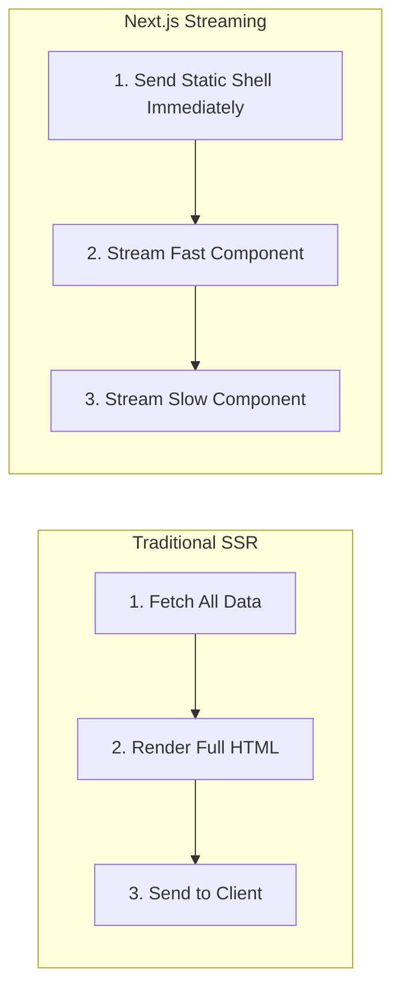

import { Callout } from 'fumadocs-ui/components/callout';
import { Tabs, Tab } from 'fumadocs-ui/components/tabs';

Traditionally, server-rendered applications faced an all-or-nothing trade-off: either generate pages statically at build time (fast, but no personalized data) or block the entire response while waiting for slow database queries (slow Time to First Byte). Next.js solves this with **Streaming** and **Partial Prerendering (PPR)**.

---

## 1. What is Streaming?

Streaming breaks a page's HTML into smaller chunks and progressively sends them to the browser over an open HTTP connection via **HTTP Chunked Transfer Encoding**:



Users see navigation headers and loading skeletons almost immediately (fast TTFB and FCP), while slower data-fetching widgets stream in asynchronously without blocking the user interface.

---

## 2. Using React Suspense Boundaries

Wrap asynchronous, data-fetching Server Components in React `<Suspense>`:

```tsx
// app/dashboard/page.tsx
import { Suspense } from 'react';

async function RevenueChart() {
  // Simulate slow 2-second database query
  const data = await fetchRevenue();
  return <div className="chart">{/* Render chart */}</div>;
}

export default function DashboardPage() {
  return (
    <main>
      <h1>Analytics Overview</h1>

      {/* Immediate fast UI */}
      <nav>Dashboard Breadcrumbs</nav>

      {/* Slow data wrapped in Suspense */}
      <Suspense fallback={<div className="skeleton h-64 w-full">Loading revenue data...</div>}>
        <RevenueChart />
      </Suspense>
    </main>
  );
}
```

### The `loading.tsx` Convention
Adding `loading.tsx` inside a route segment automatically wraps the segment's `page.tsx` in a `<Suspense>` boundary behind the scenes.

---

## 3. Partial Prerendering (PPR)

**Partial Prerendering (PPR)** unifies static and dynamic rendering within the exact same route.

### How PPR Works Under the Hood

1. **Static Shell at Build/Edge Time**: At build time, Next.js pre-renders all static content (layouts, headers, navigation bars, and the Suspense `fallback` skeletons) into static HTML and caches it on the CDN edge.
2. **Dynamic Holes at Request Time**: The asynchronous components inside `<Suspense>` are treated as "dynamic holes".
3. **Instant Delivery**: Upon visiting the URL, the edge CDN responds in ~0ms with the static shell. Simultaneously, the server origin streams the resolved dynamic components into the open HTTP stream.

```plaintext
┌─────────────────────────────────────────────────────────┐
│  STATIC SHELL (Cached at CDN Edge — 0ms TTFB)           │
│  Navbar / Global Layout / Headers                       │
├─────────────────────────────────────────────────────────┤
│  DYNAMIC HOLE (<Suspense fallback={<Skeleton />}>)     │
│  User Profile & Personalized Recommendations (Streamed) │
└─────────────────────────────────────────────────────────┘
```

### Configuring PPR in `next.config.ts`

```typescript
// next.config.ts
import type { NextConfig } from 'next';

const nextConfig: NextConfig = {
  // Enabled via Cache Components or experimental PPR flag
  cacheComponents: true,
};

export default nextConfig;
```
