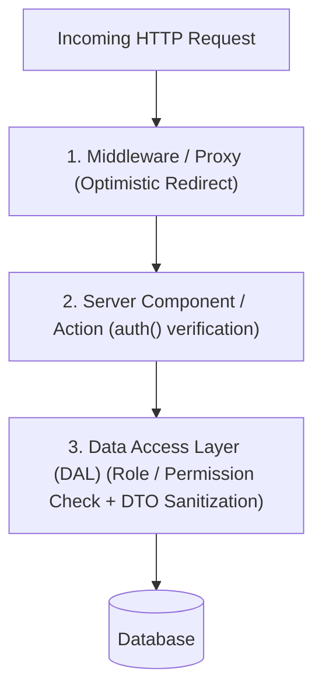

import { Callout } from 'fumadocs-ui/components/callout';
import { Tabs, Tab } from 'fumadocs-ui/components/tabs';

Authentication in the Next.js App Router is **server-first**. By reading session cookies directly inside Server Components and Data Access Layers, you eliminate client-side flashes of unauthenticated content and protect sensitive database logic.

---

## 1. Zero-Trust Security Architecture

Modern enterprise Next.js applications implement a **three-tier security defense**:



1. **Middleware Layer**: Fast, optimistic redirection for users without session cookies before expensive page rendering starts.
2. **Server Action / Component Layer**: Explicit session verification on every public RPC action.
3. **Data Access Layer (DAL)**: Final authority that verifies permissions and strips sensitive columns (password hashes, secret keys) before returning data.

---

## 2. Implementing the Data Access Layer (DAL)

Create a dedicated module protected by `'server-only'` and memoized with React `cache()`:

```typescript
// lib/dal.ts
import 'server-only'; // Throws a compile error if imported into a Client Component!
import { cache } from 'react';
import { cookies } from 'next/headers';
import { redirect } from 'next/navigation';
import db from '@/lib/db';
import { verifyJwt } from '@/lib/jwt';

// Memoized per-request session validator
export const verifySession = cache(async () => {
  const cookie = (await cookies()).get('auth_token')?.value;
  if (!cookie) redirect('/login');

  const session = await verifyJwt(cookie);
  if (!session?.userId) redirect('/login');

  return { userId: session.userId, role: session.role };
});

// Secure data accessor
export async function getUserProfile() {
  const session = await verifySession();

  const user = await db.user.findUnique({
    where: { id: session.userId },
    select: { id: true, name: true, email: true, role: true }, // Exclude password!
  });

  return user;
}
```

---

## 3. Auth.js (NextAuth v5) in Server Components

With Auth.js v5, checking sessions in Server Components is synchronous to the render pipeline:

```tsx
// app/dashboard/page.tsx
import { auth } from '@/auth';
import { redirect } from 'next/navigation';

export default async function DashboardPage() {
  const session = await auth();

  if (!session?.user) {
    redirect('/login');
  }

  return (
    <main>
      <h1>Welcome back, {session.user.name}!</h1>
      <p>Role: {session.user.email}</p>
    </main>
  );
}
```

---

## 4. Preventing Secret Leaks: The React Taint API

React provides experimental taint APIs to ensure server secrets and user passwords can never accidentally cross the RSC boundary into client props:

```typescript
// lib/secrets.ts
import { experimental_taintUniqueValue, experimental_taintObjectReference } from 'react';

export function protectUser(user: { id: string; passwordHash: string }) {
  // Throws if passwordHash is ever passed to a Client Component prop!
  experimental_taintUniqueValue(
    'Do not pass password hashes to the client!',
    user,
    user.passwordHash
  );
}
```
