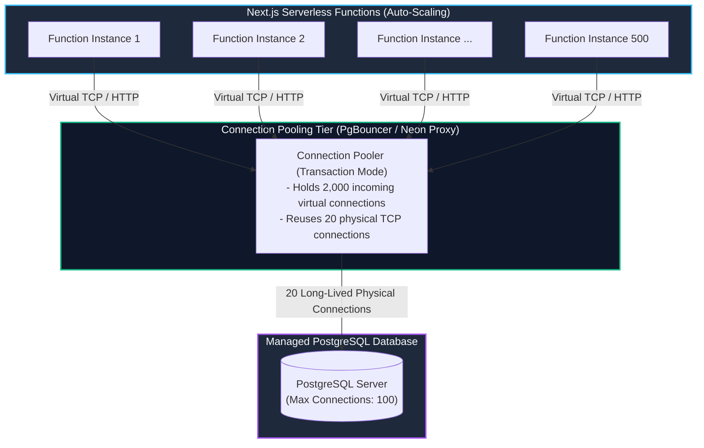
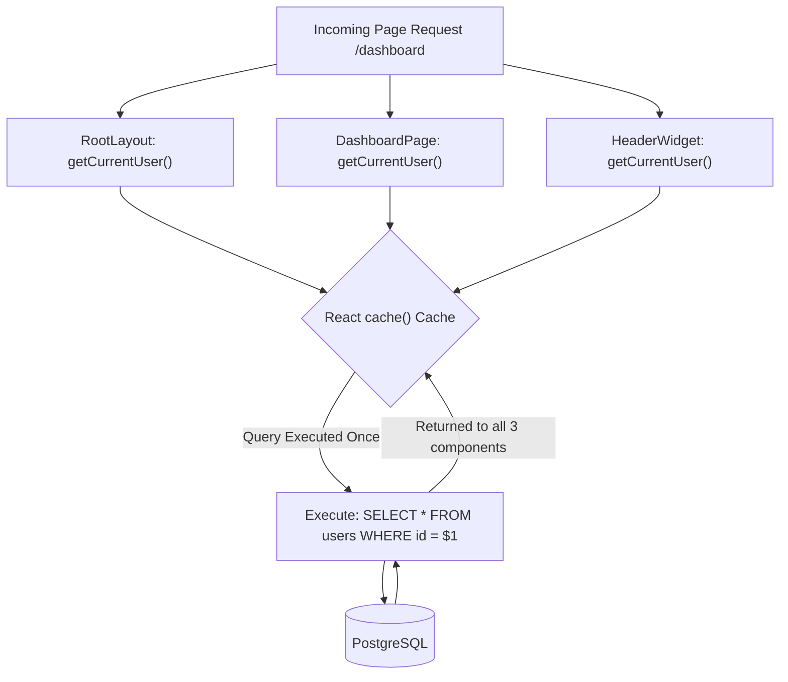

import { Callout } from 'fumadocs-ui/components/callout';
import { Tabs, Tab } from 'fumadocs-ui/components/tabs';
import { Steps, Step } from 'fumadocs-ui/components/steps';
import { Cards, Card } from 'fumadocs-ui/components/card';

Integrating a database into Next.js is fundamentally different from a traditional long-running Express or Spring application. In traditional monolithic servers, a single process boots up, creates a persistent pool of 10–20 TCP database connections, and shares them across thousands of concurrent web requests.

In Next.js—especially when deployed to serverless environments (Vercel, AWS Lambda) or during local development with Hot Module Reloading (HMR)—each serverless function invocation or code reload can inadvertently spin up its own database connection, quickly triggering PostgreSQL's dreaded error:
```text
FATAL: remaining connection slots are reserved for non-replication superuser connections
```

In this lesson, we will master **connection pooling**, architect type-safe data models with **Drizzle ORM** and **Prisma**, implement the **Data Access Layer (DAL)** pattern, and manage production database migrations.

---

## The Serverless Connection Problem & Pooling Architecture

PostgreSQL allocates a dedicated operating system process for every connected client. Because each OS process consumes ~10MB of RAM, a standard managed PostgreSQL instance is typically hard-capped at 100 to 300 simultaneous connections.

When traffic spikes on a serverless Next.js deployment:
1. The platform scales horizontally from 5 to 500 isolated serverless containers.
2. If each container initializes its own connection pool of 5 connections, your database receives `500 * 5 = 2,500` connection attempts.
3. The database runs out of connection slots, crashing the entire application.



### Connection Pooling Solutions

To survive serverless traffic, you must route queries through a connection pooler:

1. **Transaction Pooling (PgBouncer / Supabase Port 6543):**
   A physical database connection is assigned to a serverless function only for the duration of a single database transaction. As soon as the transaction or query completes, the connection is instantly returned to the pool for another function to use.
2. **Serverless HTTP/WebSocket Drivers (Neon `@neondatabase/serverless`):**
   Neon communicates with PostgreSQL over standard HTTP `fetch` or WebSockets rather than stateful raw TCP sockets. Each query executes as a stateless HTTP POST request, completely bypassing the OS socket limit.
3. **The `globalThis` Singleton Pattern (Preventing HMR Leaks):**
   During Next.js local development (`next dev`), saving a file reloads the server module. Without a singleton, each file save initializes a brand-new ORM client, quickly exhausting database connections locally.

---

## Architectural Comparison: Drizzle ORM vs. Prisma

| Feature | Drizzle ORM | Prisma ORM |
| :--- | :--- | :--- |
| **Philosophy** | "If you know SQL, you know Drizzle." Zero abstractions over relational algebra. | High-level declarative schema abstraction with auto-generated query client. |
| **Schema Language** | Pure TypeScript (`pgTable`, `text`, `timestamp`) | Custom Prisma Schema DSL (`schema.prisma`) |
| **Bundle Size & Cold Start**| Ultra-lightweight (~5KB), zero binary dependencies, instant cold starts (under 5ms) | Requires Prisma Query Engine (Wasm or binary engine, ~15MB) |
| **Edge Runtime Support** | Native out of the box (via Neon HTTP / Cloudflare D1) | Supported via Driver Adapters (`@prisma/adapter-neon`, `@prisma/adapter-pg`) |
| **Relational Queries** | Both SQL-like query builder and structured `db.query` relational API | Intuitive nested `include` and `select` API |
| **Best Suited For** | High-performance serverless apps, Edge deployments, SQL purists | Rapid prototyping, large enterprise teams, complex migrations |

---

## Solution A: Drizzle ORM with PostgreSQL

Let's build a type-safe relational schema with Drizzle ORM connecting to PostgreSQL via connection pooling.

### 1. Schema Definition (`schema.ts`)

```ts
// lib/db/schema.ts
import { pgTable, text, timestamp, uuid, boolean, integer, index } from 'drizzle-orm/pg-core';
import { relations } from 'drizzle-orm';

// Users Table
export const users = pgTable('users', {
  id: uuid('id').defaultRandom().primaryKey(),
  email: text('email').notNull().unique(),
  name: text('name').notNull(),
  role: text('role', { enum: ['user', 'admin'] }).default('user').notNull(),
  createdAt: timestamp('created_at').defaultNow().notNull(),
  updatedAt: timestamp('updated_at').defaultNow().notNull(),
});

// Organizations Table
export const organizations = pgTable('organizations', {
  id: uuid('id').defaultRandom().primaryKey(),
  name: text('name').notNull(),
  slug: text('slug').notNull().unique(),
  ownerId: uuid('owner_id').references(() => users.id, { onDelete: 'cascade' }).notNull(),
  createdAt: timestamp('created_at').defaultNow().notNull(),
});

// Projects Table
export const projects = pgTable('projects', {
  id: uuid('id').defaultRandom().primaryKey(),
  organizationId: uuid('org_id').references(() => organizations.id, { onDelete: 'cascade' }).notNull(),
  title: text('title').notNull(),
  budgetUSD: integer('budget_usd').default(0).notNull(),
  isArchived: boolean('is_archived').default(false).notNull(),
  createdAt: timestamp('created_at').defaultNow().notNull(),
}, (table) => [
  index('org_idx').on(table.organizationId),
]);

// Relational Mappings
export const usersRelations = relations(users, ({ many }) => ({
  ownedOrganizations: many(organizations),
}));

export const organizationsRelations = relations(organizations, ({ one, many }) => ({
  owner: one(users, {
    fields: [organizations.ownerId],
    references: [users.id],
  }),
  projects: many(projects),
}));

export const projectsRelations = relations(projects, ({ one }) => ({
  organization: one(organizations, {
    fields: [projects.organizationId],
    references: [organizations.id],
  }),
}));

// TypeScript Inferred Types
export type User = typeof users.$inferSelect;
export type NewUser = typeof users.$inferInsert;
export type Project = typeof projects.$inferSelect;
export type NewProject = typeof projects.$inferInsert;
```

### 2. Client Setup with Singleton & Connection Pooling (`db.ts`)

```ts
// lib/db/index.ts
import { drizzle } from 'drizzle-orm/node-postgres';
import { Pool } from 'pg';
import * as schema from './schema';

// Prevent multiple connection pools during Next.js Hot Module Reload (HMR)
const globalForDb = globalThis as unknown as {
  pool: Pool | undefined;
};

const pool =
  globalForDb.pool ??
  new Pool({
    connectionString: process.env.DATABASE_URL, // Points to PgBouncer / Neon pooler port
    max: 10, // Max connections per serverless container
    idleTimeoutMillis: 30000,
    connectionTimeoutMillis: 5000,
  });

if (process.env.NODE_ENV !== 'production') {
  globalForDb.pool = pool;
}

export const db = drizzle(pool, { schema });
```

### 3. Migrations Configuration (`drizzle.config.ts`)

```ts
// drizzle.config.ts
import { defineConfig } from 'drizzle-kit';

export default defineConfig({
  schema: './lib/db/schema.ts',
  out: './drizzle/migrations',
  dialect: 'postgresql',
  dbCredentials: {
    url: process.env.DATABASE_DIRECT_URL || process.env.DATABASE_URL!, // Direct session port 5432 for migrations!
  },
  verbose: true,
  strict: true,
});
```

<Callout type="warn" title="Direct Port vs. Pooler Port for Migrations">
Always run database migrations (`drizzle-kit migrate` or `prisma migrate deploy`) against the **Direct Database Port** (usually `5432` on Supabase/Neon), **NOT** the transaction pooler port (`6543`). Transaction poolers disable prepared statements and session-level schema locks required by migration scripts!
</Callout>

---

## Solution B: Prisma ORM with Serverless Driver Adapters

If your team chooses Prisma, configure the **Neon Serverless Driver Adapter** to prevent cold start bottlenecks and avoid connection exhaustion.

### 1. Prisma Schema (`prisma/schema.prisma`)

```prisma
datasource db {
  provider = "postgresql"
  url      = env("DATABASE_URL")
}

generator client {
  provider        = "prisma-client-js"
  previewFeatures = ["driverAdapters"]
}

enum Role {
  USER
  ADMIN
}

model User {
  id            String         @id @default(uuid())
  email         String         @unique
  name          String
  role          Role           @default(USER)
  organizations Organization[]
  createdAt     DateTime       @default(now()) @map("created_at")
  updatedAt     DateTime       @updatedAt @map("updated_at")

  @@map("users")
}

model Organization {
  id        String    @id @default(uuid())
  name      String
  slug      String    @unique
  ownerId   String    @map("owner_id")
  owner     User      @relation(fields: [ownerId], references: [id], onDelete: Cascade)
  projects  Project[]
  createdAt DateTime  @default(now()) @map("created_at")

  @@map("organizations")
}

model Project {
  id             String       @id @default(uuid())
  title          String
  budgetUSD      Int          @default(0) @map("budget_usd")
  isArchived     Boolean      @default(false) @map("is_archived")
  organizationId String       @map("org_id")
  organization   Organization @relation(fields: [organizationId], references: [id], onDelete: Cascade)
  createdAt      DateTime     @default(now()) @map("created_at")

  @@index([organizationId])
  @@map("projects")
}
```

### 2. Prisma Client Singleton (`lib/prisma.ts`)

```ts
// lib/prisma.ts
import { PrismaClient } from '@prisma/client';
import { Pool } from 'pg';
import { PrismaPg } from '@prisma/adapter-pg';

const globalForPrisma = globalThis as unknown as {
  prisma: PrismaClient | undefined;
};

const connectionString = process.env.DATABASE_URL!;
const pool = new Pool({ connectionString, max: 10 });
const adapter = new PrismaPg(pool);

export const prisma =
  globalForPrisma.prisma ??
  new PrismaClient({
    adapter,
    log: process.env.NODE_ENV === 'development' ? ['query', 'error', 'warn'] : ['error'],
  });

if (process.env.NODE_ENV !== 'production') {
  globalForPrisma.prisma = prisma;
}
```

---

## The Data Access Layer (DAL) & Request Deduplication with React `cache()`

In a large Next.js application, multiple Server Components within the same page tree might need the same user data:
- `app/layout.tsx` checks the user's role to render the navigation bar.
- `app/dashboard/page.tsx` checks the user's subscription tier.
- `app/dashboard/components/Header.tsx` displays the user's avatar.

Without optimization, this would trigger **three redundant database queries** in the same HTTP request!

By wrapping queries inside React's `cache()` function, Next.js **memoizes the query per request**. If the function is called five times during a single render lifecycle, the database is queried exactly once.



### Production DAL Implementation

```ts
// lib/dal/users.ts
import 'server-only'; // Enforces that this module can NEVER be imported by Client Components
import { cache } from 'react';
import { db } from '@/lib/db';
import { auth } from '@/lib/auth';

/**
 * Returns the currently authenticated user record.
 * Memoized per-request using React cache(): safe to call anywhere in the RSC tree.
 */
export const getCurrentUser = cache(async () => {
  const session = await auth();
  if (!session?.user?.id) return null;

  try {
    const user = await db.query.users.findFirst({
      where: (users, { eq }) => eq(users.id, session.user.id),
      with: {
        ownedOrganizations: {
          with: {
            projects: true,
          },
        },
      },
    });

    return user ?? null;
  } catch (error) {
    console.error('Failed to fetch user in DAL:', error);
    return null;
  }
});
```

---

## Safe Multi-Table Mutations with Transactions

When mutating multiple tables (e.g., creating an organization and immediately generating its default project), always wrap operations in a database transaction to prevent orphaned rows if an error occurs mid-way:

```ts
// app/organizations/actions.ts
'use server';

import { db } from '@/lib/db';
import { organizations, projects } from '@/lib/db/schema';
import { auth } from '@/lib/auth';
import { revalidatePath } from 'next/cache';

export async function createOrganizationWithDefaultProject(name: string, slug: string) {
  const session = await auth();
  if (!session?.user?.id) throw new Error('Unauthorized');

  // Atomic database transaction
  const result = await db.transaction(async (tx) => {
    // 1. Create Organization
    const [newOrg] = await tx
      .insert(organizations)
      .values({
        name,
        slug,
        ownerId: session.user.id,
      })
      .returning();

    // 2. Automatically seed default starter project
    const [starterProject] = await tx
      .insert(projects)
      .values({
        organizationId: newOrg.id,
        title: 'General Workspace',
        budgetUSD: 0,
      })
      .returning();

    return { organization: newOrg, project: starterProject };
  });

  revalidatePath('/dashboard');
  return result;
}
```

---

## Key Takeaways

<Steps>
  <Step>
    ### Always Route Through a Connection Pooler
    Never connect a serverless Next.js deployment directly to a PostgreSQL database without a transaction pooler (PgBouncer) or HTTP driver (Neon), or you will exhaust connection slots under load.
  </Step>
  <Step>
    ### Protect Local Dev with the globalThis Singleton
    Store your ORM client instance on `globalThis` in development to prevent Hot Module Reloading from spawning redundant connection pools.
  </Step>
  <Step>
    ### Deduplicate Requests with React cache()
    Wrap read queries in `react.cache()` inside your Data Access Layer (DAL) so multiple Server Components can read identical data without duplicating SQL queries.
  </Step>
  <Step>
    ### Enforce Transactions for Multi-Table Writes
    Always wrap interdependent database writes inside `db.transaction()` to guarantee atomic commits and protect data integrity against partial failures.
  </Step>
</Steps>
