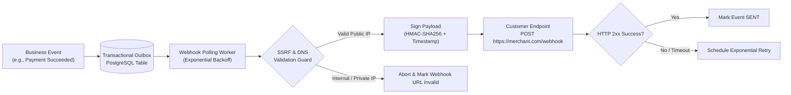
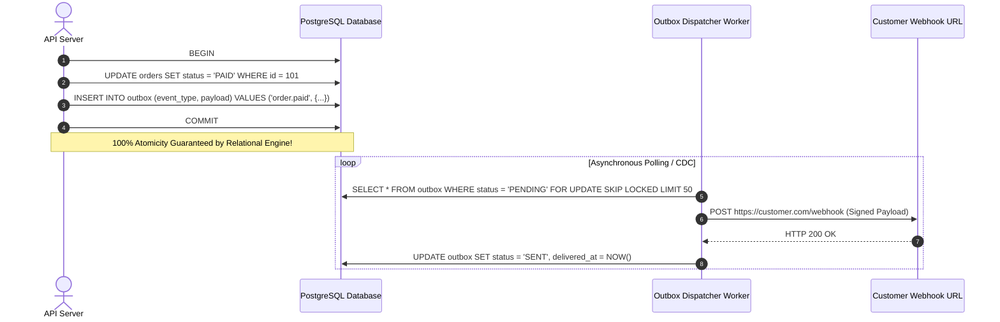
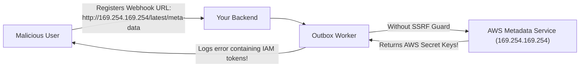

import { Callout } from 'fumadocs-ui/components/callout';
import { Tabs, Tab } from 'fumadocs-ui/components/tabs';
import { Steps, Step } from 'fumadocs-ui/components/steps';
import { Cards, Card } from 'fumadocs-ui/components/card';

While REST APIs operate on an inbound pull model (clients ask your server for data), **Webhooks** invert this relationship into an outbound event-driven architecture: when a business event occurs (e.g. an order is paid, a build succeeds, or an invoice fails), your backend acts as an HTTP client, pushing real-time payloads to external URLs registered by subscribers.

However, operating a webhook publishing system introduces critical distributed systems challenges:
1. **The Dual-Write Problem**: Ensuring events are never lost if your server crashes between saving to the database and publishing to the network.
2. **Cryptographic Integrity**: Proving payload authenticity to subscribers and defending against replay attacks.
3. **Provider-Side SSRF Vulnerabilities**: Preventing malicious customers from registering webhook URLs that probe your internal network, database ports, or cloud instance metadata.

---

## 1. Webhook Architecture: The Inverted HTTP Pattern



<Callout type="warn" title="Never Dispatch Webhooks Synchronously">
Never execute webhook HTTP calls inside your primary API handler or database transaction. External subscriber servers may be slow, rate-limited, or completely offline. Dispatched webhooks must be buffered and processed asynchronously.
</Callout>

---

## 2. The Dual-Write Problem & The Transactional Outbox Pattern

When a business event occurs (such as an order being paid), a naive implementation does this:

```typescript
// THE DUAL-WRITE BUG:
await db.orders.update({ where: { id }, data: { status: 'PAID' } }); // 1. DB Commit
await messageQueue.publish('order.paid', { orderId: id });           // 2. Network Dispatch
```

### Why Dual-Writes Inevitably Corrupt State
In distributed systems, step 1 and step 2 cannot be atomically linked without complex Two-Phase Commit (2PC) protocols that destroy throughput:
- **Case A**: Step 1 commits, but the application crashes, network disconnects, or the queue runs out of memory before Step 2. **Result**: The order is marked paid in the database, but the webhook is never sent!
- **Case B**: Step 2 publishes first, but the database transaction rolls back due to a constraint violation. **Result**: A ghost webhook is dispatched for a transaction that never existed!

### The Solution: The Transactional Outbox Pattern

Instead of publishing directly to the network, you write the event to a dedicated `outbox` table **inside the exact same ACID database transaction** as the business mutation:



### PostgreSQL Outbox Table Schema

```sql
CREATE TYPE outbox_status AS ENUM ('pending', 'processing', 'sent', 'failed');

CREATE TABLE outbox (
    id UUID PRIMARY KEY DEFAULT gen_random_uuid(),
    aggregate_type VARCHAR(64) NOT NULL,
    aggregate_id VARCHAR(64) NOT NULL,
    event_type VARCHAR(64) NOT NULL,
    payload JSONB NOT NULL,
    destination_url TEXT NOT NULL,
    secret_key TEXT NOT NULL,
    status outbox_status NOT NULL DEFAULT 'pending',
    attempts INT NOT NULL DEFAULT 0,
    max_attempts INT NOT NULL DEFAULT 5,
    last_error TEXT,
    next_retry_at TIMESTAMPTZ NOT NULL DEFAULT NOW(),
    created_at TIMESTAMPTZ NOT NULL DEFAULT NOW(),
    delivered_at TIMESTAMPTZ
);

CREATE INDEX idx_outbox_queue 
ON outbox (status, next_retry_at) 
WHERE status IN ('pending', 'processing');
```

---

## 3. Provider-Side SSRF Protection: Defending Internal Networks

When allowing customers to configure webhook URLs (e.g. `https://api.myclient.com/webhooks`), your backend essentially makes outbound HTTP requests to user-controlled destinations.

### The Attack Vector: Server-Side Request Forgery (SSRF)

An attacker registers webhook URLs targeting your private infrastructure:
- **Cloud Instance Metadata**: `http://169.254.169.254/latest/meta-data/iam/security-credentials/` (Stealing AWS IAM role keys!)
- **Localhost Services**: `http://127.0.0.1:6379/` (Sending commands to Redis) or `http://localhost:5432/`
- **Private Subnets (RFC 1918)**: `http://10.0.0.15/internal-admin/` or `http://192.168.1.1/`
- **DNS Rebinding Attacks**: The attacker registers a domain whose DNS TTL is 0. During validation it resolves to a harmless public IP, but during actual dispatch it resolves to `169.254.169.254`.



### Production SSRF Guard: Resolving & Validating IPs (TypeScript)

Before dispatching an HTTP request, your worker must resolve the domain to its physical IP address and verify it does not belong to reserved, loopback, or private ranges:

```typescript
import dns from "node:dns/promises";
import net from "node:net";

export class SSRFProtector {
  // Disallowed IP ranges and CIDR blocks
  private static readonly BLOCKED_IP_PATTERNS = [
    /^127\./,                         // IPv4 Loopback (127.0.0.0/8)
    /^10\./,                          // RFC 1918 Class A (10.0.0.0/8)
    /^172\.(1[6-9]|2[0-9]|3[0-1])\./, // RFC 1918 Class B (172.16.0.0/12)
    /^192\.168\./,                    // RFC 1918 Class C (192.168.0.0/16)
    /^169\.254\./,                    // Link-Local / Cloud Metadata (169.254.0.0/16)
    /^0\./,                           // Current network
    /^::1$/,                          // IPv6 Loopback
    /^fc00:/i,                        // IPv6 Unique Local Address
    /^fe80:/i,                        // IPv6 Link-Local
  ];

  /**
   * Validates a target webhook URL against SSRF attacks.
   * Throws an error if the destination points to private or cloud infrastructure.
   */
  static async validateUrl(urlString: string): Promise<string> {
    const parsed = new URL(urlString);

    // Only allow secure HTTPS (or HTTP in local test environments)
    if (parsed.protocol !== "https:" && parsed.protocol !== "http:") {
      throw new Error(`Invalid protocol: ${parsed.protocol}`);
    }

    const hostname = parsed.hostname;

    // Reject direct IP addresses in hostname if private
    if (net.isIP(hostname)) {
      if (this.isPrivateIP(hostname)) {
        throw new Error(`Forbidden target IP: ${hostname}`);
      }
      return urlString;
    }

    // Resolve DNS records to verify resolved physical IP
    const addresses = await dns.resolve4(hostname);
    if (!addresses || addresses.length === 0) {
      throw new Error(`Could not resolve hostname: ${hostname}`);
    }

    for (const ip of addresses) {
      if (this.isPrivateIP(ip)) {
        throw new Error(
          `SSRF Security Violation: Domain ${hostname} resolves to private IP ${ip}`
        );
      }
    }

    return urlString;
  }

  private static isPrivateIP(ip: string): boolean {
    return this.BLOCKED_IP_PATTERNS.some((pattern) => pattern.test(ip));
  }
}
```

---

## 4. Cryptographic Security: HMAC Signatures & Replay Defenses

Because webhook endpoints are public URLs exposed on the internet, subscribers need cryptographic proof that the payload was generated by your platform and not by an imposter.

### The Three Defensive Pillars

1. **Authenticity & Integrity (HMAC-SHA256)**: The payload is hashed with a shared secret key using HMAC-SHA256. Any modification to a single character of the JSON body invalidates the signature.
2. **Replay Protection (Timestamp Verification)**: Attackers capturing signed requests cannot replay them later. The subscriber verifies that the signed timestamp is within a tight tolerance window (e.g. within 300 seconds).
3. **Timing-Safe Comparison**: Attackers cannot guess valid signatures byte-by-byte using response timing variations. Comparisons must use constant-time operations (`crypto.timingSafeEqual`).

---

## 5. Production Implementation: Webhook Signer & Verifier (TypeScript)

Here is a battle-tested webhook signature engine following the Stripe standard:

```typescript
import { createHmac, timingSafeEqual } from "node:crypto";

export class WebhookSecurity {
  /**
   * Generates a signed webhook header containing timestamp and HMAC-SHA256 digest.
   * Format: "t=1714500000,v1=5d41402abc..."
   */
  static generateSignature(rawPayload: string, secretKey: string): string {
    const timestamp = Math.floor(Date.now() / 1000);
    const signedPayload = `${timestamp}.${rawPayload}`;

    const signature = createHmac("sha256", secretKey)
      .update(signedPayload)
      .digest("hex");

    return `t=${timestamp},v1=${signature}`;
  }

  /**
   * Verifies an incoming webhook's authenticity, integrity, and timestamp freshness.
   */
  static verifySignature({
    rawPayload,
    signatureHeader,
    secretKey,
    toleranceSeconds = 300, // 5 minute freshness window
  }: {
    rawPayload: string;
    signatureHeader: string;
    secretKey: string;
    toleranceSeconds?: number;
  }): boolean {
    // 1. Parse the header: "t=1714500000,v1=abc..."
    const elements = signatureHeader.split(",");
    const timestampItem = elements.find((el) => el.startsWith("t="));
    const signatureItem = elements.find((el) => el.startsWith("v1="));

    if (!timestampItem || !signatureItem) {
      throw new Error("Malformed signature header");
    }

    const timestamp = parseInt(timestampItem.split("=")[1], 10);
    const receivedSignature = signatureItem.split("=")[1];

    // 2. Defend against Replay Attacks: Check timestamp tolerance
    const currentTimestamp = Math.floor(Date.now() / 1000);
    if (Math.abs(currentTimestamp - timestamp) > toleranceSeconds) {
      throw new Error(`Webhook timestamp expired. Age: ${currentTimestamp - timestamp}s`);
    }

    // 3. Re-compute expected signature
    const signedPayload = `${timestamp}.${rawPayload}`;
    const expectedSignature = createHmac("sha256", secretKey)
      .update(signedPayload)
      .digest("hex");

    // 4. Defend against Timing Attacks: Constant-time buffer comparison
    const receivedBuffer = Buffer.from(receivedSignature, "utf-8");
    const expectedBuffer = Buffer.from(expectedSignature, "utf-8");

    if (receivedBuffer.length !== expectedBuffer.length) {
      return false;
    }

    return timingSafeEqual(receivedBuffer, expectedBuffer);
  }
}
```

<Callout type="error" title="Critical Requirement: Raw Request Body">
When verifying incoming webhooks in Express, Fastify, or Next.js, **you must use the raw, unparsed request body string (Buffer)**. If your framework parses the JSON before verification, key re-ordering or whitespace formatting will alter the string, causing valid HMAC signatures to fail!
</Callout>

---

## 6. The Outbox Polling Worker Implementation

Here is the asynchronous dispatcher loop that polls the PostgreSQL outbox using `FOR UPDATE SKIP LOCKED` and handles retries with exponential backoff:

```typescript
import { SSRFProtector } from "./ssrf-protector";
import { WebhookSecurity } from "./webhook-security";

export class OutboxDispatcher {
  private running = true;

  async startPollingLoop(db: any) {
    while (this.running) {
      try {
        // Fetch up to 10 pending events safely across concurrent workers
        const events = await db.$queryRaw`
          SELECT * FROM outbox 
          WHERE status = 'pending' AND next_retry_at <= NOW()
          ORDER BY created_at ASC 
          LIMIT 10
          FOR UPDATE SKIP LOCKED;
        `;

        for (const event of events) {
          await this.dispatchSingleEvent(db, event);
        }
      } catch (err) {
        console.error("[Outbox Loop Error]", err);
      }

      // Sleep 500ms before next polling tick
      await new Promise((r) => setTimeout(r, 500));
    }
  }

  private async dispatchSingleEvent(db: any, event: any) {
    try {
      // 1. SSRF Protection Check
      await SSRFProtector.validateUrl(event.destination_url);

      // 2. Prepare Payload & Signature
      const rawPayload = JSON.stringify(event.payload);
      const signature = WebhookSecurity.generateSignature(rawPayload, event.secret_key);

      // 3. Dispatch HTTP Request
      const controller = new AbortController();
      const timeout = setTimeout(() => controller.abort(), 10000); // 10s timeout

      const response = await fetch(event.destination_url, {
        method: "POST",
        headers: {
          "Content-Type": "application/json",
          "X-Signature": signature,
          "User-Agent": "Platform-Webhooks/1.0",
        },
        body: rawPayload,
        signal: controller.signal,
      });
      clearTimeout(timeout);

      if (!response.ok) {
        throw new Error(`Destination returned HTTP status ${response.status}`);
      }

      // 4. Mark Delivered
      await db.$executeRaw`
        UPDATE outbox 
        SET status = 'sent', delivered_at = NOW() 
        WHERE id = ${event.id};
      `;
    } catch (err: any) {
      const nextAttempt = event.attempts + 1;
      const isExhausted = nextAttempt >= event.max_attempts;

      // Exponential backoff: 30s, 2m, 8m, 32m...
      const backoffSeconds = Math.pow(4, nextAttempt) * 30;

      await db.$executeRaw`
        UPDATE outbox 
        SET 
          attempts = ${nextAttempt},
          status = ${isExhausted ? 'failed' : 'pending'},
          last_error = ${err.message},
          next_retry_at = NOW() + (${backoffSeconds} * INTERVAL '1 second')
        WHERE id = ${event.id};
      `;
    }
  }
}
```

---

## Key Architecture Takeaways

<Cards>
  <Card
    title="Transactional Outbox Pattern"
    description="Eliminate dual-write hazards by committing business entity changes and outbox event records in the same atomic database transaction."
  />
  <Card
    title="Provider-Side SSRF Protection"
    description="Validate customer webhook URLs using DNS resolution before dispatch to block requests targeting 169.254.169.254, localhost, and RFC 1918 subnets."
  />
  <Card
    title="HMAC-SHA256 & Timestamps"
    description="Sign raw payload strings with shared secrets, append Unix epoch timestamps, and compare digests using crypto.timingSafeEqual."
  />
  <Card
    title="Asynchronous Retry Scheduling"
    description="Poll pending outbox rows with FOR UPDATE SKIP LOCKED and back off exponentially on failing subscriber destinations."
  />
</Cards>
