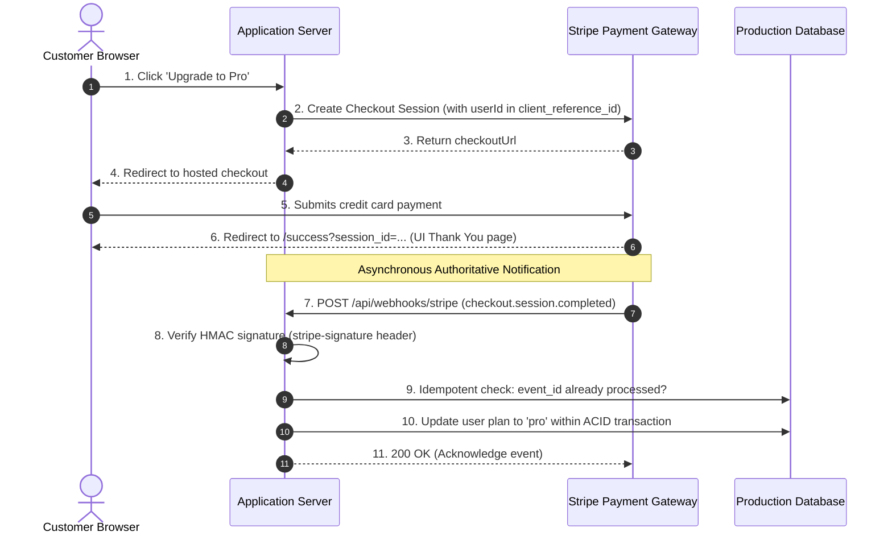

import { Callout } from 'fumadocs-ui/components/callout';
import { Cards, Card } from 'fumadocs-ui/components/card';
import { Steps, Step } from 'fumadocs-ui/components/steps';

Integrating third-party payment rails (such as Stripe, Lemon Squeezy, or PayPal) requires strict consistency guarantees. Networks fail, webhooks retry multiple times, and users close browser tabs mid-transaction.

Production payment architectures decouple the user interface from authoritative transaction confirmation using **Asynchronous Webhooks** and **Idempotency Keys**.

---

## Transaction Lifecycle & Webhook Architecture

Never fulfill an order or activate a subscription solely based on client-side redirect callbacks (`/success?session_id=...`). The client redirect can be spoofed or closed early. Always wait for the signed backend webhook:



---

## Secure Webhook Handler (Node.js / Next.js)

```typescript
import { headers } from 'next/headers';
import Stripe from 'stripe';

const stripe = new Stripe(process.env.STRIPE_SECRET_KEY!, { apiVersion: '2024-06-20' });

export async function POST(req: Request) {
  // Webhook verification requires the raw, unparsed string buffer
  const rawBody = await req.text();
  const signature = (await headers()).get('stripe-signature');

  if (!signature) {
    return new Response('Missing signature header', { status: 400 });
  }

  let event: Stripe.Event;
  try {
    event = stripe.webhooks.constructEvent(
      rawBody,
      signature,
      process.env.STRIPE_WEBHOOK_SECRET!
    );
  } catch (err: any) {
    return new Response(`Webhook Error: ${err.message}`, { status: 400 });
  }

  // Idempotent processing: prevent duplicate fulfillment on webhook retries
  switch (event.type) {
    case 'checkout.session.completed': {
      const session = event.data.object as Stripe.Checkout.Session;
      await fulfillCustomerOrder(session);
      break;
    }
    case 'customer.subscription.deleted': {
      const subscription = event.data.object as Stripe.Subscription;
      await revokeCustomerAccess(subscription);
      break;
    }
  }

  return new Response(JSON.stringify({ received: true }), { status: 200 });
}
```

---

## Essential Production Guardrails

<Steps>
<Step>
### Use Idempotency Keys on All Outgoing Mutations
Whenever requesting a charge or creating a customer via the API, pass a unique `Idempotency-Key` (e.g., `idempotency-key: charge_order_9872`). If a network timeout causes a retry, the payment provider guarantees you won't charge the customer twice.
</Step>

<Step>
### Store the Raw Webhook Event ID
Record processed `event.id` values in your database. If Stripe retries sending `evt_12345` due to a transient network blip, your handler can immediately return `200 OK` without re-running fulfillment logic.
</Step>

<Step>
### Model Subscriptions as a Finite State Machine
Support all lifecycle states: `incomplete`, `trialing`, `active`, `past_due`, and `canceled`. Build grace periods for failed renewals (`invoice.payment_failed`) to prevent abrupt customer lockouts.
</Step>
</Steps>

---

## Lessons in This Track

<Cards>
  <Card
    title="01. Webhooks & Event-Driven Architecture"
    href="/docs/full-stack-development/payments-and-integrations/01-webhooks-and-event-driven-architecture"
    description="Event-driven push notifications, cryptographic HMAC-SHA256 signature verification over raw bytes, timestamp replay attack defense, and idempotent database deduplication."
  />
</Cards>
