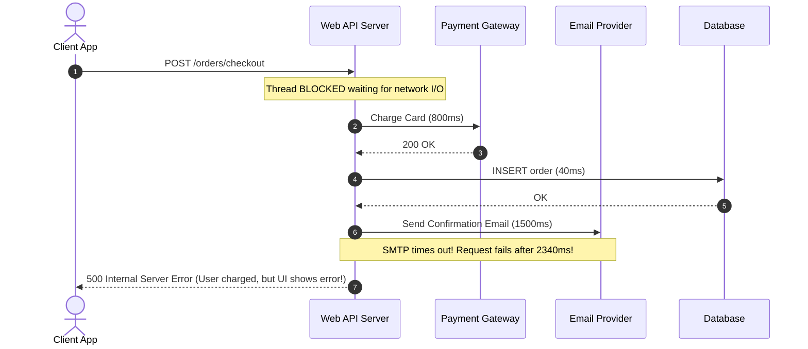
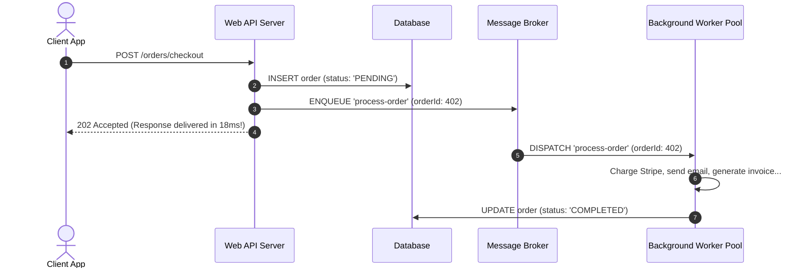
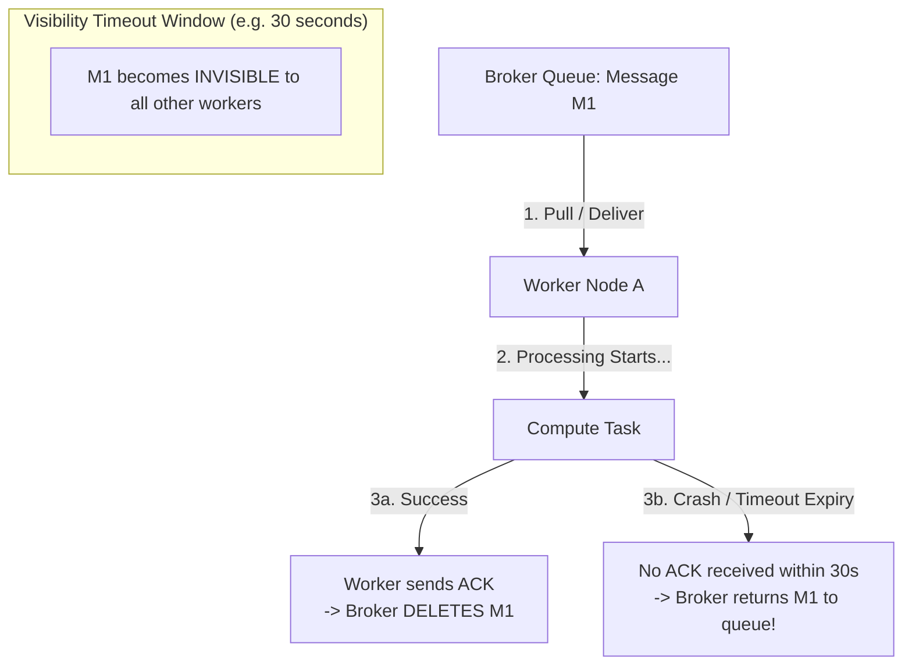
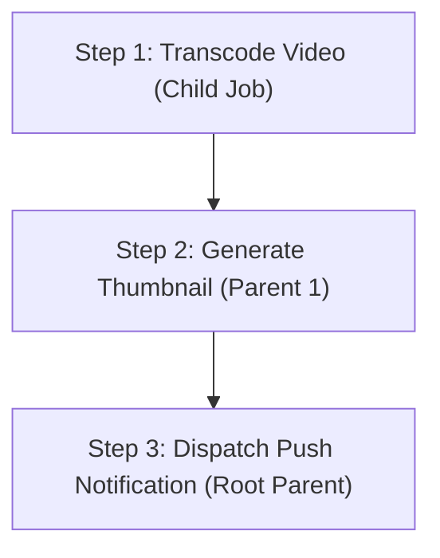
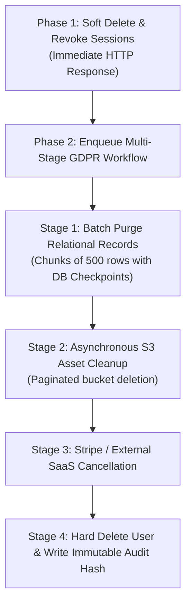
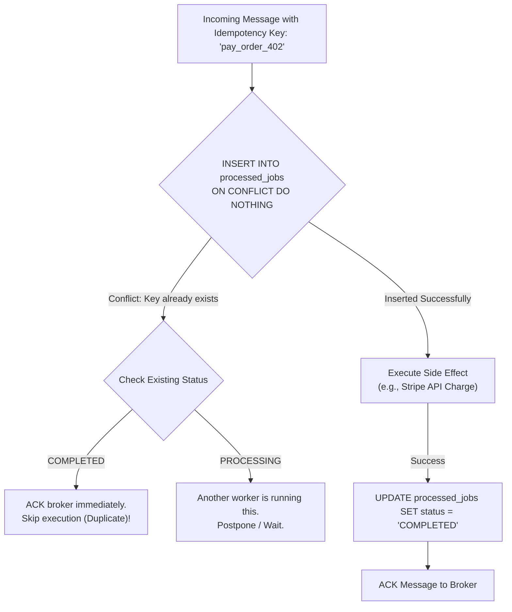

import { Tabs, Tab } from 'fumadocs-ui/components/tabs';
import { Callout } from 'fumadocs-ui/components/callout';
import { Steps, Step } from 'fumadocs-ui/components/steps';

When a client makes an HTTP request to your backend, your web server has a strict deadline: typically 15 to 30 seconds before reverse proxies (like NGINX, Cloudflare, or AWS ALB) terminate the socket with a `504 Gateway Timeout`.

If an endpoint must generate a PDF report, transcode a video, charge a credit card via Stripe, or send 5,000 push notifications, executing that work synchronously inside the HTTP request loop is an architectural anti-pattern. Task queues decouple **intent** from **execution**.

---

## 1. Asynchronous Architecture: The Request/Response Decoupling

In a synchronous architecture, the client's thread is held hostage while your backend waits on external I/O:



Now contrast this with an **Asynchronous Task Queue Architecture**:



The user receives an immediate `202 Accepted` response with an `order_id` in less than 20ms. The background workers execute the heavy operations independently and notify the client via WebSockets or polling.

---

## 2. Broker Landscape: Choosing the Right Engine

Not all message brokers are built alike. Selecting the wrong broker for your workload can lead to data loss or operational complexity.

```
+-------------------------------------------------------------------------------+
| Feature              | Redis Streams / BullMQ | RabbitMQ (AMQP) | AWS SQS     |
+-------------------------------------------------------------------------------+
| Architecture         | In-Memory Log + Hash   | Erlang Router   | Cloud Managed|
| Primary Paradigm     | Push / Long-Poll       | Push to Worker  | Pull (Batch) |
| Latency              | Sub-millisecond        | 1 - 5 ms        | 10 - 50 ms   |
| Routing Flexibility  | Channel / Stream Name  | Topic / Direct  | Single Queue |
| Persistence Model    | Append-Only File (AOF) | Mnesia / Disk   | Multi-AZ Disk|
| Max Throughput       | ~100k msgs/sec         | ~50k msgs/sec   | Near Infinite|
| Operational Burden   | Low (if Redis exists)  | High (Clustering| Zero (SaaS)  |
+-------------------------------------------------------------------------------+
```

### 1. Redis Streams & BullMQ
- **Best For**: Fast, ephemeral jobs, delayed scheduling, complex parent-child flows, Node.js/TypeScript microservices.
- **Trade-off**: In-memory storage. If queue size explodes due to worker downtime, Redis can run out of memory (`OOM`).

### 2. RabbitMQ (AMQP 0-9-1)
- **Best For**: Complex enterprise routing topologies (fanout exchanges, topic routing keys, dead-letter exchanges).
- **Trade-off**: Requires dedicated cluster management and memory/disk watermark tuning in Erlang.

### 3. AWS SQS
- **Best For**: Serverless backends, workloads with extreme spikiness, zero-maintenance operational model.
- **Trade-off**: Higher latency (15-50ms), lacks native Redis-style fine-grained priority sorting.

---

## 3. Delivery Guarantees & The Visibility Timeout Invariant

In distributed systems, networks drop packets, machines crash, and processes run out of memory. There are three theoretical delivery guarantees:

1. **At-Most-Once**: Fire and forget. If the worker crashes mid-job, the task is gone forever.
2. **At-Least-Once** *(Industry Standard)*: A message is never deleted from the broker until a worker explicitly returns an **ACK (Acknowledgment)**. If the worker crashes, another worker will re-process it.
3. **Exactly-Once**: A theoretical ideal. In reality, network partitions make true exactly-once delivery impossible without end-to-end **idempotency keys** at the application layer.



<Callout type="warn" title="The Visibility Timeout Trap">
If a worker takes 35 seconds to process a heavy video render, but the queue's `VisibilityTimeout` is set to 30 seconds:
1. At second 30, the broker assumes Worker A died.
2. The broker delivers the *exact same message* to Worker B!
3. Now Worker A and Worker B are running the same video render simultaneously, doubling costs and corrupting state.

**Remedy**: Set `VisibilityTimeout` to $3\times$ your expected 99th-percentile processing duration, or have your worker send periodic **heartbeat extensions** (`job.updateProgress()` in BullMQ) while actively making progress.
</Callout>

---

## 4. Architectural Best Practice: Lightweight Payload Pointers

<Callout type="error" title="Never Pass Large Binary Payloads Through Queues">
**The Anti-Pattern**: Putting full file buffers, image byte arrays, or giant 10MB JSON documents directly into queue payloads.
- It inflates Redis RAM rapidly and can trigger Out-Of-Memory evictions.
- It introduces heavy JSON serialization/deserialization CPU bottlenecks.
- It causes data drift: if the entity is updated while waiting in the queue, the worker operates on stale data.

**The Production Pattern**: Always pass **lightweight entity IDs and storage pointers**:
```json
// GOOD: Minimal 120-byte payload pointer
{
  "taskId": "tsk_89410",
  "userId": "usr_99182",
  "s3Bucket": "raw-media-uploads",
  "s3Key": "videos/raw_footage.mp4"
}
```
The worker uses the IDs to fetch the authoritative record from PostgreSQL and stream the bytes directly from S3.
</Callout>

---

## 5. BullMQ Production Implementation with Redis

In the Node.js and TypeScript ecosystem, **BullMQ** is the battle-tested, industry-standard distributed queue framework. Built on Redis streams and Lua scripts, it provides atomic state transitions, concurrency control, and built-in exponential backoff.

### 1. Producer: Enqueueing Jobs with Retries & Backoff

```typescript
// producer.ts
import { Queue, QueueEvents } from "bullmq";
import Redis from "ioredis";

// Shared Redis connection
const connection = new Redis(process.env.REDIS_URL || "redis://localhost:6379", {
  maxRetriesPerRequest: null, // Required by BullMQ
});

export interface MediaJobData {
  mediaId: string;
  userId: string;
  resolution: "1080p" | "720p" | "4k";
}

// Instantiate Queue
export const mediaQueue = new Queue<MediaJobData>("media-processing", {
  connection,
  defaultJobOptions: {
    attempts: 3,
    backoff: {
      type: "exponential",
      delay: 2000, // 2s -> 4s -> 8s
    },
    removeOnComplete: {
      count: 1000, // Keep last 1,000 completed jobs for auditing
      age: 86400,  // Keep for 24 hours
    },
    removeOnFail: {
      count: 5000, // Keep last 5,000 failures for DLQ inspection
    },
  },
});

/**
 * Enqueue a media processing job
 */
export async function enqueueMediaJob(data: MediaJobData) {
  const job = await mediaQueue.add("transcode", data, {
    jobId: `transcode_${data.mediaId}`, // Prevents duplicate job creation
  });
  console.log(`[Producer] Enqueued job ${job.id} for media ${data.mediaId}`);
  return job;
}
```

### 2. Consumer: Worker with Concurrency & Event Handling

```typescript
// worker.ts
import { Worker, Job } from "bullmq";
import Redis from "ioredis";
import type { MediaJobData } from "./producer";

const connection = new Redis(process.env.REDIS_URL || "redis://localhost:6379", {
  maxRetriesPerRequest: null,
});

export const mediaWorker = new Worker<MediaJobData>(
  "media-processing",
  async (job: Job<MediaJobData>) => {
    console.log(`[Worker] Starting job ${job.id} (Attempt ${job.attemptsMade + 1})`);
    
    // Report progress to keep visibility alive
    await job.updateProgress(10);
    
    // Step 1: Query source database using the lightweight ID
    const { mediaId, resolution } = job.data;
    
    // Step 2: Perform processing
    await job.updateProgress(50);
    if (mediaId === "invalid_id") {
      throw new Error("Transcoder failed: corrupted video container");
    }

    await job.updateProgress(100);
    return { status: "SUCCESS", durationSeconds: 42 };
  },
  {
    connection,
    concurrency: 5, // Process 5 jobs concurrently per container
    limiter: {
      max: 100,      // Max 100 jobs
      duration: 1000, // Per 1 second (Rate-limiting protection)
    },
  }
);

// Worker Lifecycle Events
mediaWorker.on("completed", (job: Job) => {
  console.log(`[Worker] Job ${job.id} completed successfully.`);
});

mediaWorker.on("failed", (job: Job | undefined, err: Error) => {
  console.error(`[Worker] Job ${job?.id} failed with error: ${err.message}`);
});
```

---

## 6. Advanced Job Types & Orchestration Pipelines

### 1. Delayed Jobs
Delayed jobs allow scheduling tasks to execute in the future (e.g. sending an abandoned cart email 24 hours later). Redis stores these in a sorted set ordered by execution timestamp:

```typescript
// Delay execution by 24 hours (86,400,000 milliseconds)
await mediaQueue.add(
  "abandoned-cart-reminder",
  { userId: "usr_102", cartId: "crt_552" },
  { delay: 86400000 }
);
```

### 2. Repeatable / Recurring Cron Jobs
BullMQ provides built-in cron scheduling without requiring external cron daemons:

```typescript
// Run nightly database reconciliation at midnight UTC
await mediaQueue.add(
  "nightly-reconciliation",
  { scope: "full_audit" },
  {
    repeat: {
      pattern: "0 0 * * *", // Standard 5-field cron expression
    },
  }
);
```

### 3. Task Pipelines and Chaining (FlowProducer)
When work involves sequential dependencies—such as transcoding a video, generating its thumbnail, and alerting the user—use BullMQ's `FlowProducer`:



```typescript
import { FlowProducer } from "bullmq";

const flowProducer = new FlowProducer({ connection });

// Parent jobs run ONLY AFTER all their child jobs complete successfully
const flow = await flowProducer.add({
  name: "notify-user",
  queueName: "notification-queue",
  data: { userId: "usr_101", message: "Video is ready!" },
  children: [
    {
      name: "generate-thumbnail",
      queueName: "image-queue",
      data: { videoId: "vid_99" },
      children: [
        {
          name: "transcode-video",
          queueName: "video-queue",
          data: { videoId: "vid_99", format: "hls" },
        },
      ],
    },
  ],
});
```

---

## 7. Long-Running Workflows: GDPR Account Deletion Case Study

Deleting an account under GDPR compliance cannot happen in a single SQL query. A user may have:
- 500,000 task audit log records across multiple relational tables.
- 50GB of uploaded files and video clips stored in AWS S3.
- Active subscriptions and customer records in Stripe.

Running this in one transaction causes lock escalations and transaction timeouts. Running it asynchronously without checkpoints causes data leaks if the worker crashes midway.



### Multi-Stage Batch Processing with Transactional Checkpoints

```typescript
interface DeletionCheckpoint {
  userId: string;
  stage: "PURGE_DB_ROWS" | "CLEANUP_S3" | "CANCEL_BILLING" | "FINAL_PURGE";
  lastProcessedId?: string;
}

export async function processGdprDeletion(job: Job<DeletionCheckpoint>) {
  const { userId } = job.data;
  let currentStage = job.data.stage;

  // STAGE 1: Chunked Relational Deletion (Prevents Table Locks)
  if (currentStage === "PURGE_DB_ROWS") {
    let rowsRemaining = true;
    while (rowsRemaining) {
      // Delete in small batches of 500
      const deletedCount = await db.$executeRaw`
        DELETE FROM task_history 
        WHERE id IN (
          SELECT id FROM task_history 
          WHERE user_id = ${userId} 
          LIMIT 500
        );
      `;
      if (deletedCount === 0) rowsRemaining = false;
      await job.updateProgress(25);
    }
    
    // Save checkpoint before proceeding
    currentStage = "CLEANUP_S3";
    await job.updateData({ userId, stage: currentStage });
  }

  // STAGE 2: Asynchronous S3 Cleanup
  if (currentStage === "CLEANUP_S3") {
    await deleteUserS3Folder(`users/${userId}/`);
    await job.updateProgress(75);
    
    currentStage = "FINAL_PURGE";
    await job.updateData({ userId, stage: currentStage });
  }

  // STAGE 3: Final Hard Delete & Immutable Audit Record
  if (currentStage === "FINAL_PURGE") {
    await db.$transaction([
      db.user.delete({ where: { id: userId } }),
      db.auditLog.create({
        data: {
          action: "GDPR_PURGE_COMPLETE",
          userHash: sha256(userId),
          completedAt: new Date(),
        },
      }),
    ]);
    await job.updateProgress(100);
  }
}
```

If the server crashes during S3 cleanup, the job re-runs from `CLEANUP_S3`—never re-attempting the already-deleted database rows.

---

## 8. Exponential Backoff, Jitter, and Dead Letter Queues (DLQ)

When an external dependency experiences an outage, retrying immediately causes an accidental Denial of Service attack against the failing system.

### Exponential Backoff with Decorrelated Jitter

A robust backoff formula increases the sleep duration exponentially while introducing pseudo-random variance:

$$t_{\text{wait}} = \min\left(t_{\max},\; t_{\text{base}} \times 2^{\text{attempt}}\right) + \text{random}(0,\; \text{jitter})$$

```
Attempt 1:  1s  + random(0, 500ms)  -> 1.2s
Attempt 2:  2s  + random(0, 500ms)  -> 2.4s
Attempt 3:  4s  + random(0, 500ms)  -> 4.1s
Attempt 4:  8s  + random(0, 500ms)  -> 8.3s
Attempt 5: 16s  + random(0, 500ms)  -> 16.5s
```

Without jitter, 5,000 jobs failing at the same second will all retry at the exact same millisecond, keeping the downstream system crippled.

---

## 9. Interactive Simulation: The Lifecycle of a Failed Job

<Tabs items={['Step 1: Enqueue & Initial Pull', 'Step 2: Dependency Failure & NACK', 'Step 3: Backoff Retry with Jitter', 'Step 4: DLQ Quarantine & Alert']}>
  <Tab value="Step 1: Enqueue & Initial Pull">
```text
[EVENT: JOB DISPATCH]
Task ID:      job_9841
Payload:      { "userId": "usr_840", "action": "SYNC_CRM" }
Status:       IN_FLIGHT
Worker:       worker-pod-3b
Visibility:   Expires in 30.000s
Attempts:     0 / 3

Worker 3b receives message and calls external CRM API...
```
  </Tab>

  <Tab value="Step 2: Dependency Failure & NACK">
```text
[EVENT: NETWORK ERROR]
External API returns: HTTP 503 Service Unavailable (Maintenance)
Worker Error: "Request to api.crm.com timed out after 5000ms"

Action: Worker throws error.
Broker increments: attemptsMade = 1.
Next Attempt Time: Current Time + (2^1 * 1000ms) + Jitter(312ms) = 2312ms.
Job moved to DELAYED state.
```
  </Tab>

  <Tab value="Step 3: Backoff Retry with Jitter">
```text
[EVENT: DELAYED RETRY]
After 2.3 seconds, message becomes eligible for consumption.
Worker:       worker-pod-1a (Different worker pulls the job)
Attempts:     2 / 3
Action:       Retry API call.
Result:       HTTP 503 Service Unavailable (Outage ongoing)

Broker increments: attemptsMade = 2.
Next Attempt Time: Current Time + (2^2 * 1000ms) + Jitter(450ms) = 4450ms.
Job delayed again.
```
  </Tab>

  <Tab value="Step 4: DLQ Quarantine & Alert">
```text
[EVENT: MAX RETRIES EXCEEDED -> POISON PILL ROUTED TO DLQ]
Worker:       worker-pod-2c
Attempts:     3 / 3 (Threshold Reached)
Action:       Final attempt failed.

BROKER ACTION:
1. Job moved to FAILED set / Dead Letter Queue.
2. Metadata attached:
   - failedReason: "HTTP 503 CRM Maintenance"
   - finishedOn: 1714501200000
3. PagerDuty / Sentry alert dispatched to on-call engineer.
```
  </Tab>
</Tabs>

---

## 10. End-to-End Idempotency Pattern

Because task queues operate under **at-least-once delivery**, workers will inevitably process the same job twice. Every background worker must be strictly **idempotent**:

```sql
-- Idempotency tracking table in PostgreSQL
CREATE TABLE processed_jobs (
    idempotency_key VARCHAR(128) PRIMARY KEY,
    job_name VARCHAR(64) NOT NULL,
    status VARCHAR(32) NOT NULL, -- 'PROCESSING', 'COMPLETED', 'FAILED'
    result_payload JSONB,
    created_at TIMESTAMPTZ DEFAULT NOW(),
    updated_at TIMESTAMPTZ DEFAULT NOW()
);
```



---

## Key Architecture Takeaways

1. **Keep the HTTP loop lean**: Any operation that takes longer than 100ms belongs in a background task queue.
2. **Pass lightweight ID pointers**: Never put large files or binary buffers in queue payloads; pass database IDs and S3 keys.
3. **Use BullMQ for Node.js backends**: Leverage its built-in Redis concurrency, exponential backoff, delayed jobs, and repeatable cron capabilities.
4. **Design for At-Least-Once delivery**: Build idempotent consumers using database uniqueness constraints or Redis locks.
5. **Always add Jitter to Exponential Backoff**: Prevent thundering herd retry waves against recovering third-party services.
6. **Checkpoint Long-Running Workflows**: Break multi-stage jobs like GDPR deletion into distinct transactional checkpoints to enable resumption after node restarts.
