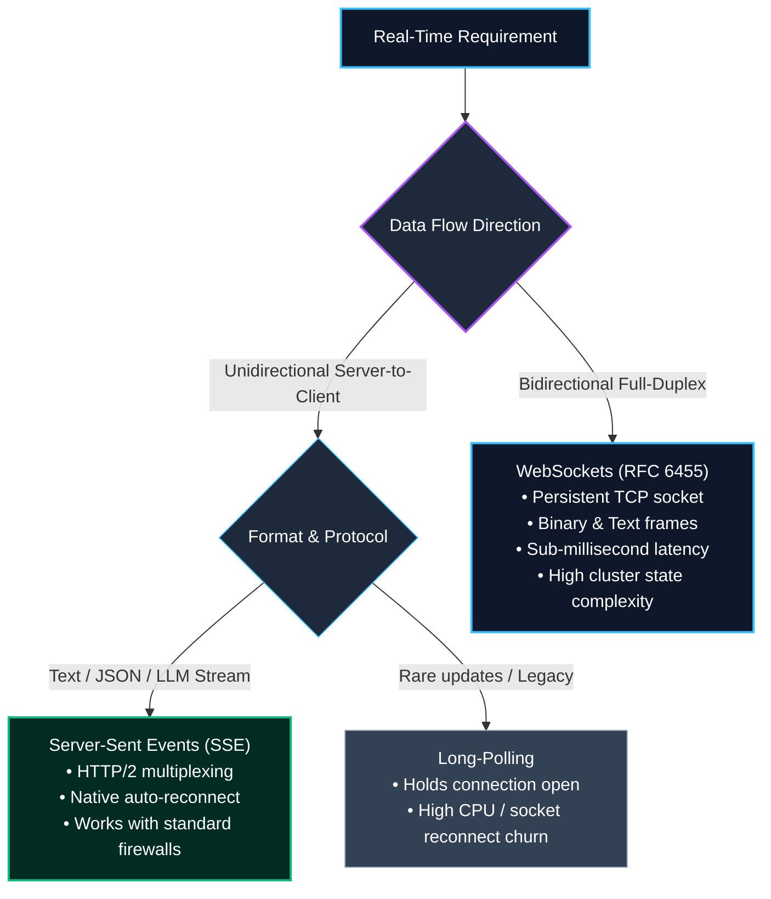
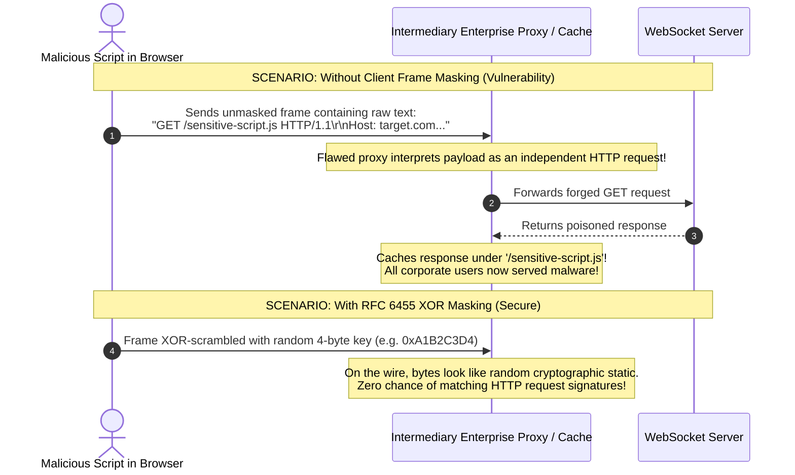
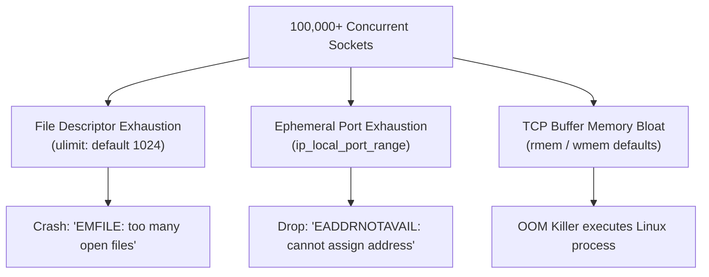
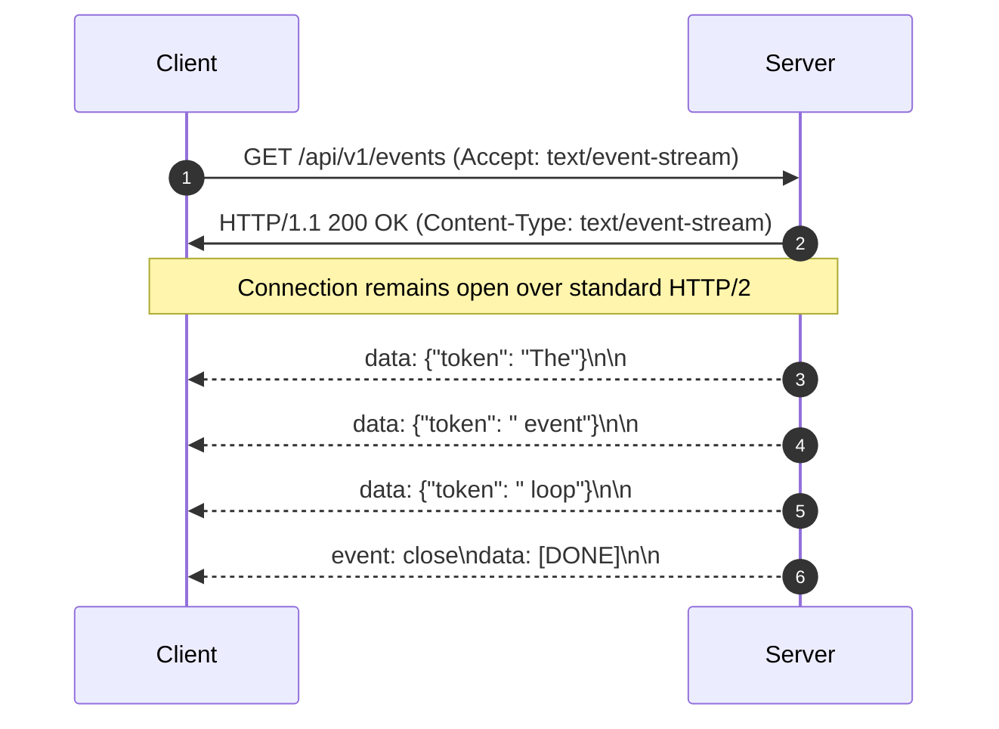
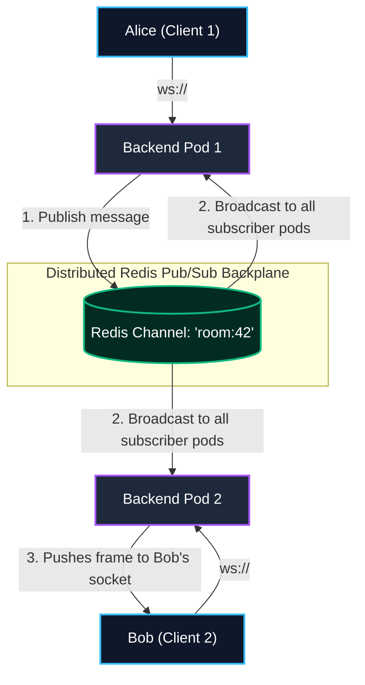

import { Callout } from 'fumadocs-ui/components/callout';
import { Tabs, Tab } from 'fumadocs-ui/components/tabs';
import { Steps, Step } from 'fumadocs-ui/components/steps';
import { Cards, Card } from 'fumadocs-ui/components/card';

Traditional web backends rely on a **request-response model**: a client sends an HTTP request, the server computes a response, and the connection closes or returns to a pool. But for collaborative tools, financial trading platforms, chat applications, and live AI streaming, servers must push state to clients instantly without waiting for a request.

Choosing between **Short Polling**, **Long Polling**, **Server-Sent Events (SSE)**, and **WebSockets** requires balancing connection overhead, proxy compatibility, OS kernel limits, and horizontal cluster complexity.

---

## 1. The Real-Time Evolution: Choosing the Right Transport



### Protocol Comparison Matrix

| Feature | Short Polling | Long Polling | Server-Sent Events (SSE) | WebSockets (RFC 6455) |
| :--- | :--- | :--- | :--- | :--- |
| **Directionality** | Client pull | Client pull (delayed) | Unidirectional (Server $\to$ Client) | **Full-Duplex (Bidirectional)** |
| **Protocol** | HTTP/1.1 or HTTP/2 | HTTP/1.1 or HTTP/2 | HTTP/1.1 or HTTP/2 | Upgraded TCP Socket (`ws://` / `wss://`) |
| **Per-Message Overhead** | ~800 bytes (Headers) | ~800 bytes (Headers) | ~20 bytes (Text framing) | **2 to 10 bytes (Binary framing)** |
| **Connection Lifespan** | Ephemeral | Semi-persistent (reconnects) | Persistent | Persistent |
| **Auto-Reconnection** | Manual client timer | Manual loop in client | **Native browser support** | Requires client reconnection library |
| **Binary Support** | Base64/Multipart | Base64/Multipart | No (UTF-8 text only) | **Native TypedArrays / Buffers** |
| **Proxy / Corporate Firewalls** | 100% compatible | High compatibility | High compatibility | Often inspected / terminated by proxies |
| **Ideal Use Case** | Infrequent background checks | Legacy fallbacks | LLM token streaming, live sports scores | Multiplayer gaming, live trading, chat apps |

---

## 2. Deep Dive: The WebSocket Protocol (RFC 6455)

The WebSocket protocol begins life as a standard HTTP request and upgrades to an asynchronous, bidirectional TCP stream.

### 1. The Upgrade Handshake

To initiate a WebSocket connection, the client sends a standard HTTP/1.1 request with specific upgrade headers:

```http
GET /chat HTTP/1.1
Host: api.example.com
Upgrade: websocket
Connection: Upgrade
Sec-WebSocket-Key: dGhlIHNhbXBsZSBub25jZQ==
Sec-WebSocket-Version: 13
```

The server validates the token by appending the RFC 6455 magic GUID `258EAFA5-E914-47DA-95CA-C5AB0DC85B11`, computing its SHA-1 hash, and returning a Base64-encoded string:

```http
HTTP/1.1 101 Switching Protocols
Upgrade: websocket
Connection: Upgrade
Sec-WebSocket-Accept: s3pPLMBiTxaQ9kYGzzhZRbK+xOo=
```

Once the handshake finishes, the TCP connection remains open, and the HTTP parser is replaced by the WebSocket frame parser.

### 2. Anatomy of a WebSocket Frame

Every message is split into frames. Unlike verbose HTTP headers, a WebSocket frame header consumes only **2 to 10 bytes**:

```
 0                   1                   2                   3
 0 1 2 3 4 5 6 7 8 9 0 1 2 3 4 5 6 7 8 9 0 1 2 3 4 5 6 7 8 9 0 1
+-+-+-+-+-------+-+-------------+-------------------------------+
|F|R|R|R| opcode|M| Payload len |    Extended payload length    |
|I|S|S|S|  (4)  |A|     (7)     |             (16/64)           |
| |1|2|3|       |S|             |   (if payload len == 126/127) |
| | | | |       |K|             |                               |
+-+-+-+-+-------+-+-------------+ - - - - - - - - - - - - - - - +
|     Extended payload length continued, if payload len == 127  |
+ - - - - - - - - - - - - - - - +-------------------------------+
|                               |Masking-key, if MASK set to 1  |
+-------------------------------+-------------------------------+
| Masking-key (continued)       |          Payload Data         |
+-------------------------------- - - - - - - - - - - - - - - - +
:                     Payload Data continued ...                :
+---------------------------------------------------------------+
```

- **FIN (1 bit)**: Indicates if this is the final fragment of a multi-frame message.
- **Opcode (4 bits)**:
  - `0x1`: Text message (UTF-8)
  - `0x2`: Binary data (`ArrayBuffer`, `Buffer`)
  - `0x8`: Connection Close
  - `0x9`: Ping (Heartbeat probe)
  - `0xA`: Pong (Heartbeat acknowledgement)
- **MASK (1 bit)**: MUST be set to `1` on all frames sent from client to server.

### 3. The Security Rationale Behind Client Frame Masking

Why does RFC 6455 mandate that **every frame sent from a client to a server must be masked with a random 4-byte XOR key**, while server-to-client frames remain unmasked?



> **The Proxy Cache Poisoning Attack**:
> Before RFC 6455, an attacker could open a WebSocket connection and send an unmasked binary frame containing raw ASCII HTTP request strings (e.g., `GET /script.js HTTP/1.1`).
> Transparent, non-WebSocket-aware HTTP proxies sitting between corporate networks and the internet would mistakenly parse these payload bytes as real HTTP requests. If the proxy cached the resulting response, all other users behind that corporate proxy would receive the attacker's payload.
> 
> **The Defense**: By forcing the client browser to generate a **cryptographically unpredictable 4-byte masking key** per frame and XOR each payload byte (`byte ^ mask[i % 4]`), the bytes on the wire are effectively randomized. No intermediary proxy can mistake the payload for valid HTTP syntax.

---

## 3. Simulation: WebSocket Lifecycle & Frame Exchange

<Tabs items={['Step 1: HTTP Upgrade Handshake', 'Step 2: Masked Binary Frame Exchange', 'Step 3: Ping/Pong Heartbeat Keep-Alive', 'Step 4: Clean Two-Way Closure']}>
  <Tab value="Step 1: HTTP Upgrade Handshake">
    **Client initiates the upgrade on TCP port 443:**

    ```
    CLIENT                                             SERVER
      |                                                   |
      | --- GET /ws (Upgrade: websocket) ---------------> | (Inspects auth cookie / JWT)
      | <--- HTTP/1.1 101 Switching Protocols ----------- | (Handshake validated)
      |                                                   |
    ```

    Both sides switch their socket handlers from HTTP parser to raw RFC 6455 frame parsers.
  </Tab>

  <Tab value="Step 2: Masked Binary Frame Exchange">
    **Client sends a message to the server (Client $\to$ Server MUST be masked):**

    ```
    Client Message: "HELLO"
    Mask Key: [0xA1, 0xB2, 0xC3, 0xD4]
    Wire Bytes: [ 0x81 (FIN + Text), 0x85 (Masked + Len 5), 0xA1, 0xB2, 0xC3, 0xD4, ...XOR Payload ]
    
    Server:
    - Reads 4-byte mask key
    - Decodes: original_byte = masked_byte XOR mask_key[i % 4]
    - Emits: ws.on('message', "HELLO")
    ```

    Server responses sent back to the client are **unmasked** (Mask bit = 0), saving CPU cycles.
  </Tab>

  <Tab value="Step 3: Ping/Pong Heartbeat Keep-Alive">
    **Detecting "Zombie" Connections:**

    If a client loses cellular signal or unplugs their ethernet cable, the OS TCP stack may take up to 2 hours to recognize the dead socket (TCP keep-alive timeouts). 

    The server issues proactive WebSocket application heartbeats every 30 seconds:

    ```
    SERVER                                             CLIENT
      |                                                   |
      | --- Opcode 0x9 (PING, payload: timestamp) ------> |
      | <--- Opcode 0xA (PONG, payload: timestamp) ------ |
      |                                                   |
    ```

    <Callout type="warn" title="Defending Against Dead Sockets">
    If the client fails to return a matching Pong within 5 seconds, the server terminates the socket (`ws.terminate()`), releasing kernel file descriptors and memory.
    </Callout>
  </Tab>

  <Tab value="Step 4: Clean Two-Way Closure">
    **Orderly disconnection prevents data truncation:**

    ```
    CLIENT                                             SERVER
      |                                                   |
      | --- Opcode 0x8 (CLOSE: Code 1000 Normal) -------> |
      | <--- Opcode 0x8 (CLOSE: Code 1000 Echoed) ------- |
      | [TCP Socket gracefully closes via FIN packet]     |
    ```

    Standard status codes:
    - `1000`: Normal Closure
    - `1001`: Going Away (tab closed or server restarting)
    - `1008`: Policy Violation (authentication expired)
    - `1011`: Internal Server Error
  </Tab>
</Tabs>

---

## 4. Operating System & Kernel Tuning for 100K - 1M Connections

When scaling persistent connections (WebSockets or SSE) on Linux, servers fail at the **OS and TCP kernel layer** long before CPU exhaustion.



### 1. File Descriptor Limits (`nofile`)

In Linux, every TCP socket is allocated a File Descriptor (FD). 
- Default user limit: `1024` (The server crashes after only 1,024 clients with `EMFILE: too many open files`!).

To support 1,000,000 concurrent sockets:

```bash
# Check current limit
ulimit -n

# Set in /etc/security/limits.conf
*    soft    nofile    1048576
*    hard    nofile    1048576
root soft    nofile    1048576
root hard    nofile    1048576

# Set system-wide maximum in /etc/sysctl.conf
fs.file-max = 2097152
```

### 2. Ephemeral Port Exhaustion

A TCP connection is uniquely identified by the 4-tuple:
$$(\text{Source IP},\; \text{Source Port},\; \text{Destination IP},\; \text{Destination Port})$$

When an NGINX reverse proxy or internal microservice gateway opens outbound connections to upstream backend pods, it acts as a client and draws from the ephemeral port pool:

```bash
# Check current ephemeral port range
cat /proc/sys/net/ipv4/ip_local_port_range
# Default is often: 32768 60999 (Only ~28,231 ports available!)
```

If the proxy attempts to open 30,000 simultaneous connections to a single backend IP, it throws `EADDRNOTAVAIL`.

**Kernel Remediation in `/etc/sysctl.conf`**:
```ini
# Expand ephemeral port range
net.ipv4.ip_local_port_range = 1024 65535

# Enable fast reuse of TIME_WAIT sockets for outgoing connections
net.ipv4.tcp_tw_reuse = 1

# Reduce TIME_WAIT timeout from 60s to 30s
net.ipv4.tcp_fin_timeout = 30
```

### 3. TCP Socket Buffer Sizing: Sizing Memory for 100K - 1M Concurrency

Each open TCP socket allocates two memory buffers in the Linux kernel:
1. **Receive Buffer (`rmem`)**: Staging memory for incoming packets.
2. **Send Buffer (`wmem`)**: Staging memory for outgoing packets awaiting ACK.

#### The Default Memory Math (Disaster Scenario):
By default, modern Linux distros tune buffers for high-bandwidth single streams (e.g. 128KB to 256KB per buffer):
$$\text{Memory per socket} \approx 128\text{ KB (rmem)} + 128\text{ KB (wmem)} = 256\text{ KB}$$

- **For 100,000 connections**: $100{,}000 \times 256\text{ KB} = 25.6\text{ GB RAM}$
- **For 1,000,000 connections**: $1{,}000{,}000 \times 256\text{ KB} = 256\text{ GB RAM}$
A 16GB server will be wiped out by the Linux OOM Killer.

#### The Real-Time Optimized Math:
Real-time chat, telemetry, and trading platforms exchange small JSON messages (under 2KB). We can safely configure smaller minimum buffer sizes in `/etc/sysctl.conf`:

```ini
# (min, default, max) bytes for read buffer
net.ipv4.tcp_rmem = 4096 87380 4194304

# (min, default, max) bytes for write buffer
net.ipv4.tcp_wmem = 4096 65536 4194304

# Max SYN backlog queue
net.core.somaxconn = 65535
net.ipv4.tcp_max_syn_backlog = 65535
```

When tuned down so idle connections use $\sim 8\text{ KB}$ kernel space:
$$1{,}000{,}000\text{ connections} \times 8\text{ KB} \approx 8\text{ GB RAM}$$
Now, a single modern 16GB or 32GB cloud instance comfortably handles 1,000,000 concurrent connected sockets!

---

## 5. Server-Sent Events (SSE): The Lightweight Alternative

For unidirectional streaming (such as OpenAI/Anthropic LLM token generation, live dashboards, or activity feeds), **WebSockets are often architectural overkill**.

**Server-Sent Events (SSE)** uses standard HTTP streaming with the `text/event-stream` MIME type:



### Production SSE Endpoint (Node.js / Express)

```typescript
import type { Request, Response } from 'express';

export function streamEventsHandler(req: Request, res: Response) {
  // 1. Set required SSE headers
  res.writeHead(200, {
    'Content-Type': 'text/event-stream',
    'Cache-Control': 'no-cache, no-transform',
    'Connection': 'keep-alive',
    'X-Accel-Buffering': 'no', // Disable Nginx reverse proxy buffering
  });

  // 2. Send an initial ping comment to establish connection
  res.write(': connected\n\n');

  // 3. Emit structured events
  let counter = 0;
  const interval = setInterval(() => {
    counter++;
    const payload = JSON.stringify({ count: counter, time: new Date().toISOString() });
    
    // SSE Format: id, event name, data, and double newline \n\n
    res.write(`id: ${counter}\n`);
    res.write(`event: tick\n`);
    res.write(`data: ${payload}\n\n`);

    if (counter >= 100) {
      clearInterval(interval);
      res.write('event: done\ndata: {}\n\n');
      res.end();
    }
  }, 1000);

  // 4. Handle client disconnect to prevent memory leaks
  req.on('close', () => {
    clearInterval(interval);
    console.log('Client terminated SSE stream');
  });
}
```

---

## 6. Scaling Real-Time Clusters with Redis Pub/Sub

In production, your backend runs across multiple load-balanced nodes (e.g., Kubernetes Pod 1 and Pod 2). 

Because WebSockets are stateful TCP connections:
- **Alice** is connected to **Pod 1**.
- **Bob** is connected to **Pod 2**.
- When Alice posts a message to Bob, **Pod 1 cannot send it to Bob because Bob's socket lives in Pod 2's memory!**



### Production Clustered WebSocket Server (TypeScript + `ws` + Redis)

```typescript
import { createServer } from 'node:http';
import { WebSocketServer, WebSocket } from 'ws';
import Redis from 'ioredis';

const server = createServer();
const wss = new WebSocketServer({ server });

// Connect to shared Redis cluster
const redisPublisher = new Redis(process.env.REDIS_URL || 'redis://localhost:6379');
const redisSubscriber = new Redis(process.env.REDIS_URL || 'redis://localhost:6379');

// Map of local active client sockets on THIS pod instance
const localSockets = new Set<WebSocket>();

// 1. Listen for broadcast messages from ANY pod in the cluster
redisSubscriber.subscribe('chat:general', (err) => {
  if (err) console.error('Failed to subscribe to Redis channel', err);
});

redisSubscriber.on('message', (channel, message) => {
  if (channel === 'chat:general') {
    // Broadcast to all clients connected to THIS pod
    for (const client of localSockets) {
      if (client.readyState === WebSocket.OPEN) {
        client.send(message);
      }
    }
  }
});

// 2. Handle incoming client connections on this instance
wss.on('connection', (ws: WebSocket) => {
  localSockets.add(ws);
  (ws as any).isAlive = true;

  // Heartbeat pong listener
  ws.on('pong', () => {
    (ws as any).isAlive = true;
  });

  ws.on('message', async (data) => {
    // Publish message to Redis so ALL pods receive it
    await redisPublisher.publish('chat:general', data.toString());
  });

  ws.on('close', () => {
    localSockets.delete(ws);
  });
});

// 3. Keep-alive heartbeat interval to purge dead sockets
const heartbeatInterval = setInterval(() => {
  for (const ws of localSockets) {
    if ((ws as any).isAlive === false) {
      ws.terminate(); // Kill dead socket
      localSockets.delete(ws);
      continue;
    }

    (ws as any).isAlive = false;
    ws.ping(); // Send ping frame (0x9)
  }
}, 30000);

wss.on('close', () => {
  clearInterval(heartbeatInterval);
});

server.listen(8080, () => {
  console.log('Clustered WebSocket server running on port 8080');
});
```

---

## Key Architecture Takeaways

<Cards>
  <Card
    title="Match Transport to Directionality"
    description="Use Server-Sent Events (SSE) for unidirectional streams like AI tokens or notifications; use WebSockets for bidirectional, low-latency, full-duplex communication."
  />
  <Card
    title="Client Frame Masking (RFC 6455)"
    description="Client-to-server frames MUST be XOR-masked with a random 4-byte key to prevent intermediary proxy cache poisoning attacks."
  />
  <Card
    title="Tune OS Kernel for Concurrency"
    description="Increase ulimit -n to 1M+, widen ip_local_port_range, and tune tcp_rmem / tcp_wmem down to 4-8KB to support 1M sockets in 8GB RAM."
  />
  <Card
    title="Redis Pub/Sub Backplane"
    description="Horizontally scaled WebSocket pods must bridge isolated in-memory sockets using a distributed message broker like Redis Pub/Sub or NATS."
  />
</Cards>
