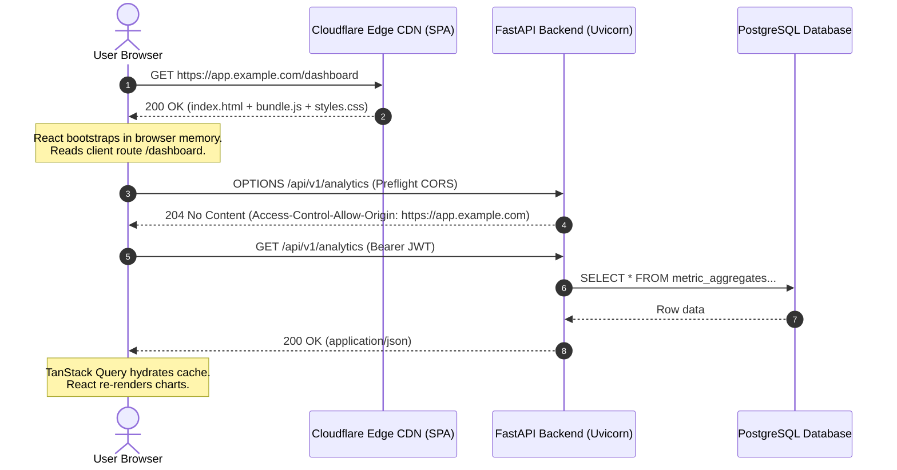
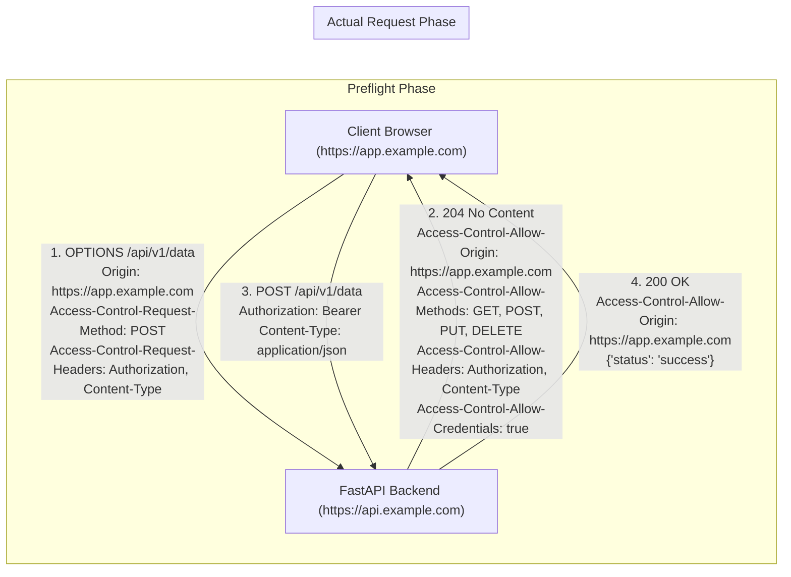
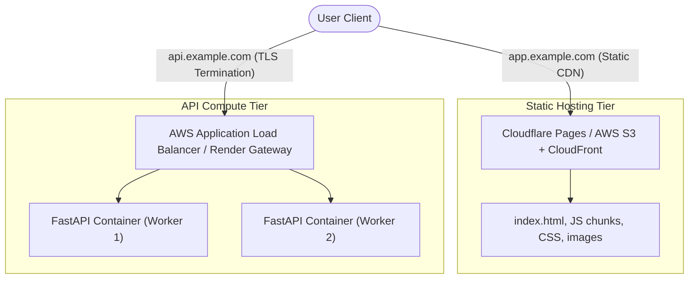

import { Callout } from 'fumadocs-ui/components/callout';
import { Tabs, Tab } from 'fumadocs-ui/components/tabs';
import { Steps, Step } from 'fumadocs-ui/components/steps';
import { Cards, Card } from 'fumadocs-ui/components/card';

A decoupled architecture establishes a strict physical and logical boundary between the user-facing presentation tier and the backend computational API. In this model, the frontend is compiled into static assets served via a Global Content Delivery Network (CDN), while the backend runs as containerized application services behind a load balancer.

---

## 1. The Client-Server Separation Model

In traditional monolithic web frameworks (such as Django with Jinja templates or Ruby on Rails with ERB), the server renders HTML on every request and pushes the full document across the wire. 

In a modern decoupled system:
1. **The Presentation Tier (React SPA):** The browser downloads a minimal `index.html` file alongside pre-compiled JavaScript and CSS bundles. React bootstraps client-side, renders the DOM, and manages the view lifecycle.
2. **The Data Tier (FastAPI):** The backend is completely headless. It exposes RESTful JSON endpoints and streaming interfaces, handling business logic, authorization, database persistence, and orchestration.



### Architectural Advantages

- **Independent Release Lifecycles:** The frontend engineering team can ship UI polishes, copy revisions, and design system updates tens of times a day without rebuilding or restarting backend container instances.
- **Micro-Frontend and Multi-Client Readiness:** The same FastAPI API serves the React desktop web app, React Native mobile apps, automated CLI tools, and external API partners with zero code duplication.
- **Granular Security Surface:** The frontend contains zero database drivers, secret encryption keys, or private infrastructure credentials. All sensitive operations are shielded behind authenticated API contracts.

---

## 2. React + Vite SPA Architecture

Vite has replaced legacy bundlers like Webpack due to its utilization of native browser ECMAScript Modules (ESM) during development and optimized Rollup packaging for production.

```
frontend/
├── index.html              # HTML shell root (<div id="root"></div>)
├── package.json
├── tsconfig.json
├── vite.config.ts          # Build config & dev reverse proxy
└── src/
    ├── main.tsx            # React root mount & QueryClientProvider
    ├── App.tsx             # Root layout & client router
    ├── api/
    │   ├── client.ts       # Axios or fetch instance with interceptors
    │   └── endpoints/      # Domain-specific API fetchers
    ├── components/         # Reusable UI primitives
    ├── hooks/              # Custom React & TanStack Query hooks
    └── pages/              # View routes
```

### Single-Page Routing and the Fallback Rule

Unlike server-rendered applications where `/dashboard` corresponds to a physical server route, an SPA relies on the **HTML5 History API** (`pushState`, `replaceState`). 

When a user visits `https://app.example.com/settings/billing` directly or refreshes the page, the static web server (Nginx, S3, or Cloudflare) does not find a physical file named `settings/billing.html`. 

<Callout type="warn" title="The SPA 404 Pitfall">
If your static hosting provider is not configured to rewrite all unknown paths to `/index.html`, direct links or browser refreshes will return an HTTP 404 error. The static server must return `index.html` with an HTTP 200 status code for all non-file paths, allowing the client-side router (e.g., React Router) to parse `window.location.pathname` and render the correct view.
</Callout>

Here is the Nginx configuration required to handle SPA routing:

```nginx title="nginx.conf (SPA Fallback)"
server {
    listen 80;
    server_name _;
    root /usr/share/nginx/html;
    index index.html;

    # Serve static assets directly with aggressive caching
    location ~* \.(js|css|png|jpg|jpeg|gif|ico|svg|woff2)$ {
        expires 1y;
        add_header Cache-Control "public, immutable";
        try_files $uri =404;
    }

    # All other routes rewrite to index.html for client-side routing
    location / {
        try_files $uri $uri/ /index.html;
        add_header Cache-Control "no-cache";
    }
}
```

---

## 3. Demystifying CORS in Decoupled Systems

**Cross-Origin Resource Sharing (CORS)** is a browser-enforced security mechanism governed by the **Same-Origin Policy (SOP)**. An origin is defined by the tuple `(Scheme, Host, Port)`.

If your React SPA is hosted at `https://app.example.com` and your FastAPI backend resides at `https://api.example.com`, they are **different origins** because their hostnames differ.



### Simple vs. Preflighted Requests

The browser automatically issues an `OPTIONS` preflight request prior to the actual request if the request meets any of these conditions:
- Uses HTTP methods other than `GET`, `HEAD`, or `POST`.
- Sends custom headers (such as `Authorization: Bearer ...` or `X-Workspace-Id`).
- Uses a `Content-Type` other than `application/x-www-form-urlencoded`, `multipart/form-data`, or `text/plain` (e.g., `application/json`).

### Hardening CORS in FastAPI

FastAPI provides the `CORSMiddleware` class to intercept incoming requests, handle preflight `OPTIONS` probes, and attach the required headers to outgoing responses.

```python title="app/core/cors.py"
from fastapi import FastAPI
from fastapi.middleware.cors import CORSMiddleware
from pydantic_settings import BaseSettings

class Settings(BaseSettings):
    ENVIRONMENT: str = "production"
    # Whitelist specific trusted origins
    ALLOWED_ORIGINS: list[str] = [
        "https://app.example.com",
        "https://staging.example.com",
    ]

    class Config:
        env_file = ".env"

settings = Settings()

def setup_cors(app: FastAPI) -> None:
    # In local development, permit localhost ports
    origins = list(settings.ALLOWED_ORIGINS)
    if settings.ENVIRONMENT == "development":
        origins.extend([
            "http://localhost:5173",  # Vite default port
            "http://127.0.0.1:5173",
        ])

    app.add_middleware(
        CORSMiddleware,
        allow_origins=origins,
        allow_credentials=True,
        allow_methods=["GET", "POST", "PUT", "PATCH", "DELETE", "OPTIONS"],
        allow_headers=[
            "Content-Type",
            "Authorization",
            "Accept",
            "X-Requested-With",
            "X-Correlation-ID",
        ],
        expose_headers=["Content-Disposition", "X-Total-Count"],
        max_age=86400,  # Cache preflight response in browser for 24 hours
    )
```

<Callout type="danger" title="Critical CORS Security Anti-Patterns">
1. **Never combine wildcard origin with credentials:**
   ```python
   # INSECURE & BROWSER-REJECTED:
   allow_origins=["*"]
   allow_credentials=True
   ```
   Browsers strictly prohibit credentialed requests (cookies, authorization headers) when the server responds with a wildcard `*`.
2. **Never reflect the Origin header blindly:**
   Reflecting `request.headers.get("origin")` without validation effectively disables CORS entirely, leaving your authenticated API vulnerable to cross-site credential exploitation.
</Callout>

---

## 4. Environment Isolation & Configuration

Separating configuration from application code ensures that a single artifact can be promoted across development, staging, and production environments.

### Frontend Environment Configuration (Vite)

Vite uses `import.meta.env` to inject environment variables into the client bundle at build time. Variables must be prefixed with `VITE_` to prevent accidental leakage of sensitive host environment variables.

<Tabs items={['.env.development', '.env.production', 'src/api/client.ts']}>
  <Tab value=".env.development">
```ini
# Loaded when running `vite`
VITE_API_BASE_URL="http://localhost:8000/api/v1"
VITE_APP_TITLE="Cookbook AI (Dev)"
```
  </Tab>
  <Tab value=".env.production">
```ini
# Loaded when running `vite build`
VITE_API_BASE_URL="https://api.example.com/api/v1"
VITE_APP_TITLE="Cookbook AI"
```
  </Tab>
  <Tab value="src/api/client.ts">
```typescript
import axios from 'axios';

const apiBaseUrl = import.meta.env.VITE_API_BASE_URL;

if (!apiBaseUrl) {
  throw new Error("Missing VITE_API_BASE_URL environment variable.");
}

export const apiClient = axios.create({
  baseURL: apiBaseUrl,
  headers: {
    'Content-Type': 'application/json',
  },
  withCredentials: true,
});

// Attach JWT access token dynamically
apiClient.interceptors.request.use((config) => {
  const token = localStorage.getItem('auth_token');
  if (token && config.headers) {
    config.headers.Authorization = `Bearer ${token}`;
  }
  return config;
});
```
  </Tab>
</Tabs>

### Eliminating CORS in Local Development with Vite Proxy

During local development, you can completely bypass CORS hurdles by configuring Vite's internal development server to act as a reverse proxy:

```typescript title="vite.config.ts"
import { defineConfig } from 'vite';
import react from '@vitejs/plugin-react';

export default defineConfig({
  plugins: [react()],
  server: {
    port: 5173,
    proxy: {
      // Forward all /api requests directly to local FastAPI server
      '/api': {
        target: 'http://127.0.0.1:8000',
        changeOrigin: true,
        secure: false,
      },
    },
  },
});
```

When using this proxy, the React app calls `/api/v1/users` as a relative path. The browser views the request as **same-origin** (`http://localhost:5173/api/...`), and the Vite dev server forwards the TCP socket to port `8000`.

---

## 5. Production Cloud Deployment Topologies

In modern cloud environments, two primary architectures are utilized to deploy decoupled systems.

### Pattern 1: Static CDN + Containerized Backend (Recommended)



In this pattern, the frontend domain (`app.example.com`) and backend domain (`api.example.com`) are managed on separate infrastructure tiers:
- **Frontend Cost & Scale:** Edge delivery guarantees near-zero hosting costs and instant multi-region failover.
- **Backend Scaling:** FastAPI instances scale dynamically based on CPU utilization and request concurrency.

### Pattern 2: Unified Gateway Reverse Proxy

A single unified domain (`example.com`) uses a reverse proxy (such as Nginx, AWS CloudFront Path Routing, or Traefik) to route traffic:
- Path `/api/*` $\rightarrow$ Forwarded to FastAPI upstream containers.
- Path `/*` $\rightarrow$ Forwarded to Static S3 Bucket / CDN.

This approach provides the benefit of zero CORS preflight overhead in production, because all requests share identical origins.

---

## 6. Production Containerization

To deploy both components reliably to production environments (such as AWS ECS, Render, or Kubernetes), we construct multi-stage, secure container images.

<Steps>
  <Step>
    ### Backend Container: Multi-Stage Python 3.12 with Non-Root User
    We use a multi-stage Docker build to keep build dependencies out of the final runtime image and execute as a non-privileged `appuser`.
    
```dockerfile title="backend/Dockerfile"
# --- STAGE 1: Builder ---
FROM python:3.12-slim-bookworm AS builder

WORKDIR /build

RUN apt-get update && apt-get install -y --no-install-recommends \
    build-essential \
    curl \
    && rm -rf /var/lib/apt/lists/*

# Install poetry / pip requirements
COPY requirements.txt .
RUN pip install --no-cache-dir --user -r requirements.txt

# --- STAGE 2: Production Runtime ---
FROM python:3.12-slim-bookworm AS runner

WORKDIR /app

# Create unprivileged system user
RUN groupadd -g 10001 appgroup && \
    useradd -u 10001 -g appgroup -s /bin/bash -m appuser

# Copy installed Python packages from builder
COPY --from=builder /root/.local /home/appuser/.local
ENV PATH=/home/appuser/.local/bin:$PATH
ENV PYTHONUNBUFFERED=1

COPY --chown=appuser:appgroup ./app ./app

USER appuser

EXPOSE 8000

# Run Uvicorn with standard production worker configuration
CMD ["uvicorn", "app.main:app", "--host", "0.0.0.0", "--port", "8000", "--workers", "4", "--proxy-headers", "--forwarded-allow-ips", "*"]
```
  </Step>

  <Step>
    ### Frontend Container: Multi-Stage Node.js Build + Nginx Alpine
    Build the React application with Vite, then copy the compiled `dist/` directory into an ultra-lightweight Alpine Nginx web server.

```dockerfile title="frontend/Dockerfile"
# --- STAGE 1: Build React Assets ---
FROM node:22-alpine AS builder

WORKDIR /app

COPY package*.json ./
RUN npm ci

COPY . .

# Set build-time environment variable
ARG VITE_API_BASE_URL
ENV VITE_API_BASE_URL=$VITE_API_BASE_URL

RUN npm run build

# --- STAGE 2: Static Server ---
FROM nginx:1.27-alpine-slim

# Remove default configuration
RUN rm /etc/nginx/conf.d/default.conf

# Copy custom Nginx SPA configuration
COPY nginx.conf /etc/nginx/conf.d/default.conf

# Copy compiled static assets from builder
COPY --from=builder /app/dist /usr/share/nginx/html

EXPOSE 80

CMD ["nginx", "-g", "daemon off;"]
```
  </Step>
</Steps>
