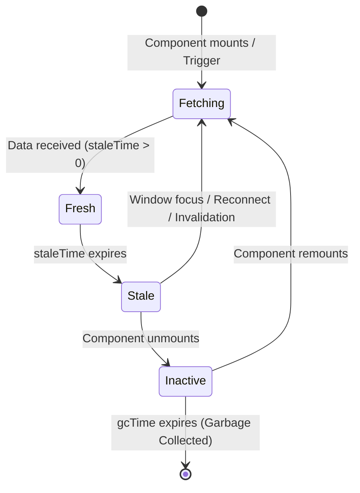
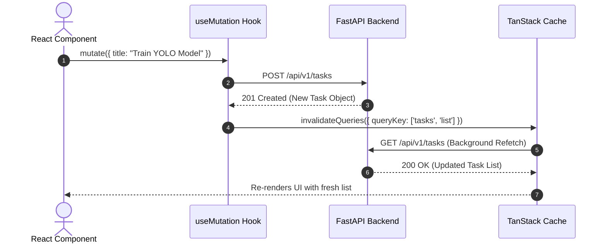
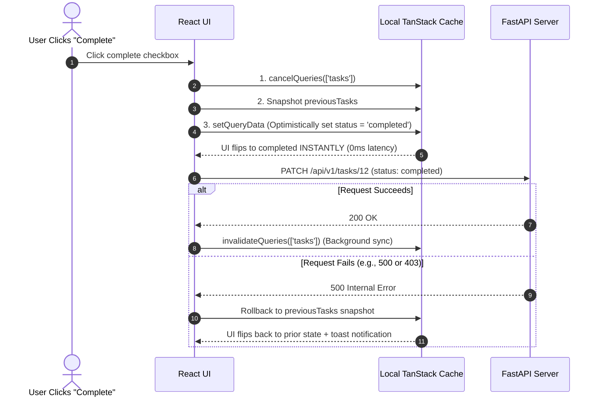

import { Callout } from 'fumadocs-ui/components/callout';
import { Tabs, Tab } from 'fumadocs-ui/components/tabs';
import { Steps, Step } from 'fumadocs-ui/components/steps';
import { Cards, Card } from 'fumadocs-ui/components/card';

In a decoupled React + FastAPI system, the single largest architectural hazard is treating **Server State** as if it were **Client State**. 

Traditional state managers (such as Redux, Zustand, or React Context) are designed for ephemeral client state—such as whether a modal is open, a sidebar is collapsed, or a multi-step form's current draft step. They do not naturally handle caching, deduplication, background synchronization, polling, or race conditions.

**TanStack Query (React Query) v5** is a purpose-built asynchronous state synchronization engine that bridges this divide.

---

## 1. Client State vs. Server State

| Dimension | Client State (Zustand / useState) | Server State (TanStack Query) |
| :--- | :--- | :--- |
| **Ownership** | Completely owned by the browser memory | Owned and persisted remotely on the server |
| **Freshness** | Synchronous, always accurate locally | Asynchronous; immediately potentially stale |
| **Concurrency** | Single user modifying state | Multiple users may mutate the data concurrently |
| **Lifecycle** | Destroyed on page unload or component unmount | Requires intelligent caching, garbage collection, and invalidation |



---

## 2. Bootstrapping TanStack Query v5

In TanStack Query v5, all queries and mutations are invoked using single-object syntax (`useQuery({ queryKey, queryFn })`).

<Tabs items={['src/main.tsx', 'src/api/queryClient.ts']}>
  <Tab value="src/main.tsx">
```tsx
import React from 'react';
import ReactDOM from 'react-dom/client';
import { QueryClientProvider } from '@tanstack/react-query';
import { ReactQueryDevtools } from '@tanstack/react-query-devtools';
import { queryClient } from './api/queryClient';
import App from './App';

ReactDOM.createRoot(document.getElementById('root')!).render(
  <React.StrictMode>
    <QueryClientProvider client={queryClient}>
      <App />
      {/* DevTools automatically excluded in production bundles */}
      <ReactQueryDevtools initialIsOpen={false} buttonPosition="bottom-right" />
    </QueryClientProvider>
  </React.StrictMode>
);
```
  </Tab>
  <Tab value="src/api/queryClient.ts">
```typescript
import { QueryClient } from '@tanstack/react-query';

export const queryClient = new QueryClient({
  defaultOptions: {
    queries: {
      // Data remains "fresh" for 1 minute before background refetching on trigger
      staleTime: 1000 * 60,
      // Inactive cache entries are retained in memory for 10 minutes
      gcTime: 1000 * 60 * 10,
      // Automatically refetch when the user refocuses the browser window
      refetchOnWindowFocus: true,
      // Retry failed network queries twice with exponential backoff before surfacing error
      retry: 2,
    },
  },
});
```
  </Tab>
</Tabs>

<Callout type="info" title="staleTime vs. gcTime in v5">
- **`staleTime`:** The duration (in milliseconds) until cached data is considered stale. As long as data is fresh, TanStack Query will return it instantly from cache without firing any network requests.
- **`gcTime` (formerly `cacheTime`):** The duration that unused or inactive query data remains in browser memory before being garbage-collected.
</Callout>

---

## 3. Query Key Factories

Query keys identify unique slices of data in the cache. Rather than hardcoding string arrays across multiple components (which invites typos and invalidation bugs), production teams employ the **Query Key Factory Pattern**.

```typescript title="src/api/keys.ts"
export interface TaskFilters {
  status?: 'pending' | 'in_progress' | 'completed';
  search?: string;
  page?: number;
}

export const taskKeys = {
  all: ['tasks'] as const,
  lists: () => [...taskKeys.all, 'list'] as const,
  list: (filters: TaskFilters) => [...taskKeys.lists(), filters] as const,
  details: () => [...taskKeys.all, 'detail'] as const,
  detail: (id: string | number) => [...taskKeys.details(), id] as const,
};
```

This hierarchical structure permits both surgical and broad invalidations:
- `queryClient.invalidateQueries({ queryKey: taskKeys.all })`: Invalidates every task list and detail query across the entire app.
- `queryClient.invalidateQueries({ queryKey: taskKeys.lists() })`: Invalidates all list views while keeping cached item details intact.
- `queryClient.invalidateQueries({ queryKey: taskKeys.detail(42) })`: Re-fetches only task #42.

---

## 4. Query Hooks: Fetching and Stale-While-Revalidate

Let's build a type-safe custom hook to fetch tasks from the FastAPI endpoint:

```typescript title="src/hooks/useTasks.ts"
import { useQuery } from '@tanstack/react-query';
import { apiClient } from '../api/client';
import { taskKeys, TaskFilters } from '../api/keys';

export interface Task {
  id: number;
  title: string;
  description: string;
  status: 'pending' | 'in_progress' | 'completed';
  created_at: string;
}

async function fetchTasks(filters: TaskFilters): Promise<Task[]> {
  const { data } = await apiClient.get<Task[]>('/tasks', {
    params: filters,
  });
  return data;
}

export function useTasks(filters: TaskFilters = {}) {
  return useQuery({
    queryKey: taskKeys.list(filters),
    queryFn: () => fetchTasks(filters),
    placeholderData: (previousData) => previousData, // Smooth pagination transitions
  });
}
```

---

## 5. The Mutation Lifecycle & Cache Invalidation

Mutations represent server-side write operations (`POST`, `PUT`, `DELETE`). After mutating data on the server, we must instruct TanStack Query to refresh affected cache entries.



```typescript title="src/hooks/useCreateTask.ts"
import { useMutation, useQueryClient } from '@tanstack/react-query';
import { apiClient } from '../api/client';
import { taskKeys } from '../api/keys';
import { Task } from './useTasks';

interface CreateTaskInput {
  title: string;
  description: string;
}

export function useCreateTask() {
  const queryClient = useQueryClient();

  return useMutation({
    mutationFn: async (newTask: CreateTaskInput) => {
      const { data } = await apiClient.post<Task>('/tasks', newTask);
      return data;
    },
    onSuccess: (createdTask) => {
      // Option A: Invalidate lists to trigger background refetch
      queryClient.invalidateQueries({ queryKey: taskKeys.lists() });

      // Option B: Immediately write the newly created object to detail cache
      queryClient.setQueryData(taskKeys.detail(createdTask.id), createdTask);
    },
  });
}
```

---

## 6. Mastering Optimistic Updates

In high-fidelity user experiences, waiting 200–500ms for a network round-trip before toggling a checkbox, upvoting a comment, or archiving a task feels sluggish. 

**Optimistic Updates** immediately update the local client cache before the HTTP request leaves the browser. If the backend fails (e.g., database constraint or authorization denial), the cache rolls back seamlessly to its prior snapshot.



<Steps>
  <Step>
    ### Cancel Outgoing Queries
    Cancel any active queries for this key so in-flight fetches do not overwrite the optimistic state.
  </Step>
  <Step>
    ### Snapshot Previous State
    Read and store the current cache value in the mutation context for rollback purposes.
  </Step>
  <Step>
    ### Apply Optimistic Data
    Directly mutate the cache using `queryClient.setQueryData`.
  </Step>
  <Step>
    ### Rollback on Error
    In `onError`, restore the previous snapshot if the network request fails.
  </Step>
  <Step>
    ### Resync on Settled
    In `onSettled`, invalidate the query key so the true server state is guaranteed to synchronize.
  </Step>
</Steps>

Here is the complete production implementation:

```typescript title="src/hooks/useToggleTaskStatus.ts"
import { useMutation, useQueryClient } from '@tanstack/react-query';
import { apiClient } from '../api/client';
import { taskKeys } from '../api/keys';
import { Task } from './useTasks';

interface ToggleStatusInput {
  taskId: number;
  newStatus: 'pending' | 'completed';
}

export function useToggleTaskStatus() {
  const queryClient = useQueryClient();

  return useMutation({
    mutationFn: async ({ taskId, newStatus }: ToggleStatusInput) => {
      const { data } = await apiClient.patch<Task>(`/tasks/${taskId}`, {
        status: newStatus,
      });
      return data;
    },
    // Step 1 & 2: Executed immediately before mutationFn is invoked
    onMutate: async ({ taskId, newStatus }) => {
      const queryKey = taskKeys.lists();

      // Cancel outgoing fetches so they don't overwrite optimistic update
      await queryClient.cancelQueries({ queryKey });

      // Snapshot previous cache state
      const previousTasks = queryClient.getQueryData<Task[]>(queryKey);

      // Optimistically update cache
      if (previousTasks) {
        queryClient.setQueryData<Task[]>(queryKey, (old) =>
          old?.map((task) =>
            task.id === taskId ? { ...task, status: newStatus } : task
          )
        );
      }

      // Return context object containing snapshot for onError rollback
      return { previousTasks, queryKey };
    },
    // Step 4: If mutation throws, rollback using snapshotted context
    onError: (err, variables, context) => {
      if (context?.previousTasks) {
        queryClient.setQueryData(context.queryKey, context.previousTasks);
      }
    },
    // Step 5: Always refetch after error or success to guarantee true state
    onSettled: (data, error, variables, context) => {
      if (context?.queryKey) {
        queryClient.invalidateQueries({ queryKey: context.queryKey });
      }
    },
  });
}
```

---

## 7. Handling UI Loading, Error, and Empty States

In TanStack Query v5, `isPending` indicates that there is no cached data yet and an initial fetch is running. 

```tsx title="src/components/TaskList.tsx"
import React from 'react';
import { useTasks } from '../hooks/useTasks';
import { useToggleTaskStatus } from '../hooks/useToggleTaskStatus';

export const TaskList: React.FC = () => {
  const { data: tasks, isPending, isError, error, refetch } = useTasks();
  const toggleMutation = useToggleTaskStatus();

  // 1. Initial Loading State (Skeleton Screens)
  if (isPending) {
    return (
      <div className="space-y-3 p-4 animate-pulse">
        <div className="h-6 bg-slate-200 dark:bg-slate-800 rounded w-1/3" />
        <div className="h-16 bg-slate-200 dark:bg-slate-800 rounded w-full" />
        <div className="h-16 bg-slate-200 dark:bg-slate-800 rounded w-full" />
      </div>
    );
  }

  // 2. Error State with Retry Capability
  if (isError) {
    return (
      <div className="p-4 rounded-lg bg-red-50 dark:bg-red-950/40 border border-red-200">
        <h3 className="text-red-800 font-semibold">Failed to load tasks</h3>
        <p className="text-red-600 text-sm mt-1">{error.message}</p>
        <button
          onClick={() => refetch()}
          className="mt-3 px-3 py-1.5 bg-red-600 text-white rounded text-sm hover:bg-red-700"
        >
          Retry Connection
        </button>
      </div>
    );
  }

  // 3. Empty State
  if (tasks.length === 0) {
    return (
      <div className="text-center py-12 text-slate-500">
        <p>No tasks found. Create your first task to get started.</p>
      </div>
    );
  }

  // 4. Content Presentation
  return (
    <ul className="divide-y divide-slate-200 dark:divide-slate-800">
      {tasks.map((task) => (
        <li key={task.id} className="py-3 flex items-center justify-between">
          <div>
            <h4 className={task.status === 'completed' ? 'line-through text-slate-400' : 'font-medium'}>
              {task.title}
            </h4>
            <p className="text-sm text-slate-500">{task.description}</p>
          </div>
          <button
            onClick={() =>
              toggleMutation.mutate({
                taskId: task.id,
                newStatus: task.status === 'completed' ? 'pending' : 'completed',
              })
            }
            className="px-3 py-1 text-sm border rounded hover:bg-slate-100 dark:hover:bg-slate-800"
          >
            {task.status === 'completed' ? 'Mark Pending' : 'Mark Complete'}
          </button>
        </li>
      ))}
    </ul>
  );
};
```
