import { Cards, Card } from 'fumadocs-ui/components/card';
import { Callout } from 'fumadocs-ui/components/callout';

Modern web engineering often demands a strict boundary between the user experience and backend computational capabilities. While unified full-stack frameworks (like Next.js) excel at content-driven platforms and rapid SaaS iterations, applications operating in data-intensive, machine learning, and high-throughput analytical domains require the **Decoupled Architecture Paradigm**.

In this architecture, a client-side **Single-Page Application (SPA)** built with **React** and **Vite** is physically separated from a high-performance **FastAPI** backend running in Python. They communicate exclusively over strict HTTP RESTful contracts and asynchronous real-time protocols (WebSockets, Server-Sent Events).

---

## 1. Unified vs. Decoupled Paradigms

Understanding when to choose a decoupled stack over a unified framework is an essential architectural decision. Neither paradigm is universally superior; each solves distinct engineering challenges.

```mermaid
flowchart TD
    subgraph Unified["Unified Full-Stack (e.g., Next.js)"]
        U_Client["Browser UI"]
        U_Node["Node.js / Edge Runtime"]
        U_DB[("Database")]
        
        U_Client <-->|RSC / Server Actions / Fetch| U_Node
        U_Node <-->|ORM / SQL| U_DB
    end

    subgraph Decoupled["Decoupled Multi-Service (React + FastAPI)"]
        D_SPA["React SPA (CDN Edge)"]
        D_API["FastAPI Cluster (ASGI / Uvicorn)"]
        D_Broker["Message Broker (Redis)"]
        D_Worker["Celery / Python Workers (PyTorch, Pandas)"]
        D_DB[("PostgreSQL")]

        D_SPA <-->|REST JSON / SSE / WebSockets| D_API
        D_API <-->|SQLAlchemy / asyncpg| D_DB
        D_API -->|Task Dispatch| D_Broker
        D_Broker --> D_Worker
        D_Worker <--> D_DB
    end
```



| Dimension | Unified Full-Stack (Next.js) | Decoupled (React + FastAPI) |
| :--- | :--- | :--- |
| **Primary Runtime** | Node.js / V8 / Edge (V8 isolates) | Python 3.12+ (ASGI / Uvicorn) + Browser V8 |
| **Client/Server Coupling** | High (colocated components, server actions) | Zero (strict OpenAPI / REST / JSON contracts) |
| **AI / ML Ecosystem** | Secondary (wraps external REST APIs via fetch) | First-Class (native NumPy, PyTorch, HuggingFace, LangChain) |
| **Multi-Client Support** | Primarily tailored for Web DOM | Universal: Powers Web, iOS, Android, Desktop, and CLI |
| **Frontend Deployment** | Node servers or specialized serverless edge | Pure static files on globally distributed CDNs (S3, Cloudflare) |
| **Compute Scaling** | Scale UI rendering alongside server logic | Scale compute-heavy endpoints independently from frontend assets |

---

## 2. Why Python for the Backend?

In contemporary software architecture, the backend is no longer merely a database proxy that performs basic CRUD operations. Modern backends orchestrate machine learning inferences, perform real-time embeddings search, process scientific arrays, and drive automated generative agents.

Python is the undisputed lingua franca of the AI and scientific computing ecosystem:

1. **Native AI / Data Science Gravity:** Frameworks such as `PyTorch`, `TensorFlow`, `scikit-learn`, `Hugging Face Transformers`, `Pandas`, and `Polars` are written with C/C++ and CUDA extensions exposed via Python bindings. Calling them directly in a Python backend avoids multi-tier IPC latency and serialization overhead.
2. **C-Speed Validation with Rust:** FastAPI is powered by **Pydantic V2**, whose underlying engine (`pydantic-core`) is implemented entirely in **Rust**. Request parsing, type coercion, and JSON validation run at native machine speed, eliminating traditional Python performance bottlenecks.
3. **True Asynchronous Concurrency:** Built on the **ASGI (Asynchronous Server Gateway Interface)** specification and `uvloop` (an ultra-fast libuv wrapper for `asyncio`), FastAPI achieves I/O performance on par with Go and Node.js for network-bound operations.
4. **Deterministic OpenAPI Contracts:** FastAPI automatically infers OpenAPI 3.1 schemas from type annotations. The frontend team can automatically generate type-safe TypeScript fetch clients directly from the running backend.

<Callout type="info" title="The Microservices Reality">
In enterprise scale organizations, the backend frequently serves multiple consumers beyond the web browser: native mobile apps (iOS Swift, Android Kotlin), public API consumers, third-party webhooks, and internal microservices. Decoupling the API into FastAPI ensures your core business logic is not bound to a web rendering framework.
</Callout>

---

## 3. The Decoupled Engineering Topology

The diagram below maps the complete topology of a production React + FastAPI system, illustrating how user interactions flow through the static CDN, the API gateway, the transactional database, and asynchronous worker queues.

```mermaid
flowchart LR
    User([End User Browser])
    
    subgraph Edge["Edge & Static Layer"]
        CDN["Cloudflare / AWS CloudFront"]
        S3["Object Storage (React SPA Build)"]
        CDN -->|Serves HTML/JS/CSS| S3
    end

    subgraph API["Backend API Cluster"]
        ALB["Application Load Balancer"]
        API1["FastAPI Instance 1 (Uvicorn)"]
        API2["FastAPI Instance 2 (Uvicorn)"]
        ALB --> API1
        ALB --> API2
    end

    subgraph Workers["Distributed Task Processing"]
        Redis[("Redis Broker & Result Store")]
        Worker1["Celery Worker (CPU / GPU)"]
        Worker2["Celery Worker (I/O & Data)"]
        Redis --> Worker1
        Redis --> Worker2
    end

    subgraph Storage["Data Persistence"]
        Postgres[("PostgreSQL 16")]
    end

    User -->|1. Request SPA Assets| CDN
    User -->|2. REST / SSE / WS Request| ALB
    API1 <-->|Async Queries (asyncpg)| Postgres
    API2 <-->|Async Queries (asyncpg)| Postgres
    API1 -->|3. Dispatch Heavy Job| Redis
    API2 -->|3. Dispatch Heavy Job| Redis
    Worker1 <-->|Persist Results| Postgres
    Worker2 <-->|Persist Results| Postgres
```

### Architectural Principles of the Decoupled Stack

- **Zero-Compute Frontend Serving:** The compiled React SPA consists purely of static HTML, CSS, JavaScript chunks, and SVG/WebP assets. These are cached at edge points of presence (PoPs) worldwide, yielding sub-50ms Time To First Byte (TTFB) without consuming server CPU.
- **Independent Scaling Dimensions:** If frontend traffic spikes (e.g., a viral marketing landing page), the edge CDN absorbs 100% of the static load. Conversely, if users initiate heavy vector search or PDF parsing operations, the FastAPI container cluster scales horizontally using ECS or Kubernetes without touching the frontend delivery tier.
- **Fail-Safe Blast Radius:** A frontend JavaScript exception will not crash the API server, and a backend memory leak or heavy processing queue will never prevent users from loading the web application interface and viewing cached client states.

---

## 4. Track Modules & Roadmap

This track provides a comprehensive, production-grade guide to building, connecting, securing, and scaling decoupled applications.

<Cards>
  <Card
    title="01. Decoupled Architecture & Deployment"
    href="/docs/full-stack-development/react-fastapi/01-decoupled-architecture"
    description="Client-Server separation, React Vite SPA builds, deep diving into CORS headers, environment isolation, and multi-tier deployment patterns."
  />
  <Card
    title="02. FastAPI Runtimes & Pydantic V2"
    href="/docs/full-stack-development/react-fastapi/02-fastapi-and-pydantic"
    description="ASGI async event loops, Uvicorn worker models, Pydantic V2 Rust validation, dependency injection graphs, and automated OpenAPI contracts."
  />
  <Card
    title="03. Client-Side Data Fetching"
    href="/docs/full-stack-development/react-fastapi/03-client-data-fetching"
    description="Mastering TanStack Query v5 in React: Stale-While-Revalidate caching, structured query keys, optimistic updates, and error boundary recovery."
  />
  <Card
    title="04. Background Tasks & Workers"
    href="/docs/full-stack-development/react-fastapi/04-background-tasks"
    description="FastAPI BackgroundTasks vs Celery + Redis, 202 Accepted polling patterns, and real-time status broadcasting using Server-Sent Events (SSE)."
  />
</Cards>
