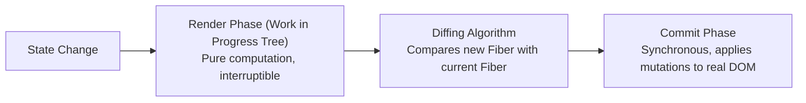

import { Callout } from 'fumadocs-ui/components/callout';
import { Tabs, Tab } from 'fumadocs-ui/components/tabs';

To scale React applications to millions of interactions, developers must understand how React balances rendering workloads, updates the native DOM, and optimizes compilation.

---

## 1. Virtual DOM & The React Fiber Reconciler

React maintains a lightweight in-memory representation of the UI called the **Virtual DOM**. When state changes, the **Fiber Reconciler** determines the minimal set of DOM changes needed:



### The Two Phases:
1. **Render Phase**: React calls component functions and creates a new Virtual DOM tree. This phase is pure, asynchronous, and can be paused or abandoned if higher-priority events (e.g. typing) arrive.
2. **Commit Phase**: React applies the calculated differences to the actual native browser DOM. This phase is synchronous and non-interruptible.

---

## 2. Reconciliation Heuristics (The Diffing Rules)

React relies on two heuristic rules to calculate diffs in $O(n)$ time:

1. **Different Element Types**: If a root element type changes (e.g. from `<div>` to `<section>`), React destroys the entire old subtree and mounts a fresh one from scratch.
2. **Keys Preserved**: When children are reordered, React matches elements using their `key` attribute to preserve component instances and state rather than re-creating them.

---

## 3. The React Compiler Paradigm Shift (React 19+)

In legacy React (v16–18), developers wrote extensive manual memoization to avoid re-renders:

```tsx
// Legacy React (Manual boilerplate required):
const memoizedValue = useMemo(() => computeHeavyStats(data), [data]);
const handleClick = useCallback(() => doAction(), []);
```

### The React Compiler Solution:
React 19 introduces the **React Compiler**, an automatic optimizing compiler that analyzes your component's JavaScript data flows and memoizes values and component outputs automatically at build time.

<Callout type="tip" title="Write Idiomatic, Clean Code">
With the React Compiler, you do not need to wrap every function in `useCallback` or every object in `useMemo`. Focus on writing clear, readable code; the compiler ensures memoization is applied optimally.
</Callout>

---

## 4. Error Boundaries (Graceful Failure)

If a runtime error occurs during rendering, React unmounts the entire component tree by default. **Error Boundaries** are components that catch JavaScript errors anywhere in their child component tree, log the error, and display a fallback UI:

```tsx
"use client";
import React, { Component, ErrorInfo, ReactNode } from "react";

interface Props {
  fallback: ReactNode;
  children: ReactNode;
}

interface State {
  hasError: boolean;
}

export class ErrorBoundary extends Component<Props, State> {
  public state: State = { hasError: false };

  public static getDerivedStateFromError(_: Error): State {
    return { hasError: true };
  }

  public componentDidCatch(error: Error, errorInfo: ErrorInfo) {
    console.error("Uncaught render error:", error, errorInfo);
  }

  public render() {
    if (this.state.hasError) {
      return this.props.fallback;
    }
    return this.props.children;
  }
}
```

### Usage in Application Layout:
```tsx
export function Dashboard() {
  return (
    <ErrorBoundary fallback={<div className="error-card">Widget failed to load.</div>}>
      <FinancialChartWidget />
    </ErrorBoundary>
  );
}
```
