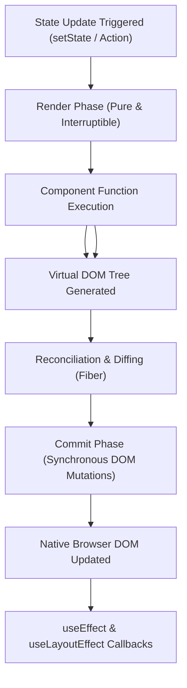

import { Cards, Card } from 'fumadocs-ui/components/card';
import { Callout } from 'fumadocs-ui/components/callout';

Welcome to the **React Curriculum**.

React is the industry-standard UI library powering modern full-stack web applications. By shifting the paradigm from imperative DOM manipulations (`document.getElementById`) to declarative state-driven rendering, React enables developers to reason about UI as a predictable mathematical formula: `UI = f(state)`.

In React 19, the ecosystem has evolved to a **server-first architecture** with native React Server Components (RSC), built-in Form Actions (`useActionState`, `useOptimistic`), and the automatic React Compiler.

---

## Curriculum Lessons

<Cards>
  <Card
    title="00. Toolchains & Project Setup"
    href="/docs/full-stack-development/react/00-toolchains-and-project-setup"
    description="Build toolchains, the evolution from CRA to Vite, package managers, and production repository anatomy."
  />
  <Card
    title="01. Components, JSX & Props"
    href="/docs/full-stack-development/react/01-components-jsx-and-props"
    description="Functional components, JSX runtime rules, props immutability, children composition, and list keys."
  />
  <Card
    title="02. State & Event Handling"
    href="/docs/full-stack-development/react/02-state-and-event-handling"
    description="useState snapshot mental models, immutable object/array updates, automatic batching, and derived state."
  />
  <Card
    title="03. Hooks & Lifecycle Synchronization"
    href="/docs/full-stack-development/react/03-hooks-and-lifecycle"
    description="The Rules of Hooks, useEffect synchronization, useRef, custom hooks, and class lifecycle mapping."
  />
  <Card
    title="04. React 19 Actions & Forms"
    href="/docs/full-stack-development/react/04-react-19-actions-and-forms"
    description="Native Form Actions, useActionState, useFormStatus, useOptimistic, and the conditional use() hook."
  />
  <Card
    title="05. Component Architecture & Context"
    href="/docs/full-stack-development/react/05-component-architecture-and-context"
    description="Lifting state up, controlled vs uncontrolled inputs, Context API, and compound components."
  />
  <Card
    title="06. Server Components & Rendering Models"
    href="/docs/full-stack-development/react/06-server-components-and-rendering"
    description="React Server Components (RSC), Client Component boundaries ('use client'), Suspense, and streaming HTML."
  />
  <Card
    title="07. Performance, Reconciliation & Compiler"
    href="/docs/full-stack-development/react/07-performance-and-reconciliation"
    description="Virtual DOM & Fiber diffing algorithm, the React Compiler, Error Boundaries, and rendering profiling."
  />
  <Card
    title="08. React Router & Navigation"
    href="/docs/full-stack-development/react/08-react-router-and-navigation"
    description="Client-side routing with React Router v6+: routes, nested layouts, outlets, dynamic params, and auth guards."
  />
  <Card
    title="09. Code Splitting & Lazy Loading"
    href="/docs/full-stack-development/react/09-code-splitting-and-lazy-loading"
    description="Bundle optimization with dynamic import(), React.lazy, Suspense boundaries, and useTransition."
  />
  <Card
    title="10. Global Client State with Zustand"
    href="/docs/full-stack-development/state-management/01-zustand-client-state"
    description="Lightweight Flux store architecture, TypeScript currying, useShallow optimization, middleware (persist & devtools), and the slice pattern."
  />
  <Card
    title="11. Server State & Data Fetching with TanStack Query"
    href="/docs/full-stack-development/state-management/02-tanstack-query-server-state"
    description="Asynchronous server state, QueryClientProvider, query keys, staleTime vs gcTime caching lifecycle, mutations, optimistic updates, and React 19 Suspense."
  />
  <Card
    title="12. React Hook Form & Validation"
    href="/docs/full-stack-development/react/12-react-hook-form-and-validation"
    description="Performant uncontrolled forms, Zod schema validation, Controller patterns for custom UI (shadcn/ui), and dynamic useFieldArray."
  />
  <Card
    title="React Glossary & Quick Reference"
    href="/docs/full-stack-development/react/glossary"
    description="Comprehensive quick-reference cheatsheet of built-in hooks, React 19 additions, and anti-patterns to avoid."
  />
</Cards>

---

## The React Rendering Pipeline

<Callout type="tip" title="Mental Model: Pure Functions">
React components should be pure functions with respect to their props and state. Given the same inputs, a component should always return the same JSX. Never perform side effects (mutating external variables, starting timers) directly inside the component render body.
</Callout>
