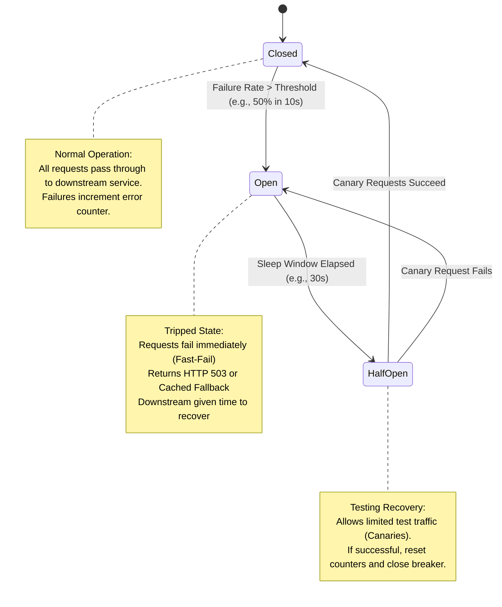
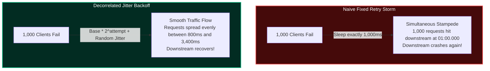
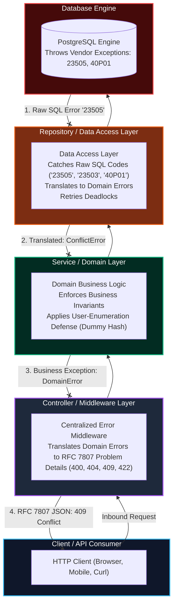

import { Callout } from 'fumadocs-ui/components/callout';
import { Tabs, Tab } from 'fumadocs-ui/components/tabs';
import { Steps, Step } from 'fumadocs-ui/components/steps';

In distributed backend architectures, failure is not an unexpected anomaly—it is a mathematical certainty. Disks run out of space, third-party payment gateways experience downtime, network switches drop TCP packets, and downstream microservices slow to a crawl.

A naive backend crashes or hangs indefinitely when an upstream dependency stumbles. A **resilient backend** embraces failure: it isolates faulty subsystems, trips circuit breakers to prevent cascading resource starvation, retries transient glitches with jittered backoff, and communicates structured diagnostics to API clients without leaking sensitive stack traces.

---

## 1. Operational Errors vs. Programmer Errors

The foundation of robust error architecture is recognizing that software errors fall into two fundamentally distinct categories:

```mermaid
flowchart TD
    subgraph Errors["All Runtime Exceptions"]
        OE["Operational Errors<br/>(Expected Environmental Glitches)"]
        PE["Programmer Errors<br/>(Bugs in Application Logic)"]
    end

    OE --> O1["Network timeout / Socket hangup"]
    OE --> O2["Database connection pool exhausted"]
    OE --> O3["Invalid user input (400 Bad Request)"]
    OE --> O4["Third-party API rate limit (429)"]
    OE --> OStrategy["Strategy: Catch, Retry with Jitter, Degrade gracefully, or return 4xx/5xx"]

    PE --> P1["TypeError: Cannot read property of undefined"]
    PE --> P2["SyntaxError / ReferenceError"]
    PE --> P3["Unhandled Promise Rejection"]
    PE --> P4["Passing wrong arguments to DB query"]
    PE --> PStrategy["Strategy: Fail Fast, Log Stack Trace, Alert Sentry, Restart Process cleanly"]

    style Errors fill:#0f172a,stroke:#38bdf8,stroke-width:2px,color:#ffffff
    style OE fill:#042f2e,stroke:#14b8a6,stroke-width:2px,color:#ffffff
    style PE fill:#450a0a,stroke:#ef4444,stroke-width:2px,color:#ffffff
    style OStrategy fill:#134e4a,stroke:#2dd4bf,stroke-width:1px,color:#ffffff
    style PStrategy fill:#7f1d1d,stroke:#f87171,stroke-width:1px,color:#ffffff
```



### The Architectural Distinction

| Dimension | Operational Errors | Programmer Errors |
| :--- | :--- | :--- |
| **Origin** | Real-world environment, network, external I/O, or user inputs. | Coding mistakes, unhandled edge cases, logic flaws. |
| **Predictability** | Expected to occur continuously throughout normal operation. | Unexpected; represents flawed program state. |
| **Examples** | `ECONNREFUSED`, `ETIMEDOUT`, disk full, schema validation failure. | `Cannot read property 'id' of null`, array index out of bounds. |
| **Response Strategy** | **Handle and recover**: Retry, return HTTP status, fall back to cached data. | **Fail fast and crash**: The process memory may be corrupted. Log to Sentry and restart pod. |
| **Client Visibility** | Return clean RFC 7807 JSON (`400`, `404`, `503`). | Return generic `500 Internal Server Error`; hide internal details. |

<Callout type="error" title="Never Swallow Programmer Errors">
Catching a `TypeError` with an empty `try/catch` block leaves your Node.js or Python process in an indeterminate state. If a variable that was supposed to be a database transaction handle is `undefined`, subsequent queries may commit partial mutations or leak connections. Restarting the worker process (letting systemd or Kubernetes respawn it) is safer than continuing with corrupted memory.
</Callout>

---

## 2. The Circuit Breaker Pattern

When a downstream service (such as an external SMS provider, billing API, or internal recommendation engine) goes down, incoming user requests will hang until their socket timeout expires (e.g., 30 seconds).

If your backend receives 500 requests per second, within 2 seconds **1,000 requests** are stuck waiting. Web worker threads, database connections, and file descriptors become saturated. Your service runs out of memory and crashes—a **cascading failure**.

The **Circuit Breaker** pattern solves this by wrapping external calls in a stateful protective switch:



### Circuit Breaker States

1. **`CLOSED` (Normal)**: All traffic passes through to the downstream service. The breaker monitors the ratio of successes to failures over a sliding time window (e.g., the last 60 seconds).
2. **`OPEN` (Tripped)**: When the failure rate exceeds the configured threshold (e.g., 50% errors across at least 20 calls), the breaker trips. Subsequent calls **fail immediately** without touching the network. This protects downstream systems from being hammered while down and frees your server threads immediately.
3. **`HALF-OPEN` (Probing)**: After a cooldown reset timeout (e.g., 30 seconds), the breaker transitions to `HALF-OPEN`. It permits a small number of "canary" probe requests to reach the downstream service. If they succeed, the breaker returns to `CLOSED`. If any canary fails, the breaker trips back to `OPEN` for another cooldown period.

---

## 3. Circuit Breaker Simulation: Step-by-Step Execution Trace

Explore this real-world simulation of an e-commerce checkout service interacting with an unstable payment processor:

<Tabs items={['Stage 1: Normal Traffic (Closed)', 'Stage 2: Downstream Degrades', 'Stage 3: Breaker Trips (Open & Fast-Fail)', 'Stage 4: Probing Health (Half-Open)', 'Stage 5: Recovery (Closed)']}>
  <Tab value="Stage 1: Normal Traffic (Closed)">
```text
[00:00.100] [CIRCUIT: CLOSED] Request #101 -> POST https://api.stripe-mock.internal/v1/charges
[00:00.142] [DOWNSTREAM] HTTP 200 OK (Latency: 42ms)
[00:00.143] [METRICS] Rolling Window: 100 requests, 100 successes, 0 failures (0% failure rate)
[00:00.500] [CIRCUIT: CLOSED] Request #102 -> POST https://api.stripe-mock.internal/v1/charges
[00:00.539] [DOWNSTREAM] HTTP 200 OK (Latency: 39ms)
[00:01.000] [HEALTH] All downstream dependencies responding within SLA (< 100ms).
```
*The circuit breaker operates in the `CLOSED` state. The error counter is zero, latency is nominal, and requests pass through seamlessly.*
  </Tab>

  <Tab value="Stage 2: Downstream Degrades">
```text
[00:05.210] [CIRCUIT: CLOSED] Request #120 -> POST https://api.stripe-mock.internal/v1/charges
[00:07.210] [DOWNSTREAM] Socket Timeout after 2000ms! (ECONNRESET)
[00:07.211] [METRICS] Rolling Window (last 10s): 10 calls, 6 failed, 4 succeeded (60% failure rate)
[00:07.450] [CIRCUIT: CLOSED] Request #121 -> POST https://api.stripe-mock.internal/v1/charges
[00:09.450] [DOWNSTREAM] HTTP 504 Gateway Timeout
[00:09.451] [ALERT] Failure rate reached 65% (Threshold: 50%). Minimum request volume (10) met.
```
*Downstream payment service experiences an outage. Latency spikes to the 2,000ms timeout mark, exhausting available thread pool capacity.*
  </Tab>

  <Tab value="Stage 3: Breaker Trips (Open & Fast-Fail)">
```text
[00:09.452] [STATE_TRANSITION] Circuit breaker 'PaymentGateway' transitioned: CLOSED -> OPEN
[00:09.453] [TIMER] Configured Reset Timeout: 30,000ms. Will attempt probe at 00:39.452.
[00:09.500] [CIRCUIT: OPEN] Request #122 -> Incoming Checkout Request
[00:09.501] [FAST_FAIL] Call aborted locally in 0.4ms! Error: CircuitBreakerOpenException
[00:09.502] [FALLBACK] Returning HTTP 503 with Retry-After: 30 (Degraded Mode: Payment queued for background capture)
[00:10.000] [METRICS] Thread pool utilization dropped from 98% -> 4%. System fully protected.
```
*The breaker trips to `OPEN`. All incoming payment attempts fail immediately in under 1ms. Your servers remain responsive and memory is completely protected.*
  </Tab>

  <Tab value="Stage 4: Probing Health (Half-Open)">
```text
[00:39.452] [TIMER] Reset timeout expired (30,000ms elapsed).
[00:39.453] [STATE_TRANSITION] Circuit breaker 'PaymentGateway' transitioned: OPEN -> HALF-OPEN
[00:39.500] [CIRCUIT: HALF-OPEN] Request #185 permitted as Canary Probe #1.
[00:39.545] [DOWNSTREAM] Canary Probe #1 returned HTTP 200 OK in 45ms.
[00:40.000] [CIRCUIT: HALF-OPEN] Request #186 permitted as Canary Probe #2.
[00:40.041] [DOWNSTREAM] Canary Probe #2 returned HTTP 200 OK in 41ms.
[00:40.042] [HEALTH] 2 consecutive canary probes succeeded.
```
*The cooldown timer expires. The breaker cautiously sends two real requests downstream to test if the payment gateway has recovered.*
  </Tab>

  <Tab value="Stage 5: Recovery (Closed)">
```text
[00:40.043] [STATE_TRANSITION] Circuit breaker 'PaymentGateway' transitioned: HALF-OPEN -> CLOSED
[00:40.044] [METRICS] Rolling failure counters reset to zero. Normal routing resumed.
[00:40.100] [CIRCUIT: CLOSED] Request #187 -> Normal execution completed in 38ms.
[00:40.101] [NOTIFICATION] OpsGenie auto-resolved: "Payment Gateway Circuit Breaker Restored".
```
*The service automatically self-heals without human intervention or manual server restarts.*
  </Tab>
</Tabs>

---

## 4. The Bulkhead Pattern: Architectural Compartmentalization

Named after the watertight partition bulkheads inside oceanic ships that prevent a single hull breach from sinking the entire vessel, the **Bulkhead Pattern** divides system resources into isolated pools.

```
       WITHOUT BULKHEAD (Shared Thread / Connection Pool)
       +------------------------------------------------------+
       | Incoming Traffic                                     |
       |  - Critical Auth: 10 req/s                           |
       |  - Analytics Upload: 1000 req/s [HANGING]            |
       +------------------------------------------------------+
                                  |
                                  v
       +------------------------------------------------------+
       | Single Shared DB Pool (50 max connections)           |
       | Analytics takes 50/50 connections -> AUTH IS DOWN!   |
       +------------------------------------------------------+

       WITH BULKHEAD (Isolated Connection & Worker Pools)
       +--------------------+          +--------------------+
       | Auth / Checkout    |          | Analytics / Logs   |
       | Pool: 40 Conns     |          | Pool: 10 Conns     |
       | Status: 100% UP    |          | Status: Saturation |
       +--------------------+          +--------------------+
```

### Implementing Bulkheads Across Backend Layers

1. **Process & Thread Bulkheads**: Run CPU-heavy tasks (video transcoding, image resizing, PDF generation) in dedicated worker processes or separate worker queues (e.g. BullMQ / Celery), rather than inside the main HTTP event loop.
2. **Database Connection Pool Bulkheads**: Do not share a single PostgreSQL connection pool between interactive user queries and background analytical cron jobs. Allocate 80% of pool connections to user-facing API handlers and 20% to analytical workers.
3. **HTTP Client Bulkheads**: Configure separate HTTP client instances with independent socket pool limits (`maxSockets`) for each external integration.

---

## 5. Retries: Exponential Backoff & Jitter

When a network request fails due to a transient glitch (such as a temporary network hiccup or an overloaded microservice returning `HTTP 503`), retrying immediately will often fail and make the overload worse.

If 10,000 clients all retry simultaneously after exactly 1.0 second, they produce a synchronized wave of requests called the **Thundering Herd problem** (or retry storm).



### The Mathematics of Exponential Backoff with Jitter

AWS Architecture research proven that **Full Jitter** or **Decorrelated Jitter** drastically reduces downstream queuing and contention:

1. **Standard Exponential Backoff**:
   $$T_{\text{sleep}} = \min(T_{\text{max}}, T_{\text{base}} \times 2^{\text{attempt}})$$
2. **Exponential Backoff with Full Jitter**:
   $$T_{\text{sleep}} = \text{random}(0, \min(T_{\text{max}}, T_{\text{base}} \times 2^{\text{attempt}}))$$
3. **Decorrelated Jitter (Optimal for Microservices)**:
   $$T_{\text{sleep}} = \min(T_{\text{max}}, \text{random}(T_{\text{base}}, T_{\text{prev}} \times 3))$$

### Production TypeScript Implementation

```typescript
export interface RetryOptions {
  maxRetries: number;
  baseDelayMs: number;
  maxDelayMs: number;
  retryableStatuses?: number[];
}

export async function fetchWithJitterRetry<T>(
  fn: () => Promise<T>,
  options: RetryOptions = { maxRetries: 3, baseDelayMs: 200, maxDelayMs: 3000 }
): Promise<T> {
  const { maxRetries, baseDelayMs, maxDelayMs, retryableStatuses = [429, 502, 503, 504] } = options;
  let attempt = 0;

  while (true) {
    try {
      return await fn();
    } catch (error: any) {
      attempt++;
      const isLastAttempt = attempt > maxRetries;
      
      // Determine if error is transient
      const status = error?.response?.status || error?.status;
      const isNetworkError = error.code === 'ECONNRESET' || error.code === 'ETIMEDOUT';
      const isRetryable = isNetworkError || (status && retryableStatuses.includes(status));

      if (isLastAttempt || !isRetryable) {
        throw error;
      }

      // Calculate Exponential Backoff with Full Jitter
      const exponentialDelay = Math.min(maxDelayMs, baseDelayMs * Math.pow(2, attempt));
      const jitteredDelay = Math.floor(Math.random() * exponentialDelay);

      console.warn(
        `[Retry] Attempt ${attempt}/${maxRetries} failed with ${error.message}. ` +
        `Retrying in ${jitteredDelay}ms...`
      );

      await new Promise((resolve) => setTimeout(resolve, jitteredDelay));
    }
  }
}
```

<Callout type="warn" title="Only Retry Idempotent Operations">
Never automatically retry non-idempotent operations! If a `POST /charges` request times out after 10 seconds, the payment may have been processed by the bank even though the network connection dropped before receiving the response. Retrying unconditionally will charge the customer twice. Always use **Idempotency Keys** (e.g., `Idempotency-Key: uuid-v4`) when retrying mutating operations.
</Callout>

---

## 6. The Layer-Specific Error Translation Pattern

In an enterprise N-tier backend (Controller → Service → Repository → Database), letting raw database exceptions bubble up to HTTP responses is a severe architectural flaw.



### Why Layer Separation Is Critical
1. **Information Disclosure Prevention:** If raw SQL exceptions bubble up, internal table names, foreign key constraints, and column schemas leak into HTTP responses, arming attackers with schema blueprints for injection.
2. **Coupling Decoupling:** The Service and Controller layers should never know whether data is stored in PostgreSQL, MongoDB, or DynamoDB. Translating low-level vendor errors at the Repository boundary maintains strict domain isolation.
3. **Resilience & Concurrency:** Database deadlocks (`40P01`) should be automatically retried at the repository transaction boundary before the application gives up.

---

## 7. Concrete Translation: Repositories, Services & Deadlock Retries

### 1. Repository Layer Error Translation & Deadlock Retries

The Repository catches raw SQL error codes and translates them into semantic domain errors:

| PostgreSQL Error Code | Meaning | Translated Domain Error | Target HTTP Status |
| :--- | :--- | :--- | :--- |
| `23505` | `unique_violation` | `ConflictError` | `409 Conflict` |
| `23503` | `foreign_key_violation` | `EntityNotFoundError` / `BadRequestError` | `404 Not Found` / `400 Bad Request` |
| `23502` | `not_null_violation` | `ValidationError` | `400 Bad Request` |
| `40P01` | `deadlock_detected` | Retry 3x with jitter; else `TransientConcurrencyError` | `503 Service Unavailable` (`Retry-After: 1`) |

```typescript
import { Pool, PoolClient } from 'pg';

export class UserRepository {
  constructor(private readonly pool: Pool) {}

  /**
   * Executes a database transaction with automated deadlock retry
   */
  async withDeadlockRetry<T>(operation: (client: PoolClient) => Promise<T>, maxRetries = 3): Promise<T> {
    let attempt = 0;
    while (attempt < maxRetries) {
      attempt++;
      const client = await this.pool.connect();
      try {
        await client.query('BEGIN');
        const result = await operation(client);
        await client.query('COMMIT');
        return result;
      } catch (error: any) {
        await client.query('ROLLBACK');

        // Postgres SQLSTATE 40P01 = deadlock_detected
        if (error.code === '40P01' && attempt < maxRetries) {
          const jitter = Math.floor(Math.random() * 50) + attempt * 50;
          console.warn(`[DEADLOCK_DETECTED] Retrying transaction (Attempt ${attempt}/${maxRetries}) after ${jitter}ms`);
          await new Promise((res) => setTimeout(res, jitter));
          continue;
        }

        // Map raw vendor SQL errors into domain errors
        this.translatePostgresError(error);
      } finally {
        client.release();
      }
    }
    throw new TransientConcurrencyError('Database transaction failed due to persistent deadlock.');
  }

  private translatePostgresError(error: any): never {
    if (error.code === '23505') {
      // e.g. Key (email)=(victim@bank.com) already exists.
      throw new ConflictError('A record with this identifier already exists in the system.', {
        detail: error.detail,
        constraint: error.constraint,
      });
    }

    if (error.code === '23503') {
      throw new EntityNotFoundError('The referenced foreign record does not exist.', {
        constraint: error.constraint,
      });
    }

    if (error.code === '40P01') {
      throw new TransientConcurrencyError('Database deadlock occurred. Please retry.');
    }

    // Unmapped unexpected database error -> rethrow as system failure
    throw error;
  }
}
```

### 2. Service Layer: Invariants & User-Enumeration Defense

The Service layer enforces business rules and protects authentication endpoints from **User Enumeration and Timing Attacks**:

```typescript
import argon2 from 'argon2';

// Dummy hash generated at application startup with identical Argon2id parameters
const DUMMY_HASH = '$argon2id$v=19$m=65536,t=3,p=4$dummySalt1234567$dummyHashValueToEqualizeTiming...';

export class AuthService {
  constructor(private readonly userRepo: UserRepository) {}

  /**
   * Authenticates user while defeating timing attacks & user enumeration
   */
  async login(email: string, passwordAttempt: string): Promise<{ token: string }> {
    const user = await this.userRepo.findByEmail(email);

    // 🛡️ ANTI-ENUMERATION DEFENSE:
    // If the user DOES NOT exist, we STILL compute an Argon2id hash against DUMMY_HASH!
    // This ensures login latency is identical (~80ms) whether the email exists or not,
    // completely defeating timing analysis and user-enumeration scanners.
    if (!user) {
      await argon2.verify(DUMMY_HASH, passwordAttempt).catch(() => false);
      throw new InvalidCredentialsError();
    }

    const isMatch = await argon2.verify(user.passwordHash, passwordAttempt);
    if (!isMatch) {
      throw new InvalidCredentialsError();
    }

    return { token: 'jwt_valid_token' };
  }
}
```

---

## 8. Centralized Global Error Middleware & RFC 7807 / RFC 9457

In an enterprise API, all domain errors are captured by a centralized error handling middleware and normalized into the **RFC 7807 (updated by RFC 9457) Problem Details for HTTP APIs** specification:

```json
{
  "type": "https://api.mycompany.com/errors/conflict",
  "title": "Conflict",
  "status": 409,
  "detail": "A user with the provided email address already exists.",
  "instance": "/v1/auth/register",
  "code": "ERR_CONFLICT",
  "timestamp": "2026-10-05T12:00:00Z",
  "traceId": "00-4bf92f3577b34da6a3ce929d0e0e4736-00f067aa0ba902b7-01"
}
```

### Complete Express / TypeScript Error Architecture

```typescript
import { Request, Response, NextFunction } from 'express';

// 1. Base Domain Error Class
export abstract class AppError extends Error {
  public abstract readonly statusCode: number;
  public abstract readonly errorCode: string;
  public readonly isOperational: boolean = true;

  constructor(message: string, public readonly details?: Record<string, unknown>) {
    super(message);
    Object.setPrototypeOf(this, new.target.prototype);
    Error.captureStackTrace(this, this.constructor);
  }

  public abstract toProblemDetails(instanceUri: string, traceId: string): Record<string, unknown>;
}

// 2. Concrete Domain Errors
export class ConflictError extends AppError {
  public readonly statusCode = 409;
  public readonly errorCode = 'CONFLICT';

  toProblemDetails(instanceUri: string, traceId: string) {
    return {
      type: 'https://api.example.com/errors/conflict',
      title: 'Resource Conflict',
      status: this.statusCode,
      detail: this.message,
      instance: instanceUri,
      code: this.errorCode,
      traceId,
    };
  }
}

export class EntityNotFoundError extends AppError {
  public readonly statusCode = 404;
  public readonly errorCode = 'ENTITY_NOT_FOUND';

  toProblemDetails(instanceUri: string, traceId: string) {
    return {
      type: 'https://api.example.com/errors/not-found',
      title: 'Resource Not Found',
      status: this.statusCode,
      detail: this.message,
      instance: instanceUri,
      code: this.errorCode,
      traceId,
    };
  }
}

export class ValidationError extends AppError {
  public readonly statusCode = 400;
  public readonly errorCode = 'VALIDATION_FAILED';

  constructor(message: string, public readonly validationErrors: Array<{ field: string; message: string }>) {
    super(message);
  }

  toProblemDetails(instanceUri: string, traceId: string) {
    return {
      type: 'https://api.example.com/errors/validation-failed',
      title: 'Validation Error',
      status: this.statusCode,
      detail: this.message,
      instance: instanceUri,
      code: this.errorCode,
      invalid_params: this.validationErrors,
      traceId,
    };
  }
}

export class InvalidCredentialsError extends AppError {
  public readonly statusCode = 401;
  public readonly errorCode = 'INVALID_CREDENTIALS';

  constructor() {
    // Generic message prevents user enumeration
    super('Invalid email or password.');
  }

  toProblemDetails(instanceUri: string, traceId: string) {
    return {
      type: 'https://api.example.com/errors/unauthorized',
      title: 'Unauthorized',
      status: this.statusCode,
      detail: this.message,
      instance: instanceUri,
      code: this.errorCode,
      traceId,
    };
  }
}

export class TransientConcurrencyError extends AppError {
  public readonly statusCode = 503;
  public readonly errorCode = 'CONCURRENCY_TIMEOUT';

  toProblemDetails(instanceUri: string, traceId: string) {
    return {
      type: 'https://api.example.com/errors/service-unavailable',
      title: 'Service Temporarily Unavailable',
      status: this.statusCode,
      detail: this.message,
      instance: instanceUri,
      code: this.errorCode,
      retryAfterSeconds: 1,
      traceId,
    };
  }
}

// 3. Centralized Global Error Handler Middleware
export function errorHandlerMiddleware(
  err: Error,
  req: Request,
  res: Response,
  next: NextFunction
): void {
  const traceId = (req.headers['x-trace-id'] as string) || req.id || 'trace-unknown';
  const instanceUri = req.originalUrl;

  // Case A: Handled Domain / Operational Error
  if (err instanceof AppError && err.isOperational) {
    const payload = err.toProblemDetails(instanceUri, traceId);
    res.setHeader('Content-Type', 'application/problem+json');
    if (err instanceof TransientConcurrencyError) {
      res.setHeader('Retry-After', '1');
    }
    res.status(err.statusCode).json(payload);
    return;
  }

  // Case B: Unhandled Programmer Error or Severe System Failure
  console.error('[FATAL_PROGRAMMER_ERROR]', {
    message: err.message,
    stack: err.stack,
    traceId,
    path: req.path,
    method: req.method,
  });

  const isProduction = process.env.NODE_ENV === 'production';
  const problemDetails = {
    type: 'https://api.example.com/errors/internal-server-error',
    title: 'Internal Server Error',
    status: 500,
    detail: isProduction
      ? 'An unexpected error occurred. Please contact support with the trace ID.'
      : err.message,
    instance: instanceUri,
    code: 'INTERNAL_SERVER_ERROR',
    traceId,
    ...(isProduction ? {} : { stack: err.stack }),
  };

  res.setHeader('Content-Type', 'application/problem+json');
  res.status(500).json(problemDetails);
}
```

---

## 9. Operational Checklist & Best Practices

<Steps>
  <Step>
    ### Separate Operational from Programmer Errors
    Subclass your domain errors from a custom base `AppError`. Mark expected operational errors with `isOperational = true`.
  </Step>
  <Step>
    ### Translate Raw SQL Errors at the Repository Boundary
    Catch PostgreSQL error codes (`23505`, `23503`, `23502`) in data access repositories and map them to domain `ConflictError` or `EntityNotFoundError` to prevent schema leakage.
  </Step>
  <Step>
    ### Implement Automated Deadlock Retries
    Wrap database transactions in a retry loop that intercepts PostgreSQL `40P01` deadlock codes and retries with randomized backoff before giving up.
  </Step>
  <Step>
    ### Defend Against User Enumeration with Constant-Time Hashes
    On login failure, return a generic `InvalidCredentialsError` and execute a dummy Argon2id hash verification when the user is not found to equalize latency.
  </Step>
  <Step>
    ### Protect External Integrations with Circuit Breakers
    Never make unbounded external HTTP calls. Wrap third-party APIs with a circuit breaker configured with a 50% error threshold and a 30s reset cooldown.
  </Step>
  <Step>
    ### Standardize on RFC 7807 / RFC 9457 Problem Details
    Return uniform, machine-readable JSON error payloads with standard keys (`type`, `title`, `status`, `detail`, `instance`, `traceId`). Set `Content-Type: application/problem+json`.
  </Step>
</Steps>

