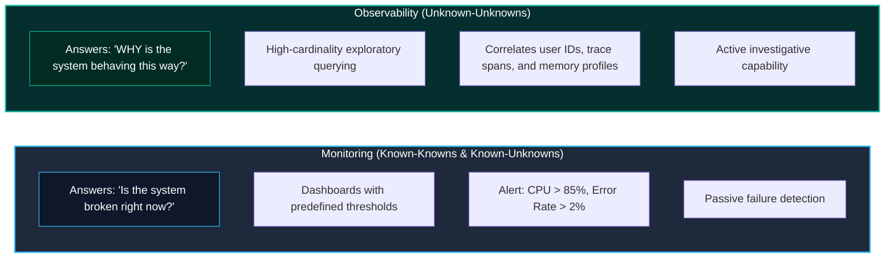
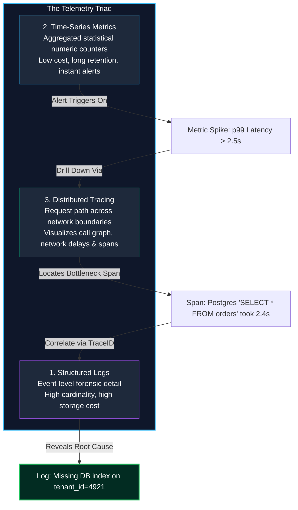
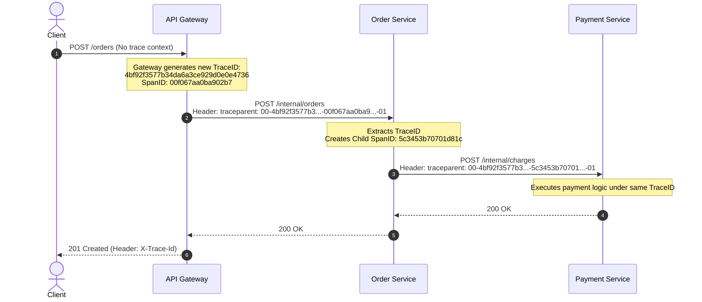
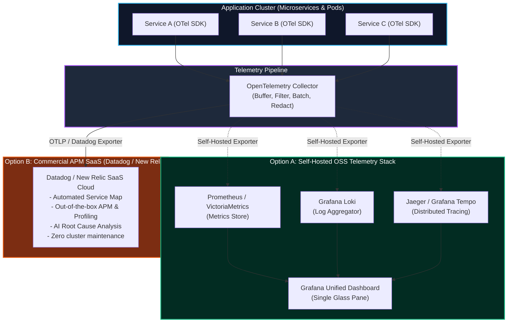

import { Callout } from 'fumadocs-ui/components/callout';
import { Tabs, Tab } from 'fumadocs-ui/components/tabs';
import { Steps, Step } from 'fumadocs-ui/components/steps';

When a monolithic backend running on a single server crashed in 2012, an engineer could SSH into the machine, run `tail -f /var/log/app.log`, and diagnose the bug within minutes.

In modern cloud-native architectures—where a single user click triggers a cascade of asynchronous HTTP and gRPC calls across 20 containerized microservices running on dynamic Kubernetes clusters—traditional server inspection fails. **Observability** provides the tooling and mathematical telemetry required to answer questions about internal system states that were never anticipated in advance.

---

## 1. Monitoring vs. Observability: The Core Philosophy

While often conflated, **Monitoring** and **Observability** address fundamentally different cognitive needs:



- **Monitoring tells you *when* a system is failing**: It checks predetermined health signals against static thresholds (e.g., *"Ping failed"*, *"HTTP 500 error count exceeded 50 per minute"*).
- **Observability enables you to deduce *why* an unprecedented failure occurred**: It measures the external outputs of a system (telemetry) to reconstruct any internal state, even if you never anticipated that specific failure mode when writing the code.

---

## 2. The Three Pillars of Observability

A complete observability pipeline relies on three complementary data structures: **Logs**, **Metrics**, and **Traces**.



### Comparing Telemetry Modalities

| Dimension | Structured Logs | Time-Series Metrics | Distributed Traces |
| :--- | :--- | :--- | :--- |
| **Data Format** | JSON key-value records with timestamps. | Float value + timestamp + key-value labels. | Directed acyclic graph (DAG) of spans. |
| **Typical Tools** | Elasticsearch, Grafana Loki, Datadog. | Prometheus, VictoriaMetrics, AWS CloudWatch. | Jaeger, Grafana Tempo, Honeycomb, AWS X-Ray. |
| **Cardinality** | Extremely high (user IDs, IP addresses, emails). | Low to moderate (method, status, route). | High (trace IDs, request IDs, span tags). |
| **Primary Strength** | Forensic root-cause analysis. | Real-time alerting and aggregate trending. | Pinpointing distributed latency bottlenecks. |

<Callout type="warn" title="Beware of Metric Cardinality Explosions">
Never attach raw high-cardinality values—such as `userId`, `email`, or `uuid`—as Prometheus metric labels! Prometheus creates a distinct time-series in RAM for every unique label combination. Emitting 100,000 user IDs as metric dimensions will exhaust your Prometheus server's memory and trigger an Out-Of-Memory (OOM) crash. Put high-cardinality identifiers in **Logs** and **Traces**, not in Metrics.
</Callout>

---

## 3. SRE Methodologies: RED & USE Methods

To avoid dashboard clutter and alert fatigue, Google and Site Reliability Engineering (SRE) leaders rely on standardized metric frameworks:

### 1. The RED Method (For Request-Driven Services)
Developed by Tom Wilkie, the RED method covers every service handling synchronous requests (REST, GraphQL, gRPC):
- **Rate**: The number of requests the service is serving per second ($QPS$).
- **Errors**: The number of requests that are failing per second (e.g., HTTP `5xx` rate).
- **Duration**: The time requests take to complete, analyzed across percentiles ($p50$, $p90$, $p99$).

```
        RED METHOD DASHBOARD PANEL EXAMPLE
        +-------------------------------------------------------+
        | RATE:     [|||||||||||||||||||||||||||] 1,420 req/sec |
        | ERRORS:   [||] 0.12% (nominal < 0.5%)                 |
        | DURATION: p50: 14ms | p90: 45ms | p99: 180ms          |
        +-------------------------------------------------------+
```

### 2. The USE Method (For Underlying System Resources)
Developed by Brendan Gregg for analyzing hardware and infrastructure bottlenecks (CPU, Memory, Disks, Network Interfaces, Connection Pools):
- **Utilization**: The percentage of time the resource was busy performing work (e.g., CPU at 72%).
- **Saturation**: The degree to which extra work is waiting in a queue (e.g., CPU run queue length > number of cores, or Postgres connection pool queue size > 0).
- **Errors**: Hardware or driver failure counts (e.g., dropped network packets, memory page faults).

---

## 4. OpenTelemetry & Distributed Context Propagation

In a microservices architecture, a user request flows across multiple physical machines. To track the execution end-to-end, the industry standard is **OpenTelemetry (OTel)** using the **W3C Trace Context specification**.



### The W3C `traceparent` Header Format

The `traceparent` header string is a 4-part hyphen-delimited string:

```
traceparent: 00-4bf92f3577b34da6a3ce929d0e0e4736-00f067aa0ba902b7-01
             ^^ -------------------------------- ---------------- ^^
             |                 |                        |          |
          Version           Trace ID                 Parent      Trace
           (00)          (16-byte hex,             Span ID       Flags
                         shared across all       (8-byte hex,   (01 = sampled)
                           microservices)        unique per hop)
```

### Production OpenTelemetry Node.js Instrumentation

```typescript
import { trace, context, SpanStatusCode } from '@opentelemetry/api';

const tracer = trace.getTracer('ecommerce-order-service', '1.0.0');

export async function processOrderCheckout(userId: string, orderPayload: any) {
  // Start an active tracing span
  return tracer.startActiveSpan('processOrderCheckout', async (span) => {
    try {
      // 1. Add contextual attributes for high-cardinality debugging
      span.setAttribute('app.user_id', userId);
      span.setAttribute('app.order_amount', orderPayload.amount);
      span.setAttribute('app.item_count', orderPayload.items.length);

      // 2. Perform business logic
      const reservation = await reserveInventory(orderPayload.items);
      const charge = await executePaymentGatewayCharge(userId, orderPayload.amount);

      // 3. Mark span as successful
      span.setStatus({ code: SpanStatusCode.OK });
      return { orderId: charge.orderId, status: 'COMPLETED' };
    } catch (error: any) {
      // 4. Record exception details inside the trace
      span.recordException(error);
      span.setStatus({
        code: SpanStatusCode.ERROR,
        message: error.message,
      });
      throw error;
    } finally {
      // 5. Always end span to transmit metrics
      span.end();
    }
  });
}
```

---

## 5. Structured JSON Logging & Log Level Hygiene

Plaintext logs written with `console.log("User " + id + " bought item")` are unsearchable at scale. Production systems emit newline-delimited JSON (NDJSON) enriched with contextual metadata:

```json
{
  "level": "error",
  "time": 1728130800000,
  "pid": 2941,
  "hostname": "order-worker-pod-6f98c7",
  "trace_id": "4bf92f3577b34da6a3ce929d0e0e4736",
  "span_id": "00f067aa0ba902b7",
  "service": "order-service",
  "environment": "production",
  "userId": "usr_99812",
  "tenantId": "org_enterprise_alpha",
  "msg": "Failed to charge credit card via Stripe",
  "error": {
    "name": "StripeRateLimitError",
    "message": "Too many requests to Stripe API",
    "stack": "Error: Too many requests\n    at StripeClient.post (/app/node_modules/stripe/lib/StripeClient.js:84:12)"
  }
}
```

### Log Level Hygiene

A production logging system must enforce strict operational discipline around log severity levels:

| Level | Formal Definition | When to Use | Action Required? |
| :--- | :--- | :--- | :--- |
| **`DEBUG`** | Fine-grained diagnostic information for engineers during development. | Variable contents, internal branch decisions, function entry/exit, loop counts. | None. Filtered out in production. |
| **`INFO`** | Normal operational milestones indicating healthy system progress. | Server started on port 3000, user successfully logged in, payment authorized, cron job completed. | None. Used for operational audits. |
| **`WARN`** | An unexpected or degraded condition occurred, but the request still succeeded. | Transient retry succeeded, deprecated API version invoked, cache miss triggered slow DB fallback, queue depth > 70%. | Low urgency. Monitored for recurring anomalies. |
| **`ERROR`** | A request or background transaction **failed** and could not complete. | Database query timeout, payment declined by gateway after retries, 500 error returned to client. | **Yes.** Paged or tracked in Sentry / bug tracker. |
| **`FATAL`** | The application process suffered an unrecoverable failure and must terminate. | Out of memory (OOM), missing database encryption key in environment, unhandled crash during startup. | **Immediate.** SRE paged; Kubernetes pod restarts. |

### Environment-Based Filtering & Log Sampling

At 50,000 requests per second, logging every single `INFO` event creates petabytes of data, causing runaway cloud bills (e.g., Datadog or CloudWatch ingestion costs).

1. **Environment-Based Minimum Levels:**
   - **Local Development:** `LOG_LEVEL=debug` (pretty-printed via `pino-pretty`).
   - **Staging / QA:** `LOG_LEVEL=info`.
   - **Production:** `LOG_LEVEL=info` (with sampling) or `LOG_LEVEL=warn`.
2. **Log Sampling Strategy:**
   - **100% Retention:** Retain all `WARN`, `ERROR`, and `FATAL` logs unconditionally.
   - **Probabilistic Sampling (1% - 5%):** Sample a random 1% of successful `INFO` request events to maintain baseline traffic health without blowing the storage budget.
   - **Latency-Based Retention:** Retain `INFO` logs for any request taking longer than 1,000ms ($p99$).

```typescript
import pino from 'pino';

const isProduction = process.env.NODE_ENV === 'production';
const logLevel = process.env.LOG_LEVEL || (isProduction ? 'info' : 'debug');

export const logger = pino({
  level: logLevel,
  // 🛡️ Redact sensitive user data to prevent PII leakage into log aggregators
  redact: {
    paths: [
      'req.headers.authorization',
      'req.headers.cookie',
      'password',
      'creditCardNumber',
      'token',
      'apiKey',
    ],
    remove: true,
  },
  formatters: {
    level(label) {
      return { level: label };
    },
  },
  timestamp: pino.stdTimeFunctions.isoTime,
});

/**
 * Probabilistic sampler: logs info only for a percentage of requests
 */
export function sampleLog(sampleRatePercent: number, msg: string, metadata: Record<string, unknown>) {
  if (Math.random() * 100 < sampleRatePercent) {
    logger.info({ ...metadata, sampled: true }, msg);
  }
}
```

---

## 6. OSS Telemetry Stack vs. Commercial APM

When architecting an observability platform, engineering organizations face a classic build-vs-buy choice: **Self-Hosted Open Source Software (OSS)** vs. **Commercial APM SaaS**.



### Architectural Comparison: Self-Hosted OSS vs. Commercial APM

| Evaluation Dimension | Self-Hosted OSS (Prometheus + Grafana + Loki + Jaeger) | Commercial APM SaaS (Datadog, New Relic, Dynatrace) |
| :--- | :--- | :--- |
| **Core Components** | Prometheus (Metrics), Loki (Logs), Tempo/Jaeger (Traces), Grafana (UI). | Single agent / OpenTelemetry exporter delivering to vendor cloud. |
| **Initial Setup Time** | Days to weeks (configuring storage backends, helm charts, retention policies). | **Minutes** (install agent or point OTel collector to API key). |
| **Pricing & Cost Model** | **Infrastructure Cost Only** (EC2, S3 disks, memory). Zero per-host license fees. | **Usage-Based License Fees** (e.g. $15-$31/host/month + per-GB log ingestion + per-million custom metrics). |
| **High Cardinality Pricing Risk** | Fixed compute costs; metric explosion causes server OOM crash. | **Severe Surprise Invoicing**; emitting high-cardinality custom metric tags can easily generate a $50,000 surprise monthly bill! |
| **Maintenance Burden** | **High.** SRE team must maintain, upgrade, shard, backup, and tune cluster storage. | **Zero.** Vendor manages database clusters, scaling, and high availability. |
| **Correlation & Ease of Use** | Moderate. Requires manual configuration of trace-to-log links and dashboards in Grafana. | **Exceptional.** Automatic service maps, seamless 1-click trace-to-log navigation, and out-of-the-box APM dashboards. |
| **Data Sovereignty & Compliance** | **Absolute.** Telemetry data never leaves your VPC. Compliant with HIPAA, GDPR, banking regulations. | Third-party data processing agreement required. PII masking must be enforced at agent level. |

### The SRE Decision Matrix
- **Choose Self-Hosted OSS** if you operate large-scale Kubernetes infrastructure (100+ nodes), possess a dedicated DevOps/SRE platform team, operate in strict compliance environments (defense, banking, healthcare), or want to avoid six-figure SaaS bills.
- **Choose Commercial APM** if you have a small engineering team that needs instant observability without dedicating full-time engineers to maintaining logging clusters, or when rapid time-to-market outweighs software licensing expenses.

---

## 7. Simulation of Working: Incident Triage Execution Trace


Walk through a complete real-world SRE incident triage flow—from automated PagerDuty alarm to metric diagnosis, trace isolation, and structured log root cause identification:

<Tabs items={['Stage 1: PagerDuty Alert Triggered', 'Stage 2: RED Metrics Dashboard Investigation', 'Stage 3: Distributed Trace Latency Drilldown', 'Stage 4: Structured Log Root Cause Correlated']}>
  <Tab value="Stage 1: PagerDuty Alert Triggered">
```text
[14:22:04 UTC] [PAGERDUTY:FIRING] High-Severity Incident #94102
              Service: api-gateway.production
              Condition: p99 Latency > 3000ms for 3 consecutive minutes
              Current Value: 4,820ms (Threshold: 1,000ms)
              Impact: 14% of customer checkout requests timing out (HTTP 504)
              On-Call Engineer: @sre-oncall paged via SMS & Push notification
```
*An automated alert wakes the on-call engineer. The alert provides the exact metric anomaly and impacted endpoint.*
  </Tab>

  <Tab value="Stage 2: RED Metrics Dashboard Investigation">
```text
[14:24:10 UTC] [GRAFANA:RED_METHOD_DASHBOARD]
              - Rate (QPS): Steady at 2,400 req/s (No abnormal traffic spike)
              - Errors (5xx): Spiked from 0.01% to 14.8% at exactly 14:19 UTC
              - Duration:
                * p50 (median): 28ms (Healthy)
                * p90: 120ms (Healthy)
                * p99: 4,820ms (CRITICAL SEVERITY SPUR)
              - Service Breakdown:
                * auth-service: p99 = 15ms (Healthy)
                * order-service: p99 = 4,790ms (IDENTIFIED BOTTLENECK SERVICE)
```
*The RED dashboard eliminates the auth service and confirms `order-service` is the sole source of latency.*
  </Tab>

  <Tab value="Stage 3: Distributed Trace Latency Drilldown">
```text
[14:26:30 UTC] [JAEGER:TRACE_QUERY] Filter: service=order-service & minDuration=4s
Trace ID: 00-7fa9b201889c2041b-482098ca1209b-01 (Total Duration: 4,812ms)
--------------------------------------------------------------------------------
Span 1: [Gateway] GET /api/v1/orders/recent .......................... [4,812ms]
  Span 2: [OrderSvc] Handler: getRecentOrders ........................ [4,790ms]
    Span 3: [OrderSvc] AuthTokenVerify ............................... [    8ms]
    Span 4: [OrderSvc] CacheLookup: Redis GET 'recent:usr_812' [MISS]  [    3ms]
    Span 5: [OrderSvc] Postgres Query: 'SELECT * FROM orders ...' .... [4,765ms] ⚠️
--------------------------------------------------------------------------------
Bottleneck Pinpointed: Span 5 (Database Query) consumed 99.2% of total transaction time!
```
*Distributed tracing instantly proves the issue is not network latency or external API calls, but an individual database query.*
  </Tab>

  <Tab value="Stage 4: Structured Log Root Cause Correlated">
```text
[14:28:15 UTC] [LOKI:LOG_SEARCH] query: {service="order-service"} |= "00-7fa9b201889c2041b"
Found 1 matching log record:
{
  "level": "warn",
  "time": "2026-10-05T14:21:48.102Z",
  "traceId": "00-7fa9b201889c2041b",
  "service": "order-service",
  "query_duration_ms": 4765,
  "sql": "SELECT * FROM orders WHERE customer_id = $1 ORDER BY created_at DESC",
  "explain_plan": "Seq Scan on orders (cost=0.00..184912.40 rows=2910 width=420)",
  "warning": "Sequential scan executed on unindexed table column 'customer_id' (Table size: 12M rows)"
}

[14:31:00 UTC] [RESOLUTION] Hotfix applied: Added concurrent btree index `idx_orders_customer_id`.
[14:32:00 UTC] [METRICS] p99 latency dropped from 4,820ms -> 18ms. PagerDuty auto-resolved.
```
*Correlating the trace ID directly into the structured log engine reveals the exact root cause: a missing database index.*
  </Tab>
</Tabs>

---

## 8. Operational Checklist

<Steps>
  <Step>
    ### Emit Structured JSON Logs
    Ban unstructured `console.log` in production. Format all log entries as NDJSON with uniform keys (`level`, `time`, `msg`, `trace_id`).
  </Step>
  <Step>
    ### Standardize on RED Metrics for HTTP/RPC APIs
    Set up standard Grafana dashboards tracking Rate, Errors, and Duration percentiles (p50, p90, p99) for every route.
  </Step>
  <Step>
    ### Implement OpenTelemetry Context Propagation
    Pass W3C `traceparent` headers across every HTTP, gRPC, and message queue boundary (RabbitMQ/Kafka) to maintain continuous trace trees.
  </Step>
  <Step>
    ### Correlate Logs and Traces
    Inject active OpenTelemetry `trace_id` and `span_id` values into your logging logger context automatically.
  </Step>
  <Step>
    ### Configure Multi-Window Percentile Alerts
    Avoid alerting on single spikes. Alert on sustained anomalies (e.g., p99 latency exceeding threshold for 3 consecutive minutes).
  </Step>
</Steps>
