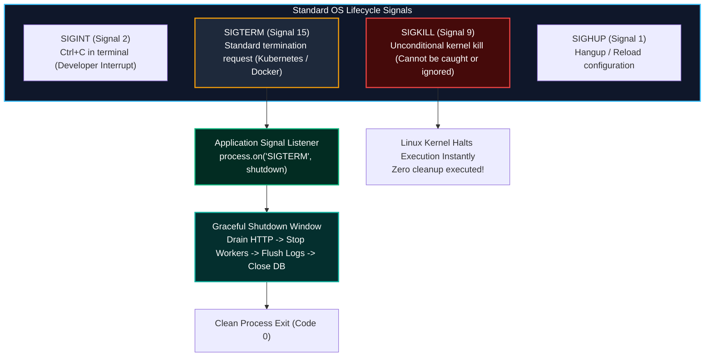

import { Callout } from 'fumadocs-ui/components/callout';
import { Tabs, Tab } from 'fumadocs-ui/components/tabs';
import { Steps, Step } from 'fumadocs-ui/components/steps';

When deploying a new version of a backend service to Kubernetes or Docker, the orchestrator terminates existing application instances to replace them with new ones.

If an application handles termination abruptly—by immediately killing the process—all active HTTP requests are severed mid-flight. Credit card charges may be processed while order records fail to write, database connections are terminated ungracefully, and end users encounter jarring `502 Bad Gateway` errors.

**Graceful Shutdown** ensures that a backend completes all work currently in flight, rejects new incoming connections cleanly, and releases underlying system resources in strict sequence before terminating.

---

## 1. Unix Signals & Process Lifecycle

Operating systems communicate lifecycle events to running processes via POSIX/Unix signals:



### The Signals Breakdown

| Signal | Number | Catchable? | Purpose & Behavioral Expectation |
| :--- | :--- | :--- | :--- |
| **`SIGINT`** | 2 | **Yes** | Emitted when a developer presses `Ctrl+C`. The process should stop cleanly. |
| **`SIGTERM`** | 15 | **Yes** | Sent by Kubernetes/Docker/systemd to request polite termination. Begins graceful draining. |
| **`SIGKILL`** | 9 | **NO** | Uncatchable kernel hammer. Process memory is wiped instantly. Used if graceful shutdown times out. |
| **`SIGHUP`** | 1 | **Yes** | Historically sent on terminal disconnect; modern daemons use it to reload config files without restarting. |

<Callout type="warn" title="Docker PID 1 Signal Trapping Trap">
When running Node.js or Python containers, ensure your process is running as **PID 1** (or under a lightweight init system like `tini` or `dumb-init`). If your Dockerfile uses the shell form `CMD npm start` instead of the exec array form `CMD ["node", "dist/index.js"]`, the Linux shell runs as PID 1 and frequently swallows `SIGTERM`, preventing your app from ever triggering its graceful shutdown logic!
</Callout>

---

## 2. In-Flight Request Draining & The LIFO Teardown Order

During a rolling deployment, shutting down resources must happen in strict **LIFO (Last In, First Out)** reverse dependency order:

```
                  THE LIFO SHUTDOWN SEQUENCE
                  
  STEP 1: FLIP READINESS PROBE TO UNHEALTHY
  ==============================================================
  Stop accepting new connections from Kubernetes Load Balancer.
                               |
                               v
  STEP 2: CLOSE INGRESS HTTP SERVER (server.close())
  ==============================================================
  Stop accepting new TCP connections. Allow active in-flight
  requests to finish processing within SLA.
                               |
                               v
  STEP 3: PAUSE & DRAIN BACKGROUND QUEUES
  ==============================================================
  Stop pulling new jobs from BullMQ/Celery/Kafka. Allow currently
  running consumer workers to acknowledge finished tasks.
                               |
                               v
  STEP 4: FLUSH TELEMETRY & LOG BUFFERS
  ==============================================================
  Force flush OpenTelemetry trace batches, Sentry exceptions,
  and Pino/Winston logging buffers to disk/network.
                               |
                               v
  STEP 5: DISCONNECT DATABASE & CACHE CONNECTION POOLS
  ==============================================================
  Close PostgreSQL and Redis client pools. No in-flight query
  will encounter broken connection pipes!
                               |
                               v
  STEP 6: CLEAN PROCESS EXIT (process.exit(0))
```

<Callout type="error" title="The Fatal Order Inversion">
If you close your PostgreSQL connection pool *before* draining in-flight HTTP requests, any active checkout or user mutation request that attempts to query the database will crash with `Error: Connection pool is closed`, resulting in customer data loss and `500 Internal Server Errors`. Always close database connections **last**.
</Callout>

---

## 3. Kubernetes Pod Deletion Timeline & Race Conditions

In Kubernetes clusters, when a pod is terminated, two asynchronous processes occur simultaneously:
1. The **Kubelet** sends a `SIGTERM` to the container process.
2. The **Kube-Proxy and Ingress Controller** remove the pod's IP address from the EndpointSlice / Endpoints object.

```mermaid
sequenceDiagram
    autonumber
    participant K8s as Kubernetes API Server
    participant Router as Ingress / Load Balancer
    participant App as Pod Container Process

    K8s->>Router: Remove Pod IP from Endpoints
    K8s->>App: Send SIGTERM Signal (Simultaneous!)
    
    rect rgb(69, 10, 10)
    Note over Router,App: The Race Condition Window:<br/>Router takes 2-4 seconds to propagate network iptables rules.<br/>If App stops immediately, Router routes new traffic to dead port!
    Router->>App: Incoming HTTP Request (502 Bad Gateway!)
    end

    Note over App: Mitigation: preStop Sleep Hook (e.g. 5 seconds)<br/>Delays SIGTERM until Router has updated routing tables
```



### The `preStop` Hook Mitigation

To eliminate this race condition, configure a `preStop` sleep hook in your Kubernetes pod manifest. This guarantees that the ingress router has completely removed the pod from the routing table before the application stops listening:

```yaml
apiVersion: apps/v1
kind: Deployment
metadata:
  name: order-service
spec:
  template:
    spec:
      terminationGracePeriodSeconds: 45 # Give app up to 45s before SIGKILL
      containers:
        - name: order-service
          image: order-service:v2.4.0
          lifecycle:
            preStop:
              exec:
                # Sleep 5 seconds so ingress controllers stop sending traffic
                command: ["/bin/sh", "-c", "sleep 5"]
```

---

## 4. Production Graceful Shutdown Implementation (TypeScript / Node.js)

```typescript
import http from 'http';
import { Pool } from 'pg';
import Redis from 'ioredis';

export class GracefulShutdownManager {
  private isShuttingDown = false;
  private readonly connections = new Set<any>();

  constructor(
    private readonly server: http.Server,
    private readonly dbPool: Pool,
    private readonly redisClient: Redis,
    private readonly timeoutMs: number = 25000
  ) {
    this.trackConnections();
    this.registerSignalHandlers();
  }

  // 1. Keep track of open TCP sockets
  private trackConnections(): void {
    this.server.on('connection', (socket) => {
      this.connections.add(socket);
      socket.on('close', () => this.connections.delete(socket));
    });
  }

  // 2. Register OS Signal Listeners
  private registerSignalHandlers(): void {
    const signals: NodeJS.Signals[] = ['SIGTERM', 'SIGINT'];

    for (const signal of signals) {
      process.on(signal, async () => {
        if (this.isShuttingDown) {
          console.warn(`[Shutdown] Second ${signal} received. Ignoring to allow graceful drain.`);
          return;
        }
        this.isShuttingDown = true;
        console.log(`[Shutdown] Received ${signal}. Commencing graceful teardown...`);
        await this.executeShutdown();
      });
    }
  }

  // 3. Coordinate LIFO Resource Draining
  private async executeShutdown(): Promise<void> {
    // Shutdown Guard: Hard exit if graceful teardown hangs
    const timerGuard = setTimeout(() => {
      console.error(`[Shutdown] Force kill timeout (${this.timeoutMs}ms) exceeded. Aborting!`);
      process.exit(1);
    }, this.timeoutMs);

    // Unref timer so it doesn't prevent Node from exiting naturally
    timerGuard.unref();

    try {
      // Step A: Stop accepting new HTTP connections
      console.log('[Shutdown: 1/4] Closing HTTP server and draining in-flight requests...');
      await new Promise<void>((resolve, reject) => {
        this.server.close((err) => (err ? reject(err) : resolve()));
        
        // Close idle keep-alive connections immediately
        for (const socket of this.connections) {
          // If socket is idle (not currently processing request), close it
          if ((socket as any)._httpMessage == null) {
            socket.destroy();
          }
        }
      });
      console.log('[Shutdown: 1/4] HTTP server closed cleanly.');

      // Step B: Stop Background Workers / Message Queues
      console.log('[Shutdown: 2/4] Draining background queues...');
      // e.g. await worker.close();

      // Step C: Disconnect Redis cache
      console.log('[Shutdown: 3/4] Closing Redis connection...');
      await this.redisClient.quit();

      // Step D: Drain and close Database Connection Pools
      console.log('[Shutdown: 4/4] Draining PostgreSQL connection pool...');
      await this.dbPool.end();

      console.log('[Shutdown] All resources released cleanly. Exiting with code 0.');
      clearTimeout(timerGuard);
      process.exit(0);
    } catch (error) {
      console.error('[Shutdown: ERROR] Encountered failure during teardown:', error);
      clearTimeout(timerGuard);
      process.exit(1);
    }
  }

  // Helper for health check middleware
  public isTerminating(): boolean {
    return this.isShuttingDown;
  }
}
```

---

## 5. Simulation of Working: Graceful Shutdown Execution Trace

Watch this complete step-by-step execution trace of a high-throughput payment service undergoing a rolling update:

<Tabs items={['Stage 1: SIGTERM Received', 'Stage 2: Readiness Flips Unhealthy', 'Stage 3: In-Flight HTTP Requests Drain', 'Stage 4: Queues & Telemetry Flush', 'Stage 5: DB Pools Closed & Clean Exit']}>
  <Tab value="Stage 1: SIGTERM Received">
```text
[16:04:10.001] [K8S:KUBELET] Initiating rolling update for Deployment 'checkout-api'
[16:04:10.002] [K8S:PRESTOP] Executing preStop hook: sleep 5
[16:04:15.003] [OS:SIGNAL] Linux Kernel delivered SIGTERM (Signal 15) to PID 1
[16:04:15.004] [SHUTDOWN:INIT] Registered SIGTERM. Commencing graceful teardown.
[16:04:15.005] [GUARD] Configured force-exit deadline: 25,000ms. Hard cutoff at 16:04:40.005.
```
*Kubernetes initiates the pod termination. The preStop hook allows ingress routing tables to update before sending the SIGTERM signal.*
  </Tab>

  <Tab value="Stage 2: Readiness Flips Unhealthy">
```text
[16:04:15.006] [HEALTHCHECK] /healthz/ready endpoint switched state: UP (200) -> DOWN (503)
[16:04:15.008] [K8S:PROBE] Kubelet readiness probe returned HTTP 503 Service Unavailable
[16:04:15.010] [INGRESS] AWS ALB removed pod IP 10.244.3.18 from target group pool.
[16:04:15.012] [METRICS] Inbound new connection rate dropped to 0 req/s.
```
*The readiness probe immediately fails, ensuring any remaining upstream proxies remove the pod from their load balancing pools.*
  </Tab>

  <Tab value="Stage 3: In-Flight HTTP Requests Drain">
```text
[16:04:15.015] [HTTP:DRAIN] server.close() invoked. Server stopped listening on port 8080.
[16:04:15.016] [HTTP:CONNECTIONS] 42 active TCP sockets connected.
              - 34 idle keep-alive sockets destroyed immediately.
              - 8 in-flight HTTP requests permitted to finish processing.
[16:04:16.120] [HTTP:REQ] Req #8901 [POST /checkout] completed successfully (200 OK, 1,104ms)
[16:04:17.430] [HTTP:REQ] Req #8902 [POST /transfers] completed successfully (200 OK, 2,414ms)
[16:04:18.250] [HTTP:DRAIN] All 8 in-flight requests completed! 0 pending sockets remain.
```
*Active user requests are allowed to finish their database mutations cleanly. Zero requests are severed.*
  </Tab>

  <Tab value="Stage 4: Queues & Telemetry Flush">
```text
[16:04:18.255] [BULLMQ:WORKER] Stopping message consumer queue 'email-notifications'...
[16:04:18.890] [BULLMQ:WORKER] Active job #4921 ('send-receipt') finished and acknowledged.
[16:04:18.892] [OPENTELEMETRY] Flushing trace span batch (38 spans exported to Jaeger collector).
[16:04:19.102] [LOGS:PINO] Log buffer sync flushed to stdout.
```
*Background queues cleanly finish active jobs without re-queuing duplicate work. Telemetry buffers are emptied.*
  </Tab>

  <Tab value="Stage 5: DB Pools Closed & Clean Exit">
```text
[16:04:19.105] [CACHE] Redis connection disconnected cleanly via QUIT command.
[16:04:19.210] [POSTGRES:POOL] Closing 20 database connections in pool...
[16:04:19.340] [POSTGRES:POOL] All connection sockets closed. 0 leaked transactions.
[16:04:19.345] [SHUTDOWN:DONE] Teardown completed in 4,340ms (Well within 25,000ms deadline).
[16:04:19.350] [PROCESS] Exiting with status code 0.
[K8S:KUBELET] Container terminated successfully. Pod marked as Completed.
```
*All database connections are cleanly closed, and the process terminates with exit code 0.*
  </Tab>
</Tabs>

---

## 6. Implementation Checklist

<Steps>
  <Step>
    ### Run Container as Exec Form (PID 1)
    In Dockerfiles, use `CMD ["node", "dist/index.js"]`. Ensure signals are passed directly to your runtime without being intercepted by a shell wrapper.
  </Step>
  <Step>
    ### Add a Kubernetes `preStop` Hook
    Configure `sleep 5` in your pod's lifecycle spec to avoid race conditions with ingress controller endpoint updates.
  </Step>
  <Step>
    ### Enforce Strict LIFO Teardown
    Stop HTTP ingress $\rightarrow$ drain in-flight requests $\rightarrow$ stop worker queues $\rightarrow$ flush logs $\rightarrow$ close database pools.
  </Step>
  <Step>
    ### Install a Hard Timeout Guard
    Set an unref'd `setTimeout` (e.g. 25–30 seconds) that triggers `process.exit(1)` if a hung socket or un-resolvable promise blocks shutdown.
  </Step>
  <Step>
    ### Terminate Keep-Alive Connections
    Destroy idle keep-alive TCP sockets immediately on `SIGTERM` so clients establish connections with newly deployed pods.
  </Step>
</Steps>
