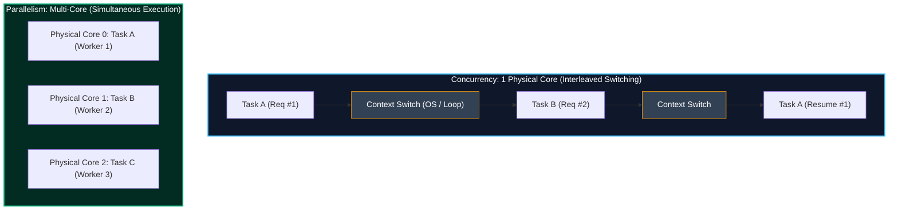
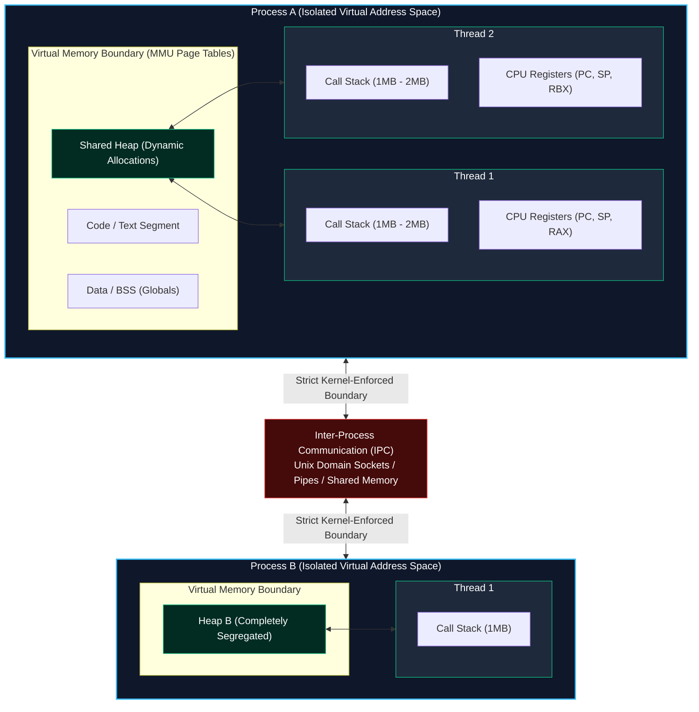
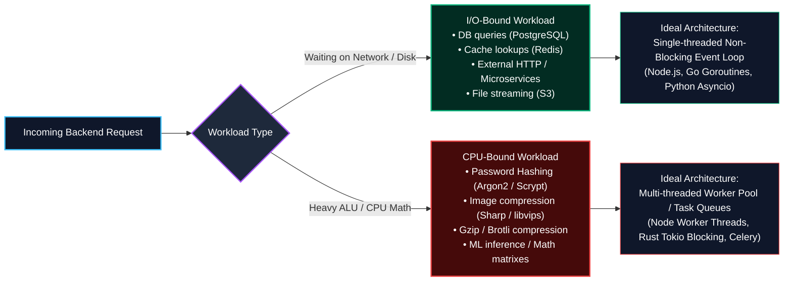
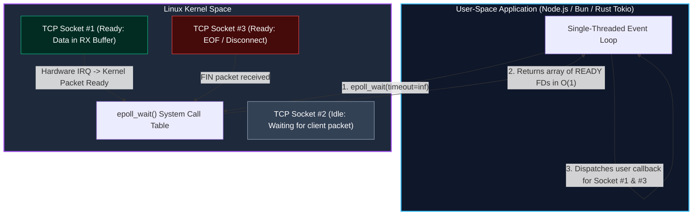
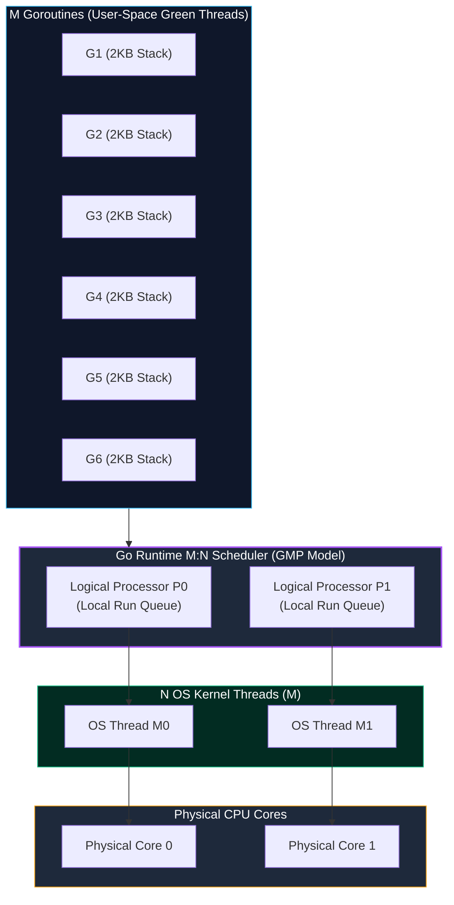
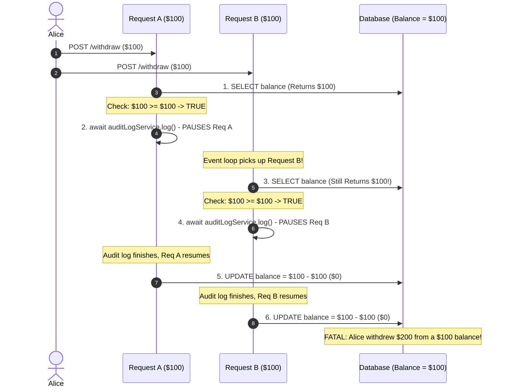
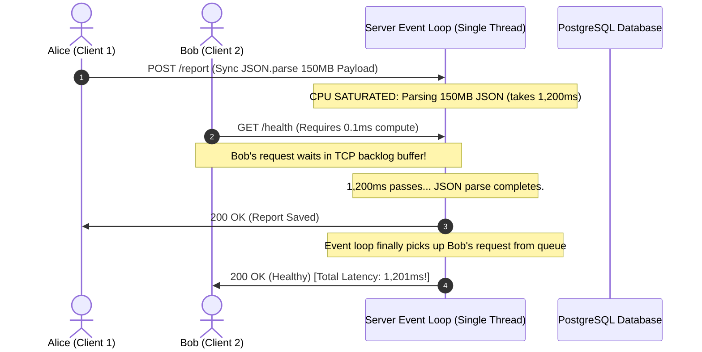

import { Callout } from 'fumadocs-ui/components/callout';
import { Tabs, Tab } from 'fumadocs-ui/components/tabs';
import { Steps, Step } from 'fumadocs-ui/components/steps';
import { Cards, Card } from 'fumadocs-ui/components/card';

High-performance backend systems are defined by how they manage **waiting** versus **computing**. When thousands of clients simultaneously fetch profiles, query databases, upload files, and authenticate passwords, how does an operating system and backend runtime allocate compute without exhausting system memory or stalling on blocked threads?

To build scalable distributed systems, you must understand the mechanical reality beneath high-level abstractions: operating system kernels, virtual memory isolation, non-blocking system calls, multiplexed I/O (`epoll` and `kqueue`), M:N user-space schedulers, and the subtle concurrency bugs that plague asynchronous single-threaded code.

---

## 1. Concurrency vs. Parallelism: The First Principle

As Go co-creator Rob Pike famously defined:
> **"Concurrency is about dealing with lots of things at once. Parallelism is about doing lots of things at once."**

```
+---------------------------------------------------------------------------------+
| CONCURRENCY (Structure / Composition)                                          |
| Managing multiple execution flows simultaneously on a single CPU core via      |
| rapid time-slicing (interleaving).                                              |
|                                                                                 |
| Core 0: [ Task A ] -> [ Task B ] -> [ Task A ] -> [ Task C ] -> [ Task B ] ... |
+---------------------------------------------------------------------------------+
| PARALLELISM (Execution / Hardware)                                             |
| Executing multiple computations simultaneously on distinct physical CPU cores. |
|                                                                                 |
| Core 0: [ ============= Task A ============= ]                                  |
| Core 1: [ ============= Task B ============= ]                                  |
| Core 2: [ ============= Task C ============= ]                                  |
+---------------------------------------------------------------------------------+
```



- **Concurrency** is an architectural attribute of your software design. It partitions a program into discrete, out-of-order executable tasks (e.g., handling 10,000 HTTP sockets where 99.8% are waiting on network packets).
- **Parallelism** is a physical property of your runtime hardware. It requires multiple physical execution units (CPU cores, hardware threads, or GPUs) running operations concurrently at the exact same nanosecond.

<Callout type="info" title="The Coffee Shop Analogy">
Imagine a barista. 
- **Concurrent**: One barista takes Customer 1's order, starts grinding beans, pauses to take Customer 2's order while the machine brews, and steams milk for Customer 1. One brain juggles multiple tasks during idle wait times.
- **Parallel**: Three baristas operate three separate espresso machines simultaneously. Three brains do three computations at the exact same moment.
</Callout>

---

## 2. Process vs. Thread Memory Architecture

To reason about concurrency, we must examine how the operating system and CPU Memory Management Unit (MMU) organize memory across **Processes** and **Threads**:



### The Architectural Contrast

| Dimension | Process | Thread |
| :--- | :--- | :--- |
| **Address Space** | **Isolated**: Private virtual address space mapped via OS page tables. Cannot access another process's RAM. | **Shared**: All threads inside a process share the same heap, data segment, and open file descriptors. |
| **Crash Blast Radius** | **Isolated**: A segmentation fault in Process B kills only Process B; Process A remains running. | **Catastrophic**: An unhandled memory fault or uncaught exception in Thread 2 crashes the entire host process. |
| **Call Stack & Registers** | Owns main thread stack and registers. | Each thread has its **private stack (typically 1MB - 8MB)** and dedicated CPU registers (Program Counter, Stack Pointer). |
| **Context Switch Overhead** | **Heavy ($1\mu\text{s} - 10\mu\text{s}$)**: Requires flushing MMU Page Tables, invalidating TLB (Translation Lookaside Buffer), and CPU pipeline stalls. | **Moderate ($100\text{ns} - 1\mu\text{s}$)**: Same virtual memory page tables; only registers and stack pointers are switched. |
| **Data Sharing Mechanism** | Requires kernel Inter-Process Communication (IPC): Unix sockets, shared memory (`shm_open`), or pipes. | Instant pointer dereference on the shared heap (requires synchronization like mutexes to prevent data races). |

---

## 3. Workload Classification: I/O-Bound vs. CPU-Bound

Designing a backend architecture without categorizing its workload profile leads directly to system degradation or wasteful over-provisioning:



### Workload Comparison Matrix

| Metric | I/O-Bound Workload | CPU-Bound Workload |
| :--- | :--- | :--- |
| **Primary Bottleneck** | Kernel socket buffers, network RTT, NVMe disk access | CPU Arithmetic Logic Unit (ALU), memory bus bandwidth |
| **CPU Utilization** | Low (5% - 25% while handling thousands of active connections) | High (100% saturation on active cores) |
| **Typical Operation Time** | 5ms – 250ms (dominated by external latency) | 50ms – 5000ms (dominated by algorithmic complexity) |
| **Optimal Concurrency Model** | Non-blocking Event-Driven Loop (`epoll`/`kqueue`) | Multi-process or Thread Pool across physical CPU cores |
| **Consequence of Blocking** | Negligible if using non-blocking asynchronous APIs | Stalls the entire event loop, freezing all other clients |

---

## 4. The Thread-per-Request Trap vs. Non-Blocking Event Loops

To appreciate why modern runtimes (Node.js, Bun, Go, Envoy, Nginx) scale to millions of concurrent connections, consider the classical backend model: **Thread-per-Request** (Apache HTTP Server, early Tomcat, classical Ruby on Rails).

### The Classical Thread-per-Request Model

```
Client 1  ---> [ OS Thread 1 (Stack: 2MB) ] ---> Blocks on Postgres DB (20ms idle)
Client 2  ---> [ OS Thread 2 (Stack: 2MB) ] ---> Blocks on S3 Read (80ms idle)
Client 3  ---> [ OS Thread 3 (Stack: 2MB) ] ---> Blocks on Redis Get (2ms idle)
...
Client 10,000 ---> FATAL ERROR: Cannot allocate memory / OS Context Switch Thrashing
```

1. **Stack Memory Footprint**: Every OS thread consumes between 1MB and 8MB of virtual memory for its call stack. Spawning 10,000 threads consumes **10GB to 20GB of RAM** just for thread stack overhead before application code executes.
2. **Context-Switching Thrashing**: When thread count exceeds physical CPU cores, the OS kernel scheduler spends more CPU time saving and restoring CPU registers, cache lines, and TLB entries than executing application instructions.
3. **The C10K Problem**: At approximately 10,000 simultaneous connections, thread-per-request systems suffer exponential latency spikes and catastrophic memory exhaustion.

---

## 5. Kernel-Level Multiplexing: `select`, `poll`, `epoll`, and `kqueue`

Non-blocking servers do not assign a thread to a connection. Instead, a single thread registers thousands of network file descriptors (sockets) with the operating system kernel and sleeps until the kernel notifies it that data is available.



### Evolution of I/O Multiplexing

```
1980s: select()  -> Checks an array of FDs linearly. Time complexity: O(N). Max limit: 1024 FDs.
1990s: poll()    -> Removes the 1024 limit using pollfd arrays, but still scans linearly: O(N).
2000s: epoll()   -> Linux kernel uses an event-driven Red-Black tree & Ready List. O(1) performance!
       kqueue()  -> BSD / macOS equivalent of epoll. O(1) registered state change notification.
```

When an event loop calls `epoll_wait()`, the Linux kernel does **not** iterate through 100,000 sockets. It inspects an internal doubly-linked **ready list** populated directly by hardware network card interrupts. The cost of polling is proportional only to the number of *active* sockets that actually have data ready to read, not the total number of connected sockets.

---

## 6. The M:N User-Space Green Threads / Goroutines Model

Between heavyweight OS threads ($1\text{MB}$ stacks, kernel-managed) and single-threaded async event loops lies a third paradigm: **M:N User-Space Green Threads** (pioneered by the Go runtime, Erlang BEAM, and Java Virtual Threads / Project Loom).



### The Three Pillars of the M:N Architecture

1. **Tiny 2KB Dynamic Growable Stacks**: While an OS thread pre-allocates 1MB to 2MB, a Go Goroutine starts with just **2KB of stack RAM**. If stack depth increases, the runtime dynamically reallocates and copies the stack to a larger contiguous memory chunk. This allows a single machine to host **1,000,000 concurrent Goroutines in only ~2GB of RAM**.
2. **The GMP Scheduler**:
   - **G (Goroutine)**: Represents user code execution state, call stack, and instruction pointer.
   - **M (Machine)**: An OS kernel thread created by the OS runtime.
   - **P (Processor)**: A logical context resource representing the right to execute code (by default, `GOMAXPROCS = CPU Cores`). Each `P` maintains a local run queue of `G`s, performing **work-stealing** from other `P`s if its own queue runs empty.
3. **Runtime I/O Interception (Zero Kernel Context Switching)**: When a Goroutine calls a blocking network socket read (`net.Conn.Read()`), the Go runtime intercepts the call in user space. It deschedules the Goroutine, parks it in the runtime's internal **Netpoller** (which monitors `epoll`), and immediately assigns a ready Goroutine to that OS thread. The kernel thread **never blocks**, completely bypassing expensive OS kernel context switches!

---

## 7. Simulation: An Event Loop Tick Under Heavy Traffic

The event loop continuously executes a structured lifecycle loop (often implemented via `libuv` in Node.js or `io_uring`/`epoll` in Rust and C++). Let's simulate a single tick handling simultaneous timers, database network callbacks, and microtasks:

<Tabs items={['Phase 1: Poll & I/O Wait', 'Phase 2: Microtask Flush (Promises)', 'Phase 3: Timers & Intervals', 'Phase 4: Check / Immediate']}>
  <Tab value="Phase 1: Poll & I/O Wait">
    **Phase 1: The Poll Phase (Operating System Network Ready)**

    The event loop queries the OS kernel via `epoll_wait` / `kqueue`. The kernel returns the file descriptors that completed their network transfers:

    ```
    +-------------------------------------------------------------------------+
    | [POLL PHASE] Checking Kernel Network Ready Queue                       |
    |                                                                         |
    |  - Socket #42 (PostgreSQL client): 14.2 KB received (SQL query finished)|
    |  - Socket #89 (HTTP Client): Request body stream finished               |
    |                                                                         |
    |  Execution: Loop grabs Socket #42, invokes deserializer callback, and   |
    |  schedules its async continuation (Promise).                            |
    +-------------------------------------------------------------------------+
    ```

    <Callout type="info" title="Zero CPU Idle">
    If no timers are due and no callbacks are pending, the event loop blocks inside the OS kernel at `epoll_wait` using zero CPU cycles until a network packet triggers a hardware interrupt.
    </Callout>
  </Tab>

  <Tab value="Phase 2: Microtask Flush (Promises)">
    **Phase 2: The Microtask Queue Drain (High-Priority Starvation Risk)**

    Microtasks (Node.js `process.nextTick()` and native `Promise.then()` callbacks) run **immediately after any synchronous JavaScript execution frame finishes**, before the loop proceeds to the next phase:

    ```
    +-------------------------------------------------------------------------+
    | [MICROTASKS DRAIN] Flushes completely before moving to next phase!      |
    |                                                                         |
    |  Queue: [ Promise.resolve().then(...) ] -> [ nextTick(...) ]            |
    |                                                                         |
    |  WARNING: If a microtask recursively enqueues another microtask,        |
    |  the event loop will NEVER reach Phase 3 (Timers) or Phase 1 (I/O),     |
    |  completely starving network traffic!                                  |
    +-------------------------------------------------------------------------+
    ```
  </Tab>

  <Tab value="Phase 3: Timers & Intervals">
    **Phase 3: Timers Phase (`setTimeout`, `setInterval`)**

    The event loop checks its internal min-heap of active timers:

    ```
    +-------------------------------------------------------------------------+
    | [TIMERS MIN-HEAP] Current Epoch: 1714500000150ms                        |
    |                                                                         |
    |  Root Timer: Due at 1714500000100ms (Expired 50ms ago!)                 |
    |  Action: Pops Root Timer, invokes its callback: cacheCleanup()          |
    |  Next Timer: Due at 1714500002000ms (Not ready, stays in heap)          |
    +-------------------------------------------------------------------------+
    ```

    Timer thresholds represent a *minimum* guaranteed delay, not an exact execution timestamp. If previous phases executed long-running synchronous code, timers run late.
  </Tab>

  <Tab value="Phase 4: Check / Immediate">
    **Phase 4: Check Phase (`setImmediate`)**

    Executes callbacks immediately after the poll phase finishes processing pending I/O:

    ```
    +-------------------------------------------------------------------------+
    | [CHECK PHASE] setImmediate Queue                                        |
    |                                                                         |
    |  Queue: [ sessionTokenRotationCallback() ]                              |
    |  Action: Invokes callback safely without starving I/O cycles.           |
    |                                                                         |
    |  Tick Complete -> Loop repeats from Phase 1 (or exits if ref count = 0)  |
    +-------------------------------------------------------------------------+
    ```
  </Tab>
</Tabs>

---

## 8. Concurrency Hazards: The Check-Then-Act Race Condition Across `await` Points

A pervasive misconception among backend developers is that **"single-threaded event loops (Node.js/Bun/Python Asyncio) are immune to race conditions."**

While a single-threaded runtime prevents low-level memory data races (where two CPU threads write to the same memory byte simultaneously), it is **completely vulnerable to logical Check-Then-Act race conditions whenever execution yields at an `await` boundary**.

### The Anatomy of the Bug: Overdrawing a Bank Account

Consider an endpoint handling account balance withdrawals:

```typescript
// DANGEROUS ANTI-PATTERN: Logical race condition across an await point
class BankService {
  async withdraw(userId: string, amount: number): Promise<boolean> {
    // 1. CHECK PHASE: Inspect account balance
    const account = await db.account.findUnique({ where: { id: userId } });
    
    if (account.balance >= amount) {
      // 2. YIELD POINT: The event loop pauses this execution frame!
      // Any other request can interleave and execute right here!
      await auditLogService.logWithdrawalAttempt(userId, amount); // 50ms I/O delay

      // 3. ACT PHASE: Deduct balance
      await db.account.update({
        where: { id: userId },
        data: { balance: account.balance - amount }
      });
      return true;
    }
    
    return false;
  }
}
```

### The Failure Sequence

Suppose Alice has a **\$100** balance and triggers two simultaneous withdrawal requests of **\$100** (Request A and Request B):



### The Solutions

#### Solution 1: Database Atomic Decrement with Constraint Checks (Best)
Eliminate the check-then-act window by letting the database execute the condition and update in a single atomic SQL instruction:

```sql
-- Single atomic operation: Evaluates condition and updates in 1 step!
UPDATE accounts 
SET balance = balance - 100 
WHERE id = 'alice' AND balance >= 100;
-- If row count affected == 0, the balance was insufficient!
```

#### Solution 2: In-Process Asynchronous Mutex / Keyed Lock
Serialize concurrent operations targeting the same user ID using an async lock:

```typescript
import { Mutex } from 'async-mutex';

const userLocks = new Map<string, Mutex>();

function getUserLock(userId: string): Mutex {
  if (!userLocks.has(userId)) userLocks.set(userId, new Mutex());
  return userLocks.get(userId)!;
}

async function withdrawSafely(userId: string, amount: number) {
  const mutex = getUserLock(userId);
  return await mutex.runExclusive(async () => {
    // Only 1 execution frame can evaluate balance per userId at a time!
    const account = await db.account.findUnique({ where: { id: userId } });
    if (account.balance < amount) return false;
    
    await auditLogService.logWithdrawalAttempt(userId, amount);
    await db.account.update({
      where: { id: userId },
      data: { balance: account.balance - amount }
    });
    return true;
  });
}
```

---

## 9. The Cardinal Sin: Blocking the Event Loop

Because an event loop handles all concurrent connections on a single primary thread, **any synchronous CPU computation or blocking I/O halts every single user on the server**.



<Callout type="error" title="Never Execute These on the Event Loop Thread">
1. **`fs.readFileSync()` / synchronous file operations** in request handlers.
2. **`JSON.parse()` or `JSON.stringify()` on multi-megabyte payloads**.
3. **Synchronous Cryptography**: `bcrypt.hashSync()`, `crypto.pbkdf2Sync()`, or large `crypto.createCipheriv()` encryption tasks.
4. **Complex Regular Expressions**: Vulnerable to Regular Expression Denial of Service (ReDoS) with polynomial/exponential backtracking.
</Callout>

### Measuring Event Loop Starvation

Modern production backends monitor event loop delay using high-resolution native histograms:

```typescript
import { monitorEventLoopDelay } from 'node:perf_hooks';

// Sample loop delay every 10ms with microsecond resolution
const histogram = monitorEventLoopDelay({ resolution: 10 });
histogram.enable();

setInterval(() => {
  const p50 = (histogram.percentile(50) / 1e6).toFixed(2);
  const p99 = (histogram.percentile(99) / 1e6).toFixed(2);
  const max = (histogram.max / 1e6).toFixed(2);

  console.log(`[Event Loop Health] p50: ${p50}ms | p99: ${p99}ms | max: ${max}ms`);

  if (histogram.percentile(99) / 1e6 > 50) {
    console.error('CRITICAL ALERT: Event loop latency exceeded 50ms! CPU-bound task detected.');
  }

  histogram.reset();
}, 5000);
```

---

## 10. Offloading CPU-Bound Workload: Production Patterns

When your backend requires CPU-bound operations (e.g. image transcoding, password hashing, PDF generation), you must offload the computation away from the event loop.

### Architecture Options

```
Option A: In-Process Worker Thread Pool (Low Latency, Shared Memory)
Client ---> Event Loop ---> Passes Task Buffer ---> Worker Thread (Core 2)
                                                         | (Computes Argon2)
Client <--- Event Loop <--- Returns Hash Result <--------+

Option B: Distributed Task Queue (High Durability, Scale-to-Zero)
Client ---> Event Loop ---> Pushes Job to Redis (BullMQ/Celery)
Client <--- Returns 202 Accepted (jobId: "abc-123")
                                |
                             Worker Pod (Separate K8s Deployment)
                             Processes PDF generation and uploads to S3
```

### Production Implementation: Node.js Worker Thread Pool

Below is a production-grade CPU offloading pattern using `node:worker_threads` to hash passwords with PBKDF2 without blocking incoming HTTP requests:

```typescript
// worker.ts - Dedicated CPU thread running on an isolated core
import { parentPort } from 'node:worker_threads';
import { pbkdf2Sync, randomBytes } from 'node:crypto';

interface HashTask {
  id: string;
  payload: string;
}

parentPort?.on('message', ({ id, payload }: HashTask) => {
  const salt = randomBytes(16).toString('hex');
  // Intensive CPU work: 100,000 iterations of SHA-512
  const derivedKey = pbkdf2Sync(payload, salt, 100_000, 64, 'sha512');
  
  parentPort?.postMessage({
    id,
    hash: `${salt}:${derivedKey.toString('hex')}`,
  });
});
```

```typescript
// server.ts - HTTP Server maintaining healthy event loop responsiveness
import { createServer } from 'node:http';
import { Worker } from 'node:worker_threads';
import { randomUUID } from 'node:crypto';

// 1. Initialize dedicated worker thread
const cpuWorker = new Worker(new URL('./worker.js', import.meta.url));
const pendingRequests = new Map<string, (hash: string) => void>();

// 2. Listen for completed calculations from the worker thread
cpuWorker.on('message', ({ id, hash }: { id: string; hash: string }) => {
  const resolve = pendingRequests.get(id);
  if (resolve) {
    resolve(hash);
    pendingRequests.delete(id);
  }
});

const server = createServer(async (req, res) => {
  if (req.method === 'POST' && req.url === '/hash') {
    let body = '';
    req.on('data', chunk => { body += chunk; });
    req.on('end', () => {
      const taskId = randomUUID();

      // 3. Register resolution promise before dispatching to worker
      const hashPromise = new Promise<string>((resolve) => {
        pendingRequests.set(taskId, resolve);
      });

      // 4. Offload heavy computation to worker thread
      cpuWorker.postMessage({ id: taskId, payload: body });

      hashPromise.then((computedHash) => {
        res.writeHead(200, { 'Content-Type': 'application/json' });
        res.end(JSON.stringify({ status: 'success', hash: computedHash }));
      });
    });
  } else {
    // 5. Lightweight endpoints maintain sub-millisecond p99 latency
    res.writeHead(200, { 'Content-Type': 'application/json' });
    res.end(JSON.stringify({ status: 'ok', timestamp: Date.now() }));
  }
});

server.listen(3000, () => {
  console.log('Server running on port 3000 with offloaded worker pool');
});
```

---

## 11. Summary & Architectural Principles

<Cards>
  <Card
    title="Processes vs. Threads"
    description="Processes have isolated virtual memory spaces and cannot crash each other. Threads share heap memory and file descriptors, requiring locks to prevent data races."
  />
  <Card
    title="M:N Green Threads (Goroutines)"
    description="Go's GMP scheduler maps M user-space Goroutines with 2KB dynamic stacks to N OS threads, intercepting I/O calls via the Netpoller without kernel context switches."
  />
  <Card
    title="Await Race Conditions"
    description="Single-threaded event loops are not immune to race conditions. Execution interleaves across await boundaries, creating Check-Then-Act data inconsistencies."
  />
  <Card
    title="I/O Multiplexing (epoll)"
    description="Modern runtimes achieve O(1) connection scalability by letting the OS kernel monitor file descriptors and waking user space only when packets arrive."
  />
</Cards>
