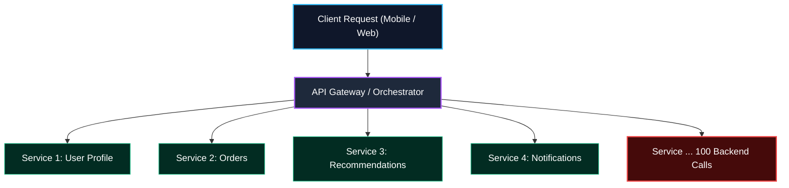
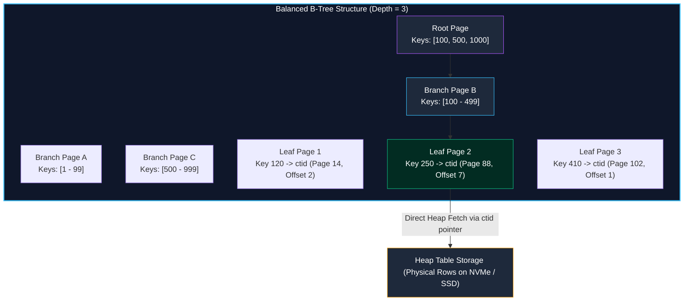
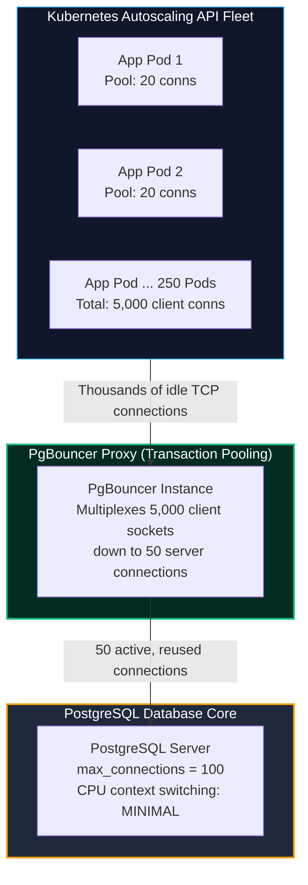
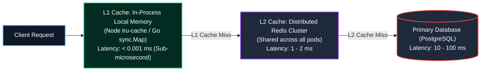
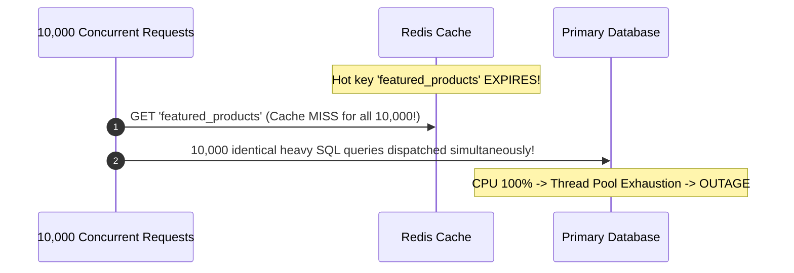
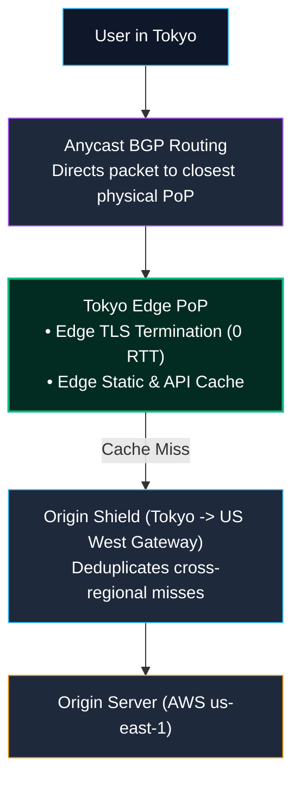
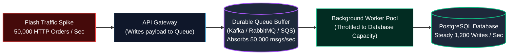
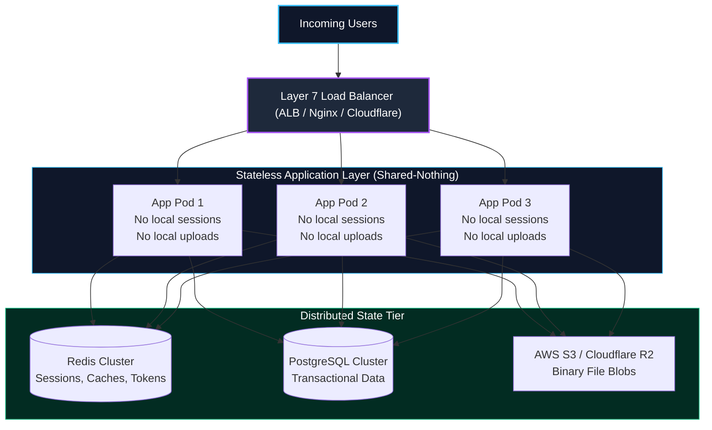
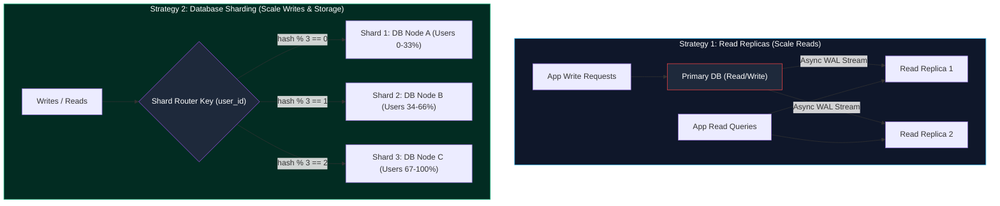

import { Callout } from 'fumadocs-ui/components/callout';
import { Tabs, Tab } from 'fumadocs-ui/components/tabs';
import { Steps, Step } from 'fumadocs-ui/components/steps';
import { Cards, Card } from 'fumadocs-ui/components/card';

Scaling a backend service is not merely about launching larger servers or adding auto-scaling groups. True performance engineering requires understanding **queueing theory**, **latency distributions**, **database query amplification**, and the **state boundaries** of distributed architectures.

When systems fail under traffic surges, they rarely run out of raw compute gradually. Instead, they hit non-linear mathematical cliffs where response times degrade exponentially within seconds.

---

## 1. The Tyranny of Averages: P50, P95, P99, and Latency Fan-Out

In performance engineering, **mean (average) response time is a dangerous illusion**. 

Consider a service where 99 requests take 10ms and 1 request stalls for 10,000ms (10 seconds):
$$\text{Average Latency} = \frac{(99 \times 10) + (1 \times 10000)}{100} = 109.9\text{ ms}$$

An average of ~110ms sounds acceptable on an executive dashboard, but 1% of your user base suffered an unresponsive interface, dropped cart, or connection timeout.

### Percentiles Defined

- **P50 (Median)**: 50% of requests are faster than this threshold. Represents the typical user experience.
- **P95**: 95% of requests are faster than this. Surfaces edge-case degradations and network jitters.
- **P99**: 99% of requests are faster than this. Represents the slowest 1% of users—typically your most active power users who query the largest datasets.
- **P99.9**: The 1-in-1,000 request tail, revealing garbage collection pauses, cold database connection pools, or locking contention.

### The Tail Latency Amplification Problem

Modern backends are distributed. Loading a single mobile homepage often requires fanning out queries to 50 or 100 backend microservices or database tables:



If an endpoint depends on $N$ downstream services, each with a 1% probability of hitting its P99 latency, the probability that the client experiences a P99 tail latency delay is:

$$P(\text{Client Hit Slow Down}) = 1 - (1 - 0.01)^N$$

| Number of Downstream Calls ($N$) | Probability of Client Experiencing Tail Latency |
| :--- | :--- |
| **1 call** | $1.0\%$ |
| **10 calls** | $9.6\%$ |
| **50 calls** | $39.5\%$ |
| **100 calls** | **$63.4\%$** |

At 100 downstream RPC or database calls, **almost two-thirds of all users experience P99 tail latency**, even though each individual service reports a 99% success rate!

---

## 2. Queueing Theory & The "Utilization Knee": Kingman's Formula

Why do backends behave gracefully at 70% CPU utilization, but crash catastrophically when traffic increases by just 15%?

This is explained by **Kingman's Approximation** for queueing delays in $G/G/1$ queues:

$$W_q \approx \left(\frac{\rho}{1 - \rho}\right) \left(\frac{c_a^2 + c_s^2}{2}\right) \tau$$

Where:
- $W_q$: Mean waiting time in queue.
- $\rho$: Server resource utilization factor ($\text{arrival rate} / \text{service capacity}$, from $0.0$ to $1.0$).
- $c_a, c_s$: Coefficients of variation of arrival times and service times.
- $\tau$: Mean service time per request.

```
Waiting
Time (Wq)
  ^
  |                                        | The Utilization Knee
  |                                        | (Catastrophic Collapse)
  |                                      /
  |                                     /
  |                                   /
  |                                 /
  |                               /
  |                             /
  |      Safe Zone            /
  |-------------------------/
  +---------------------------------------------> Server Utilization (ρ)
 0%        25%         50%       75%    85%  100%
```

### The Utilization Factor: $\frac{\rho}{1 - \rho}$

Notice the non-linear term $\frac{\rho}{1 - \rho}$:

- At $\rho = 0.50$ (50% utilization): $\frac{0.50}{1 - 0.50} = \mathbf{1.0}$
- At $\rho = 0.80$ (80% utilization): $\frac{0.80}{1 - 0.80} = \mathbf{4.0}$
- At $\rho = 0.95$ (95% utilization): $\frac{0.95}{1 - 0.95} = \mathbf{19.0}$
- At $\rho = 0.99$ (99% utilization): $\frac{0.99}{1 - 0.99} = \mathbf{99.0}$

<Callout type="warn" title="The Golden Rule of Capacity Planning">
Never design production backend clusters to run above **70% to 75% steady-state utilization**. Above this threshold, queues do not grow linearly—they explode exponentially, converting minor traffic spikes into total system brownouts.
</Callout>

---

## 3. Database Indexing Deep Dive: B-Trees, Prefix Rules & Write Amplification

When queries slow down as a database grows from 10,000 to 100,000,000 rows, the root cause is almost always how the database storage engine locates rows on disk.

```
Full Table Scan (Sequential Scan): O(N) Complexity
Reads every 8KB disk block sequentially from drive into buffer pool.
Scanning 50,000,000 rows at 100MB/sec = 12.5 seconds!

B-Tree Index Lookup: O(log N) Complexity
Traverses balanced tree from root -> branch -> leaf page -> heap pointer.
Depth is typically only 3 or 4 levels: 3 random 8KB page reads = 1.2 milliseconds!
```



### The Leftmost Prefix Rule (Compound Indexes)

When creating multi-column compound indexes, **column ordering is critical**.

```sql
CREATE INDEX idx_tenant_status_created ON orders (tenant_id, status, created_at);
```

Think of a compound index like a phone directory sorted by `(Last Name, First Name)`:

| Query Pattern | Index Usability | Explanation |
| :--- | :--- | :--- |
| `WHERE tenant_id = 42` | **100% Usable** | Matches the leftmost prefix. |
| `WHERE tenant_id = 42 AND status = 'COMPLETED'` | **100% Usable** | Matches first two leftmost columns. |
| `WHERE tenant_id = 42 AND status = 'COMPLETED' AND created_at > '2026-01-01'` | **100% Usable** | Complete index range lookup. |
| `WHERE status = 'COMPLETED'` | **UNUSABLE (Full Scan)** | Skips leftmost column (`tenant_id`). Like looking up someone by first name in a phone book sorted by last name! |
| `WHERE created_at > '2026-01-01'` | **UNUSABLE (Full Scan)** | Skips leftmost columns. |

<Callout type="error" title="Range Scan Boundary Rule">
Once a query uses a range operator (`>`, `<`, `BETWEEN`, `LIKE 'foo%'`) on an index column, any subsequent columns in the compound index **cannot** be used for tree-based filtering:
```sql
-- Uses tenant_id (equality) and created_at (range),
-- but CANNOT use status for index tree descent:
WHERE tenant_id = 42 AND created_at > '2026-01-01' AND status = 'PAID'
```
Always place equality columns first, followed by the range column last in your composite index!
</Callout>

### Covering Indexes & Index-Only Scans

Normally, an index lookup finds the matching key in the B-Tree leaf, extracts the tuple identifier (`ctid`), and performs a secondary disk read to the **Heap Table** to retrieve unindexed columns.

A **Covering Index** includes all columns requested by the query in the index itself, enabling an **Index-Only Scan** that bypasses the Heap Table entirely:

```sql
-- In PostgreSQL: Include payload column without bloating the search B-Tree
CREATE INDEX idx_users_email_covering ON users (email) INCLUDE (full_name, avatar_url);

-- This query is satisfied 100% inside RAM from the index page:
SELECT email, full_name, avatar_url FROM users WHERE email = 'alex@example.com';
```

### The Write Amplification Penalty

Indexes are not free. Every additional index on a table imposes a **write amplification tax**:
1. When you execute an `INSERT`, the database must insert the row into the heap table **plus** update every single B-Tree index on that table.
2. If an index leaf page is full, the engine must perform a **page split** (allocating a new 8KB block and rebalancing the tree), triggering disk write spikes and Write-Ahead Log (WAL) bloat.
3. Every `UPDATE` on an indexed column requires deleting and re-inserting the B-Tree entry.

---

## 4. Database Connection Pooling & PgBouncer

A common scalability failure occurs when Kubernetes automatically scales out backend API pods to handle high traffic, inadvertently **crashing the production PostgreSQL database**.

### The Process-Per-Connection Memory Trap

Unlike MySQL or Redis (which handle connections using threads or event loops), **PostgreSQL operates a process-per-connection architecture**. Every client connection forks a dedicated OS backend process:

```
PostgreSQL Connection Memory Footprint:
- Base process overhead: ~5MB - 10MB RAM per connection
- Private workspace memory: work_mem (e.g. 16MB) + maintenance_work_mem
- 1,000 concurrent client connections = ~10GB - 25GB RAM consumed purely by connection sockets!
```

When 100 Kubernetes pods each open a connection pool of 20 connections, they establish $100 \times 20 = 2,000$ connections to PostgreSQL. The database server exhausts memory, CPU context-switching explodes between 2,000 competing Linux processes, and the database freezes.



### PgBouncer: Session vs. Transaction Pooling

**PgBouncer** is a lightweight connection pooler that sits between your application fleet and PostgreSQL.

| Mode | How It Works | Concurrency Multiplier | Caveats |
| :--- | :--- | :--- | :--- |
| **Session Pooling** | A client is assigned a server connection upon login and keeps it until disconnection (like native Postgres). | $1\times$ | Does not protect against pod autoscaling connection exhaustion. |
| **Transaction Pooling** | A client borrows a server connection **only for the duration of a single transaction** (`BEGIN ... COMMIT`). The moment the transaction commits, the connection is instantly returned to the pool for another client. | **$50\times - 100\times$** | **Cannot use** session-level features: `SET timezone`, temporary tables, or native prepared statements (unless using PgBouncer 1.21+ prepared statement support). |
| **Statement Pooling** | Connection is returned after every individual SQL statement. | Extreme | Multi-statement transactions (`BEGIN ... COMMIT`) are disallowed! Rarely used in web apps. |

---

## 5. Multi-Tier Caching Architecture (L1 vs. L2) & Cache Stampede

Relying on a single cache layer is insufficient for high-throughput distributed systems. Production architectures use **Multi-Tier Caching**:



- **L1 In-Process Cache**: Embedded in application process memory. Delivers sub-microsecond lookups with zero network overhead. *Trade-off*: Local to that specific container; each pod may hold slightly different data until TTL expires.
- **L2 Distributed Cache**: Central Redis cluster shared across all pods. Guarantees global cache consistency.

### Mitigating the Cache Stampede (Thundering Herd)

When a hot cache key (e.g. the homepage banner viewed by 50,000 users/sec) expires, 10,000 requests simultaneously miss the cache and hit the database at the exact same millisecond, crashing the database.



#### Solution A: Mutex Locking (Single-Flight Pattern)

Only the **first** request that misses the cache is permitted to query the database. All other requests acquire a mutex and wait for the single in-flight query to populate the cache:

```typescript
import { Mutex } from 'async-mutex';

const keyMutex = new Map<string, Mutex>();

async function getCachedWithMutex(key: string, fetchFn: () => Promise<any>, ttlSeconds: number) {
  // 1. Try reading from cache
  const cached = await redis.get(key);
  if (cached) return JSON.parse(cached);

  // 2. Acquire key-specific lock
  if (!keyMutex.has(key)) keyMutex.set(key, new Mutex());
  const mutex = keyMutex.get(key)!;

  return await mutex.runExclusive(async () => {
    // Double-check cache inside lock (another thread may have just resolved it)
    const recheck = await redis.get(key);
    if (recheck) return JSON.parse(recheck);

    // 3. Only 1 request executes the heavy database query!
    const data = await fetchFn();
    await redis.set(key, JSON.stringify(data), 'EX', ttlSeconds);
    return data;
  });
}
```

#### Solution B: Probabilistic Early Expiration (XFetch Algorithm)

Instead of waiting for the key to hard-expire, the application probabilistically computes whether to refresh the cache in the background as the expiration deadline approaches:

$$P(\text{Refresh}) = -\beta \times \delta \times \ln(\text{rand}()) > \text{TTL}_{\text{remaining}}$$

Where $\beta > 0$, $\delta$ is the computation time to generate the data, and $\text{rand}() \in (0, 1]$. High traffic volume naturally causes an early background refresh before the hard TTL ever elapses, guaranteeing zero cache stampedes.

---

## 6. Edge Caching & CDNs: Global Latency Reduction

Serving requests from a central origin server in Northern Virginia (`us-east-1`) to a user in Tokyo imposes a minimum physical speed-of-light round-trip latency of ~180ms.

Content Delivery Networks (CDNs) solve this by distributing hundreds of **Points of Presence (PoPs)** across the globe:



1. **Anycast BGP Routing**: Multiple worldwide data centers announce the exact same IP address. Internet routers route the user's packet to the topologically closest PoP.
2. **Edge TLS Termination**: The TLS cryptographic handshake completes at the edge PoP (5ms away) rather than traveling 10,000km to the origin, accelerating HTTPS handshakes by hundreds of milliseconds.
3. **Origin Shields**: An intermediate centralized caching layer between regional PoPs and origin that coalesces global cache misses, protecting the origin server from being bombarded by hundreds of PoPs simultaneously.
4. **Modern Cache-Control**:
   ```http
   Cache-Control: public, max-age=60, s-maxage=3600, stale-while-revalidate=86400
   ```
   - `s-maxage=3600`: CDN edge caches for 1 hour.
   - `stale-while-revalidate=86400`: The edge instantly serves stale cached data to users while asynchronously fetching fresh data from the origin in the background.

---

## 7. Asynchronous Load Leveling: Queue Buffers

Directly connecting high-traffic HTTP ingress to transactional databases makes systems vulnerable to sudden traffic spikes. 

**Asynchronous Load Leveling** places a persistent message queue buffer (Apache Kafka, RabbitMQ, AWS SQS) between the API ingress and worker processors:



- **Smooth Ingestion**: Even if 50,000 orders arrive per second during a Black Friday flash sale, the API instantly acknowledges receipts with `202 Accepted` after appending to the queue.
- **Protected Database**: The worker fleet pulls messages only as fast as PostgreSQL can write them (e.g. 1,200 writes/sec), completely preventing database saturation and connection lockouts.

---

## 8. Autoscaling Dynamics & Serverless Cold Starts

Scaling compute automatically sounds simple, but real-world dynamic autoscaling involves critical latency mechanics.

### Metrics & Provisioning Lag

```
Event Timeline:
[ Traffic Spikes ] 
       | (30s metric collection interval: Prometheus / CloudWatch)
[ Alert Threshold Tripped: CPU > 75% ]
       | (60s Provisioning Lag: Cloud provisions VM node & schedules Pod)
[ Pod Pulls Docker Image & Boots Runtime ]
       | (30s Readiness Probe & Health Checks)
[ Pod Finally Accepts User Traffic (Total delay: 2 - 3 minutes!) ]
```

- **Flapping (Thrashing)**: If an autoscaler scales up at 75% CPU and immediately scales down the moment CPU drops to 60%, the cluster enters a destructive cycle of constantly provisioning and terminating pods. Enforce a **Cooldown / Stabilization Window** (typically 300 seconds) before triggering scale-downs.

### Serverless Cold Starts: Containers vs. V8 Isolates

When a serverless function hasn't received traffic recently, cloud platforms scale instances to zero.

```
Traditional Container Cold Start (AWS Lambda / Cloud Run):
1. Download container image / zip bundle (100MB): 500ms - 2,000ms
2. Initialize Linux Firecracker microVM / sandbox: 200ms
3. Boot Node.js / Python / JVM runtime: 300ms - 3,000ms
4. Execute application module imports & DB connection: 500ms
Total Latency Spike: 1,500ms - 6,000ms!

Edge V8 Isolate Cold Start (Cloudflare Workers / Deno Deploy):
1. Spawn lightweight V8 isolate within pre-warmed host process
2. Instantiate pre-compiled bytecode snapshot
Total Latency Spike: < 5ms (Sub-millisecond to 5ms)
```

---

## 9. The $N+1$ Database Query Problem: Root Cause & Remedies

The single most common performance bug in modern ORMs (Prisma, TypeORM, Hibernate, SQLAlchemy) is the **$N+1$ query problem**.

### How It Happens

Suppose you fetch 100 users and their most recent profile post:

```typescript
// NAIVE ORM EXECUTION
const users = await prisma.user.findMany({ take: 100 }); // 1 query

for (const user of users) {
  // Executes 100 individual SQL queries over the network!
  user.latestPost = await prisma.post.findFirst({
    where: { userId: user.id },
  });
}
```

```
Total Database Network Roundtrips = 1 + N = 101 round trips!
If database RTT is 3ms: 101 * 3ms = 303ms wasted purely on TCP socket overhead!
```

### The Solutions: Eager Loading vs. Batching

```mermaid
flowchart TD
    subgraph Problem["Naive Approach: 101 Network Queries"]
        N1["1. SELECT * FROM users (100 rows)"] --> N2["2. SELECT * FROM posts WHERE user_id = 1"]
        N2 --> N3["3. SELECT * FROM posts WHERE user_id = 2"]
        N3 --> N4["... 100 separate round-trips!"]
    end

    subgraph SolutionSQL["Solution A: Relational SQL JOIN (1 Query)"]
        S1["SELECT u.*, p.* FROM users u LEFT JOIN posts p ON p.user_id = u.id"]
    end

    subgraph SolutionBatch["Solution B: DataLoader / IN Batching (2 Queries)"]
        B1["1. SELECT * FROM users (100 rows)"]
        B2["2. SELECT * FROM posts WHERE user_id IN (1, 2, 3, ..., 100)"]
        B1 --> B2
    end

    style Problem fill:#450a0a,stroke:#ef4444,stroke-width:2px,color:#ffffff
    style SolutionSQL fill:#022c22,stroke:#10b981,stroke-width:2px,color:#ffffff
    style SolutionBatch fill:#0f172a,stroke:#38bdf8,stroke-width:2px,color:#ffffff
```



---

## 10. Simulation: The DataLoader Batching Pattern

When developing GraphQL APIs or decoupled service layers, SQL JOINs are not always feasible because resolvers execute independently. The **DataLoader pattern** solves this by coalescing individual calls across an event loop microtask tick into a single batched query.

<Tabs items={['Tick 0: Independent Calls Queued', 'Tick 1: Microtask Coalescing', 'Tick 2: Single Batched SQL Dispatch', 'Tick 3: Key Distribution to Callers']}>
  <Tab value="Tick 0: Independent Calls Queued">
    **Resolvers invoke `userLoader.load(id)` across various components:**

    ```typescript
    // Component A requests author 101
    const authorA = userLoader.load(101); // Returns unresolved Promise

    // Component B requests author 102
    const authorB = userLoader.load(102); // Returns unresolved Promise

    // Component C requests author 101 again (memoization cache hit!)
    const authorC = userLoader.load(101); // Shares authorA Promise
    ```

    The DataLoader adds `101` and `102` to an internal queue and schedules a microtask flush (`process.nextTick` or `Promise.resolve()`).
  </Tab>

  <Tab value="Tick 1: Microtask Coalescing">
    **The JavaScript Call Stack Empties:**

    The event loop reaches the microtask queue. The DataLoader batch collector wakes up and inspects the deduplicated set of queued keys:

    ```
    +-------------------------------------------------------------------+
    | DataLoader Internal State:                                        |
    | Queued Keys Set: [ 101, 102, 103, 104, 105 ]                     |
    | Total Callers: 12 independent UI components                       |
    | Action: Freezes queue and triggers batch function                 |
    +-------------------------------------------------------------------+
    ```
  </Tab>

  <Tab value="Tick 2: Single Batched SQL Dispatch">
    **A single database query is dispatched over the wire:**

    ```sql
    -- Exactly 1 SQL query over the network wire!
    SELECT id, name, email FROM users WHERE id IN (101, 102, 103, 104, 105);
    ```

    Instead of 12 distinct TCP roundtrips, the application sends **1 query** containing all keys.
  </Tab>

  <Tab value="Tick 3: Key Distribution to Callers">
    **Matching rows are mapped back to their original Promises:**

    ```
    DB Results: [ User(101), User(102), User(103), User(104), User(105) ]

    DataLoader maps results to caller Promises in O(N):
    - Resolve Promise A with User(101)
    - Resolve Promise B with User(102)
    - Resolve Promise C with User(101)
    ```

    All components resume execution simultaneously with zero duplicate SQL queries.
  </Tab>
</Tabs>

### Production DataLoader Implementation (TypeScript)

```typescript
import DataLoader from 'dataloader';
import { db } from './database';

interface User {
  id: string;
  name: string;
  email: string;
}

// 1. Define the batch loading function
async function batchUsersById(userIds: readonly string[]): Promise<(User | Error)[]> {
  const users = await db.query(
    'SELECT * FROM users WHERE id = ANY($1)',
    [userIds]
  );

  const userMap = new Map<string, User>();
  for (const user of users) {
    userMap.set(user.id, user);
  }

  // CRITICAL: Return array must match EXACT length and order of userIds input!
  return userIds.map(id => userMap.get(id) ?? new Error(`User ${id} not found`));
}

// 2. Instantiate DataLoader per-request (to avoid cross-user cache leakage)
export function createUserDataLoader() {
  return new DataLoader<string, User>(batchUsersById, {
    cache: true,
    maxBatchSize: 1000,
  });
}
```

---

## 11. Stateless Horizontal Scaling & Shared-Nothing Architecture

Vertical scaling (buying a server with 128 cores and 512GB RAM) eventually reaches physical and economic ceilings. **Horizontal scaling** adds multiple commodity nodes behind a reverse proxy or load balancer.

To horizontally scale seamlessly, backend application nodes must be strictly **stateless**:



### The Three Invariants of Statelessness

1. **No Sticky Sessions**: Sockets can terminate at any node on every request. Store sessions in Redis or use stateless cryptographically signed tokens (e.g. Ed25519 JWTs).
2. **No Local Disk Attachments**: User-uploaded avatars or CSV reports must stream directly to S3/blob storage. Ephemeral local disk writes are lost when Kubernetes restarts pods.
3. **Graceful Ephemeral Lifecycles**: Nodes can be destroyed at any moment by auto-scalers or spot instance interruptions. Handlers must drain existing requests before exiting.

---

## 12. Database Scaling: Read Replicas vs. Database Sharding

When database read or write throughput saturates your primary database, you have two primary scaling strategies:



### 1. Read Replicas & The Replication Lag Trap

Most web applications have a 9:1 or 20:1 read-to-write ratio. By directing reads to read replicas via asynchronous Write-Ahead Log (WAL) streaming, the primary database is reserved for writes.

<Callout type="error" title="The 'Read-Your-Own-Writes' Inconsistency">
Because replication across nodes is asynchronous, there is a small delay (**replication lag**, typically 5ms to 500ms).
1. User updates their username to `"alice_new"`.
2. Request hits Primary DB and updates successfully.
3. User is redirected to `/profile`.
4. The read query hits a Read Replica that hasn't received the WAL change yet!
5. User sees old username `"alice_old"` and files a bug report.
</Callout>

**Solution**: Implement sticky routing. If a client executes a write mutation, route all read requests from that specific user to the Primary DB for the next 2 seconds before reverting to Read Replicas.

### 2. Database Sharding: Partitioning Across Physical Hardware

When data volume exceeds the storage capacity or write IOPS limits of a single database machine, you must **shard** the data across multiple independent database clusters.

| Strategy | Mechanism | Pros | Cons |
| :--- | :--- | :--- | :--- |
| **Range-Based Sharding** | Partition by keys like timestamp or alphabetical names (e.g. A-M, N-Z) | Simple range queries (`WHERE created_at > 2026-01-01`) | Causes severe hot spots (all new writes hit the latest partition) |
| **Hash-Based Sharding** | Compute `hash(shard_key) % num_shards` | Perfectly uniform distribution of data and write IOPS | Cross-shard JOINs are impossible; resharding requires re-hashing data |
| **Consistent Hashing** | Uses a virtual cryptographic ring ($0 \dots 2^{32}-1$) | Adding or removing shards moves only $K/N$ keys, avoiding full rebuilds | Complex cluster topology and routing table management |

---

## 13. Performance Engineering Checklist

<Cards>
  <Card
    title="Compound Index Ordering"
    description="Follow the Leftmost Prefix Rule: equality columns first, range columns last. Avoid full table scans by creating covering indexes with INCLUDE."
  />
  <Card
    title="Pool with PgBouncer"
    description="Never connect autoscaled containers directly to Postgres. Use PgBouncer in transaction pooling mode to compress thousands of client sockets into 50 DB connections."
  />
  <Card
    title="Multi-Tier Caching"
    description="Combine L1 in-process local cache with L2 Redis cache. Prevent thundering herds using single-flight mutexes or the probabilistic XFetch algorithm."
  />
  <Card
    title="Asynchronous Load Leveling"
    description="Decouple bursty ingress from database transaction limits by buffering writes in Kafka/RabbitMQ message queues."
  />
</Cards>
